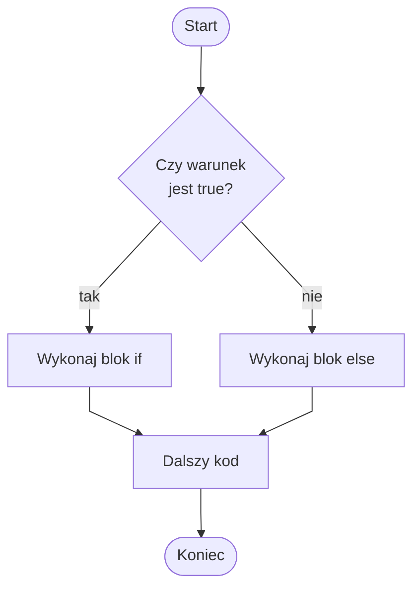

# Instrukcja warunkowa if else

## Cel lekcji

Nauczysz się używać instrukcji `if else`, aby wybrać jedną z dwóch ścieżek wykonania programu.

Po tej lekcji powinieneś umieć:

- wyjaśnić, kiedy używa się `if else`,
- zapisać blok `if` i blok `else`,
- wskazać, który blok wykona się dla warunku `true`,
- wskazać, który blok wykona się dla warunku `false`,
- rozpoznać typowe błędy przy `if else`.

## 1. Krótkie przypomnienie if

Instrukcja `if` wykonuje blok kodu tylko wtedy, gdy warunek daje wynik `true`.

Jeśli warunek daje wynik `false`, blok `if` jest pomijany.

Czasami chcemy wykonać inny kod, gdy warunek nie jest spełniony. Do tego służy `else`.

## 2. Składnia if else

Schemat:

```csharp
if (warunek)
{
    // instrukcje wykonywane, gdy warunek jest true
}
else
{
    // instrukcje wykonywane, gdy warunek jest false
}
```

Najważniejsze informacje:

- `if` i `else` tworzą jeden wybór,
- wykona się dokładnie jeden z dwóch bloków,
- `else` nie ma własnego warunku,
- `else` oznacza „w przeciwnym razie”.

## 3. Pierwszy przykład - pełnoletniość

```csharp
using System;

class Program
{
    static void Main()
    {
        Console.WriteLine("Podaj wiek:");
        int wiek = int.Parse(Console.ReadLine());

        if (wiek >= 18)
        {
            Console.WriteLine("Osoba jest pełnoletnia.");
        }
        else
        {
            Console.WriteLine("Osoba nie jest pełnoletnia.");
        }
    }
}
```

Jeśli warunek `wiek >= 18` daje `true`, wykona się pierwszy blok.

W przeciwnym razie wykona się blok `else`.



Diagram pokazuje, że w instrukcji `if else` wykonuje się dokładnie jedna z dwóch ścieżek.

## 4. Liczba dodatnia albo niedodatnia

```csharp
using System;

class Program
{
    static void Main()
    {
        Console.WriteLine("Podaj liczbę:");
        int liczba = int.Parse(Console.ReadLine());

        if (liczba > 0)
        {
            Console.WriteLine("Liczba jest dodatnia.");
        }
        else
        {
            Console.WriteLine("Liczba nie jest dodatnia.");
        }
    }
}
```

„Liczba nie jest dodatnia” oznacza, że jest równa `0` albo ujemna.

Dokładniejsze rozróżnienie kilku przypadków będzie możliwe przy `else if`.

## 5. Liczba parzysta albo nieparzysta

```csharp
using System;

class Program
{
    static void Main()
    {
        Console.WriteLine("Podaj liczbę:");
        int liczba = int.Parse(Console.ReadLine());

        if (liczba % 2 == 0)
        {
            Console.WriteLine("Liczba jest parzysta.");
        }
        else
        {
            Console.WriteLine("Liczba jest nieparzysta.");
        }
    }
}
```

Warunek `liczba % 2 == 0` sprawdza, czy reszta z dzielenia przez `2` jest równa `0`.

Jeśli warunek jest fałszywy, liczba jest nieparzysta.

## 6. Próg punktów

```csharp
using System;

class Program
{
    static void Main()
    {
        Console.WriteLine("Podaj liczbę punktów:");
        int punkty = int.Parse(Console.ReadLine());

        if (punkty >= 50)
        {
            Console.WriteLine("Próg został osiągnięty.");
        }
        else
        {
            Console.WriteLine("Próg nie został osiągnięty.");
        }
    }
}
```

Program wybiera jeden z dwóch komunikatów zależnie od liczby punktów.

## 7. Proste hasło

```csharp
using System;

class Program
{
    static void Main()
    {
        Console.WriteLine("Podaj hasło:");
        string haslo = Console.ReadLine();

        if (haslo == "admin")
        {
            Console.WriteLine("Hasło poprawne.");
        }
        else
        {
            Console.WriteLine("Hasło błędne.");
        }
    }
}
```

To jest przykład dydaktyczny. W prawdziwych programach haseł nie zapisuje się bezpośrednio w kodzie programu.

## 8. Zgadnij, który blok się wykona

Przykład z odpowiedzią:

```csharp
using System;

class Program
{
    static void Main()
    {
        int x = 10;

        if (x > 5)
        {
            Console.WriteLine("A");
        }
        else
        {
            Console.WriteLine("B");
        }
    }
}
```

Odpowiedź: program wypisze `A`, ponieważ `x > 5` daje `true`.

Drugi przykład z odpowiedzią:

```csharp
using System;

class Program
{
    static void Main()
    {
        int x = 3;

        if (x % 2 == 0)
        {
            Console.WriteLine("Parzysta");
        }
        else
        {
            Console.WriteLine("Nieparzysta");
        }
    }
}
```

Odpowiedź: program wypisze `Nieparzysta`, ponieważ `3 % 2` daje `1`.

Spróbuj teraz przewidzieć wyniki samodzielnie:

```csharp
using System;

class Program
{
    static void Main()
    {
        int a = 7;
        int b = 12;

        if (a > b)
        {
            Console.WriteLine("Pierwszy");
        }
        else
        {
            Console.WriteLine("Drugi");
        }

        if (a + 5 == b)
        {
            Console.WriteLine("Równe");
        }
        else
        {
            Console.WriteLine("Różne");
        }

        if (b % 2 == 0)
        {
            Console.WriteLine("Parzyste");
        }
        else
        {
            Console.WriteLine("Nieparzyste");
        }
    }
}
```

Odpowiedzi:

- pierwszy przykład wypisze `Drugi`,
- drugi przykład wypisze `Równe`,
- trzeci przykład wypisze `Parzyste`.

## 9. If bez klamerek

W C# można zapisać `if` bez nawiasów klamrowych, jeśli zależna od warunku jest tylko jedna instrukcja.

```csharp
if (wiek >= 18)
    Console.WriteLine("Pełnoletni");
```

W tym kursie stosujemy nawiasy klamrowe.

Zapis z klamrami jest czytelniejszy, łatwiej uniknąć błędów przy dopisywaniu kolejnych instrukcji, a na egzaminie i w nauce lepiej pisać jasno.

Wersja zalecana:

```csharp
if (wiek >= 18)
{
    Console.WriteLine("Pełnoletni");
}
```

## 10. Operator warunkowy ?:

W C# istnieje skrócony zapis wyboru jednej z dwóch wartości.

Często bywa potocznie nazywany jednolinijkowym `if`, ale formalnie jest to operator warunkowy `?:`, a nie instrukcja `if`.

Nadaje się do prostych wyborów wartości. Nie powinien zastępować czytelnego `if else` w bardziej złożonym kodzie.

```csharp
using System;

class Program
{
    static void Main()
    {
        int wiek = 20;

        string komunikat = wiek >= 18 ? "Pełnoletni" : "Niepełnoletni";

        Console.WriteLine(komunikat);
    }
}
```

Schemat:

```csharp
warunek ? wartośćGdyTrue : wartośćGdyFalse
```

Jeśli warunek jest `true`, wybrana zostanie wartość po znaku `?`.

Jeśli warunek jest `false`, wybrana zostanie wartość po znaku `:`.

W tym kursie podstawowym zapisem pozostaje klasyczne `if else`.

## 11. Typowe błędy

### Błąd 1 - else bez wcześniejszego if

Niepoprawnie:

```csharp
else
{
    Console.WriteLine("Błąd");
}
```

`else` nie działa samodzielnie. Musi być powiązane z wcześniejszym `if`.

### Błąd 2 - średnik po if

Niepoprawnie:

```csharp
if (wiek >= 18);
{
    Console.WriteLine("Pełnoletni");
}
```

Średnik po `if` kończy instrukcję.

Blok poniżej nie działa wtedy tak, jak uczeń oczekuje.

W tym kursie nie stawiamy średnika po warunku `if`.

### Błąd 3 - brak klamerek przy rozbudowanym bloku

W tym kursie konsekwentnie stosujemy nawiasy klamrowe przy `if` i `else`.

```csharp
if (punkty >= 50)
{
    Console.WriteLine("Próg został osiągnięty.");
}
else
{
    Console.WriteLine("Próg nie został osiągnięty.");
}
```

Dzięki temu od razu widać, które instrukcje należą do którego bloku.

### Błąd 4 - mylenie = i ==

`=` przypisuje wartość.

`==` porównuje wartości.

Poprawnie:

```csharp
if (haslo == "admin")
{
    Console.WriteLine("Hasło poprawne.");
}
else
{
    Console.WriteLine("Hasło błędne.");
}
```

## 12. Zapowiedź kolejnej lekcji

Instrukcja `if else` pozwala wybrać jedną z dwóch możliwości.

W kolejnej lekcji pojawi się `else if`, czyli wybór spośród wielu warunków.

## Zapamiętaj

- `if else` pozwala wybrać jedną z dwóch ścieżek.
- Gdy warunek jest `true`, wykonuje się blok `if`.
- Gdy warunek jest `false`, wykonuje się blok `else`.
- `else` nie ma własnego warunku.
- `else` nie działa bez `if`.
- W kursie stosujemy nawiasy klamrowe.
- Operator `?:` służy do krótkiego wyboru wartości, ale nie zastępuje czytelnego `if else` w trudniejszych przykładach.

## Ćwiczenia

1. Wczytaj wiek i wypisz, czy osoba jest pełnoletnia.
2. Wczytaj liczbę i wypisz, czy jest dodatnia, czy niedodatnia.
3. Wczytaj liczbę i wypisz, czy jest parzysta, czy nieparzysta.
4. Wczytaj liczbę punktów i wypisz, czy próg `50` punktów został osiągnięty.
5. Wczytaj hasło i wypisz, czy jest poprawne.
6. Dla zmiennej `int x = 8` określ, który blok się wykona przy warunku `x > 10`.
7. Popraw błędny zapis z `else` bez `if`.
8. Popraw błędny zapis ze średnikiem po `if`.
9. Przepisz prosty przykład `if else` na operator warunkowy `?:`.
10. Wskaż, kiedy lepiej użyć klasycznego `if else` zamiast operatora `?:`.
