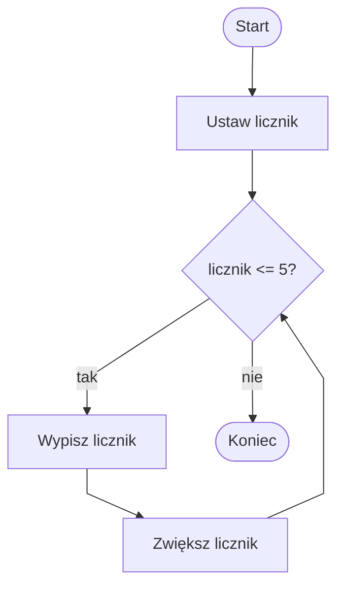

# Pętla while

## Cel lekcji

Nauczysz się używać pętli `while`, aby wielokrotnie wykonywać blok instrukcji, dopóki warunek jest spełniony.

Po tej lekcji powinieneś umieć:

- wyjaśnić, czym jest pętla,
- zapisać podstawową pętlę `while`,
- użyć licznika do kontrolowania liczby powtórzeń,
- przewidzieć, ile razy wykona się pętla,
- rozpoznać prostą pętlę nieskończoną.

## 1. Krótkie wprowadzenie

Program bez pętli wykonuje instrukcje po kolei.

Pętla pozwala powtarzać fragment kodu wiele razy.

Pętla `while` wykonuje blok kodu, dopóki warunek ma wartość `true`.

Jeśli warunek ma wartość `false`, pętla się kończy.

## 2. Składnia while

Schemat:

```csharp
while (warunek)
{
    // instrukcje wykonywane wielokrotnie
}
```

Najważniejsze elementy:

- warunek zapisujemy w nawiasach okrągłych `()`,
- instrukcje pętli zapisujemy w nawiasach klamrowych `{}`,
- po każdym wykonaniu bloku warunek jest sprawdzany ponownie.

## 3. Pierwszy przykład - liczby od 1 do 5

```csharp
using System;

class Program
{
    static void Main()
    {
        int licznik = 1;

        while (licznik <= 5)
        {
            Console.WriteLine(licznik);
            licznik++;
        }
    }
}
```

W tym przykładzie:

- `licznik` zaczyna od `1`,
- pętla działa, dopóki `licznik <= 5`,
- `licznik++` zwiększa wartość licznika o `1`,
- bez zwiększania licznika pętla mogłaby działać bez końca.



Diagram pokazuje, że w pętli `while` warunek jest sprawdzany przed każdym obiegiem.

## 4. Warunek od początku fałszywy

Pętla `while` sprawdza warunek przed pierwszym wykonaniem bloku.

```csharp
using System;

class Program
{
    static void Main()
    {
        int licznik = 10;

        while (licznik <= 5)
        {
            Console.WriteLine(licznik);
            licznik++;
        }

        Console.WriteLine("Koniec programu.");
    }
}
```

Warunek `licznik <= 5` jest `false` już na początku.

Blok pętli nie wykona się ani razu.

Napis `"Koniec programu."` wypisze się normalnie, bo jest poza pętlą.

## 5. Liczby parzyste

```csharp
using System;

class Program
{
    static void Main()
    {
        int liczba = 2;

        while (liczba <= 10)
        {
            Console.WriteLine(liczba);
            liczba += 2;
        }
    }
}
```

`liczba += 2` zwiększa wartość zmiennej o `2`.

Dlatego program wypisuje kolejne liczby parzyste.

## 6. Suma liczb od 1 do 5

```csharp
using System;

class Program
{
    static void Main()
    {
        int licznik = 1;
        int suma = 0;

        while (licznik <= 5)
        {
            suma += licznik;
            licznik++;
        }

        Console.WriteLine($"Suma: {suma}");
    }
}
```

`suma` to zmienna przechowująca wynik narastająco.

`suma += licznik` dodaje aktualną wartość licznika do sumy.

Taki sposób pracy nazywamy akumulacją wartości. Dokładniej licznik i akumulator zostaną uporządkowane w kolejnych lekcjach działu.

## 7. Wczytywanie kilku liczb

```csharp
using System;

class Program
{
    static void Main()
    {
        int licznik = 1;
        int suma = 0;

        while (licznik <= 3)
        {
            Console.WriteLine("Podaj liczbę:");
            int liczba = int.Parse(Console.ReadLine());

            suma += liczba;
            licznik++;
        }

        Console.WriteLine($"Suma podanych liczb: {suma}");
    }
}
```

Pętla wykona się `3` razy.

Za każdym razem użytkownik poda jedną liczbę.

Zmienna `suma` przechowuje łączny wynik.

## 8. Zgadnij, ile razy wykona się pętla

Przykład z odpowiedzią:

```csharp
using System;

class Program
{
    static void Main()
    {
        int i = 1;

        while (i <= 3)
        {
            Console.WriteLine(i);
            i++;
        }
    }
}
```

Odpowiedź: pętla wykona się `3` razy i wypisze `1`, `2`, `3`.

Spróbuj przewidzieć wyniki:

```csharp
using System;

class Program
{
    static void Main()
    {
        int a = 0;

        while (a < 4)
        {
            Console.WriteLine(a);
            a++;
        }

        int b = 5;

        while (b > 0)
        {
            Console.WriteLine(b);
            b--;
        }

        int c = 10;

        while (c < 5)
        {
            Console.WriteLine(c);
            c++;
        }
    }
}
```

Odpowiedzi:

- pierwszy przykład wykona się `4` razy i wypisze `0`, `1`, `2`, `3`,
- drugi przykład wykona się `5` razy i wypisze `5`, `4`, `3`, `2`, `1`,
- trzeci przykład nie wykona się ani razu.

## 9. Typowe błędy

### Błąd 1 - brak zmiany licznika

Niepoprawnie:

```csharp
int licznik = 1;

while (licznik <= 5)
{
    Console.WriteLine(licznik);
}
```

`licznik` się nie zmienia, więc warunek cały czas pozostaje `true`.

Może powstać pętla nieskończona.

Poprawnie:

```csharp
int licznik = 1;

while (licznik <= 5)
{
    Console.WriteLine(licznik);
    licznik++;
}
```

### Błąd 2 - zły warunek

Warunek musi prowadzić do zakończenia pętli.

Trzeba sprawdzić, czy zmienna sterująca zmienia się w dobrą stronę.

Przykład: jeśli licznik rośnie, warunek powinien mieć taką granicę, którą licznik może przekroczyć.

### Błąd 3 - instrukcja poza blokiem pętli

Tylko instrukcje w nawiasach klamrowych należą do pętli.

Kod poza pętlą wykona się dopiero po jej zakończeniu.

### Błąd 4 - średnik po while

Niepoprawnie:

```csharp
while (licznik <= 5);
{
    Console.WriteLine(licznik);
    licznik++;
}
```

Średnik po `while` kończy pustą instrukcję pętli.

Blok poniżej nie działa wtedy tak, jak uczeń oczekuje.

W tym kursie nie stawiamy średnika po warunku `while`.

## 10. Zapowiedź kolejnej lekcji

Pętla `while` sprawdza warunek przed pierwszym wykonaniem bloku.

W kolejnej lekcji pojawi się pętla `do while`, która wykonuje blok co najmniej raz.

## Zapamiętaj

- `while` powtarza blok instrukcji, dopóki warunek jest `true`.
- Warunek jest sprawdzany przed każdym wykonaniem pętli.
- Pętla `while` może nie wykonać się ani razu.
- Licznik często służy do kontrolowania liczby powtórzeń.
- Trzeba zmieniać zmienną sterującą pętlą.
- Brak zmiany warunku może prowadzić do pętli nieskończonej.

## Ćwiczenia

1. Wypisz liczby od `1` do `10` za pomocą `while`.
2. Wypisz liczby od `10` do `1` za pomocą `while`.
3. Wypisz liczby parzyste od `2` do `20`.
4. Wypisz liczby nieparzyste od `1` do `19`.
5. Oblicz sumę liczb od `1` do `10`.
6. Wczytaj `5` liczb i oblicz ich sumę.
7. Wczytaj `3` liczby i oblicz ich średnią.
8. Sprawdź, ile razy wykona się podana pętla.
9. Popraw pętlę nieskończoną.
10. Napisz własny przykład pętli `while` z licznikiem.
