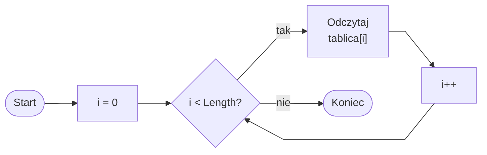

# Pętla for po tablicy

## Cel lekcji

Nauczysz się przechodzić po wszystkich elementach tablicy za pomocą pętli `for`.

## Krótkie przypomnienie

Tablica przechowuje wiele wartości tego samego typu.

Pierwszy element tablicy ma indeks `0`.

Ostatni element ma indeks `Length - 1`.

`Length` oznacza liczbę elementów tablicy.

Pętla `for` dobrze pasuje do tablic, bo licznik pętli może być indeksem elementu.

## Problem bez pętli

```csharp
using System;

class Program
{
    static void Main()
    {
        int[] oceny = { 5, 4, 3, 5 };

        Console.WriteLine(oceny[0]);
        Console.WriteLine(oceny[1]);
        Console.WriteLine(oceny[2]);
        Console.WriteLine(oceny[3]);
    }
}
```

Dla czterech elementów jeszcze da się to zapisać ręcznie.

Dla `20` albo `100` elementów taki sposób jest niewygodny. Lepiej użyć pętli.

## Pętla for po tablicy

```csharp
using System;

class Program
{
    static void Main()
    {
        int[] oceny = { 5, 4, 3, 5 };

        for (int i = 0; i < oceny.Length; i++)
        {
            Console.WriteLine(oceny[i]);
        }
    }
}
```

W tym przykładzie:

- `i` zaczyna od `0`, bo pierwszy indeks tablicy to `0`,
- warunek `i < oceny.Length` oznacza, że pętla działa dla poprawnych indeksów,
- dla tablicy długości `4` poprawne indeksy to `0`, `1`, `2`, `3`,
- gdy `i` osiągnie `4`, warunek `i < oceny.Length` będzie fałszywy,
- `oceny[i]` oznacza element tablicy o aktualnym indeksie.



Diagram pokazuje, że pętla przechodzi tylko po poprawnych indeksach tablicy.

## Dlaczego używamy i < tablica.Length

```csharp
int[] liczby = { 10, 20, 30 };

for (int i = 0; i < liczby.Length; i++)
{
    Console.WriteLine(liczby[i]);
}
```

Dla tej tablicy `Length` wynosi `3`.

Poprawne indeksy to `0`, `1`, `2`.

Warunek `i < liczby.Length` daje kolejno `i = 0`, `i = 1`, `i = 2`.

Warunek `i <= liczby.Length` próbowałby użyć indeksu `3`, a indeks `3` nie istnieje.

Niepoprawnie:

```csharp
for (int i = 0; i <= liczby.Length; i++)
{
    Console.WriteLine(liczby[i]);
}
```

To typowy błąd. Pętla dojdzie do `i == 3`, ale `liczby[3]` nie istnieje.

## Wypisywanie indeksu i wartości

```csharp
using System;

class Program
{
    static void Main()
    {
        int[] punkty = { 10, 15, 20 };

        for (int i = 0; i < punkty.Length; i++)
        {
            Console.WriteLine($"Indeks {i}: {punkty[i]}");
        }
    }
}
```

`i` jest indeksem.

`punkty[i]` jest wartością zapisaną pod tym indeksem.

Taki zapis pomaga zrozumieć różnicę między numerem elementu a jego wartością.

## Zmiana elementów tablicy w pętli

```csharp
using System;

class Program
{
    static void Main()
    {
        int[] punkty = { 10, 15, 20 };

        for (int i = 0; i < punkty.Length; i++)
        {
            punkty[i] = punkty[i] + 1;
        }

        for (int i = 0; i < punkty.Length; i++)
        {
            Console.WriteLine(punkty[i]);
        }
    }
}
```

Pierwsza pętla zwiększa każdy element tablicy o `1`.

Druga pętla wypisuje zmienione wartości.

`punkty[i]` może być użyte zarówno do odczytu, jak i do zapisu.

## Wczytywanie danych do tablicy

```csharp
using System;

class Program
{
    static void Main()
    {
        int[] liczby = new int[5];

        for (int i = 0; i < liczby.Length; i++)
        {
            Console.WriteLine($"Podaj liczbę o indeksie {i}:");
            liczby[i] = int.Parse(Console.ReadLine());
        }

        Console.WriteLine("Zawartość tablicy:");

        for (int i = 0; i < liczby.Length; i++)
        {
            Console.WriteLine(liczby[i]);
        }
    }
}
```

`new int[5]` tworzy tablicę na `5` liczb.

Pierwsza pętla wczytuje dane do tablicy. Druga pętla wypisuje dane z tablicy.

Używamy `Length`, aby kod działał poprawnie także po zmianie rozmiaru tablicy.

## Indeks w tablicy a numer dla użytkownika

Indeksy w tablicy zaczynają się od `0`, ale użytkownikowi często pokazujemy numerację od `1`.

Wtedy w komunikacie można użyć `i + 1`.

```csharp
using System;

class Program
{
    static void Main()
    {
        int[] oceny = new int[3];

        for (int i = 0; i < oceny.Length; i++)
        {
            Console.WriteLine($"Podaj ocenę numer {i + 1}:");
            oceny[i] = int.Parse(Console.ReadLine());
        }

        for (int i = 0; i < oceny.Length; i++)
        {
            Console.WriteLine($"Ocena numer {i + 1}: {oceny[i]}");
        }
    }
}
```

`i` jest indeksem technicznym.

`i + 1` jest numerem czytelnym dla użytkownika.

Nie zmienia to indeksowania tablicy. Pierwszy element nadal ma indeks `0`.

## Wyjaśnienie

Wyobraź sobie rząd szuflad z ocenami.

Każda szuflada ma numer techniczny: `0`, `1`, `2`, `3`.

Pętla `for` to osoba, która idzie od pierwszej szuflady do ostatniej:

- zaczyna od szuflady `0`,
- sprawdza, czy numer szuflady jest jeszcze mniejszy niż liczba szuflad,
- zagląda do szuflady,
- przechodzi do następnej.

Kod:

```csharp
for (int i = 0; i < oceny.Length; i++)
{
    Console.WriteLine(oceny[i]);
}
```

oznacza: dla każdego poprawnego indeksu tablicy wypisz wartość z tej szuflady.

## Typowe błędy

### Błąd 1: użycie i <= tablica.Length

Niepoprawnie:

```csharp
for (int i = 0; i <= liczby.Length; i++)
{
    Console.WriteLine(liczby[i]);
}
```

Poprawnie:

```csharp
for (int i = 0; i < liczby.Length; i++)
{
    Console.WriteLine(liczby[i]);
}
```

`Length` to liczba elementów. Ostatni indeks to `Length - 1`, dlatego używamy `i < Length`.

### Błąd 2: zaczynanie od 1

Niepoprawnie:

```csharp
for (int i = 1; i < liczby.Length; i++)
{
    Console.WriteLine(liczby[i]);
}
```

Ten kod pomija element o indeksie `0`. Pierwszy element tablicy nie zostanie wypisany.

### Błąd 3: mylenie indeksu z wartością

`i` to indeks.

`tablica[i]` to wartość.

`Console.WriteLine(i)` wypisuje indeks.

`Console.WriteLine(tablica[i])` wypisuje element tablicy.

### Błąd 4: wpisanie danych do zmiennej zamiast do tablicy

Jeśli dane mają zostać zapamiętane, trzeba przypisać je do tablicy:

```csharp
liczby[i] = int.Parse(Console.ReadLine());
```

Sama zmienna `liczba` przechowuje tylko jedną aktualną wartość.

## Zapowiedź kolejnej lekcji

W tej lekcji nauczyliśmy się przechodzić po elementach tablicy pętlą `for`.

W kolejnej lekcji użyjemy tej techniki do sumowania elementów tablicy i obliczania średniej.

## Zapamiętaj

- Pętla `for` dobrze pasuje do tablic.
- Indeks pętli zwykle zaczyna się od `0`.
- Warunek powinien mieć postać `i < tablica.Length`.
- Ostatni indeks to `tablica.Length - 1`.
- `tablica[i]` oznacza element o aktualnym indeksie.
- `i` oznacza indeks, a `tablica[i]` oznacza wartość.
- Przy komunikatach dla użytkownika można używać `i + 1`.

## Ćwiczenia

1. Utwórz tablicę z pięcioma liczbami i wypisz wszystkie elementy za pomocą `for`.
2. Utwórz tablicę `string[]` z imionami i wypisz każde imię.
3. Wypisz indeks i wartość każdego elementu tablicy.
4. Wczytaj `4` liczby do tablicy i wypisz je.
5. Wczytaj `3` oceny do tablicy i wypisz je z numerami od `1`.
6. Zwiększ każdy element tablicy punktów o `1`.
7. Zmień każdy element tablicy liczb całkowitych na jego podwojoną wartość.
8. Popraw pętlę z błędem `i <= tablica.Length`.
9. Popraw pętlę, która pomija element o indeksie `0`.
10. Wyjaśnij różnicę między `i` oraz `tablica[i]`.
