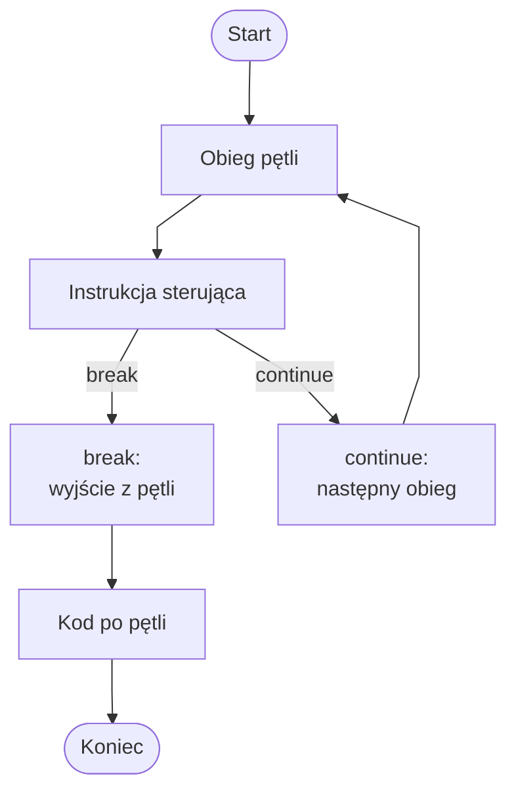

# Instrukcje break i continue

## Cel lekcji

Nauczysz się używać instrukcji `break` i `continue` do sterowania przebiegiem pętli.

## Krótkie wprowadzenie

Zwykle pętla wykonuje się tak długo, jak pozwala jej warunek.

Czasami chcemy zakończyć pętlę wcześniej.

Czasami chcemy pominąć tylko jeden obieg pętli.

Do tego służą instrukcje `break` i `continue`.

## Instrukcja break

`break` natychmiast kończy najbliższą pętlę.

Program przechodzi do instrukcji po pętli.

`break` często stosuje się, gdy znaleziono szukaną wartość albo dalsze sprawdzanie nie ma sensu.

```csharp
using System;

class Program
{
    static void Main()
    {
        for (int i = 1; i <= 10; i++)
        {
            if (i == 5)
            {
                break;
            }

            Console.WriteLine(i);
        }

        Console.WriteLine("Koniec pętli.");
    }
}
```

Program wypisze `1`, `2`, `3`, `4`.

Gdy `i` ma wartość `5`, wykona się `break` i pętla zostanie przerwana.

Po pętli wykona się instrukcja:

```csharp
Console.WriteLine("Koniec pętli.");
```

## Instrukcja continue

`continue` pomija resztę bieżącego obiegu pętli.

Pętla nie kończy się całkowicie. Program przechodzi do następnego obiegu.

`continue` stosuje się, gdy chcemy pominąć wybrane wartości.

```csharp
using System;

class Program
{
    static void Main()
    {
        for (int i = 1; i <= 5; i++)
        {
            if (i == 3)
            {
                continue;
            }

            Console.WriteLine(i);
        }
    }
}
```

Program wypisze `1`, `2`, `4`, `5`.

Dla `i == 3` wykonuje się `continue`, więc `Console.WriteLine(i)` zostaje wtedy pominięte.

Pętla działa dalej.

## Różnica między break i continue

| Instrukcja | Co robi | Czy pętla działa dalej? |
| --- | --- | --- |
| `break` | kończy najbliższą pętlę | nie |
| `continue` | pomija bieżący obieg | tak |

`break` oznacza: zakończ pętlę.

`continue` oznacza: pomiń ten przypadek i przejdź dalej.



Diagram pokazuje różnicę między zakończeniem całej pętli a przejściem do następnego obiegu.

## Wyjaśnienie metodą Feynmana

Wyobraź sobie, że sprawdzasz stos kartek z liczbami.

`break`: szukasz pierwszej kartki z liczbą `0`. Gdy ją znajdziesz, przestajesz przeglądać kolejne kartki. To jest `break` - kończysz całą pętlę.

`continue`: przeglądasz wszystkie kartki. Jeśli kartka ma liczbę ujemną, odkładasz ją i przechodzisz do następnej. To jest `continue` - pomijasz jeden przypadek, ale pracujesz dalej.

## break przy szukaniu elementu w tablicy

```csharp
using System;

class Program
{
    static void Main()
    {
        int[] liczby = { 4, 7, 2, 9, 5 };

        for (int i = 0; i < liczby.Length; i++)
        {
            if (liczby[i] == 9)
            {
                Console.WriteLine($"Znaleziono liczbę 9 pod indeksem {i}.");
                break;
            }

            Console.WriteLine($"Sprawdzam indeks {i}.");
        }

        Console.WriteLine("Po pętli.");
    }
}
```

Pętla sprawdza kolejne elementy tablicy.

Gdy znajdzie wartość `9`, wypisuje komunikat i kończy pętlę.

Elementy po znalezionej wartości nie są już sprawdzane. To ma sens, gdy interesuje nas pierwsze wystąpienie.

## break i zmienna bool: czy znaleziono

```csharp
using System;

class Program
{
    static void Main()
    {
        int[] liczby = { 4, 7, 2, 9, 5 };
        int szukana = 9;
        bool znaleziono = false;

        for (int i = 0; i < liczby.Length; i++)
        {
            if (liczby[i] == szukana)
            {
                znaleziono = true;
                break;
            }
        }

        if (znaleziono)
        {
            Console.WriteLine("Znaleziono szukaną liczbę.");
        }
        else
        {
            Console.WriteLine("Nie znaleziono szukanej liczby.");
        }
    }
}
```

Zmienna `znaleziono` zapamiętuje wynik wyszukiwania.

Zaczyna od `false`.

Jeśli znajdziemy szukaną wartość, ustawiamy `true` i przerywamy pętlę.

Po pętli można wypisać odpowiedni komunikat.

## continue przy pomijaniu elementów tablicy

```csharp
using System;

class Program
{
    static void Main()
    {
        int[] liczby = { 4, -2, 0, 7, -5, 3 };

        foreach (int liczba in liczby)
        {
            if (liczba < 0)
            {
                continue;
            }

            Console.WriteLine(liczba);
        }
    }
}
```

Liczby ujemne są pomijane.

`continue` sprawia, że `Console.WriteLine(liczba)` nie wykona się dla liczb ujemnych.

Pętla przechodzi dalej do kolejnych elementów.

Wypisane zostaną tylko `4`, `0`, `7`, `3`.

## continue przy sumowaniu tylko wybranych wartości

```csharp
using System;

class Program
{
    static void Main()
    {
        int[] liczby = { 4, -2, 0, 7, -5, 3 };

        int suma = 0;

        foreach (int liczba in liczby)
        {
            if (liczba < 0)
            {
                continue;
            }

            suma += liczba;
        }

        Console.WriteLine($"Suma liczb nieujemnych: {suma}");
    }
}
```

Liczby ujemne są pomijane.

`suma += liczba` wykonuje się tylko dla liczb nieujemnych.

Wynik obejmuje liczby dodatnie i zero.

## break w pętli while

```csharp
using System;

class Program
{
    static void Main()
    {
        while (true)
        {
            Console.WriteLine("Podaj liczbę. Wpisz 0, aby zakończyć:");
            int liczba = int.Parse(Console.ReadLine());

            if (liczba == 0)
            {
                break;
            }

            Console.WriteLine($"Podano: {liczba}");
        }

        Console.WriteLine("Program zakończony.");
    }
}
```

`while (true)` tworzy pętlę działającą bez ograniczenia.

`break` kończy ją po wpisaniu `0`.

To przykład dydaktyczny. Taka pętla musi mieć jasny sposób zakończenia.

## continue w pętli while: ostrożnie

Przykład błędu:

```csharp
int i = 1;

while (i <= 5)
{
    if (i == 3)
    {
        continue;
    }

    Console.WriteLine(i);
    i++;
}
```

Gdy `i` ma wartość `3`, wykonuje się `continue`.

Instrukcja `i++` zostaje pominięta, więc `i` nadal ma wartość `3`.

Powstaje pętla nieskończona.

Poprawny wariant:

```csharp
using System;

class Program
{
    static void Main()
    {
        int i = 1;

        while (i <= 5)
        {
            if (i == 3)
            {
                i++;
                continue;
            }

            Console.WriteLine(i);
            i++;
        }
    }
}
```

Przed `continue` zwiększamy licznik. Dzięki temu pętla może dojść do końca.

## Zgadnij, co wypisze program

Przykład z odpowiedzią:

```csharp
for (int i = 1; i <= 5; i++)
{
    if (i == 3)
    {
        break;
    }

    Console.WriteLine(i);
}
```

Odpowiedź: program wypisze `1`, `2`.

Spróbuj najpierw samodzielnie przewidzieć wyniki kolejnych przykładów.

```csharp
for (int i = 1; i <= 5; i++)
{
    if (i == 3)
    {
        continue;
    }

    Console.WriteLine(i);
}
```

```csharp
int[] liczby = { 2, 4, 6, 8 };

foreach (int liczba in liczby)
{
    if (liczba > 5)
    {
        break;
    }

    Console.WriteLine(liczba);
}
```

```csharp
int[] liczby = { 1, -2, 3, -4 };

foreach (int liczba in liczby)
{
    if (liczba < 0)
    {
        continue;
    }

    Console.WriteLine(liczba);
}
```

Odpowiedzi:

- pierwszy przykład wypisze `1`, `2`, `4`, `5`,
- drugi przykład wypisze `2`, `4`,
- trzeci przykład wypisze `1`, `3`.

## Typowe błędy

### Błąd 1: mylenie break i continue

`break` kończy całą najbliższą pętlę.

`continue` kończy tylko bieżący obieg pętli.

### Błąd 2: oczekiwanie, że break zakończy cały program

`break` kończy pętlę albo `case` w `switch`.

Nie kończy całego programu. Po pętli wykonują się dalsze instrukcje.

### Błąd 3: continue przed zmianą licznika w while

W pętli `while` trzeba pilnować, aby `continue` nie pominęło zmiany zmiennej sterującej.

Inaczej może powstać pętla nieskończona.

### Błąd 4: nadużywanie break i continue

`break` i `continue` są przydatne, ale zbyt częste używanie może utrudnić czytanie programu.

Stosujemy je wtedy, gdy naprawdę upraszczają kod.

### Błąd 5: break przy zliczaniu wszystkich elementów

Jeśli chcemy policzyć wszystkie pasujące elementy tablicy, zwykle nie używamy `break`.

`break` kończy pętlę po pierwszym znalezieniu.

Do zliczania wszystkich elementów pętla powinna przejść przez całą tablicę.

## Kiedy używać break, a kiedy continue

Użyj `break`, gdy:

- szukasz pierwszego wystąpienia,
- dalsze sprawdzanie nie ma sensu,
- użytkownik wybrał zakończenie,
- chcesz wyjść z pętli.

Użyj `continue`, gdy:

- chcesz pominąć jeden przypadek,
- nie chcesz wykonywać dalszych instrukcji dla aktualnego elementu,
- pętla ma działać dalej dla kolejnych elementów.

## Zapowiedź podsumowania działu

Po poznaniu pętli, tablic, `foreach`, licznika, akumulatora oraz instrukcji `break` i `continue` można rozwiązywać wiele typowych zadań programistycznych.

Następny krok to podsumowanie działu o pętlach i tablicach.

## Zapamiętaj

- `break` kończy najbliższą pętlę.
- `continue` pomija resztę bieżącego obiegu.
- Po `break` program przechodzi za pętlę.
- Po `continue` pętla przechodzi do kolejnego obiegu.
- `break` dobrze pasuje do szukania pierwszego pasującego elementu.
- `continue` dobrze pasuje do pomijania wybranych elementów.
- W pętli `while` trzeba uważać, aby `continue` nie pominęło zmiany licznika.
- Do zliczania wszystkich pasujących elementów zwykle nie używamy `break`.

## Ćwiczenia

1. Wypisz liczby od `1` do `10`, ale przerwij pętlę po liczbie `5`.
2. Wypisz liczby od `1` do `10` z pominięciem liczby `4`.
3. Wypisz elementy tablicy do momentu napotkania liczby ujemnej.
4. Sprawdź, czy w tablicy znajduje się liczba `0`. Po znalezieniu przerwij pętlę.
5. Wypisz tylko liczby dodatnie z tablicy, używając `continue`.
6. Oblicz sumę liczb nieujemnych z tablicy, używając `continue`.
7. Popraw pętlę `while`, w której `continue` powoduje pętlę nieskończoną.
8. Wyjaśnij różnicę między `break` i `continue`.
9. Wskaż, kiedy `break` jest błędem przy zliczaniu elementów.
10. Napisz własny przykład użycia `break` albo `continue`.
