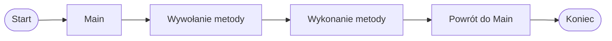

# Po co są metody

## Problem: cały kod w Main

Na początku kursu większość programów pisaliśmy w metodzie `Main`.

Dla krótkich przykładów jest to wygodne. W większych programach szybko robi się jednak bałagan:

* kod jest długi,
* trudno znaleźć ważne fragmenty,
* te same instrukcje mogą powtarzać się wiele razy,
* poprawienie programu wymaga zmiany w kilku miejscach.

Przykład bez metody:

```csharp
using System;

class Program
{
    static void Main()
    {
        Console.WriteLine("=== PROGRAM ===");
        Console.WriteLine("Witaj w programie!");

        Console.WriteLine("--------------------");
        Console.WriteLine("Opcja 1 - Start");
        Console.WriteLine("Opcja 2 - Pomoc");
        Console.WriteLine("Opcja 0 - Koniec");
        Console.WriteLine("--------------------");

        Console.WriteLine("Dziękujemy za użycie programu.");
        Console.WriteLine("=== PROGRAM ===");
    }
}
```

Ten program jest jeszcze krótki, ale już widać powtarzające się fragmenty. W większym programie taki zapis byłby trudniejszy do czytania.

## Metoda jako nazwany fragment kodu

Metoda to fragment kodu, który ma nazwę i można go wywołać.

Dzięki metodzie możemy nadać nazwę pewnej czynności, na przykład `PokazNaglowek`.

```csharp
using System;

class Program
{
    static void PokazNaglowek()
    {
        Console.WriteLine("=== PROGRAM ===");
    }

    static void Main()
    {
        PokazNaglowek();

        Console.WriteLine("Witaj w programie!");
        Console.WriteLine("Opcja 1 - Start");
        Console.WriteLine("Opcja 2 - Pomoc");
        Console.WriteLine("Opcja 0 - Koniec");
    }
}
```

W tym przykładzie:

* `PokazNaglowek` to nazwa metody,
* kod metody znajduje się w nawiasach klamrowych,
* `PokazNaglowek();` w metodzie `Main` oznacza wywołanie metody,
* po wykonaniu metody program wraca do miejsca, z którego metoda została wywołana.

## Jak działa wywołanie metody



Program zaczyna działanie w metodzie `Main`. Gdy napotka wywołanie metody, przechodzi do tej metody, wykonuje jej instrukcje, a potem wraca do `Main`.

## Metoda może być wywołana wiele razy

Metodę można wywołać więcej niż jeden raz.

To przydatne, gdy ten sam fragment kodu ma pojawić się w kilku miejscach programu.

```csharp
using System;

class Program
{
    static void PokazSeparator()
    {
        Console.WriteLine("--------------------");
    }

    static void Main()
    {
        PokazSeparator();
        Console.WriteLine("Menu programu");
        PokazSeparator();

        Console.WriteLine("1 - Start");
        Console.WriteLine("2 - Pomoc");
        Console.WriteLine("0 - Koniec");

        PokazSeparator();
    }
}
```

W tym przykładzie metoda `PokazSeparator` jest zapisana tylko raz, ale wywołujemy ją kilka razy.

Jeśli chcemy zmienić wygląd separatora, poprawiamy tylko jedną metodę.

## Dlaczego to jest przydatne

Metody pomagają pisać czytelniejsze programy.

Najważniejsze korzyści:

* mniej powtarzania kodu,
* lepszy porządek,
* łatwiejsze poprawianie programu,
* łatwiejsze czytanie programu,
* przygotowanie do większych zadań.

## Ważne pojęcia

**Metoda** to nazwany fragment kodu, który można wykonać przez wywołanie.

**Wywołanie metody** to użycie nazwy metody z nawiasami, na przykład:

```csharp
PokazSeparator();
```

**Ciało metody** to instrukcje zapisane w nawiasach klamrowych metody.

**void** oznacza, że metoda wykonuje instrukcje, ale nie zwraca wyniku.

Na tym etapie nie omawiamy jeszcze parametrów ani `return`. Pojawią się w kolejnych lekcjach.

## Ćwiczenia

1. Napisz metodę `PokazPowitanie`.
2. Napisz metodę `PokazMenu`.
3. Napisz metodę `PokazSeparator`.
4. Wywołaj jedną metodę kilka razy.
5. Popraw program, w którym ten sam fragment tekstu pojawia się kilka razy, przenosząc go do metody.

## Podsumowanie

Metody pozwalają dzielić program na mniejsze, nazwane fragmenty.

Dzięki nim kod jest bardziej uporządkowany, mniej się powtarza i łatwiej go poprawiać.

W tej lekcji używaliśmy prostych metod `void`, które nie mają parametrów i nie zwracają wyniku.
