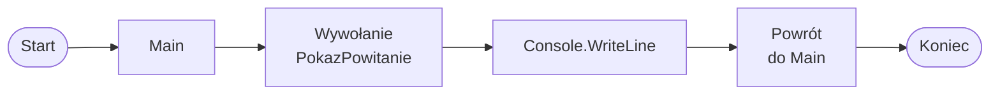

# Pierwsza metoda void

## Co oznacza void

`void` oznacza, że metoda wykonuje instrukcje, ale nie oddaje wyniku do miejsca wywołania.

Taka metoda może na przykład wypisać tekst w konsoli, pokazać menu albo wyświetlić separator.

Metody zwracające wartość poznamy później. Na razie skupiamy się na prostych metodach `void`.

## Składnia metody void

Ogólny schemat metody `void` wygląda tak:

```csharp
static void NazwaMetody()
{
    // instrukcje
}
```

Najważniejsze elementy:

* `static` - na tym etapie używamy `static`, ponieważ wywołujemy metodę z `Main`, które też jest `static`,
* `void` - metoda wykonuje instrukcje, ale nie zwraca wyniku,
* `NazwaMetody` - nazwa metody,
* `()` - nawiasy okrągłe po nazwie metody,
* `{ }` - ciało metody, czyli instrukcje wykonywane przez metodę.

Nie rozwijamy jeszcze tematu obiektowości. W tym dziale chodzi o praktyczne użycie prostych metod.

## Pierwszy przykład

```csharp
using System;

class Program
{
    static void PokazPowitanie()
    {
        Console.WriteLine("Witaj w programie!");
    }

    static void Main()
    {
        PokazPowitanie();
    }
}
```

Sama definicja metody nie uruchamia jej.

Metoda działa dopiero wtedy, gdy zostanie wywołana:

```csharp
PokazPowitanie();
```

Program zaczyna działanie w `Main`. Gdy napotka `PokazPowitanie();`, przechodzi do metody `PokazPowitanie`, wykonuje jej instrukcje, a potem wraca do `Main`.

## Jak program przechodzi przez metodę



Diagram pokazuje, że metoda jest osobnym fragmentem kodu, ale program po jej wykonaniu wraca do miejsca wywołania.

## Metoda z kilkoma instrukcjami

Jedna metoda może zawierać kilka instrukcji.

```csharp
using System;

class Program
{
    static void PokazMenu()
    {
        Console.WriteLine("1. Dodaj");
        Console.WriteLine("2. Usuń");
        Console.WriteLine("3. Zakończ");
    }

    static void Main()
    {
        Console.WriteLine("Menu programu:");
        PokazMenu();
    }
}
```

Metoda `PokazMenu` wypisuje trzy linie tekstu. W `Main` wystarczy jedno wywołanie:

```csharp
PokazMenu();
```

## Kilka wywołań tej samej metody

Tę samą metodę można wywołać wiele razy.

```csharp
using System;

class Program
{
    static void PokazSeparator()
    {
        Console.WriteLine("--------------------");
    }

    static void Main()
    {
        PokazSeparator();
        Console.WriteLine("Początek programu");
        PokazSeparator();
        Console.WriteLine("Główna część programu");
        PokazSeparator();
        Console.WriteLine("Koniec programu");
        PokazSeparator();
    }
}
```

Metoda `PokazSeparator` jest zapisana tylko raz, ale można jej używać w wielu miejscach programu.

## Nazwy metod

Nazwa metody powinna mówić, co metoda robi.

W C# dla nazw metod zwykle stosuje się `PascalCase`. Oznacza to, że każde słowo zaczynamy wielką literą.

Dobre nazwy:

* `PokazMenu`
* `ObliczSume`
* `WczytajLiczbe`
* `PokazSeparator`

Słabe nazwy:

* `X`
* `Test`
* `Metoda1`

Na razie nie omawiamy metod z parametrami. Pojawią się w kolejnej lekcji.

## Najczęstsze błędy

* Zdefiniowanie metody wewnątrz `Main`.
* Brak nawiasów przy wywołaniu metody.
* Literówka w nazwie metody.
* Zapomnienie średnika po wywołaniu metody.
* Oczekiwanie, że metoda wykona się sama bez wywołania.

Przykład wywołania metody musi zawierać nawiasy i średnik:

```csharp
PokazPowitanie();
```

## Ćwiczenia

1. Napisz metodę `PokazPowitanie`, która wypisuje krótkie powitanie.
2. Napisz metodę `PokazMenu` z trzema opcjami.
3. Napisz metodę `PokazSeparator` i wywołaj ją kilka razy.
4. Napisz metodę `PokazAutora`, która wypisuje imię autora programu.
5. Popraw program, w którym kilka razy powtarza się ten sam tekst, wydzielając ten tekst do metody `void`.

## Podsumowanie

Metoda `void` wykonuje instrukcje, ale nie zwraca wyniku.

Metoda musi zostać wywołana, aby jej kod się wykonał.

Metody pomagają porządkować program i ograniczać powtarzanie kodu.

W kolejnych lekcjach pojawią się parametry i `return`.
