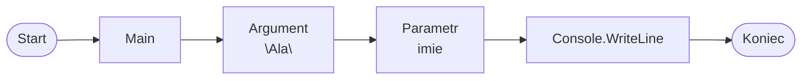

# Parametry metody

## Po co są parametry

Metoda bez parametrów zawsze działa tak samo.

Przykład:

```csharp
static void PokazPowitanie()
{
    Console.WriteLine("Cześć!");
}
```

Taka metoda za każdym razem wypisze ten sam tekst.

Metoda z parametrem może wykonać podobne działanie dla różnych danych.

```csharp
static void PokazPowitanie(string imie)
{
    Console.WriteLine($"Cześć, {imie}!");
}
```

Teraz metoda może przywitać różne osoby, zależnie od tego, jaką wartość przekażemy przy wywołaniu.

## Parametr i argument

Parametr jest w definicji metody.

Argument jest wartością przekazaną podczas wywołania metody.

Przykład definicji metody:

```csharp
static void PokazPowitanie(string imie)
```

Tutaj `imie` jest parametrem.

Przykład wywołania metody:

```csharp
PokazPowitanie("Ala");
```

Tutaj `"Ala"` jest argumentem.

Można powiedzieć prosto: argument trafia do parametru.

## Jak dane trafiają do metody



Wartość `"Ala"` jest przekazywana z miejsca wywołania metody do parametru `imie`.

Potem metoda może użyć parametru `imie` w swoich instrukcjach.

## Metoda z jednym parametrem

```csharp
using System;

class Program
{
    static void PokazPowitanie(string imie)
    {
        Console.WriteLine($"Cześć, {imie}!");
    }

    static void Main()
    {
        PokazPowitanie("Ala");
        PokazPowitanie("Bartek");
        PokazPowitanie("Celina");
    }
}
```

Ta sama metoda działa dla różnych wartości.

Za pierwszym razem argumentem jest `"Ala"`, za drugim `"Bartek"`, a za trzecim `"Celina"`.

## Typ parametru

Parametr ma typ, tak samo jak zmienna.

```csharp
static void PokazWiek(int wiek)
{
    Console.WriteLine($"Masz {wiek} lat.");
}
```

Parametr `wiek` ma typ `int`, więc do metody trzeba przekazać liczbę całkowitą.

Przykład użycia:

```csharp
PokazWiek(16);
```

## Metoda z kilkoma parametrami

Metoda może mieć więcej niż jeden parametr.

```csharp
using System;

class Program
{
    static void PokazDane(string imie, int wiek)
    {
        Console.WriteLine($"Imię: {imie}");
        Console.WriteLine($"Wiek: {wiek}");
    }

    static void Main()
    {
        PokazDane("Ola", 16);
    }
}
```

Kolejność argumentów musi odpowiadać kolejności parametrów.

W wywołaniu:

```csharp
PokazDane("Ola", 16);
```

argument `"Ola"` trafia do parametru `imie`, a argument `16` trafia do parametru `wiek`.

## Kilka wywołań z różnymi argumentami

Jedną metodę można wywołać wiele razy z różnymi argumentami.

```csharp
using System;

class Program
{
    static void PokazOcene(string przedmiot, int ocena)
    {
        Console.WriteLine($"{przedmiot}: {ocena}");
    }

    static void Main()
    {
        PokazOcene("Matematyka", 5);
        PokazOcene("Informatyka", 6);
        PokazOcene("Język polski", 4);
    }
}
```

Metoda `PokazOcene` ma dwa parametry. Dzięki temu może wypisywać podobny komunikat dla różnych przedmiotów i ocen.

## Najczęstsze błędy

* Brak argumentu przy wywołaniu metody.
* Zły typ argumentu.
* Pomylona kolejność argumentów.
* Literówka w nazwie parametru.
* Mylenie parametru z argumentem.

Przykład błędu:

```csharp
PokazWiek("szesnaście");
```

Jeśli parametr `wiek` ma typ `int`, to argument powinien być liczbą całkowitą, na przykład:

```csharp
PokazWiek(16);
```

## Ćwiczenia

1. Napisz metodę `PokazImie(string imie)`, która wypisuje imię.
2. Napisz metodę `PokazWiek(int wiek)`, która wypisuje wiek.
3. Napisz metodę `PokazUcznia(string imie, int wiek)`.
4. Wywołaj jedną metodę trzy razy z różnymi argumentami.
5. Napisz metodę `PokazOcene(string przedmiot, int ocena)`.
6. Popraw program, w którym kilka razy wypisywany jest podobny komunikat, zamieniając go na metodę z parametrem.

## Podsumowanie

Parametr znajduje się w definicji metody.

Argument przekazujemy podczas wywołania metody.

Parametr ma typ.

Metoda z parametrami jest bardziej elastyczna, bo może działać dla różnych wartości.

W następnej lekcji pojawią się metody zwracające wartość.
