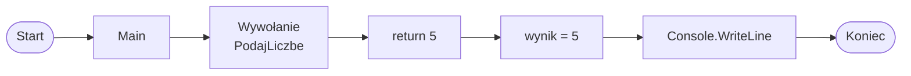

# Metoda zwracająca wartość

## Od void do wartości zwracanej

Metoda `void` wykonuje instrukcje, ale nie zwraca wyniku.

Metoda z typem zwracanym, na przykład `int`, `double` albo `string`, zwraca wartość do miejsca wywołania.

Typ przed nazwą metody informuje, jakiego typu wartość metoda zwróci.

Przykład metody `void`:

```csharp
static void PokazKomunikat()
{
    Console.WriteLine("Witaj!");
}
```

Przykład metody zwracającej wartość:

```csharp
static int PodajLiczbe()
{
    return 5;
}
```

W drugim przykładzie metoda oddaje liczbę `5` do miejsca, w którym została wywołana.

## Instrukcja return

`return` kończy działanie metody.

`return` przekazuje wartość do miejsca wywołania.

Wartość po `return` musi pasować do typu zwracanego metody.

Ogólny schemat:

```csharp
static typ NazwaMetody()
{
    return wartość;
}
```

Jeśli metoda ma typ `int`, powinna zwrócić liczbę całkowitą. Jeśli metoda ma typ `string`, powinna zwrócić tekst.

## Pierwszy przykład: metoda zwracająca int

```csharp
using System;

class Program
{
    static int PodajLiczbe()
    {
        return 5;
    }

    static void Main()
    {
        int wynik = PodajLiczbe();
        Console.WriteLine(wynik);
    }
}
```

Krok po kroku:

* `Main` wywołuje metodę `PodajLiczbe`,
* metoda zwraca `5`,
* wartość `5` trafia do zmiennej `wynik`,
* `Console.WriteLine` wypisuje `wynik`.

## Jak działa return



Diagram pokazuje, że wartość zwrócona przez metodę może zostać zapisana w zmiennej i użyta dalej w programie.

## Metoda z parametrami i wartością zwracaną

Metoda może przyjmować parametry i zwracać wynik.

```csharp
using System;

class Program
{
    static int Dodaj(int a, int b)
    {
        return a + b;
    }

    static void Main()
    {
        int suma = Dodaj(3, 4);
        Console.WriteLine(suma);
    }
}
```

W tym przykładzie:

* argumenty `3` i `4` trafiają do parametrów `a` i `b`,
* metoda oblicza `a + b`,
* `return` zwraca wynik,
* wynik można zapisać w zmiennej.

## Użycie wyniku bez zmiennej

Wynik metody można przekazać bezpośrednio do `Console.WriteLine`.

```csharp
using System;

class Program
{
    static int Dodaj(int a, int b)
    {
        return a + b;
    }

    static void Main()
    {
        Console.WriteLine(Dodaj(10, 20));
    }
}
```

Najpierw metoda `Dodaj(10, 20)` zwróci wynik, a potem `Console.WriteLine` wypisze go na ekranie.

## Metoda zwracająca double

```csharp
using System;

class Program
{
    static double ObliczSrednia(int a, int b)
    {
        return (a + b) / 2.0;
    }

    static void Main()
    {
        double srednia = ObliczSrednia(4, 5);
        Console.WriteLine($"Średnia: {srednia:F2}");
    }
}
```

Używamy `2.0`, aby otrzymać wynik zmiennoprzecinkowy.

Gdybyśmy użyli `2`, moglibyśmy przypadkowo wykonać dzielenie całkowite.

## Metoda zwracająca string

```csharp
using System;

class Program
{
    static string PrzygotujPowitanie(string imie)
    {
        return $"Cześć, {imie}!";
    }

    static void Main()
    {
        string tekst = PrzygotujPowitanie("Ala");
        Console.WriteLine(tekst);
    }
}
```

Metoda `PrzygotujPowitanie` zwraca tekst typu `string`.

Wynik metody zapisujemy w zmiennej `tekst`, a potem wypisujemy go na ekranie.

## Najczęstsze błędy

* Brak `return` w metodzie, która ma zwracać wartość.
* Zwracanie wartości złego typu.
* Mylenie `Console.WriteLine` z `return`.
* Oczekiwanie, że `Console.WriteLine` zwraca wynik.
* Kod po `return`, który nie zostanie wykonany.

`Console.WriteLine` wypisuje tekst na ekranie.

`return` oddaje wartość z metody do miejsca wywołania.

Przykład błędu:

```csharp
static int PodajLiczbe()
{
    Console.WriteLine(5);
}
```

Ta metoda ma zwracać `int`, ale nie ma instrukcji `return`.

Poprawnie:

```csharp
static int PodajLiczbe()
{
    return 5;
}
```

## Ćwiczenia

1. Napisz metodę `PodajRok`, która zwraca aktualny rok jako `int`.
2. Napisz metodę `Dodaj`, która przyjmuje dwie liczby `int` i zwraca ich sumę.
3. Napisz metodę `Pomnoz`, która przyjmuje dwie liczby `int` i zwraca ich iloczyn.
4. Napisz metodę `ObliczSrednia`, która przyjmuje dwie liczby `int` i zwraca średnią jako `double`.
5. Napisz metodę `PrzygotujPowitanie`, która przyjmuje imię i zwraca tekst powitania.
6. Zapisz wynik działania metody w zmiennej i wypisz go na ekranie.
7. Wywołaj metodę zwracającą wartość bezpośrednio wewnątrz `Console.WriteLine`.

## Podsumowanie

Metoda `void` nie zwraca wartości.

Metoda z typem zwracanym musi zwrócić wartość przez `return`.

Typ zwracanej wartości musi zgadzać się z typem metody.

Wynik metody można zapisać w zmiennej albo użyć od razu.

`return` i `Console.WriteLine` to nie to samo.
