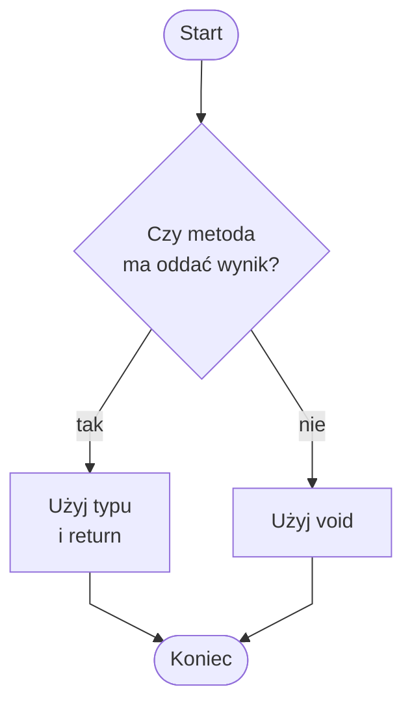

# void a return

## Dwa rodzaje metod

Na tym etapie znamy dwa podstawowe rodzaje metod:

* metody `void`, które wykonują instrukcje,
* metody zwracające wartość, na przykład `int`, `double`, `string`.

Przykład metody `void`:

```csharp
static void PokazKomunikat()
{
    Console.WriteLine("Witaj!");
}
```

Przykład metody zwracającej wartość:

```csharp
static int Dodaj(int a, int b)
{
    return a + b;
}
```

Pierwsza metoda coś robi, czyli wypisuje tekst.

Druga metoda coś oblicza i oddaje wynik do miejsca wywołania.

## Metoda void

`void` oznacza brak zwracanej wartości.

Metoda `void` może wypisywać tekst, pokazywać menu, wyświetlać separator albo wykonywać serię instrukcji.

Nie można jednak zapisać jej wyniku do zmiennej, bo taka metoda nie oddaje wartości.

```csharp
using System;

class Program
{
    static void PokazMenu()
    {
        Console.WriteLine("1. Start");
        Console.WriteLine("2. Pomoc");
        Console.WriteLine("3. Koniec");
    }

    static void Main()
    {
        PokazMenu();
    }
}
```

Metodę `void` wywołujemy jako osobną instrukcję:

```csharp
PokazMenu();
```

## Metoda zwracająca wartość

Metoda z typem zwracanym musi zwrócić wartość.

Typ zwracanej wartości jest zapisany przed nazwą metody.

`return` oddaje wynik do miejsca wywołania.

```csharp
using System;

class Program
{
    static int Dodaj(int a, int b)
    {
        return a + b;
    }

    static void Main()
    {
        int wynik = Dodaj(3, 4);
        Console.WriteLine(wynik);
    }
}
```

Metoda `Dodaj` zwraca liczbę typu `int`.

Wynik można zapisać w zmiennej:

```csharp
int wynik = Dodaj(3, 4);
```

## Najważniejsza różnica

| Cecha | void | metoda zwracająca wartość |
| --- | --- | --- |
| Czy zwraca wartość? | Nie | Tak |
| Czy używa return z wartością? | Nie | Tak |
| Czy wynik można zapisać do zmiennej? | Nie | Tak |
| Przykład użycia | `PokazMenu();` | `int x = Dodaj(2, 3);` |

## Jak wybrać: void czy return

Użyj `void`, gdy metoda ma coś wykonać, na przykład:

* wypisać menu,
* pokazać separator,
* wyświetlić komunikat,
* wykonać serię instrukcji bez oddawania wyniku.

Użyj metody zwracającej wartość, gdy metoda ma coś obliczyć lub przygotować, na przykład:

* policzyć sumę,
* obliczyć średnią,
* przygotować tekst,
* sprawdzić i zwrócić wynik.

## Diagram decyzyjny



Jeśli wynik metody ma być użyty później, wybieramy typ zwracany i `return`.

Jeśli metoda ma tylko wykonać instrukcje, wystarczy `void`.

## Console.WriteLine to nie return

`Console.WriteLine` wypisuje tekst na ekranie.

`return` oddaje wartość z metody do miejsca wywołania.

To są dwie różne rzeczy.

Błędny przykład:

```csharp
static int Dodaj(int a, int b)
{
    Console.WriteLine(a + b);
}
```

Ta metoda ma typ `int`, ale nie zwraca wartości.

Poprawna wersja:

```csharp
static int Dodaj(int a, int b)
{
    return a + b;
}
```

Wypisanie wyniku wykonujemy w `Main`:

```csharp
int wynik = Dodaj(3, 4);
Console.WriteLine(wynik);
```

## Częsty błąd: próba zapisania wyniku metody void

Błędny przykład:

```csharp
int wynik = PokazMenu();
```

To nie działa, bo `PokazMenu` jest metodą `void` i nie oddaje wartości.

Poprawne użycie:

```csharp
PokazMenu();
```

Metodę `void` wywołujemy jako instrukcję, ale nie zapisujemy jej wyniku do zmiennej.

## Ćwiczenia

1. Napisz metodę `void PokazSeparator`, która wypisuje linię separatora.
2. Napisz metodę `int Dodaj`, która zwraca sumę dwóch liczb.
3. Napisz metodę `double ObliczSrednia`, która zwraca średnią dwóch liczb.
4. Napisz metodę `string PrzygotujPowitanie`, która zwraca tekst powitania.
5. Wskaż, czy dana metoda powinna być `void`, czy powinna zwracać wartość: `PokazMenu`.
6. Wskaż, czy dana metoda powinna być `void`, czy powinna zwracać wartość: `ObliczPoleProstokata`.
7. Popraw metodę, która używa `Console.WriteLine` zamiast `return`.

## Podsumowanie

`void` oznacza, że metoda nie zwraca wartości.

`return` oddaje wartość do miejsca wywołania.

`Console.WriteLine` tylko wypisuje tekst na ekranie.

Jeśli chcemy użyć wyniku w dalszych obliczeniach, metoda powinna zwracać wartość.

Wybór między `void` i `return` zależy od celu metody.
