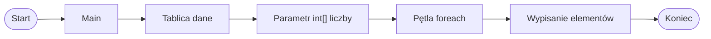

# Metody i tablice

## Po co przekazywać tablicę do metody

W poprzednich działach operacje na tablicach wykonywaliśmy bezpośrednio w metodzie `Main`.

W małych programach jest to wystarczające. W większych programach kod w `Main` może jednak stać się zbyt długi i trudny do czytania.

Do osobnych metod można przenieść na przykład:

* wypisanie elementów tablicy,
* policzenie sumy,
* obliczenie średniej,
* znalezienie minimum,
* znalezienie maksimum.

Dzięki temu metoda `Main` jest krótsza i lepiej pokazuje główny przebieg programu.

## Tablica jako parametr metody

Tablicę można przekazać do metody jako parametr. Dla tablicy liczb całkowitych używamy zapisu `int[]`.

```csharp
static void WypiszTablice(int[] liczby)
{
    // instrukcje
}
```

Najważniejsze elementy:

* `int[]` oznacza tablicę liczb całkowitych,
* `liczby` jest parametrem metody,
* do metody można przekazać tablicę utworzoną w `Main`.

## Pierwszy przykład: wypisanie tablicy

```csharp
using System;

class Program
{
    static void WypiszTablice(int[] liczby)
    {
        foreach (int liczba in liczby)
        {
            Console.WriteLine(liczba);
        }
    }

    static void Main()
    {
        int[] dane = { 5, 2, 7, 1 };

        WypiszTablice(dane);
    }
}
```

Tablica `dane` została utworzona w metodzie `Main`. Następnie została przekazana do metody `WypiszTablice`.

W metodzie `WypiszTablice` ta sama tablica jest dostępna przez parametr `liczby`.

## Jak tablica trafia do metody



Diagram pokazuje, że tablica utworzona w `Main` może zostać przekazana do metody. W metodzie używamy jej przez nazwę parametru.

## Metoda zwracająca sumę elementów tablicy

Metoda może nie tylko wypisywać elementy tablicy, ale także obliczać wynik i zwracać go przez `return`.

```csharp
using System;

class Program
{
    static int ObliczSume(int[] liczby)
    {
        int suma = 0;

        foreach (int liczba in liczby)
        {
            suma += liczba;
        }

        return suma;
    }

    static void Main()
    {
        int[] dane = { 5, 2, 7, 1 };

        int suma = ObliczSume(dane);
        Console.WriteLine(suma);
    }
}
```

W tym przykładzie metoda:

* przyjmuje tablicę jako parametr,
* przechodzi po jej elementach,
* oblicza sumę,
* zwraca wynik przez `return`.

## Metoda zwracająca średnią

```csharp
using System;

class Program
{
    static double ObliczSrednia(int[] liczby)
    {
        int suma = 0;

        foreach (int liczba in liczby)
        {
            suma += liczba;
        }

        return (double)suma / liczby.Length;
    }

    static void Main()
    {
        int[] dane = { 5, 2, 7, 1 };

        double srednia = ObliczSrednia(dane);
        Console.WriteLine(srednia);
    }
}
```

`liczby.Length` oznacza liczbę elementów tablicy.

Zapis `(double)suma` sprawia, że dzielenie daje wynik zmiennoprzecinkowy. Dzięki temu średnia może mieć część po przecinku.

Metoda zwraca wynik typu `double`.

## Metoda zwracająca minimum

```csharp
using System;

class Program
{
    static int ZnajdzMinimum(int[] liczby)
    {
        int minimum = liczby[0];

        foreach (int liczba in liczby)
        {
            if (liczba < minimum)
            {
                minimum = liczba;
            }
        }

        return minimum;
    }

    static void Main()
    {
        int[] dane = { 5, 2, 7, 1 };

        int minimum = ZnajdzMinimum(dane);
        Console.WriteLine(minimum);
    }
}
```

Jako początkowe minimum przyjmujemy pierwszy element tablicy, czyli `liczby[0]`.

Dzięki temu metoda działa także wtedy, gdy wszystkie liczby w tablicy są większe od zera albo mniejsze od zera.

## Porządkowanie programu

W większym programie można przygotować kilka metod, a w `Main` zostawić główny przebieg programu.

```csharp
using System;

class Program
{
    static void WypiszTablice(int[] liczby)
    {
        foreach (int liczba in liczby)
        {
            Console.WriteLine(liczba);
        }
    }

    static int ObliczSume(int[] liczby)
    {
        int suma = 0;

        foreach (int liczba in liczby)
        {
            suma += liczba;
        }

        return suma;
    }

    static double ObliczSrednia(int[] liczby)
    {
        int suma = ObliczSume(liczby);
        return (double)suma / liczby.Length;
    }

    static int ZnajdzMinimum(int[] liczby)
    {
        int minimum = liczby[0];

        foreach (int liczba in liczby)
        {
            if (liczba < minimum)
            {
                minimum = liczba;
            }
        }

        return minimum;
    }

    static void Main()
    {
        int[] dane = { 5, 2, 7, 1 };

        WypiszTablice(dane);

        int suma = ObliczSume(dane);
        double srednia = ObliczSrednia(dane);
        int minimum = ZnajdzMinimum(dane);

        Console.WriteLine($"Suma: {suma}");
        Console.WriteLine($"Średnia: {srednia}");
        Console.WriteLine($"Minimum: {minimum}");
    }
}
```

Metoda `Main` pokazuje, co dzieje się w programie. Szczegóły obliczeń znajdują się w osobnych metodach.

## Najczęstsze błędy

* Pomylenie `int` z `int[]`.
* Brak `[]` przy parametrze tablicy.
* Próba użycia zmiennej z `Main` bez przekazania jej jako argumentu.
* Użycie `liczby.Length` na zwykłej liczbie typu `int`.
* Rozpoczęcie szukania minimum od `0` zamiast od pierwszego elementu tablicy.
* Brak `return` w metodzie, która ma zwracać wynik.

## Ćwiczenia

1. Napisz metodę `WypiszTablice(int[] liczby)`, która wypisuje wszystkie elementy tablicy.
2. Napisz metodę `ObliczSume(int[] liczby)`, która zwraca sumę elementów tablicy.
3. Napisz metodę `ObliczSrednia(int[] liczby)`, która zwraca średnią jako `double`.
4. Napisz metodę `ZnajdzMinimum(int[] liczby)`, która zwraca najmniejszy element tablicy.
5. Napisz metodę `ZnajdzMaksimum(int[] liczby)`, która zwraca największy element tablicy.
6. Napisz metodę `PoliczParzyste(int[] liczby)`, która zwraca liczbę elementów parzystych.
7. W `Main` utwórz tablicę i wywołaj kilka metod analizujących tę samą tablicę.
8. Przepisz program z poprzedniego działu tak, aby obliczenia na tablicy były wykonane w metodach.

## Podsumowanie

Tablica może być argumentem metody. Parametr tablicowy zapisujemy na przykład jako `int[] liczby`.

Metoda może wypisać elementy tablicy albo zwrócić wynik obliczeń, na przykład sumę, średnią lub minimum.

Metody porządkują algorytmy na tablicach. Dzięki nim `Main` może pokazywać główny przebieg programu, a szczegóły można przenieść do osobnych, nazwanych fragmentów kodu.
