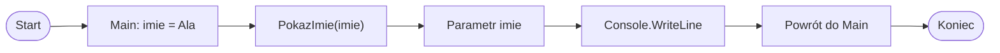

# Parametry metod a zmienne lokalne

## Przypomnienie: parametr

Parametr znajduje się w definicji metody i przyjmuje wartość przekazaną podczas wywołania metody.

```csharp
using System;

class Program
{
    static void PokazImie(string imie)
    {
        Console.WriteLine(imie);
    }

    static void Main()
    {
        PokazImie("Ala");
    }
}
```

`imie` jest parametrem metody `PokazImie`. Metoda może używać tego parametru w swoim ciele.

## Przypomnienie: zmienna lokalna

Zmienna lokalna jest zadeklarowana wewnątrz metody lub bloku kodu.

```csharp
using System;

class Program
{
    static void Main()
    {
        string imie = "Ala";
        Console.WriteLine(imie);
    }
}
```

`imie` jest zmienną lokalną metody `Main`.

## Podobieństwo

Parametr i zmienna lokalna są podobne, ponieważ:

* mają nazwę,
* mają typ,
* można ich używać w metodzie,
* przechowują wartość.

W obu przypadkach trzeba zwracać uwagę na zakres, czyli miejsce, w którym dana nazwa jest dostępna.

## Różnica

| Cecha                | Parametr                      | Zmienna lokalna              |
| -------------------- | ----------------------------- | ---------------------------- |
| Gdzie powstaje?      | W nagłówku metody             | W ciele metody lub bloku     |
| Skąd ma wartość?     | Z argumentu przy wywołaniu    | Z przypisania w kodzie       |
| Gdzie jest dostępny? | W metodzie                    | W swoim bloku                |
| Przykład             | `string imie` w nagłówku metody | `int suma = 0;` w ciele metody |

Parametr jest częścią nagłówka metody. Zmienna lokalna powstaje dopiero w instrukcji zapisanej w ciele metody albo bloku.

## Osobne zakresy metod

Każda metoda ma własny zakres zmiennych.

```csharp
using System;

class Program
{
    static void PokazImie(string imie)
    {
        Console.WriteLine(imie);
    }

    static void Main()
    {
        string imie = "Ala";

        PokazImie(imie);
    }
}
```

W tym przykładzie:

* zmienna `imie` w `Main` jest zmienną lokalną metody `Main`,
* parametr `imie` w `PokazImie` jest parametrem tej metody,
* mimo tej samej nazwy są to dwa różne miejsca w kodzie,
* argument z `Main` przekazuje wartość do parametru metody.

## Diagram: argument i parametr



Diagram pokazuje, że zmienna lokalna z `Main` jest argumentem przy wywołaniu metody. Jej wartość trafia do parametru metody `PokazImie`.

## Zmienna z Main nie jest automatycznie widoczna w innej metodzie

Przykład błędny:

```csharp
using System;

class Program
{
    static void PokazImie()
    {
        Console.WriteLine(imie);
    }

    static void Main()
    {
        string imie = "Ala";

        PokazImie();
    }
}
```

Ten program zawiera błąd. Metoda `PokazImie` nie widzi zmiennej lokalnej `imie` z metody `Main`.

Poprawna wersja:

```csharp
using System;

class Program
{
    static void PokazImie(string imie)
    {
        Console.WriteLine(imie);
    }

    static void Main()
    {
        string imie = "Ala";

        PokazImie(imie);
    }
}
```

Wartość trzeba przekazać przez argument do parametru. Dzięki temu metoda `PokazImie` otrzymuje dane, których potrzebuje.

## Czy można użyć innej nazwy parametru

Nazwa argumentu i nazwa parametru nie muszą być takie same.

```csharp
using System;

class Program
{
    static void PokazImie(string tekst)
    {
        Console.WriteLine(tekst);
    }

    static void Main()
    {
        string imie = "Ala";

        PokazImie(imie);
    }
}
```

W `Main` zmienna nazywa się `imie`, a parametr metody nazywa się `tekst`. Program nadal działa, ponieważ ważna jest przekazana wartość i zgodny typ.

## Najczęstsze błędy

* Próba użycia zmiennej lokalnej z `Main` w innej metodzie bez parametru.
* Mylenie parametru z argumentem.
* Przekonanie, że takie same nazwy oznaczają tę samą zmienną.
* Użycie parametru poza metodą.
* Nieprzekazanie argumentu przy wywołaniu metody z parametrem.

## Ćwiczenia

1. Wskaż w przykładzie, co jest parametrem, a co argumentem.
2. Napisz metodę `PokazImie(string imie)` i wywołaj ją z `Main`.
3. Napisz metodę `PokazLiczbe(int liczba)` i przekaż do niej zmienną lokalną z `Main`.
4. Zmień nazwę parametru w metodzie i sprawdź, czy program nadal działa.
5. Popraw program, w którym metoda próbuje użyć zmiennej lokalnej z `Main` bez parametru.
6. Napisz metodę `PokazDane(string imie, int wiek)` i wywołaj ją z `Main`.
7. Własnymi słowami wyjaśnij różnicę między parametrem a zmienną lokalną.

## Podsumowanie

Parametr znajduje się w nagłówku metody. Zmienna lokalna powstaje w ciele metody lub bloku.

Każda metoda ma własny zakres. Zmienna z `Main` nie jest automatycznie widoczna w innej metodzie.

Dane przekazujemy do metody przez argumenty i parametry.
