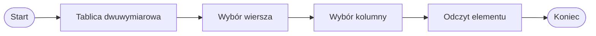

# Tablice dwuwymiarowe

## Po co są tablice dwuwymiarowe

Zwykła tablica jednowymiarowa przypomina listę wartości.

```csharp
int[] liczby = { 4, 7, 2, 9 };
```

Tablica dwuwymiarowa przypomina tabelę, czyli dane ułożone w wierszach i kolumnach.

Przykłady zastosowań:

- tabela ocen,
- plansza gry,
- macierz liczb,
- dane pomiarowe w kilku kolumnach,
- arkusz podobny do prostego Excela.

## Tablica jako tabela

|   | Kolumna 0 | Kolumna 1 | Kolumna 2 |
|---|---:|---:|---:|
| Wiersz 0 | 1 | 2 | 3 |
| Wiersz 1 | 4 | 5 | 6 |

Elementy tablicy dwuwymiarowej mają dwa indeksy:

- pierwszy indeks oznacza wiersz,
- drugi indeks oznacza kolumnę.

Przykład:

```csharp
tablica[0, 1]
```

Ten zapis oznacza element z wiersza `0` i kolumny `1`.

## Deklaracja tablicy dwuwymiarowej

```csharp
int[,] tablica = new int[2, 3];
```

Wyjaśnienie:

- `int[,]` oznacza tablicę dwuwymiarową liczb całkowitych,
- `2` oznacza liczbę wierszy,
- `3` oznacza liczbę kolumn,
- indeksy zaczynają się od `0`.

## Inicjalizacja tablicy wartościami

```csharp
int[,] liczby =
{
    { 1, 2, 3 },
    { 4, 5, 6 }
};
```

Ta tablica ma `2` wiersze i `3` kolumny.

## Dostęp do elementu tablicy

```csharp
using System;

class Program
{
    static void Main()
    {
        int[,] liczby =
        {
            { 1, 2, 3 },
            { 4, 5, 6 }
        };

        Console.WriteLine(liczby[0, 0]);
        Console.WriteLine(liczby[0, 1]);
        Console.WriteLine(liczby[1, 2]);
    }
}
```

Program wypisze:

- `1`, bo `liczby[0, 0]` oznacza wiersz `0`, kolumnę `0`,
- `2`, bo `liczby[0, 1]` oznacza wiersz `0`, kolumnę `1`,
- `6`, bo `liczby[1, 2]` oznacza wiersz `1`, kolumnę `2`.

## Diagram: wiersz i kolumna



Do odczytania elementu tablicy dwuwymiarowej potrzebne są dwa indeksy: indeks wiersza i indeks kolumny.

## Liczba wierszy i kolumn

W tablicy dwuwymiarowej można sprawdzić liczbę wierszy i kolumn za pomocą `GetLength`.

- `GetLength(0)` zwraca liczbę wierszy,
- `GetLength(1)` zwraca liczbę kolumn.

```csharp
using System;

class Program
{
    static void Main()
    {
        int[,] liczby =
        {
            { 1, 2, 3 },
            { 4, 5, 6 }
        };

        int wiersze = liczby.GetLength(0);
        int kolumny = liczby.GetLength(1);

        Console.WriteLine(wiersze);
        Console.WriteLine(kolumny);
    }
}
```

Program wypisze `2`, a potem `3`.

## Przejście po tablicy dwiema pętlami

```csharp
using System;

class Program
{
    static void Main()
    {
        int[,] liczby =
        {
            { 1, 2, 3 },
            { 4, 5, 6 }
        };

        for (int wiersz = 0; wiersz < liczby.GetLength(0); wiersz++)
        {
            for (int kolumna = 0; kolumna < liczby.GetLength(1); kolumna++)
            {
                Console.Write(liczby[wiersz, kolumna] + " ");
            }

            Console.WriteLine();
        }
    }
}
```

Wyjaśnienie:

- zewnętrzna pętla przechodzi po wierszach,
- wewnętrzna pętla przechodzi po kolumnach,
- `Console.Write` wypisuje element bez przejścia do nowej linii,
- `Console.WriteLine` po wewnętrznej pętli przechodzi do następnego wiersza.

## Suma wszystkich elementów

```csharp
int suma = 0;

for (int wiersz = 0; wiersz < liczby.GetLength(0); wiersz++)
{
    for (int kolumna = 0; kolumna < liczby.GetLength(1); kolumna++)
    {
        suma += liczby[wiersz, kolumna];
    }
}

Console.WriteLine(suma);
```

Zmienna `suma` musi być zadeklarowana przed pętlami, ponieważ jest aktualizowana w wielu obrotach pętli i używana po ich zakończeniu.

## Suma jednego wiersza

Przykład dla wiersza o indeksie `0`:

```csharp
int sumaWiersza = 0;
int wybranyWiersz = 0;

for (int kolumna = 0; kolumna < liczby.GetLength(1); kolumna++)
{
    sumaWiersza += liczby[wybranyWiersz, kolumna];
}

Console.WriteLine(sumaWiersza);
```

Wiersz jest stały, a zmienia się kolumna.

## Suma jednej kolumny

Przykład dla kolumny o indeksie `1`:

```csharp
int sumaKolumny = 0;
int wybranaKolumna = 1;

for (int wiersz = 0; wiersz < liczby.GetLength(0); wiersz++)
{
    sumaKolumny += liczby[wiersz, wybranaKolumna];
}

Console.WriteLine(sumaKolumny);
```

Kolumna jest stała, a zmienia się wiersz.

## Najczęstsze błędy

- Pomylenie `int[]` z `int[,]`.
- Użycie jednego indeksu zamiast dwóch.
- Pomylenie wiersza z kolumną.
- Zapomnienie, że indeksy zaczynają się od `0`.
- Użycie `GetLength(0)` tam, gdzie trzeba `GetLength(1)`.
- Wyjście poza zakres tablicy.
- Użycie `Console.WriteLine` w miejscu, gdzie chcemy wypisać wiersz tabeli.

## Ćwiczenia

1. Utwórz tablicę dwuwymiarową `2x3` i wpisz do niej dowolne liczby.
2. Wypisz jeden wybrany element tablicy, używając dwóch indeksów.
3. Wypisz wszystkie elementy tablicy za pomocą dwóch pętli `for`.
4. Wypisz tablicę w formie tabeli.
5. Oblicz sumę wszystkich elementów tablicy.
6. Oblicz sumę pierwszego wiersza.
7. Oblicz sumę drugiej kolumny.
8. Znajdź największy element w tablicy dwuwymiarowej.

## Podsumowanie

Tablica dwuwymiarowa przypomina tabelę.

Pierwszy indeks oznacza wiersz, a drugi indeks oznacza kolumnę.

`int[,]` oznacza tablicę dwuwymiarową. `GetLength(0)` zwraca liczbę wierszy, a `GetLength(1)` zwraca liczbę kolumn.

Do przejścia po tablicy dwuwymiarowej najczęściej używamy dwóch pętli.
