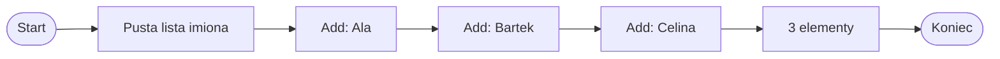

# List<string>

## Lista tekstów

`List<int>` przechowuje liczby całkowite, a `List<string>` przechowuje teksty.

```csharp
List<int> liczby = new List<int>();
```

```csharp
List<string> imiona = new List<string>();
```

Wyjaśnienie:

- `string` oznacza tekst,
- `List<string>` oznacza listę tekstów,
- lista tekstów może przechowywać np. imiona, nazwy przedmiotów, komunikaty albo hasła menu.

## Potrzebny using

Do list potrzebny jest:

```csharp
using System.Collections.Generic;
```

Minimalny przykład:

```csharp
using System;
using System.Collections.Generic;

class Program
{
    static void Main()
    {
        List<string> imiona = new List<string>();
    }
}
```

## Dodawanie tekstów do listy

```csharp
using System;
using System.Collections.Generic;

class Program
{
    static void Main()
    {
        List<string> imiona = new List<string>();

        imiona.Add("Ala");
        imiona.Add("Bartek");
        imiona.Add("Celina");

        Console.WriteLine(imiona.Count);
    }
}
```

Wyjaśnienie:

- `Add` dodaje nowy tekst na koniec listy,
- `Count` zwraca liczbę elementów,
- teksty zapisujemy w cudzysłowie.

Program wypisze `3`, ponieważ lista zawiera trzy teksty.

## Diagram: dodawanie tekstów



Diagram pokazuje, że lista tekstów rośnie po dodaniu kolejnych elementów.

## Odczyt elementu przez indeks

```csharp
Console.WriteLine(imiona[0]);
Console.WriteLine(imiona[1]);
```

Wyjaśnienie:

- indeksy zaczynają się od `0`,
- `imiona[0]` oznacza pierwszy tekst,
- `imiona[1]` oznacza drugi tekst,
- próba odczytu nieistniejącego indeksu jest błędem.

## Wypisywanie listy pętlą for

```csharp
for (int i = 0; i < imiona.Count; i++)
{
    Console.WriteLine(imiona[i]);
}
```

`i` jest indeksem. `Count` mówi, ile elementów ma lista. Przez indeks można odczytać konkretny tekst.

## Wypisywanie listy pętlą foreach

```csharp
foreach (string imie in imiona)
{
    Console.WriteLine(imie);
}
```

`foreach` jest wygodny, gdy chcemy wypisać wszystkie teksty i nie potrzebujemy indeksu.

## Sprawdzanie, czy lista zawiera tekst

```csharp
if (imiona.Contains("Ala"))
{
    Console.WriteLine("Ala jest na liście");
}
```

Wyjaśnienie:

- `Contains` sprawdza, czy lista zawiera podany tekst,
- wynik jest typu `bool`,
- wielkość liter ma znaczenie, więc `"Ala"` i `"ala"` to różne teksty.

## Usuwanie tekstów z listy

```csharp
imiona.Remove("Bartek");
```

`Remove` usuwa pierwsze wystąpienie podanego tekstu.

```csharp
imiona.RemoveAt(0);
```

`RemoveAt` usuwa element z podanego indeksu.

Po usunięciu elementu zmienia się `Count`. Po `RemoveAt` zmieniają się indeksy kolejnych elementów.

## Przykład: prosta lista obecności

```csharp
using System;
using System.Collections.Generic;

class Program
{
    static void Main()
    {
        List<string> obecni = new List<string>();

        obecni.Add("Ala");
        obecni.Add("Bartek");
        obecni.Add("Celina");

        Console.WriteLine("Lista obecnych:");

        foreach (string osoba in obecni)
        {
            Console.WriteLine(osoba);
        }

        if (obecni.Contains("Ala"))
        {
            Console.WriteLine("Ala jest obecna");
        }
    }
}
```

Lista tekstów dobrze nadaje się do przechowywania prostych zbiorów nazw.

## Najczęstsze błędy

- Brak `using System.Collections.Generic`.
- Zapis tekstu bez cudzysłowu.
- Mylenie `Count` z `Length`.
- Próba odczytu elementu spoza zakresu.
- Pomylenie `Remove` z `RemoveAt`.
- Oczekiwanie, że `Contains` ignoruje wielkość liter.
- Używanie indeksu po usunięciu elementu bez sprawdzenia aktualnej długości listy.

## Ćwiczenia

1. Utwórz pustą listę `List<string>` o nazwie `imiona`.
2. Dodaj do listy trzy imiona.
3. Wypisz liczbę elementów listy za pomocą `Count`.
4. Wypisz pierwszy element listy.
5. Wypisz wszystkie elementy listy pętlą `for`.
6. Wypisz wszystkie elementy listy pętlą `foreach`.
7. Sprawdź, czy lista zawiera wybrane imię za pomocą `Contains`.
8. Usuń jedno imię z listy i ponownie wypisz wszystkie elementy.

## Podsumowanie

`List<string>` przechowuje teksty. Teksty zapisujemy w cudzysłowie.

`Add` dodaje tekst do listy, a `Count` zwraca liczbę elementów.

Elementy listy można odczytywać przez indeks. `foreach` jest wygodny do wypisywania wszystkich tekstów.

`Contains` sprawdza, czy lista zawiera podany tekst. `Remove` i `RemoveAt` usuwają elementy na różne sposoby.
