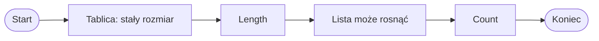

# List a tablica

## Dwa sposoby przechowywania wielu wartości

W C# poznaliśmy już dwa sposoby przechowywania wielu wartości tego samego typu:

- tablicę, np. `int[]`,
- listę, np. `List<int>`.

Przykład tablicy:

```csharp
int[] tablica = { 4, 7, 2 };
```

Przykład listy:

```csharp
List<int> lista = new List<int>();
lista.Add(4);
lista.Add(7);
lista.Add(2);
```

Obie struktury pozwalają przechowywać kilka liczb, ale różnią się sposobem pracy.

## Tablica ma ustalony rozmiar

```csharp
int[] liczby = new int[3];

liczby[0] = 10;
liczby[1] = 20;
liczby[2] = 30;
```

Wyjaśnienie:

- tablica ma rozmiar ustalony podczas tworzenia,
- w tym przykładzie tablica ma `3` miejsca,
- nie można po prostu dodać czwartego elementu metodą `Add`,
- liczba elementów tablicy to `Length`.

```csharp
Console.WriteLine(liczby.Length);
```

## Lista może rosnąć

```csharp
using System;
using System.Collections.Generic;

class Program
{
    static void Main()
    {
        List<int> liczby = new List<int>();

        liczby.Add(10);
        liczby.Add(20);
        liczby.Add(30);
        liczby.Add(40);

        Console.WriteLine(liczby.Count);
    }
}
```

Wyjaśnienie:

- lista na początku może być pusta,
- `Add` dodaje kolejne elementy,
- lista może zwiększać liczbę elementów,
- liczba elementów listy to `Count`.

## Diagram: stały rozmiar i rosnąca lista



Diagram pokazuje główną różnicę: tablica ma ustalony rozmiar, a lista może rosnąć. Dlatego tablica używa `Length`, a lista `Count`.

## Dostęp przez indeks

W obu przypadkach można odczytać element przez indeks.

```csharp
Console.WriteLine(tablica[0]);
Console.WriteLine(lista[0]);
```

Wyjaśnienie:

- indeksy zaczynają się od `0`,
- pierwszy element ma indeks `0`,
- drugi element ma indeks `1`,
- wyjście poza zakres jest błędem zarówno w tablicy, jak i w liście.

## Przejście pętlą for

Przejście po tablicy:

```csharp
for (int i = 0; i < tablica.Length; i++)
{
    Console.WriteLine(tablica[i]);
}
```

Przejście po liście:

```csharp
for (int i = 0; i < lista.Count; i++)
{
    Console.WriteLine(lista[i]);
}
```

Przy tablicy używamy `Length`, a przy liście `Count`.

## Przejście pętlą foreach

```csharp
foreach (int liczba in tablica)
{
    Console.WriteLine(liczba);
}
```

```csharp
foreach (int liczba in lista)
{
    Console.WriteLine(liczba);
}
```

`foreach` działa wygodnie w obu przypadkach, gdy chcemy przejść po wszystkich elementach.

## Kiedy użyć tablicy

Tablica jest dobra, gdy:

- znamy liczbę elementów,
- rozmiar nie będzie się zmieniał,
- dane mają prostą, ustaloną strukturę,
- pracujemy np. z tablicą 2D albo prostym zestawem danych.

Przykład:

```csharp
int[] oceny = new int[5];
```

## Kiedy użyć listy

Lista jest dobra, gdy:

- nie wiemy z góry, ile będzie elementów,
- będziemy dodawać elementy w trakcie działania programu,
- będziemy usuwać elementy,
- chcemy wygodnie korzystać z `Add`, `Remove`, `Contains`.

Przykład:

```csharp
List<int> punkty = new List<int>();
```

## Tabela porównawcza

| Cecha | Tablica `int[]` | Lista `List<int>` |
|---|---|---|
| Rozmiar | Ustalony przy tworzeniu | Może się zmieniać |
| Liczba elementów | `Length` | `Count` |
| Dodawanie elementów | Niewygodne | `Add` |
| Usuwanie elementów | Niewygodne | `Remove`, `RemoveAt` |
| Dostęp przez indeks | Tak | Tak |
| `foreach` | Tak | Tak |
| Dobre zastosowanie | Stała liczba danych | Zmienna liczba danych |

## Najczęstsze błędy

- Użycie `Count` przy tablicy.
- Użycie `Length` przy liście.
- Próba użycia `Add` na tablicy.
- Zapomnienie `using System.Collections.Generic` przy `List<int>`.
- Wyjście poza zakres indeksu.
- Używanie listy tam, gdzie prosta tablica wystarczy.
- Używanie tablicy tam, gdzie liczba elementów będzie się zmieniać.

## Ćwiczenia

1. Utwórz tablicę `int[]` o rozmiarze `5` i wpisz do niej liczby.
2. Wypisz długość tablicy za pomocą `Length`.
3. Utwórz pustą listę `List<int>`.
4. Dodaj do listy kilka liczb metodą `Add`.
5. Wypisz liczbę elementów listy za pomocą `Count`.
6. Wypisz wszystkie elementy tablicy pętlą `for`.
7. Wypisz wszystkie elementy listy pętlą `for`.
8. Dla kilku opisów zadań zdecyduj, czy lepsza będzie tablica, czy lista.

## Podsumowanie

Tablica i lista służą do przechowywania wielu wartości.

Tablica ma zwykle ustalony rozmiar, a lista może rosnąć i maleć.

Tablica używa `Length`, a lista używa `Count`.

Obie struktury pozwalają odczytywać elementy przez indeks. Wybór zależy od tego, czy liczba elementów jest stała, czy zmienna.
