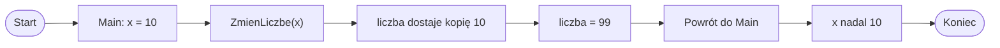

# Przekazywanie parametrów przez wartość

## Przypomnienie: parametr i argument

Parametr znajduje się w definicji metody. Argument przekazujemy podczas wywołania metody.

```csharp
using System;

class Program
{
    static void PokazLiczbe(int liczba)
    {
        Console.WriteLine(liczba);
    }

    static void Main()
    {
        int x = 10;
        PokazLiczbe(x);
    }
}
```

W tym przykładzie `x` jest argumentem, a `liczba` jest parametrem metody `PokazLiczbe`.

## Co znaczy „przez wartość”

Domyślnie C# przekazuje argumenty do metod przez wartość. Oznacza to, że metoda dostaje kopię wartości.

Jeżeli w `Main` mamy:

```csharp
int x = 10;
```

a potem wywołujemy metodę:

```csharp
ZmienLiczbe(x);
```

to metoda otrzymuje wartość `10`, ale nie dostaje bezpośredniego dostępu do zmiennej `x` z `Main`.

## Przykład: zmiana parametru nie zmienia zmiennej w Main

```csharp
using System;

class Program
{
    static void ZmienLiczbe(int liczba)
    {
        liczba = 99;
        Console.WriteLine("W metodzie: " + liczba);
    }

    static void Main()
    {
        int x = 10;

        ZmienLiczbe(x);

        Console.WriteLine("W Main: " + x);
    }
}
```

Wynik programu:

- w metodzie zostanie wypisane `99`,
- w `Main` nadal zostanie wypisane `10`,
- ponieważ `liczba` jest kopią wartości `x`.

## Diagram: kopia wartości



Diagram pokazuje, że metoda pracuje na kopii wartości, a nie bezpośrednio na zmiennej `x` z `Main`.

## Dlaczego tak się dzieje

Parametr metody jest osobną zmienną dostępną wewnątrz metody. Może mieć taką samą wartość jak argument, ale nie jest tą samą zmienną.

Porównanie:

- `x` istnieje w `Main`,
- `liczba` istnieje w metodzie `ZmienLiczbe`,
- zmiana `liczba` nie zmienia `x`.

## Jak poprawnie zwrócić zmienioną wartość

Jeśli metoda ma obliczyć nową wartość, powinna ją zwrócić przez `return`.

```csharp
using System;

class Program
{
    static int Zwieksz(int liczba)
    {
        liczba = liczba + 1;
        return liczba;
    }

    static void Main()
    {
        int x = 10;

        x = Zwieksz(x);

        Console.WriteLine(x);
    }
}
```

Wyjaśnienie:

- metoda otrzymuje kopię wartości `x`,
- oblicza nową wartość,
- zwraca ją przez `return`,
- w `Main` przypisujemy wynik z powrotem do `x`.

## Zmiana parametru a zwrócenie wyniku

| Sytuacja | Czy zmienia zmienną w Main? |
|---|---|
| Zmiana parametru w metodzie | Nie |
| Zwrócenie wyniku przez `return` i przypisanie go w `Main` | Tak, bo sami przypisujemy nową wartość |
| Samo wywołanie metody bez przypisania wyniku | Nie |

Częsty błąd:

```csharp
Zwieksz(x);
Console.WriteLine(x);
```

Jeśli nie przypiszemy wyniku, `x` pozostanie bez zmian.

Poprawnie:

```csharp
x = Zwieksz(x);
Console.WriteLine(x);
```

## Przykład z dwoma liczbami

```csharp
using System;

class Program
{
    static int Dodaj(int a, int b)
    {
        return a + b;
    }

    static void Main()
    {
        int pierwsza = 4;
        int druga = 6;

        int suma = Dodaj(pierwsza, druga);

        Console.WriteLine(suma);
    }
}
```

Metoda otrzymuje wartości zmiennych `pierwsza` i `druga`, oblicza wynik i zwraca go.

## Uwaga o tablicach i listach

Przy typach takich jak `int`, `double`, `bool` czy `char` łatwo zobaczyć przekazywanie przez wartość: metoda dostaje kopię wartości.

Przy tablicach i listach sprawa jest trudniejsza, bo są to typy referencyjne. Oznacza to, że można zmienić elementy tablicy lub listy przekazanej do metody.

Na tym etapie wystarczy zapamiętać, że zwykłe liczby zachowują się inaczej niż tablice i listy. Ten temat będzie wracał przy dalszej nauce.

## Przygotowanie do ref i out

C# ma specjalne słowa `ref` i `out`, które pozwalają przekazywać dane do metod inaczej niż zwykłe przekazywanie przez wartość.

Zanim jednak ich użyjemy, trzeba dobrze rozumieć zwykłe przekazywanie przez wartość.

## Najczęstsze błędy

- Oczekiwanie, że zmiana parametru `int` w metodzie zmieni zmienną w `Main`.
- Zapomnienie o przypisaniu wyniku metody zwracającej wartość.
- Mylenie parametru z argumentem.
- Przekonanie, że taka sama nazwa zmiennej oznacza tę samą zmienną.
- Zbyt szybkie używanie `ref` bez potrzeby.
- Mylenie zwykłych typów liczbowych z tablicami i listami.

## Ćwiczenia

1. Wskaż w przykładzie, co jest argumentem, a co parametrem.
2. Napisz metodę `PokazLiczbe(int liczba)` i wywołaj ją z `Main`.
3. Napisz metodę `ZmienLiczbe(int liczba)`, która ustawia parametr na `100` i wypisuje go w metodzie.
4. Sprawdź, czy zmienna przekazana z `Main` zmieniła się po wywołaniu metody.
5. Napisz metodę `int Zwieksz(int liczba)`, która zwraca liczbę większą o `1`.
6. Wywołaj `Zwieksz(x)` bez przypisania wyniku i sprawdź, co stanie się z `x`.
7. Wywołaj `x = Zwieksz(x)` i sprawdź, co stanie się z `x`.
8. Własnymi słowami wyjaśnij, co znaczy, że parametr jest przekazywany przez wartość.

## Podsumowanie

Domyślnie argumenty są przekazywane do metod przez wartość.

Metoda otrzymuje kopię wartości. Zmiana parametru `int` w metodzie nie zmienia zmiennej z `Main`.

Jeśli metoda ma dać nową wartość, powinna ją zwrócić przez `return`. Wynik metody trzeba przypisać, jeśli chcemy go dalej używać.

`ref` i `out` są specjalnymi mechanizmami i będą omówione osobno.
