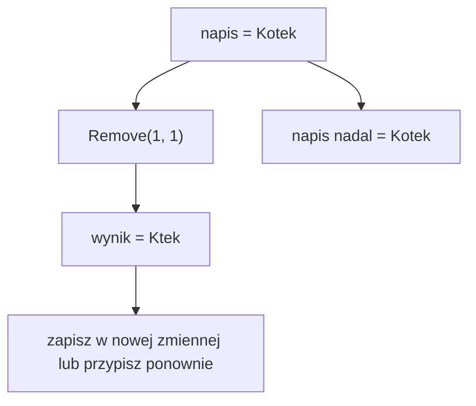

# Metody typu string - wyszukiwanie i przekształcanie napisów

## Cel lekcji

Na tej lekcji poznasz najczęściej używane metody typu `string`. Nauczysz się wyszukiwać fragmenty tekstu, usuwać zbędne znaki oraz tworzyć zmienione napisy.

## Po lekcji potrafisz

- zamienić litery na wielkie lub małe,
- usunąć białe znaki z początku i końca napisu,
- sprawdzić, czy napis zawiera podany fragment,
- sprawdzić początek i koniec napisu,
- znaleźć pozycję znaku lub fragmentu,
- pobrać część napisu,
- usunąć, zamienić albo wstawić fragment,
- połączyć kilka prostych metod,
- bezpiecznie użyć indeksu podanego przez użytkownika.

## Metoda może zwracać różne typy

Metody typu `string` nie zawsze zwracają napis.

- `ToUpper()`, `Trim()` i `Replace()` zwracają nowy `string`.
- `Contains()` i `StartsWith()` zwracają `bool`, czyli `true` albo `false`.
- `IndexOf()` zwraca `int`, czyli pozycję znalezionego fragmentu albo `-1`.

Typ wyniku decyduje o tym, jak go wykorzystamy.

```csharp
using System;

class Program
{
    static void Main()
    {
        string napis = "  Ala ma kota  ";

        string poprawionyNapis = napis.Trim();
        bool zawieraKota = napis.Contains("kota");
        int pozycjaKota = napis.IndexOf("kota");

        Console.WriteLine(poprawionyNapis);
        Console.WriteLine(zawieraKota);
        Console.WriteLine(pozycjaKota);
    }
}
```

## Napis jest niezmienny

Obiekt typu `string` jest niezmienny. Metoda taka jak `Remove()` nie zmienia istniejącego napisu. Tworzy i zwraca nowy napis.



Wynik trzeba zapisać albo od razu wykorzystać.

```csharp
using System;

class Program
{
    static void Main()
    {
        string napis = "Kotek";

        string wynik = napis.Remove(1, 1);
        Console.WriteLine(wynik);
        Console.WriteLine(napis);

        napis = napis.Remove(1, 1);
        Console.WriteLine(napis);
    }
}
```

Samo wywołanie `napis.Remove(1, 1);` obliczy nowy napis, ale wynik zostanie utracony.

## ToUpper i ToLower

Metoda `ToUpper()` tworzy napis z wielkimi literami, a `ToLower()` z małymi literami.

```csharp
using System;

class Program
{
    static void Main()
    {
        string nazwa = "CSharp";

        string wielkieLitery = nazwa.ToUpper();
        string maleLitery = nazwa.ToLower();

        Console.WriteLine(wielkieLitery);
        Console.WriteLine(maleLitery);
        Console.WriteLine(nazwa);
    }
}
```

Wynik:

```text
CSHARP
csharp
CSharp
```

## Trim, TrimStart i TrimEnd

Białe znaki to między innymi spacje i znaki tabulacji.

- `Trim()` usuwa białe znaki z początku i końca.
- `TrimStart()` usuwa białe znaki tylko z początku.
- `TrimEnd()` usuwa białe znaki tylko z końca.

```csharp
using System;

class Program
{
    static void Main()
    {
        string tekst = "   Cześć!   ";

        Console.WriteLine("[" + tekst.Trim() + "]");
        Console.WriteLine("[" + tekst.TrimStart() + "]");
        Console.WriteLine("[" + tekst.TrimEnd() + "]");
    }
}
```

Nawiasy kwadratowe ułatwiają zauważenie pozostałych spacji.

## Contains

Metoda `Contains()` sprawdza, czy napis zawiera podany znak albo fragment. Zwraca `true` lub `false`.

```csharp
using System;

class Program
{
    static void Main()
    {
        string opis = "Uczeń poznaje język C#";

        bool zawieraJezyk = opis.Contains("język");
        bool zawieraJave = opis.Contains("Java");

        Console.WriteLine(zawieraJezyk);
        Console.WriteLine(zawieraJave);
    }
}
```

Wielkość liter ma znaczenie. Napis `"Kot"` nie zawiera fragmentu `"kot"`.

## StartsWith i EndsWith

Metoda `StartsWith()` sprawdza początek napisu. Metoda `EndsWith()` sprawdza jego koniec.

```csharp
using System;

class Program
{
    static void Main()
    {
        string nazwaPliku = "notatki.txt";

        if (nazwaPliku.StartsWith("notatki"))
        {
            Console.WriteLine("To są notatki.");
        }

        if (nazwaPliku.EndsWith(".txt"))
        {
            Console.WriteLine("To jest plik tekstowy.");
        }
    }
}
```

## IndexOf

Metoda `IndexOf()` szuka pierwszego wystąpienia znaku albo fragmentu i zwraca jego indeks.

- `0` oznacza, że znaleziony element zaczyna się na pierwszej pozycji.
- `-1` oznacza, że elementu nie znaleziono.

```csharp
using System;

class Program
{
    static void Main()
    {
        string napis = "programowanie";

        int pozycjaProgramu = napis.IndexOf("program");
        int pozycjaLiteryM = napis.IndexOf('m');
        int pozycjaZnakuX = napis.IndexOf('x');

        Console.WriteLine(pozycjaProgramu);
        Console.WriteLine(pozycjaLiteryM);
        Console.WriteLine(pozycjaZnakuX);
    }
}
```

Wynik:

```text
0
6
-1
```

Nie sprawdzaj znalezienia warunkiem `indeks > 0`, ponieważ indeks `0` jest poprawny. Użyj warunku `indeks >= 0` albo `indeks != -1`.

```csharp
using System;

class Program
{
    static void Main()
    {
        string zdanie = "Kot śpi na kanapie";
        int indeks = zdanie.IndexOf("Kot");

        if (indeks >= 0)
        {
            Console.WriteLine("Znaleziono na pozycji: " + indeks);
        }
        else
        {
            Console.WriteLine("Nie znaleziono.");
        }
    }
}
```

## Substring

Metoda `Substring()` pobiera fragment napisu i zwraca nowy `string`.

### Substring od podanego indeksu

`Substring(indeksPoczatkowy)` pobiera tekst od podanego indeksu do końca.

```csharp
using System;

class Program
{
    static void Main()
    {
        string kod = "PL-2026-WAW";
        string dalszaCzesc = kod.Substring(3);

        Console.WriteLine(dalszaCzesc);
    }
}
```

Wynik to `2026-WAW`.

### Substring od indeksu o podanej długości

`Substring(indeksPoczatkowy, liczbaZnakow)` pobiera określoną liczbę znaków.

```csharp
using System;

class Program
{
    static void Main()
    {
        string kod = "PL-2026-WAW";
        string rok = kod.Substring(3, 4);

        Console.WriteLine(rok);
    }
}
```

Wynik to `2026`.

Przed pobraniem fragmentu trzeba sprawdzić indeksy:

- indeks początkowy nie może być mniejszy od `0`,
- indeks początkowy nie może być większy od `Length`,
- indeks początkowy i liczba znaków razem nie mogą przekraczać `Length`.

Poniższy program używa `TryParse()`, ponieważ indeks podaje użytkownik.

```csharp
using System;

class Program
{
    static void Main()
    {
        string napis = "Programowanie";

        Console.Write("Podaj indeks początkowy: ");
        string tekstIndeksu = Console.ReadLine();

        if (int.TryParse(tekstIndeksu, out int indeksPoczatkowy))
        {
            if (indeksPoczatkowy >= 0 && indeksPoczatkowy <= napis.Length)
            {
                string fragment = napis.Substring(indeksPoczatkowy);
                Console.WriteLine(fragment);
            }
            else
            {
                Console.WriteLine("Indeks jest poza napisem.");
            }
        }
        else
        {
            Console.WriteLine("Podana wartość nie jest liczbą całkowitą.");
        }
    }
}
```

## Remove

Metoda `Remove()` usuwa znaki i zwraca nowy napis.

- `Remove(indeksPoczatkowy)` usuwa tekst od indeksu do końca.
- `Remove(indeksPoczatkowy, liczbaZnakow)` usuwa określoną liczbę znaków.

```csharp
using System;

class Program
{
    static void Main()
    {
        string napis = "Programowanie";

        string bezKoncowki = napis.Remove(7);
        string bezCzterechZnakow = napis.Remove(3, 4);

        Console.WriteLine(bezKoncowki);
        Console.WriteLine(bezCzterechZnakow);
        Console.WriteLine(napis);
    }
}
```

Przy `Remove()` obowiązują podobne zasady kontroli indeksów jak przy `Substring()`.

## Replace

Metoda `Replace()` zastępuje wszystkie pasujące wystąpienia. Można zastępować znaki albo całe fragmenty.

```csharp
using System;

class Program
{
    static void Main()
    {
        string napis = "ala ma kota, a kot ma ale";

        string zamienioneZnaki = napis.Replace('a', 'A');
        string zamienioneFragmenty = napis.Replace("kot", "pies");

        Console.WriteLine(zamienioneZnaki);
        Console.WriteLine(zamienioneFragmenty);
        Console.WriteLine(napis);
    }
}
```

`Replace('a', 'A')` zamienia wszystkie znaki `a`. `Replace("kot", "pies")` zamienia wszystkie fragmenty `"kot"`.

## Insert

Metoda `Insert(indeks, tekst)` wstawia tekst przed znakiem o podanym indeksie.

- Indeks `0` oznacza początek napisu.
- Indeks pomiędzy `0` i `Length` oznacza środek napisu.
- Indeks równy `Length` oznacza koniec napisu.

```csharp
using System;

class Program
{
    static void Main()
    {
        string napis = "Kot";

        string naPoczatku = napis.Insert(0, "Mały ");
        string wSrodku = napis.Insert(1, "oczekiwany-");
        string naKoncu = napis.Insert(napis.Length, " śpi");

        Console.WriteLine(naPoczatku);
        Console.WriteLine(wSrodku);
        Console.WriteLine(naKoncu);
        Console.WriteLine(napis);
    }
}
```

## Łączenie metod

Gdy jedna metoda zwraca `string`, można na jej wyniku wywołać następną metodę. Na początku nie łącz więcej niż trzech metod, aby kod pozostał czytelny.

```csharp
using System;

class Program
{
    static void Main()
    {
        string tekst = "   Ala MA kota   ";

        string wynik = tekst.Trim().ToLower().Replace("kota", "psa");

        Console.WriteLine(wynik);
    }
}
```

Ten sam zapis można rozłożyć na zmienne pośrednie. Taka wersja bywa łatwiejsza do sprawdzania krok po kroku.

```csharp
using System;

class Program
{
    static void Main()
    {
        string tekst = "   Ala MA kota   ";

        string bezSpacji = tekst.Trim();
        string maleLitery = bezSpacji.ToLower();
        string wynik = maleLitery.Replace("kota", "psa");

        Console.WriteLine(wynik);
    }
}
```

## Zestawienie metod

| Metoda | Typ wyniku | Co robi | Jak zachować lub użyć wyniku | Przykład |
| --- | --- | --- | --- | --- |
| `ToUpper()` | `string` | Zamienia litery na wielkie | Przypisz nowy napis | `napis = napis.ToUpper();` |
| `ToLower()` | `string` | Zamienia litery na małe | Przypisz nowy napis | `string wynik = napis.ToLower();` |
| `Trim()` | `string` | Usuwa białe znaki z obu końców | Przypisz nowy napis | `napis = napis.Trim();` |
| `TrimStart()` | `string` | Usuwa białe znaki z początku | Przypisz nowy napis | `napis = napis.TrimStart();` |
| `TrimEnd()` | `string` | Usuwa białe znaki z końca | Przypisz nowy napis | `napis = napis.TrimEnd();` |
| `Contains(fragment)` | `bool` | Sprawdza obecność fragmentu | Użyj w warunku lub zmiennej `bool` | `bool jest = napis.Contains("kot");` |
| `StartsWith(fragment)` | `bool` | Sprawdza początek | Użyj w warunku lub zmiennej `bool` | `if (napis.StartsWith("A"))` |
| `EndsWith(fragment)` | `bool` | Sprawdza koniec | Użyj w warunku lub zmiennej `bool` | `if (napis.EndsWith(".txt"))` |
| `IndexOf(fragment)` | `int` | Podaje indeks pierwszego wystąpienia | Zapisz indeks i sprawdź, czy nie wynosi `-1` | `int indeks = napis.IndexOf("kot");` |
| `Substring(start)` | `string` | Pobiera fragment od indeksu do końca | Przypisz nowy napis | `string wynik = napis.Substring(3);` |
| `Substring(start, count)` | `string` | Pobiera określoną liczbę znaków | Przypisz nowy napis | `string wynik = napis.Substring(3, 4);` |
| `Remove(start)` | `string` | Usuwa tekst od indeksu do końca | Przypisz nowy napis | `napis = napis.Remove(3);` |
| `Remove(start, count)` | `string` | Usuwa określoną liczbę znaków | Przypisz nowy napis | `napis = napis.Remove(1, 2);` |
| `Replace(stary, nowy)` | `string` | Zamienia wszystkie wystąpienia | Przypisz nowy napis | `napis = napis.Replace("kot", "pies");` |
| `Insert(indeks, tekst)` | `string` | Wstawia tekst pod podanym indeksem | Przypisz nowy napis | `napis = napis.Insert(0, "Hej ");` |

## Typowe błędy

### Utrata wyniku metody

```csharp
napis.Trim();
```

Metoda zwróciła nowy napis, ale program go nie zapisał. Poprawny zapis:

```csharp
napis = napis.Trim();
```

### Pominięcie indeksu 0

```csharp
if (napis.IndexOf("Kot") > 0)
```

Ten warunek nie rozpozna fragmentu na początku napisu. Poprawny zapis:

```csharp
if (napis.IndexOf("Kot") >= 0)
```

### Indeks poza napisem

Wywołania `Substring()`, `Remove()` i `Insert()` mogą zakończyć program błędem, gdy indeks jest niepoprawny. Sprawdzaj go za pomocą `Length`.

### Oczekiwanie zmiany tylko pierwszego wystąpienia

`Replace()` zmienia wszystkie pasujące wystąpienia, a nie tylko pierwsze.

### Nieuwzględnianie wielkości liter

W prostych wywołaniach poznanych na tej lekcji wielkość liter ma znaczenie. `"Kot"` i `"kot"` to różne fragmenty.

## Zapamiętaj

- Napis typu `string` jest niezmienny.
- Metody przekształcające zwracają nowy napis.
- Wynik metody trzeba zapisać, wypisać albo od razu wykorzystać.
- `Contains()`, `StartsWith()` i `EndsWith()` zwracają `bool`.
- `IndexOf()` zwraca indeks lub `-1`.
- Indeks `0` jest poprawny.
- Przed `Substring()`, `Remove()` i `Insert()` sprawdź indeksy.
- `Replace()` zamienia wszystkie pasujące wystąpienia.
- Kilka metod można łączyć, ale czytelność jest ważniejsza od krótkiego zapisu.

## Ćwiczenia

1. Wczytaj imię, usuń spacje z obu końców i wypisz je wielkimi literami.
2. Wczytaj zdanie i wypisz je małymi literami.
3. Wczytaj tekst i sprawdź, czy zawiera fragment `"C#"`.
4. Wczytaj nazwę pliku i sprawdź, czy kończy się na `".txt"`.
5. Wczytaj adres strony i sprawdź, czy zaczyna się od `"https"`.
6. Znajdź pierwszą pozycję litery `a` w podanym napisie. Obsłuż sytuację, gdy litery nie ma.
7. Sprawdź poprawnie, czy podany napis zaczyna się od słowa `"Program"`. Użyj `IndexOf()` i pamiętaj o indeksie `0`.
8. Z napisu `"PL-2026-WAW"` pobierz kod kraju, rok i kod miasta za pomocą `Substring()`.
9. Wczytaj napis i indeks. Jeżeli indeks jest poprawny, wypisz fragment od tego indeksu do końca.
10. Wczytaj napis, indeks początkowy i liczbę znaków. Sprawdź wszystkie wartości przed użyciem `Substring()`.
11. Z napisu `"rachunek:12345"` usuń fragment `"rachunek:"` za pomocą `Remove()`.
12. Wczytaj napis i usuń z niego trzy znaki od podanego indeksu. Najpierw sprawdź, czy operacja jest możliwa.
13. W zdaniu zamień wszystkie kropki na wykrzykniki.
14. W zdaniu zamień wszystkie wystąpienia słowa `"stary"` na `"nowy"`.
15. Wstaw tekst `"Uczeń: "` na początku podanego imienia.
16. Wstaw myślnik dokładnie w połowie napisu o parzystej długości.
17. Dopisz tekst `" - koniec"` za pomocą `Insert()` i właściwości `Length`.
18. W jednym wyrażeniu usuń spacje z końców, zamień litery na małe i zamień słowo `"kot"` na `"pies"`.
19. Rozwiąż ćwiczenie 18 ponownie, tym razem używając trzech zmiennych pośrednich.
20. Napisz program, który wczyta nazwę pliku, usunie zbędne spacje, zmieni litery na małe i sprawdzi rozszerzenie `".jpg"`.

## Podsumowanie

Metody typu `string` pozwalają wyszukiwać i przekształcać tekst. Najważniejsza zasada brzmi: napis jest niezmienny, dlatego metoda przekształcająca zwraca nowy napis. Przed operacjami korzystającymi z indeksów zawsze sprawdzaj granice napisu.
