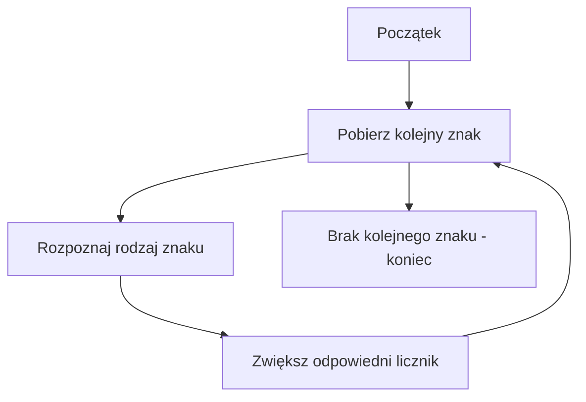

# Analiza napisów znak po znaku

## Cel lekcji

Na tej lekcji nauczysz się analizować zawartość napisu. Będziesz rozpoznawać rodzaje znaków, zliczać je, wyszukiwać oraz tworzyć nowy napis na podstawie przeprowadzonej analizy.

## Po lekcji potrafisz

- rozpoznać literę, cyfrę, biały znak i znak interpunkcyjny,
- policzyć różne rodzaje znaków,
- rozróżnić wielkie i małe litery,
- znaleźć pierwszą lub ostatnią cyfrę,
- sprawdzić, czy napis składa się wyłącznie z cyfr,
- zbudować nowy napis znak po znaku,
- przeprowadzić prostą walidację hasła,
- sprawdzić, czy słowo jest palindromem.

## 1. Krótkie przypomnienie

Typ `string` przechowuje ciąg znaków, a typ `char` pojedynczy znak. Znak napisu można odczytać za pomocą indeksu.

```csharp
string napis = "Program";
char pierwszyZnak = napis[0];
```

Poprawne indeksy mają wartości od `0` do `napis.Length - 1`.

- Pętla `for` daje dostęp do znaku oraz jego indeksu.
- Pętla `foreach` daje bezpośredni dostęp do kolejnych znaków.

Te podstawy zostały omówione w lekcji 11. Teraz wykorzystamy je do dokładniejszej analizy napisów.

## 2. Metody klasy char

Metody klasy `char` pozwalają sprawdzać i przekształcać pojedyncze znaki. Wywołujemy je na typie `char`, a badany znak przekazujemy jako argument.

```csharp
using System;

class Program
{
    static void Main()
    {
        char znak = 'A';

        bool jestLitera = char.IsLetter(znak);
        bool jestCyfra = char.IsDigit(znak);
        char malaLitera = char.ToLower(znak);

        Console.WriteLine(jestLitera);
        Console.WriteLine(jestCyfra);
        Console.WriteLine(malaLitera);
    }
}
```

Wynik:

```text
True
False
a
```

Najważniejsze metody:

- `char.IsLetter(znak)` zwraca `bool` i sprawdza, czy znak jest literą.
- `char.IsDigit(znak)` zwraca `bool` i sprawdza, czy znak jest cyfrą.
- `char.IsWhiteSpace(znak)` zwraca `bool` i sprawdza, czy znak jest białym znakiem, na przykład spacją lub tabulatorem.
- `char.IsUpper(znak)` zwraca `bool` i sprawdza, czy znak jest wielką literą.
- `char.IsLower(znak)` zwraca `bool` i sprawdza, czy znak jest małą literą.
- `char.IsLetterOrDigit(znak)` zwraca `bool` i sprawdza, czy znak jest literą albo cyfrą.
- `char.IsPunctuation(znak)` zwraca `bool` i sprawdza, czy znak jest znakiem interpunkcyjnym.
- `char.ToUpper(znak)` zwraca nowy `char` będący wielką literą.
- `char.ToLower(znak)` zwraca nowy `char` będący małą literą.

Metody rozpoczynające się od `Is` odpowiadają na pytanie i zwracają `bool`. Metody `ToUpper()` i `ToLower()` zwracają przekształcony znak typu `char`.

```csharp
using System;

class Program
{
    static void Main()
    {
        char znak = 'm';

        char wielkaLitera = char.ToUpper(znak);

        Console.WriteLine(wielkaLitera);
        Console.WriteLine(znak);
    }
}
```

`char.ToUpper(znak)` nie zmienia automatycznie zmiennej `znak`. Wynik trzeba zapisać, wypisać albo od razu wykorzystać.

## 3. Analiza pojedynczego znaku

Program pobiera pierwszy znak napisu i określa jego rodzaj. Najpierw sprawdza, czy napis nie jest pusty.

```csharp
using System;

class Program
{
    static void Main()
    {
        Console.Write("Podaj napis: ");
        string napis = Console.ReadLine();

        if (napis.Length == 0)
        {
            Console.WriteLine("Napis jest pusty.");
        }
        else
        {
            char znak = napis[0];

            if (char.IsLetter(znak))
            {
                Console.WriteLine("Pierwszy znak jest literą.");
            }
            else if (char.IsDigit(znak))
            {
                Console.WriteLine("Pierwszy znak jest cyfrą.");
            }
            else if (char.IsWhiteSpace(znak))
            {
                Console.WriteLine("Pierwszy znak jest białym znakiem.");
            }
            else if (char.IsPunctuation(znak))
            {
                Console.WriteLine("Pierwszy znak jest znakiem interpunkcyjnym.");
            }
            else
            {
                Console.WriteLine("Pierwszy znak należy do innej grupy.");
            }
        }
    }
}
```

Kolejność warunków ma znaczenie. Po znalezieniu pasującej grupy pozostałe warunki nie są już sprawdzane.

## 4. Analiza całego napisu

Analizując napis, wykonujemy te same czynności dla każdego znaku.



## 5. Liczenie rodzajów znaków

W tym zadaniu nie potrzebujemy indeksów. Pętla `foreach` pozwala więc bezpośrednio pobierać kolejne znaki.

```csharp
using System;

class Program
{
    static void Main()
    {
        Console.Write("Podaj napis: ");
        string napis = Console.ReadLine();

        int liczbaLiter = 0;
        int liczbaCyfr = 0;
        int liczbaBialychZnakow = 0;
        int liczbaZnakowInterpunkcyjnych = 0;
        int liczbaPozostalychZnakow = 0;

        foreach (char znak in napis)
        {
            if (char.IsLetter(znak))
            {
                liczbaLiter++;
            }
            else if (char.IsDigit(znak))
            {
                liczbaCyfr++;
            }
            else if (char.IsWhiteSpace(znak))
            {
                liczbaBialychZnakow++;
            }
            else if (char.IsPunctuation(znak))
            {
                liczbaZnakowInterpunkcyjnych++;
            }
            else
            {
                liczbaPozostalychZnakow++;
            }
        }

        Console.WriteLine("Litery: " + liczbaLiter);
        Console.WriteLine("Cyfry: " + liczbaCyfr);
        Console.WriteLine("Białe znaki: " + liczbaBialychZnakow);
        Console.WriteLine("Znaki interpunkcyjne: " + liczbaZnakowInterpunkcyjnych);
        Console.WriteLine("Pozostałe znaki: " + liczbaPozostalychZnakow);
    }
}
```

Każdy znak zwiększa tylko jeden licznik, ponieważ zastosowano konstrukcję `if`, `else if`, `else`.

## 6. Liczenie wielkich i małych liter

Cyfra, spacja ani znak interpunkcyjny nie jest małą lub wielką literą. Takie znaki trafią do grupy pozostałych znaków.

```csharp
using System;

class Program
{
    static void Main()
    {
        Console.Write("Podaj napis: ");
        string napis = Console.ReadLine();

        int liczbaWielkichLiter = 0;
        int liczbaMalychLiter = 0;
        int liczbaPozostalychZnakow = 0;

        foreach (char znak in napis)
        {
            if (char.IsUpper(znak))
            {
                liczbaWielkichLiter++;
            }
            else if (char.IsLower(znak))
            {
                liczbaMalychLiter++;
            }
            else
            {
                liczbaPozostalychZnakow++;
            }
        }

        Console.WriteLine("Wielkie litery: " + liczbaWielkichLiter);
        Console.WriteLine("Małe litery: " + liczbaMalychLiter);
        Console.WriteLine("Pozostałe znaki: " + liczbaPozostalychZnakow);
    }
}
```

## 7. Liczenie samogłosek

Przed sprawdzeniem znaku zamieniamy go na małą literę. Dzięki temu ten sam warunek obsługuje małe i wielkie litery.

```csharp
using System;

class Program
{
    static void Main()
    {
        Console.Write("Podaj napis: ");
        string napis = Console.ReadLine();
        int liczbaSamoglosek = 0;

        foreach (char znak in napis)
        {
            char malaLitera = char.ToLower(znak);

            if (malaLitera == 'a' || malaLitera == 'ą' ||
                malaLitera == 'e' || malaLitera == 'ę' ||
                malaLitera == 'i' || malaLitera == 'o' ||
                malaLitera == 'ó' || malaLitera == 'u' ||
                malaLitera == 'y')
            {
                liczbaSamoglosek++;
            }
        }

        Console.WriteLine("Liczba samogłosek: " + liczbaSamoglosek);
    }
}
```

Program rozpoznaje polskie samogłoski: `a`, `ą`, `e`, `ę`, `i`, `o`, `ó`, `u`, `y`.

## 8. Czy napis zawiera wyłącznie cyfry

Na początku zakładamy, że niepusty napis jest poprawny. Jeżeli znajdziemy znak, który nie jest cyfrą, zmieniamy wynik i przerywamy pętlę.

```csharp
using System;

class Program
{
    static void Main()
    {
        Console.Write("Podaj napis: ");
        string napis = Console.ReadLine();

        bool tylkoCyfry = napis.Length > 0;

        foreach (char znak in napis)
        {
            if (!char.IsDigit(znak))
            {
                tylkoCyfry = false;
                break;
            }
        }

        if (tylkoCyfry)
        {
            Console.WriteLine("Napis zawiera wyłącznie cyfry.");
        }
        else
        {
            Console.WriteLine("Napis nie zawiera wyłącznie cyfr.");
        }
    }
}
```

Warunek `napis.Length > 0` powoduje, że pusty napis nie zostanie uznany za ciąg cyfr.

## 9. Wyszukiwanie pierwszej cyfry

Potrzebujemy indeksu znalezionego znaku, dlatego używamy pętli `for`.

```csharp
using System;

class Program
{
    static void Main()
    {
        Console.Write("Podaj napis: ");
        string napis = Console.ReadLine();
        int indeksPierwszejCyfry = -1;

        for (int indeks = 0; indeks < napis.Length; indeks++)
        {
            if (char.IsDigit(napis[indeks]))
            {
                indeksPierwszejCyfry = indeks;
                break;
            }
        }

        if (indeksPierwszejCyfry >= 0)
        {
            Console.WriteLine("Pierwsza cyfra ma indeks: " + indeksPierwszejCyfry);
        }
        else
        {
            Console.WriteLine("Nie znaleziono cyfry.");
        }
    }
}
```

Wartość początkowa `-1` oznacza brak wyniku. Instrukcja `break` kończy pętlę po znalezieniu pierwszej cyfry.

## 10. Wyszukiwanie ostatniej cyfry

Aby znaleźć ostatnią cyfrę, rozpoczynamy analizę od końca napisu.

```csharp
using System;

class Program
{
    static void Main()
    {
        Console.Write("Podaj napis: ");
        string napis = Console.ReadLine();
        int indeksOstatniejCyfry = -1;

        for (int indeks = napis.Length - 1; indeks >= 0; indeks--)
        {
            if (char.IsDigit(napis[indeks]))
            {
                indeksOstatniejCyfry = indeks;
                break;
            }
        }

        if (indeksOstatniejCyfry >= 0)
        {
            Console.WriteLine("Ostatnia cyfra ma indeks: " + indeksOstatniejCyfry);
        }
        else
        {
            Console.WriteLine("Nie znaleziono cyfry.");
        }
    }
}
```

Dla pustego napisu wartość `napis.Length - 1` wynosi `-1`, więc pętla nie wykona się ani razu.

## 11. Budowanie napisu bez spacji

Nowy napis rozpoczynamy od pustej wartości. Dodajemy do niego tylko znaki, które nie są białymi znakami.

```csharp
using System;

class Program
{
    static void Main()
    {
        Console.Write("Podaj napis: ");
        string napis = Console.ReadLine();
        string bezSpacji = "";

        foreach (char znak in napis)
        {
            if (!char.IsWhiteSpace(znak))
            {
                bezSpacji += znak;
            }
        }

        Console.WriteLine("Bez białych znaków: " + bezSpacji);
    }
}
```

Program usuwa nie tylko zwykłe spacje, ale także inne białe znaki rozpoznawane przez `char.IsWhiteSpace()`.

## 12. Napis zawierający tylko cyfry

Do wyniku dodajemy wyłącznie znaki rozpoznane jako cyfry.

```csharp
using System;

class Program
{
    static void Main()
    {
        Console.Write("Podaj napis: ");
        string napis = Console.ReadLine();
        string sameCyfry = "";

        foreach (char znak in napis)
        {
            if (char.IsDigit(znak))
            {
                sameCyfry += znak;
            }
        }

        Console.WriteLine("Cyfry: " + sameCyfry);
    }
}
```

Dla napisu `Pokój 12, piętro 3` program utworzy wynik `123`.

## 13. Napis zawierający tylko litery

```csharp
using System;

class Program
{
    static void Main()
    {
        Console.Write("Podaj napis: ");
        string napis = Console.ReadLine();
        string sameLitery = "";

        foreach (char znak in napis)
        {
            if (char.IsLetter(znak))
            {
                sameLitery += znak;
            }
        }

        Console.WriteLine("Litery: " + sameLitery);
    }
}
```

Kolejność liter w wyniku jest taka sama jak w napisie wejściowym.

## 14. Zamiana liter na wielkie znak po znaku

Metoda `char.ToUpper()` zwraca nowy znak. Pozostałe znaki, na przykład cyfry i spacje, również można dodać do wyniku.

```csharp
using System;

class Program
{
    static void Main()
    {
        Console.Write("Podaj napis: ");
        string napis = Console.ReadLine();
        string wielkieLitery = "";

        foreach (char znak in napis)
        {
            char zmienionyZnak = char.ToUpper(znak);
            wielkieLitery += zmienionyZnak;
        }

        Console.WriteLine(wielkieLitery);
    }
}
```

Zapis `wynik += znak;` jest czytelny i wystarczający w prostych ćwiczeniach z krótkimi napisami. Bardziej zaawansowane sposoby budowania długich napisów poznamy później.

## 15. Prosta walidacja hasła

Program sprawdza osobno każde wymaganie. Dzięki temu może dokładnie wskazać, czego brakuje w haśle.

```csharp
using System;

class Program
{
    static void Main()
    {
        Console.Write("Podaj hasło: ");
        string haslo = Console.ReadLine();

        bool poprawnaDlugosc = haslo.Length >= 8;
        bool maMalaLitere = false;
        bool maWielkaLitere = false;
        bool maCyfre = false;
        bool maZnakSpecjalny = false;
        bool nieMaBialychZnakow = true;

        foreach (char znak in haslo)
        {
            if (char.IsLower(znak))
            {
                maMalaLitere = true;
            }

            if (char.IsUpper(znak))
            {
                maWielkaLitere = true;
            }

            if (char.IsDigit(znak))
            {
                maCyfre = true;
            }

            if (!char.IsLetterOrDigit(znak) && !char.IsWhiteSpace(znak))
            {
                maZnakSpecjalny = true;
            }

            if (char.IsWhiteSpace(znak))
            {
                nieMaBialychZnakow = false;
            }
        }

        Console.WriteLine("Co najmniej 8 znaków: " + poprawnaDlugosc);
        Console.WriteLine("Mała litera: " + maMalaLitere);
        Console.WriteLine("Wielka litera: " + maWielkaLitere);
        Console.WriteLine("Cyfra: " + maCyfre);
        Console.WriteLine("Znak specjalny: " + maZnakSpecjalny);
        Console.WriteLine("Brak białych znaków: " + nieMaBialychZnakow);

        bool poprawneHaslo = poprawnaDlugosc &&
                             maMalaLitere &&
                             maWielkaLitere &&
                             maCyfre &&
                             maZnakSpecjalny &&
                             nieMaBialychZnakow;

        if (poprawneHaslo)
        {
            Console.WriteLine("Hasło spełnia wszystkie wymagania.");
        }
        else
        {
            Console.WriteLine("Hasło nie spełnia wszystkich wymagań.");
        }
    }
}
```

To ćwiczenie pokazuje analizę znaków. Nie jest pełnym systemem bezpiecznego przechowywania ani obsługi haseł.

## 16. Porównywanie znaków

Literał typu `char` zapisujemy w apostrofach.

```csharp
using System;

class Program
{
    static void Main()
    {
        Console.Write("Podaj znak: ");
        string napis = Console.ReadLine();

        if (napis.Length > 0)
        {
            char znak = napis[0];

            if (znak == 'a')
            {
                Console.WriteLine("Podano małą literę a.");
            }

            if (char.ToLower(znak) == 'a')
            {
                Console.WriteLine("Podano literę a niezależnie od jej wielkości.");
            }
        }
        else
        {
            Console.WriteLine("Nie podano znaku.");
        }
    }
}
```

- `'A'` jest pojedynczym znakiem typu `char`.
- `"A"` jest napisem typu `string` o długości jednego znaku.

## 17. Sprawdzanie palindromu

Palindrom to słowo, które czytane od początku i od końca wygląda tak samo, na przykład `kajak`. Program porównuje pary znaków znajdujących się po przeciwnych stronach słowa.

```csharp
using System;

class Program
{
    static void Main()
    {
        Console.Write("Podaj pojedyncze słowo: ");
        string slowo = Console.ReadLine().ToLower();
        bool jestPalindromem = slowo.Length > 0;

        for (int indeks = 0; indeks < slowo.Length / 2; indeks++)
        {
            int indeksOdKonca = slowo.Length - 1 - indeks;

            if (slowo[indeks] != slowo[indeksOdKonca])
            {
                jestPalindromem = false;
                break;
            }
        }

        if (jestPalindromem)
        {
            Console.WriteLine("Słowo jest palindromem.");
        }
        else
        {
            Console.WriteLine("Słowo nie jest palindromem.");
        }
    }
}
```

Program sprawdza pojedyncze słowo. Nie usuwa spacji ani znaków interpunkcyjnych.

## 18. Zestawienie metod

| Metoda | Typ wyniku | Zastosowanie | Przykład |
| --- | --- | --- | --- |
| `char.IsLetter(znak)` | `bool` | Sprawdza, czy znak jest literą | `bool wynik = char.IsLetter(znak);` |
| `char.IsDigit(znak)` | `bool` | Sprawdza, czy znak jest cyfrą | `bool wynik = char.IsDigit(znak);` |
| `char.IsWhiteSpace(znak)` | `bool` | Sprawdza, czy znak jest białym znakiem | `bool wynik = char.IsWhiteSpace(znak);` |
| `char.IsUpper(znak)` | `bool` | Sprawdza, czy znak jest wielką literą | `bool wynik = char.IsUpper(znak);` |
| `char.IsLower(znak)` | `bool` | Sprawdza, czy znak jest małą literą | `bool wynik = char.IsLower(znak);` |
| `char.IsLetterOrDigit(znak)` | `bool` | Sprawdza, czy znak jest literą albo cyfrą | `bool wynik = char.IsLetterOrDigit(znak);` |
| `char.IsPunctuation(znak)` | `bool` | Sprawdza, czy znak jest znakiem interpunkcyjnym | `bool wynik = char.IsPunctuation(znak);` |
| `char.ToUpper(znak)` | `char` | Zwraca znak jako wielką literę | `char wynik = char.ToUpper(znak);` |
| `char.ToLower(znak)` | `char` | Zwraca znak jako małą literę | `char wynik = char.ToLower(znak);` |

## 19. Typowe błędy

### Pomylenie char ze string

```csharp
char znak = "a";
```

Wartość typu `char` zapisujemy w apostrofach:

```csharp
char znak = 'a';
```

### Wywołanie metody w niewłaściwy sposób

Niepoprawnie:

```csharp
znak.IsDigit();
```

Poprawnie:

```csharp
char.IsDigit(znak);
```

### Utrata przekształconego znaku

```csharp
char.ToUpper(znak);
```

Metoda zwraca nowy znak, ale wynik nie został zapisany. Poprawnie:

```csharp
znak = char.ToUpper(znak);
```

### Indeks poza napisem

`napis.Length` oznacza liczbę znaków, ale nie jest poprawnym indeksem. Ostatni znak ma indeks `napis.Length - 1`.

### Pomylenie znaku z indeksem

Zmienna `indeks` typu `int` określa pozycję. Wyrażenie `napis[indeks]` zwraca znak typu `char`.

### Brak sprawdzenia pustego napisu

Przed użyciem `napis[0]` trzeba sprawdzić, czy `napis.Length > 0`.

### Pusty napis uznany za ciąg cyfr

Jeżeli zmienna `tylkoCyfry` od początku ma wartość `true`, pusta pętla jej nie zmieni. Trzeba osobno uwzględnić długość napisu.

### Niewłaściwy wybór pętli

`foreach` jest wygodne do analizy znaków. Gdy potrzebujemy indeksu, zwykle lepiej użyć `for`.

### Brak break po znalezieniu wyniku

Jeżeli szukamy pierwszego znaku, po jego znalezieniu należy przerwać pętlę. W przeciwnym razie program może zapisać indeks późniejszego wystąpienia.

### Potraktowanie cyfry jako liczby

Znak `'7'` ma typ `char`. Nie jest tym samym co liczba całkowita `7`.

### Próba zmiany znaku napisu

Nie można wykonać przypisania:

```csharp
napis[0] = 'A';
```

Typ `string` jest niezmienny. Trzeba utworzyć nowy napis.

## 20. Zapamiętaj

- Metody klasy `char` analizują pojedyncze znaki.
- Metody rozpoczynające się od `Is` zwracają `bool`.
- `char.ToUpper()` i `char.ToLower()` zwracają nowy znak typu `char`.
- Wynik przekształcenia trzeba zapisać albo od razu wykorzystać.
- `foreach` jest wygodne, gdy nie potrzebujemy indeksu.
- `for` jest wygodne, gdy potrzebujemy indeksu znaku.
- Wartość `-1` może oznaczać, że poszukiwanego znaku nie znaleziono.
- Pusty napis wymaga osobnego sprawdzenia w zadaniach walidacyjnych.
- Nie można zmieniać znaków istniejącego napisu przez indeks.
- Nowy napis można budować, dodając do niego wybrane znaki.

## 21. Ćwiczenia

1. Wczytaj napis i policz wszystkie litery.
2. Wczytaj napis i policz wszystkie cyfry.
3. Wczytaj napis i policz wszystkie białe znaki.
4. Policz wielkie i małe litery w podanym napisie.
5. Policz wszystkie polskie samogłoski bez rozróżniania wielkości liter.
6. Wczytaj napis oraz znak. Policz wystąpienia tego znaku.
7. Sprawdź, czy niepusty napis zawiera wyłącznie litery.
8. Sprawdź, czy niepusty napis zawiera wyłącznie cyfry.
9. Znajdź indeks pierwszej cyfry w napisie.
10. Znajdź indeks ostatniej litery w napisie.
11. Wyświetl każdy znak napisu razem z jego indeksem.
12. Utwórz nowy napis bez białych znaków.
13. Utwórz nowy napis zawierający tylko cyfry z tekstu wejściowego.
14. Utwórz nowy napis zawierający tylko litery.
15. Zamień wszystkie litery na wielkie, analizując napis znak po znaku.
16. Wczytaj identyfikator i sprawdź, czy składa się dokładnie z sześciu cyfr.
17. Sprawdź, czy hasło ma co najmniej osiem znaków oraz zawiera małą literę, wielką literę i cyfrę.
18. Sprawdź, czy podane słowo jest palindromem.
19. Policz litery oraz cyfry i wyświetl informację, której grupy jest więcej.
20. Wczytaj napis i wyświetl pełne statystyki: litery, cyfry, białe znaki, znaki interpunkcyjne i pozostałe znaki.
21. Znajdź pierwszą wielką literę i wyświetl jej indeks. Obsłuż brak takiej litery.
22. Utwórz nowy napis zawierający wszystkie znaki oprócz cyfr.
23. Policz, ile razy w napisie występują małe litery `a` oraz wielkie litery `A`.
24. Sprawdź, czy napis zawiera przynajmniej jedną literę, jedną cyfrę i jeden znak interpunkcyjny.

## Podsumowanie

Analiza znaku po znaku pozwala dokładnie sprawdzić zawartość napisu. Metody klasy `char` rozpoznają rodzaje znaków i umożliwiają zmianę wielkości liter. Połączenie tych metod z pętlami pozwala tworzyć liczniki, wyszukiwarki, proste walidatory oraz nowe napisy.
