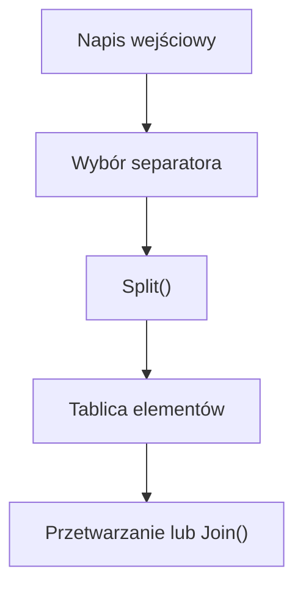

# Dzielenie i łączenie napisów - Split i Join

## Cel lekcji

Na tej lekcji nauczysz się dzielić napis na tablicę fragmentów za pomocą `Split()`. Następnie będziesz przetwarzać otrzymane elementy i ponownie łączyć je w jeden napis za pomocą `string.Join()`.

## Po lekcji potrafisz

- podzielić napis według jednego lub kilku separatorów,
- wyjaśnić, dlaczego `Split()` zwraca tablicę `string[]`,
- usunąć puste elementy powstałe podczas podziału,
- oczyścić elementy za pomocą `Trim()`,
- analizować wyrazy zwykłymi pętlami,
- bezpiecznie odczytać pola prostego rekordu,
- połączyć elementy tablicy za pomocą `string.Join()`,
- zmienić separator występujący między elementami.

## 1. Napis zawierający kilka informacji

Jeden napis może przechowywać kilka informacji oddzielonych określonym znakiem. Taki znak nazywamy separatorem.

Przykładowymi separatorami są:

- spacja,
- przecinek,
- średnik,
- dwukropek.

Metoda `Split()` dzieli napis w miejscach wystąpienia separatora. Zwraca tablicę napisów typu `string[]`.

```csharp
string tekst = "Ala ma kota";
string[] wyrazy = tekst.Split(' ');
```

Zawartość tablicy:

```text
wyrazy[0] => Ala
wyrazy[1] => ma
wyrazy[2] => kota
```

Separator nie znajduje się w elementach tablicy. Napis zapisany w zmiennej `tekst` nie zostaje zmieniony.

Metoda `string.Join()` wykonuje operację odwrotną. Łączy elementy tablicy w jeden napis i umieszcza między nimi wybrany separator.

## 2. Split z pojedynczym separatorem

Poniższy program dzieli zdanie po spacjach. Wynik jest tablicą, dlatego można sprawdzić liczbę elementów i przejść po nich pętlą.

```csharp
using System;

class Program
{
    static void Main()
    {
        string zdanie = "Ala ma kota";
        string[] wyrazy = zdanie.Split(' ');

        Console.WriteLine("Liczba elementów: " + wyrazy.Length);

        for (int indeks = 0; indeks < wyrazy.Length; indeks++)
        {
            Console.WriteLine(indeks + " => " + wyrazy[indeks]);
        }
    }
}
```

Wynik:

```text
Liczba elementów: 3
0 => Ala
1 => ma
2 => kota
```

Zapis:

```csharp
string[] wyrazy = zdanie.Split(' ');
```

oznacza:

- `zdanie` jest napisem wejściowym,
- `' '` jest separatorem typu `char`,
- `wyrazy` jest tablicą typu `string[]`,
- `wyrazy[indeks]` jest pojedynczym napisem typu `string`.

## 3. Dzielenie po przecinku

Listę produktów można zapisać w jednym napisie, oddzielając elementy przecinkami.

```csharp
using System;

class Program
{
    static void Main()
    {
        string listaOwocow = "jabłko,gruszka,śliwka,banan";
        string[] owoce = listaOwocow.Split(',');

        Console.WriteLine("Liczba owoców: " + owoce.Length);

        foreach (string owoc in owoce)
        {
            Console.WriteLine(owoc);
        }
    }
}
```

Separator będący pojedynczym znakiem zapisujemy jako `','`, a nie `","`.

## 4. Spacje pozostające w elementach

Metoda `Split(',')` usuwa przecinki, ale nie usuwa spacji znajdujących się obok nich.

```csharp
using System;

class Program
{
    static void Main()
    {
        string listaOwocow = "jabłko, gruszka, śliwka";
        string[] owoce = listaOwocow.Split(',');

        for (int indeks = 0; indeks < owoce.Length; indeks++)
        {
            Console.WriteLine("Przed Trim: [" + owoce[indeks] + "]");

            string oczyszczonyOwoc = owoce[indeks].Trim();
            Console.WriteLine("Po Trim: [" + oczyszczonyOwoc + "]");
        }
    }
}
```

Wyrażenie `owoce[indeks]` zwraca oryginalny element. Wyrażenie `owoce[indeks].Trim()` zwraca nowy napis bez białych znaków na początku i końcu.

## 5. Puste elementy po podziale

Kilka separatorów znajdujących się obok siebie może utworzyć puste elementy tablicy.

```csharp
using System;

class Program
{
    static void Main()
    {
        string tekst = "Ala  ma   kota";

        string[] wszystkieElementy = tekst.Split(' ');
        string[] bezPustychElementow = tekst.Split(
            new char[] { ' ' },
            StringSplitOptions.RemoveEmptyEntries
        );

        Console.WriteLine("Wszystkie elementy: " + wszystkieElementy.Length);
        foreach (string element in wszystkieElementy)
        {
            Console.WriteLine("[" + element + "]");
        }

        Console.WriteLine("Bez pustych elementów: " + bezPustychElementow.Length);
        foreach (string element in bezPustychElementow)
        {
            Console.WriteLine("[" + element + "]");
        }
    }
}
```

`StringSplitOptions.RemoveEmptyEntries` usuwa z wyniku elementy będące pustymi napisami. Nie usuwa automatycznie spacji znajdujących się wewnątrz innych elementów.

## 6. Dzielenie po kilku separatorach

Do `Split()` można przekazać tablicę separatorów. Podział nastąpi po każdym znaku znajdującym się w tej tablicy.

```csharp
using System;

class Program
{
    static void Main()
    {
        string tekst = "Ala,kot;dom pies";
        char[] separatory = { ',', ';', ' ' };

        string[] elementy = tekst.Split(
            separatory,
            StringSplitOptions.RemoveEmptyEntries
        );

        foreach (string element in elementy)
        {
            Console.WriteLine(element);
        }
    }
}
```

Wynik:

```text
Ala
kot
dom
pies
```

## 7. Liczenie wyrazów

Puste elementy należy usunąć, jeżeli chcemy poprawnie policzyć wyrazy przy kilku spacjach.

```csharp
using System;

class Program
{
    static void Main()
    {
        Console.Write("Podaj zdanie: ");
        string zdanie = Console.ReadLine();

        string[] wyrazy = zdanie.Split(
            new char[] { ' ' },
            StringSplitOptions.RemoveEmptyEntries
        );

        Console.WriteLine("Liczba wyrazów: " + wyrazy.Length);
    }
}
```

Program poprawnie obsługuje:

- pusty napis,
- kilka spacji między wyrazami,
- spacje na początku i końcu.

## 8. Wyrazy razem z indeksami

Pętla `for` jest dobrym wyborem, gdy potrzebujemy elementu oraz jego indeksu.

```csharp
using System;

class Program
{
    static void Main()
    {
        Console.Write("Podaj zdanie: ");
        string zdanie = Console.ReadLine();

        string[] wyrazy = zdanie.Split(
            new char[] { ' ' },
            StringSplitOptions.RemoveEmptyEntries
        );

        for (int indeks = 0; indeks < wyrazy.Length; indeks++)
        {
            Console.WriteLine(indeks + " => " + wyrazy[indeks]);
        }
    }
}
```

## 9. Najdłuższy wyraz

Przed użyciem pierwszego elementu sprawdzamy, czy tablica nie jest pusta. Pierwszy wyraz może zostać wartością początkową podczas wyszukiwania.

```csharp
using System;

class Program
{
    static void Main()
    {
        Console.Write("Podaj zdanie: ");
        string zdanie = Console.ReadLine();

        string[] wyrazy = zdanie.Split(
            new char[] { ' ' },
            StringSplitOptions.RemoveEmptyEntries
        );

        if (wyrazy.Length > 0)
        {
            string najdluzszyWyraz = wyrazy[0];

            for (int indeks = 1; indeks < wyrazy.Length; indeks++)
            {
                if (wyrazy[indeks].Length > najdluzszyWyraz.Length)
                {
                    najdluzszyWyraz = wyrazy[indeks];
                }
            }

            Console.WriteLine("Najdłuższy wyraz: " + najdluzszyWyraz);
            Console.WriteLine("Długość: " + najdluzszyWyraz.Length);
        }
        else
        {
            Console.WriteLine("Nie podano żadnego wyrazu.");
        }
    }
}
```

Jeżeli kilka wyrazów ma taką samą maksymalną długość, program pozostawia pierwszy z nich.

## 10. Najkrótszy wyraz

`RemoveEmptyEntries` zapobiega uznaniu pustego napisu za najkrótszy wyraz.

```csharp
using System;

class Program
{
    static void Main()
    {
        Console.Write("Podaj zdanie: ");
        string zdanie = Console.ReadLine();

        string[] wyrazy = zdanie.Split(
            new char[] { ' ' },
            StringSplitOptions.RemoveEmptyEntries
        );

        if (wyrazy.Length > 0)
        {
            string najkrotszyWyraz = wyrazy[0];

            for (int indeks = 1; indeks < wyrazy.Length; indeks++)
            {
                if (wyrazy[indeks].Length < najkrotszyWyraz.Length)
                {
                    najkrotszyWyraz = wyrazy[indeks];
                }
            }

            Console.WriteLine("Najkrótszy wyraz: " + najkrotszyWyraz);
            Console.WriteLine("Długość: " + najkrotszyWyraz.Length);
        }
        else
        {
            Console.WriteLine("Nie podano żadnego wyrazu.");
        }
    }
}
```

## 11. Liczenie wyrazów spełniających warunki

Jedna pętla może obliczyć kilka niezależnych statystyk.

```csharp
using System;

class Program
{
    static void Main()
    {
        Console.Write("Podaj zdanie: ");
        string zdanie = Console.ReadLine();

        string[] wyrazy = zdanie.Split(
            new char[] { ' ' },
            StringSplitOptions.RemoveEmptyEntries
        );

        int liczbaDlugichWyrazow = 0;
        int liczbaWyrazowZWielkiejLitery = 0;
        int liczbaWyrazowZLiteraA = 0;

        foreach (string wyraz in wyrazy)
        {
            if (wyraz.Length > 5)
            {
                liczbaDlugichWyrazow++;
            }

            if (wyraz.Length > 0 && char.IsUpper(wyraz[0]))
            {
                liczbaWyrazowZWielkiejLitery++;
            }

            if (wyraz.ToLower().Contains("a"))
            {
                liczbaWyrazowZLiteraA++;
            }
        }

        Console.WriteLine("Wyrazy dłuższe niż 5 znaków: " + liczbaDlugichWyrazow);
        Console.WriteLine("Wyrazy rozpoczynające się wielką literą: " + liczbaWyrazowZWielkiejLitery);
        Console.WriteLine("Wyrazy zawierające literę a: " + liczbaWyrazowZLiteraA);
    }
}
```

Każdy warunek jest niezależny. Ten sam wyraz może zwiększyć kilka liczników.

## 12. Dane oddzielone średnikiem

Przed odczytaniem pól rekordu trzeba sprawdzić liczbę elementów tablicy. Pole liczbowe należy bezpiecznie przekształcić za pomocą `TryParse()`.

```csharp
using System;

class Program
{
    static void Main()
    {
        string rekord = "Anna;Kowalska;3TI;87";
        string[] pola = rekord.Split(';');

        if (pola.Length == 4)
        {
            string imie = pola[0].Trim();
            string nazwisko = pola[1].Trim();
            string klasa = pola[2].Trim();
            string tekstPunktow = pola[3].Trim();

            if (int.TryParse(tekstPunktow, out int punkty))
            {
                Console.WriteLine("Imię: " + imie);
                Console.WriteLine("Nazwisko: " + nazwisko);
                Console.WriteLine("Klasa: " + klasa);
                Console.WriteLine("Punkty: " + punkty);
            }
            else
            {
                Console.WriteLine("Liczba punktów jest niepoprawna.");
            }
        }
        else
        {
            Console.WriteLine("Rekord powinien zawierać dokładnie 4 pola.");
        }
    }
}
```

Kontrola `pola.Length == 4` odbywa się przed użyciem indeksów od `0` do `3`.

## 13. Uproszczony format CSV

CSV to format danych, w którym pola często oddziela się przecinkami. Prosty przykład można podzielić za pomocą `Split(',')`.

```csharp
using System;

class Program
{
    static void Main()
    {
        string wiersz = "101,Monitor,899";
        string[] pola = wiersz.Split(',');

        if (pola.Length == 3)
        {
            Console.WriteLine("Id: " + pola[0]);
            Console.WriteLine("Nazwa: " + pola[1]);
            Console.WriteLine("Cena: " + pola[2]);
        }
        else
        {
            Console.WriteLine("Niepoprawna liczba pól.");
        }
    }
}
```

Jest to tylko uproszczony przykład. Prawdziwy plik CSV może zawierać przecinki wewnątrz wartości zapisanych w cudzysłowach. Zwykłe `Split(',')` nie obsługuje poprawnie takich przypadków i nie jest pełnym parserem CSV.

## 14. Łączenie elementów za pomocą string.Join

`string.Join()` łączy elementy tablicy i zwraca nowy `string`.

```csharp
using System;

class Program
{
    static void Main()
    {
        string[] imiona = { "Anna", "Jan", "Ola" };
        string wynik = string.Join(", ", imiona);

        Console.WriteLine(wynik);
    }
}
```

Wynik:

```text
Anna, Jan, Ola
```

W zapisie:

```csharp
string wynik = string.Join(", ", imiona);
```

- `", "` określa separator,
- `imiona` jest tablicą elementów,
- `wynik` jest nowym napisem,
- tablica `imiona` nie zostaje zmieniona.

`Join()` wywołujemy na typie `string`, a nie na tablicy.

## 15. Różne separatory w Join

Tę samą tablicę można połączyć za pomocą różnych separatorów.

```csharp
using System;

class Program
{
    static void Main()
    {
        string[] elementy = { "jeden", "dwa", "trzy" };

        string przecinki = string.Join(", ", elementy);
        string sredniki = string.Join(";", elementy);
        string myslniki = string.Join(" - ", elementy);
        string osobneWiersze = string.Join("\n", elementy);

        Console.WriteLine(przecinki);
        Console.WriteLine(sredniki);
        Console.WriteLine(myslniki);
        Console.WriteLine(osobneWiersze);
    }
}
```

Separator jest wstawiany tylko pomiędzy elementami. Nie pojawia się przed pierwszym ani po ostatnim elemencie.

## 16. Split i Join razem

Połączenie `Split()` i `Join()` pozwala usunąć nadmiarowe spacje między wyrazami.

```csharp
using System;

class Program
{
    static void Main()
    {
        Console.Write("Podaj zdanie: ");
        string zdanie = Console.ReadLine();

        string[] wyrazy = zdanie.Split(
            new char[] { ' ' },
            StringSplitOptions.RemoveEmptyEntries
        );

        string uporzadkowaneZdanie = string.Join(" ", wyrazy);

        Console.WriteLine(uporzadkowaneZdanie);
    }
}
```

Przykład:

```text
"  Ala   ma  kota  " => "Ala ma kota"
```

## 17. Zmiana separatora

Napis można podzielić według starego separatora, a następnie połączyć za pomocą nowego.

```csharp
using System;

class Program
{
    static void Main()
    {
        string data = "2026;09;23";
        string[] elementyDaty = data.Split(';');

        if (elementyDaty.Length == 3)
        {
            string nowyZapis = string.Join("-", elementyDaty);
            Console.WriteLine(nowyZapis);
        }
        else
        {
            Console.WriteLine("Niepoprawna liczba elementów daty.");
        }
    }
}
```

Program zmienia sposób zapisu, ale nie sprawdza, czy podana data rzeczywiście istnieje.

## 18. Komunikat z wybranych pól

Po sprawdzeniu liczby pól można wybrać potrzebne dane i zbudować czytelny komunikat.

```csharp
using System;

class Program
{
    static void Main()
    {
        Console.Write("Podaj dane w formacie imię;nazwisko;klasa: ");
        string rekord = Console.ReadLine();
        string[] pola = rekord.Split(';');

        if (pola.Length == 3)
        {
            string imie = pola[0].Trim();
            string nazwisko = pola[1].Trim();
            string klasa = pola[2].Trim();

            Console.WriteLine($"Uczeń: {imie} {nazwisko}, klasa: {klasa}");
        }
        else
        {
            Console.WriteLine("Należy podać dokładnie 3 pola.");
        }
    }
}
```

Program nie odwołuje się do elementów tablicy przed sprawdzeniem `pola.Length`.

## 19. Schemat przetwarzania



## 20. Zestawienie najważniejszych zapisów

| Zapis | Typ wyniku | Działanie | Przykład zastosowania |
| --- | --- | --- | --- |
| `napis.Split(' ')` | `string[]` | Dzieli napis po spacjach | Podział zdania na wyrazy |
| `napis.Split(',')` | `string[]` | Dzieli napis po przecinkach | Podział prostej listy |
| `napis.Split(separatory, StringSplitOptions.RemoveEmptyEntries)` | `string[]` | Dzieli po kilku separatorach i usuwa puste elementy | Analiza tekstu z różnymi separatorami |
| `element.Trim()` | `string` | Usuwa białe znaki z początku i końca elementu | Oczyszczenie pola rekordu |
| `string.Join(", ", elementy)` | `string` | Łączy elementy separatorem | Utworzenie listy do wyświetlenia |
| `elementy.Length` | `int` | Podaje liczbę elementów tablicy | Kontrola liczby pól |
| `elementy[indeks]` | `string` | Odczytuje element tablicy | Pobranie wybranego pola |

## 21. Typowe błędy

### Oczekiwanie jednego napisu

Niepoprawnie:

```csharp
string wynik = napis.Split(' ');
```

`Split()` zwraca tablicę. Poprawnie:

```csharp
string[] wynik = napis.Split(' ');
```

### Pomylenie char ze string

W poznanym prostym wywołaniu pojedynczy separator zapisujemy jako znak:

```csharp
napis.Split(',');
```

Znak `','` ma typ `char`, a napis `","` ma typ `string`.

### Nieuwzględnienie pustych elementów

Kilka separatorów obok siebie może utworzyć puste napisy. Przy liczeniu wyrazów użyj `StringSplitOptions.RemoveEmptyEntries`.

### Założenie, że Split usuwa spacje

`Split(',')` usuwa przecinki, ale nie usuwa automatycznie spacji. Każdy element można oczyścić za pomocą `Trim()`.

### Indeks poza tablicą

Przed odczytaniem określonych pól sprawdź `elementy.Length`.

### Pomylenie dwóch właściwości Length

- `napis.Length` oznacza liczbę znaków napisu.
- `elementy.Length` oznacza liczbę elementów tablicy.

### Wywołanie Join na tablicy

Niepoprawnie:

```csharp
elementy.Join(", ");
```

Poprawnie:

```csharp
string wynik = string.Join(", ", elementy);
```

### Oczekiwanie separatora na końcach

`string.Join()` wstawia separator tylko pomiędzy elementami. Nie dodaje go przed pierwszym ani po ostatnim elemencie.

### Nieuwzględnienie pustego napisu

Po zastosowaniu `RemoveEmptyEntries` pusty napis da tablicę bez elementów. Przed użyciem `elementy[0]` sprawdź długość tablicy.

### Traktowanie Split jako pełnego parsera CSV

`Split(',')` nie obsługuje wszystkich zasad prawdziwego formatu CSV, szczególnie przecinków wewnątrz pól zapisanych w cudzysłowach.

### Niepotrzebne komplikowanie rozwiązania

Do wyszukiwania i liczenia elementów wystarczą zwykłe pętle `for` i `foreach`.

## 22. Zapamiętaj

- `Split()` zwraca tablicę napisów typu `string[]`.
- Separator wskazuje miejsce podziału i nie trafia do elementów wynikowych.
- Kilka separatorów obok siebie może utworzyć puste elementy.
- `StringSplitOptions.RemoveEmptyEntries` usuwa puste elementy z wyniku.
- `Split()` nie usuwa automatycznie spacji pozostałych w elementach.
- `Trim()` pozwala oczyścić pojedynczy element.
- Przed użyciem indeksu sprawdź długość tablicy.
- `string.Join()` zwraca jeden nowy napis.
- Separator `Join()` pojawia się tylko pomiędzy elementami.
- Proste `Split(',')` nie jest pełnym parserem CSV.

## 23. Ćwiczenia

1. Wczytaj zdanie, podziel je po spacji i wyświetl wszystkie elementy.
2. Wyświetl każdy wyraz zdania w osobnym wierszu.
3. Wyświetl wyrazy razem z ich indeksami.
4. Policz wyrazy w podanym zdaniu.
5. Popraw liczenie wyrazów tak, aby kilka spacji nie tworzyło dodatkowych elementów.
6. Podziel listę owoców zapisaną z użyciem przecinków.
7. Usuń spacje z początku i końca każdego elementu listy za pomocą `Trim()`.
8. Podziel dane ucznia zapisane z użyciem średników.
9. Podziel napis zawierający przecinki, średniki i spacje.
10. Znajdź najdłuższy wyraz.
11. Znajdź najkrótszy wyraz.
12. Policz wyrazy dłuższe od wartości podanej przez użytkownika.
13. Policz wyrazy rozpoczynające się wielką literą.
14. Policz wyrazy zawierające wskazaną literę bez rozróżniania jej wielkości.
15. Znajdź pierwszy wyraz o długości podanej przez użytkownika.
16. Wyświetl wyrazy w odwrotnej kolejności bez odwracania znaków wewnątrz wyrazów.
17. Połącz tablicę imion za pomocą przecinka i spacji.
18. Połącz elementy tablicy za pomocą średnika.
19. Połącz elementy tak, aby każdy znalazł się w osobnym wierszu.
20. Usuń nadmiarowe spacje ze zdania za pomocą `Split()` i `Join()`.
21. Zamień średniki oddzielające elementy na przecinki.
22. Odczytaj rekord zawierający imię, nazwisko i klasę.
23. Odczytaj pole liczbowe rekordu za pomocą `int.TryParse()`.
24. Sprawdź liczbę pól przed odczytaniem rekordu.
25. Przeanalizuj uproszczony wiersz CSV zawierający identyfikator, nazwę i cenę.
26. Utwórz czytelny komunikat na podstawie wybranych pól rekordu.
27. Oblicz łączną liczbę znaków znajdujących się we wszystkich wyrazach, bez spacji.
28. Oblicz średnią długość wyrazów. Obsłuż zdanie bez wyrazów.

## Podsumowanie

Metoda `Split()` zmienia jeden napis w tablicę elementów, a `string.Join()` łączy elementy tablicy w nowy napis. Razem z pętlami, `Trim()` i kontrolą długości tablicy pozwalają analizować proste listy, zdania oraz rekordy tekstowe.
