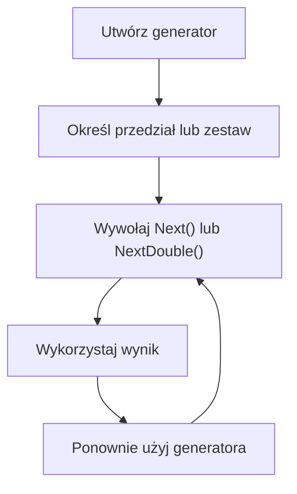

# Liczby losowe - klasa Random

## Cel lekcji

Na tej lekcji nauczysz się korzystać z klasy `Random`. Będziesz losować liczby z określonych przedziałów, wybierać elementy tablic, list i napisów oraz generować proste kody i fragmenty haseł.

## Po lekcji potrafisz

- utworzyć i wielokrotnie wykorzystać generator `Random`,
- określić możliwy zakres wyników metody `Next()`,
- losować liczby całkowite i rzeczywiste,
- symulować rzut kostką i monetą,
- losować elementy tablic oraz list,
- losować znaki z podanego zestawu,
- wygenerować kod lub fragment hasła,
- wypełnić tablicę liczbami losowymi,
- zliczyć wyniki wielu losowań,
- rozpoznać zastosowania edukacyjne i produkcyjne generatorów losowych.

## 1. Utworzenie generatora

Generator tworzymy za pomocą zapisu:

```csharp
Random los = new Random();
```

- `Random` jest typem.
- `los` jest zmienną przechowującą obiekt generatora.
- `new Random()` tworzy generator.
- Ten sam obiekt może wykonywać wiele losowań.

```csharp
using System;

class Program
{
    static void Main()
    {
        Random los = new Random();
        int liczba = los.Next();

        Console.WriteLine("Wylosowana liczba: " + liczba);
    }
}
```

Wywołanie `los.Next()` bez argumentów zwraca nieujemną liczbę całkowitą. W praktycznych zadaniach częściej określamy potrzebny przedział.

## 2. Next z górną granicą

Wywołanie:

```csharp
los.Next(10)
```

losuje liczbę spełniającą warunek:

```text
0 <= wynik < 10
```

Możliwe wyniki:

```text
0, 1, 2, 3, 4, 5, 6, 7, 8, 9
```

```csharp
using System;

class Program
{
    static void Main()
    {
        Random los = new Random();
        int liczba = los.Next(10);

        Console.WriteLine(liczba);
    }
}
```

Dolna granica wynosi `0`. Górna granica nie należy do przedziału, dlatego wynik nigdy nie będzie równy `10`.

Szczególnym przypadkiem jest `los.Next(0)`, które zwraca `0`. Nie daje to jednak poprawnego indeksu pustej kolekcji, ponieważ pusta kolekcja nie ma elementu o indeksie `0`.

## 3. Next z dolną i górną granicą

Ogólny zapis:

```csharp
los.Next(dolnaGranica, gornaGranica)
```

oznacza:

```text
dolnaGranica <= wynik < gornaGranica
```

Poniższy program losuje liczbę od `20` do `30`.

```csharp
using System;

class Program
{
    static void Main()
    {
        Random los = new Random();
        int liczba = los.Next(20, 31);

        Console.WriteLine(liczba);
    }
}
```

Wartość `20` może zostać wylosowana. Wartość `31` nie może zostać wylosowana. Największym możliwym wynikiem jest `30`.

## 4. Jak uwzględnić ostatnią wartość

Jeżeli chcemy losować liczby całkowite od wartości `a` do wartości `b` włącznie, jako górną granicę podajemy `b + 1`.

```text
los.Next(1, 7) => liczby od 1 do 6
los.Next(50, 101) => liczby od 50 do 100
los.Next(0, 2) => liczby 0 albo 1
```

Zapis `los.Next(1, 6)` nie symuluje pełnego rzutu zwykłą kostką. Może zwrócić liczby od `1` do `5`, ale nie zwróci `6`.

## 5. Losowanie liczb ujemnych

Granice mogą być ujemne. Poniższy program losuje liczbę od `-10` do `10`.

```csharp
using System;

class Program
{
    static void Main()
    {
        Random los = new Random();
        int liczba = los.Next(-10, 11);

        Console.WriteLine(liczba);
    }
}
```

Górna granica wynosi `11`, ponieważ wartość `11` nie należy do przedziału, a wartość `10` ma być możliwym wynikiem.

## 6. Losowanie wielu liczb w pętli

Jeden generator tworzymy przed pętlą. W każdej iteracji wywołujemy na nim metodę `Next()`.

```csharp
using System;

class Program
{
    static void Main()
    {
        Random los = new Random();

        for (int numerLosowania = 1; numerLosowania <= 10; numerLosowania++)
        {
            int liczba = los.Next(1, 101);
            Console.WriteLine("Losowanie " + numerLosowania + ": " + liczba);
        }
    }
}
```

Każdy wynik należy do przedziału od `1` do `100`.

## 7. Symulacja rzutów kostką

Zwykła kostka ma wyniki od `1` do `6`. Program wykonuje dziesięć rzutów, oblicza sumę oczek i liczy wyrzucone szóstki.

```csharp
using System;

class Program
{
    static void Main()
    {
        Random los = new Random();
        int sumaOczek = 0;
        int liczbaSzostek = 0;

        for (int numerRzutu = 1; numerRzutu <= 10; numerRzutu++)
        {
            int wynikKostki = los.Next(1, 7);
            Console.WriteLine("Rzut " + numerRzutu + ": " + wynikKostki);

            sumaOczek += wynikKostki;

            if (wynikKostki == 6)
            {
                liczbaSzostek++;
            }
        }

        Console.WriteLine("Suma oczek: " + sumaOczek);
        Console.WriteLine("Liczba szóstek: " + liczbaSzostek);
    }
}
```

Każde wywołanie `los.Next(1, 7)` wykonuje kolejne losowanie.

## 8. Rzut dwiema kostkami

Każda kostka wymaga osobnego wywołania `Next()`.

```csharp
using System;

class Program
{
    static void Main()
    {
        Random los = new Random();

        int pierwszaKostka = los.Next(1, 7);
        int drugaKostka = los.Next(1, 7);
        int suma = pierwszaKostka + drugaKostka;

        Console.WriteLine("Pierwsza kostka: " + pierwszaKostka);
        Console.WriteLine("Druga kostka: " + drugaKostka);
        Console.WriteLine("Suma: " + suma);
    }
}
```

Wyniki obu kostek mogą być takie same. Są jednak otrzymywane w dwóch osobnych losowaniach.

## 9. Symulacja rzutu monetą

Przyjmijmy:

```text
0 => orzeł
1 => reszka
```

```csharp
using System;

class Program
{
    static void Main()
    {
        Random los = new Random();
        int wynik = los.Next(0, 2);

        if (wynik == 0)
        {
            Console.WriteLine("Orzeł");
        }
        else
        {
            Console.WriteLine("Reszka");
        }
    }
}
```

Przedział zawiera dokładnie dwie wartości: `0` oraz `1`.

## 10. Losowanie wartości logicznej

Wynik porównania ma typ `bool`.

```csharp
using System;

class Program
{
    static void Main()
    {
        Random los = new Random();
        bool wylosowanaWartosc = los.Next(0, 2) == 1;

        Console.WriteLine(wylosowanaWartosc);
    }
}
```

Jeżeli zostanie wylosowana liczba `1`, porównanie zwróci `true`. Dla liczby `0` zwróci `false`.

## 11. Losowanie elementu tablicy

Najpierw losujemy poprawny indeks. Następnie za pomocą indeksu odczytujemy element tablicy.

```csharp
using System;

class Program
{
    static void Main()
    {
        Random los = new Random();
        string[] kolory = { "czerwony", "zielony", "niebieski", "żółty" };

        if (kolory.Length > 0)
        {
            int indeks = los.Next(kolory.Length);
            string wylosowanyKolor = kolory[indeks];

            Console.WriteLine("Indeks: " + indeks);
            Console.WriteLine("Kolor: " + wylosowanyKolor);
        }
        else
        {
            Console.WriteLine("Tablica jest pusta.");
        }
    }
}
```

Losowany indeks spełnia warunek:

```text
0 <= indeks < kolory.Length
```

Dlatego nie wychodzi poza tablicę.

## 12. Losowanie elementu listy

Dla tablicy używamy `Length`, a dla listy `Count`.

```csharp
using System;
using System.Collections.Generic;

class Program
{
    static void Main()
    {
        Random los = new Random();
        List<string> przedmioty = new List<string>
        {
            "matematyka",
            "informatyka",
            "fizyka"
        };

        if (przedmioty.Count > 0)
        {
            int indeks = los.Next(przedmioty.Count);
            string wylosowanyPrzedmiot = przedmioty[indeks];

            Console.WriteLine("Indeks: " + indeks);
            Console.WriteLine("Przedmiot: " + wylosowanyPrzedmiot);
        }
        else
        {
            Console.WriteLine("Lista jest pusta.");
        }
    }
}
```

Gdy lista jest pusta, `los.Next(przedmioty.Count)` ma argument `0` i zwraca `0`. Próba odczytania `przedmioty[0]` zakończyłaby się jednak błędem, ponieważ taki element nie istnieje. Przed losowaniem elementu sprawdzamy więc, czy kolekcja nie jest pusta.

## 13. Losowanie znaku z napisu

Napis może pełnić funkcję zestawu dostępnych znaków.

```csharp
using System;

class Program
{
    static void Main()
    {
        Random los = new Random();
        string znaki = "ABCDEF0123456789";

        int indeks = los.Next(znaki.Length);
        char wylosowanyZnak = znaki[indeks];

        Console.WriteLine("Indeks: " + indeks);
        Console.WriteLine("Znak: " + wylosowanyZnak);
    }
}
```

Zmienna `indeks` ma typ `int`, a zmienna `wylosowanyZnak` ma typ `char`.

## 14. Generowanie kodu z zestawu znaków

Kod tworzymy znak po znaku. W każdej iteracji losujemy indeks z zakresu poprawnych indeksów zestawu.

```csharp
using System;

class Program
{
    static void Main()
    {
        Random los = new Random();
        string zestawZnakow = "ABCDEFGHIJKLMNOPQRSTUVWXYZ0123456789";
        string kod = "";

        for (int i = 0; i < 8; i++)
        {
            int indeks = los.Next(zestawZnakow.Length);
            char znak = zestawZnakow[indeks];
            kod += znak;
        }

        Console.WriteLine("Wygenerowany kod: " + kod);
    }
}
```

Kod zawsze ma długość `8`, ale poszczególne znaki mogą się powtarzać.

## 15. Generowanie fragmentu hasła

W zadaniu edukacyjnym lub egzaminacyjnym sposób generowania wynika z treści polecenia. Poniższy program tworzy fragment hasła zawierający dwie wielkie litery, trzy małe litery i dwie cyfry.

```csharp
using System;

class Program
{
    static void Main()
    {
        Random los = new Random();

        string wielkieLitery = "ABCDEFGHIJKLMNOPQRSTUVWXYZ";
        string maleLitery = "abcdefghijklmnopqrstuvwxyz";
        string cyfry = "0123456789";
        string fragmentHasla = "";

        for (int i = 0; i < 2; i++)
        {
            int indeks = los.Next(wielkieLitery.Length);
            fragmentHasla += wielkieLitery[indeks];
        }

        for (int i = 0; i < 3; i++)
        {
            int indeks = los.Next(maleLitery.Length);
            fragmentHasla += maleLitery[indeks];
        }

        for (int i = 0; i < 2; i++)
        {
            int indeks = los.Next(cyfry.Length);
            fragmentHasla += cyfry[indeks];
        }

        Console.WriteLine("Fragment hasła: " + fragmentHasla);
    }
}
```

Kolejność grup wynika z przyjętego wymagania. Jeżeli zadanie INF.04 określa inny układ, kod trzeba dostosować do jego treści.

## 16. Hasło o długości podanej przez użytkownika

Program bezpiecznie sprawdza długość, a następnie losuje znaki ze wspólnego zestawu.

```csharp
using System;

class Program
{
    static void Main()
    {
        Random los = new Random();

        string zestawZnakow =
            "ABCDEFGHIJKLMNOPQRSTUVWXYZ" +
            "abcdefghijklmnopqrstuvwxyz" +
            "0123456789" +
            "!@#$%";

        Console.Write("Podaj długość hasła: ");
        string tekstDlugosci = Console.ReadLine();

        if (int.TryParse(tekstDlugosci, out int dlugosc) && dlugosc > 0)
        {
            string haslo = "";

            for (int i = 0; i < dlugosc; i++)
            {
                int indeks = los.Next(zestawZnakow.Length);
                haslo += zestawZnakow[indeks];
            }

            Console.WriteLine("Wygenerowane hasło: " + haslo);
        }
        else
        {
            Console.WriteLine("Długość musi być dodatnią liczbą całkowitą.");
        }
    }
}
```

Jest to poprawne ćwiczenie z klasy `Random` i może odpowiadać wymaganiom zadania egzaminacyjnego. Nie należy jednak na jego podstawie projektować produkcyjnego systemu bezpieczeństwa.

## 17. Losowanie liczby rzeczywistej

Metoda `NextDouble()` zwraca wartość typu `double` z przedziału:

```text
0.0 <= wynik < 1.0
```

```csharp
using System;

class Program
{
    static void Main()
    {
        Random los = new Random();

        for (int i = 0; i < 5; i++)
        {
            double liczba = los.NextDouble();
            Console.WriteLine(liczba);
        }
    }
}
```

Wartość `0.0` należy do przedziału, a `1.0` nie należy do przedziału.

## 18. Liczba rzeczywista z własnego przedziału

Własny przedział otrzymujemy za pomocą wzoru:

```csharp
double wynik = minimum + los.NextDouble() * (maksimum - minimum);
```

```csharp
using System;

class Program
{
    static void Main()
    {
        Random los = new Random();
        double minimum = -10.0;
        double maksimum = 30.0;

        double temperatura = minimum +
                             los.NextDouble() * (maksimum - minimum);

        Console.WriteLine($"Temperatura: {temperatura:F2}");
    }
}
```

Obliczenie działa następująco:

- `los.NextDouble()` zwraca wartość od `0.0` do wartości mniejszej niż `1.0`.
- `maksimum - minimum` określa szerokość przedziału.
- Dodanie `minimum` przesuwa początek przedziału.

Wynik spełnia warunek:

```text
-10.0 <= temperatura < 30.0
```

Format `F2` wyświetla dwie cyfry po przecinku. Nie zmienia wartości przechowywanej w zmiennej `temperatura`.

## 19. Wypełnianie tablicy liczbami losowymi

Program wypełnia tablicę, wyświetla elementy, oblicza sumę oraz znajduje minimum i maksimum bez używania LINQ.

```csharp
using System;

class Program
{
    static void Main()
    {
        Random los = new Random();
        int[] liczby = new int[10];

        for (int indeks = 0; indeks < liczby.Length; indeks++)
        {
            liczby[indeks] = los.Next(1, 101);
        }

        int suma = 0;
        int minimum = liczby[0];
        int maksimum = liczby[0];

        foreach (int liczba in liczby)
        {
            Console.WriteLine(liczba);
            suma += liczba;

            if (liczba < minimum)
            {
                minimum = liczba;
            }

            if (liczba > maksimum)
            {
                maksimum = liczba;
            }
        }

        Console.WriteLine("Suma: " + suma);
        Console.WriteLine("Minimum: " + minimum);
        Console.WriteLine("Maksimum: " + maksimum);
    }
}
```

Tablica ma stałą długość `10`, dlatego jej pierwszy element zawsze istnieje.

## 20. Zliczanie wyników rzutów kostką

Tablica sześciu liczników przechowuje liczbę wystąpień każdego wyniku.

```text
wynik kostki 1 => indeks 0
wynik kostki 2 => indeks 1
wynik kostki 6 => indeks 5
```

```csharp
using System;

class Program
{
    static void Main()
    {
        Random los = new Random();
        int[] liczniki = new int[6];

        for (int i = 0; i < 100; i++)
        {
            int wynik = los.Next(1, 7);
            liczniki[wynik - 1]++;
        }

        for (int indeks = 0; indeks < liczniki.Length; indeks++)
        {
            int wynikKostki = indeks + 1;
            Console.WriteLine(
                "Wynik " + wynikKostki + ": " + liczniki[indeks]
            );
        }
    }
}
```

Od wyniku kostki odejmujemy `1`, aby otrzymać poprawny indeks tablicy.

## 21. Losowania mogą się powtarzać

Kolejne wywołania `Next()` mogą zwrócić tę samą wartość.

```csharp
using System;

class Program
{
    static void Main()
    {
        Random los = new Random();

        for (int i = 0; i < 5; i++)
        {
            int liczba = los.Next(1, 11);
            Console.WriteLine(liczba);
        }
    }
}
```

`Random` nie gwarantuje unikalnych wyników. Losowanie bez powtórzeń wymaga dodatkowego mechanizmu i zostanie omówione osobno.

## 22. Jeden generator zamiast wielu

Nie należy tworzyć nowego generatora w każdej iteracji:

```csharp
for (int i = 0; i < 10; i++)
{
    Random los = new Random();
    Console.WriteLine(los.Next(1, 101));
}
```

W takim zadaniu jest to niepotrzebne. Jeden generator powinien obsługiwać kolejne losowania programu.

```csharp
using System;

class Program
{
    static void Main()
    {
        Random los = new Random();

        for (int i = 0; i < 10; i++)
        {
            Console.WriteLine(los.Next(1, 101));
        }
    }
}
```

Nie zakładamy, że każde utworzenie wielu obiektów zawsze musi dać identyczne wyniki. Tworzenie generatora w każdej iteracji jest jednak zbędne i stanowi złą praktykę w takim programie.

## 23. Schemat losowania



## 24. Random a generowanie haseł

Klasa `Random` jest generatorem pseudolosowym.

- W ćwiczeniach i zadaniach egzaminacyjnych można używać `Random` do generowania haseł, fragmentów haseł, kodów oraz ciągów znaków, jeżeli tego wymaga polecenie.
- Rozwiązanie zadania INF.04 powinno być zgodne z jego treścią.
- W rzeczywistych systemach bezpieczeństwa `Random` nie powinien generować sekretów, tokenów, kluczy kryptograficznych ani haseł systemowych.
- Zastosowania produkcyjne związane z bezpieczeństwem wymagają generatora kryptograficznego.

Ta różnica nie oznacza, że przedstawione ćwiczenia są błędne. Mają inny cel i inne wymagania niż produkcyjny system bezpieczeństwa.

## 25. Zestawienie metod

| Zapis | Typ wyniku | Możliwy zakres | Zastosowanie | Przykład |
| --- | --- | --- | --- | --- |
| `los.Next()` | `int` | Nieujemna liczba całkowita | Ogólne losowanie liczby | `int x = los.Next();` |
| `los.Next(gornaGranica)` | `int` | Dla dodatniej granicy: `0 <= wynik < gornaGranica` | Losowanie indeksu lub liczby od zera | `los.Next(10)` |
| `los.Next(dolnaGranica, gornaGranica)` | `int` | `dolnaGranica <= wynik < gornaGranica` | Losowanie z wybranego przedziału | `los.Next(1, 7)` |
| `los.NextDouble()` | `double` | `0.0 <= wynik < 1.0` | Losowanie liczby rzeczywistej | `double x = los.NextDouble();` |
| `los.Next(tablica.Length)` | `int` | Poprawne indeksy niepustej tablicy | Losowanie elementu tablicy | `tablica[los.Next(tablica.Length)]` |
| `los.Next(lista.Count)` | `int` | Poprawne indeksy niepustej listy | Losowanie elementu listy | `lista[los.Next(lista.Count)]` |
| `los.Next(zestawZnakow.Length)` | `int` | Poprawne indeksy niepustego napisu | Losowanie znaku | `zestawZnakow[indeks]` |

## 26. Typowe błędy

### Włączenie górnej granicy do przedziału

`los.Next(1, 10)` nie zwróci liczby `10`. Możliwe wyniki to liczby od `1` do `9`.

### Niepełny rzut kostką

```csharp
los.Next(1, 6)
```

nie może zwrócić `6`. Poprawny zapis:

```csharp
los.Next(1, 7)
```

### Tworzenie generatora wewnątrz pętli

Jeden obiekt `Random` utwórz przed pętlą i wykorzystuj w kolejnych iteracjach.

### Losowanie niepoprawnego indeksu

Nie dodawaj `1` do długości kolekcji:

```csharp
los.Next(tablica.Length + 1)
```

Poprawnie:

```csharp
los.Next(tablica.Length)
```

Dla listy użyj `lista.Count`, a nie `lista.Count + 1`.

### Losowanie elementu pustej kolekcji

Przed losowaniem sprawdź `tablica.Length > 0` albo `lista.Count > 0`.

### Oczekiwanie unikalnych wyników

Kolejne losowania mogą się powtarzać. `Random` nie zapewnia unikalności.

### Pomylenie indeksu z elementem

`los.Next(tablica.Length)` zwraca indeks. Element odczytujemy dopiero za pomocą `tablica[indeks]`.

### Pomylenie Next z NextDouble

`Next()` zwraca `int`, a `NextDouble()` zwraca `double` z przedziału od `0.0` do wartości mniejszej niż `1.0`.

### Błędne przesunięcie przedziału rzeczywistego

Wzór musi uwzględniać szerokość i początek przedziału:

```csharp
minimum + los.NextDouble() * (maksimum - minimum)
```

### Pomylenie formatowania z obliczeniem

Format `F2` zmienia sposób wyświetlania. Nie zmienia wartości przechowywanej w zmiennej.

### Niewłaściwa ocena zastosowania Random

Nie przypisuj klasie `Random` właściwości kryptograficznych. Jednocześnie nie ignoruj polecenia edukacyjnego lub egzaminacyjnego, które wymaga użycia tej klasy do wygenerowania kodu albo hasła.

## 27. Zapamiętaj

- `Random los = new Random();` tworzy generator.
- Jeden generator może wykonać wiele losowań.
- Górna granica metody `Next()` nie należy do przedziału.
- `los.Next(1, 7)` losuje wyniki od `1` do `6`.
- Poprawny indeks tablicy losujemy przez `los.Next(tablica.Length)`.
- Poprawny indeks listy losujemy przez `los.Next(lista.Count)`.
- Przed losowaniem elementu kolekcja nie może być pusta.
- Kolejne wyniki mogą się powtarzać.
- `NextDouble()` zwraca wartość od `0.0` do wartości mniejszej niż `1.0`.
- `Random` jest właściwy w ćwiczeniach i zadaniach egzaminacyjnych, jeżeli wymaga tego polecenie.
- Produkcyjne zastosowania związane z bezpieczeństwem wymagają generatora kryptograficznego.

## 28. Ćwiczenia

1. Wylosuj liczbę od `0` do `9`.
2. Wylosuj liczbę od `1` do `10`.
3. Wylosuj liczbę od `20` do `30`.
4. Wylosuj liczbę od `-10` do `10`.
5. Wykonaj dziesięć losowań liczb od `1` do `100`.
6. Zasymuluj jeden rzut zwykłą kostką.
7. Zasymuluj dziesięć rzutów kostką.
8. Policz, ile razy w stu rzutach kostką wypadła szóstka.
9. Zasymuluj rzut dwiema kostkami i oblicz sumę oczek.
10. Zasymuluj rzut monetą.
11. Wylosuj wartość typu `bool`.
12. Wylosuj element z niepustej tablicy napisów.
13. Wylosuj element z niepustej listy napisów.
14. Wylosuj znak z podanego napisu.
15. Wygeneruj kod składający się z ośmiu znaków.
16. Wygeneruj kod zawierający wielkie litery i cyfry.
17. Wygeneruj fragment hasła według schematu: dwie wielkie litery, trzy małe litery i dwie cyfry.
18. Wygeneruj hasło o dodatniej długości podanej przez użytkownika.
19. Wylosuj pięć liczb od `1` do `10`. Powtórzenia są dozwolone.
20. Wylosuj i wyświetl pięć wartości zwróconych przez `NextDouble()`.
21. Wylosuj temperaturę od `-20.0` do wartości mniejszej niż `40.0`.
22. Wypełnij tablicę dziesięciu elementów liczbami od `1` do `100`.
23. Oblicz sumę wylosowanych elementów tablicy.
24. Znajdź minimum i maksimum w tablicy losowej bez LINQ.
25. Zasymuluj sto rzutów kostką i policz wystąpienia każdego wyniku.
26. Wylosuj pytanie z tablicy pytań.
27. Wylosuj ucznia z niepustej listy.
28. Wygeneruj numer przesyłki według formatu określonego przez nauczyciela.
29. Wygeneruj kod zawierający dwie litery, myślnik i cztery cyfry.
30. Napisz prostą grę polegającą na odgadnięciu liczby od `1` do `100`.
31. Zasymuluj tysiąc rzutów monetą i porównaj liczbę orłów oraz reszek.
32. Wylosuj po jednym znaku z trzech osobnych zestawów znaków i połącz je w jeden napis.

## Podsumowanie

Klasa `Random` pozwala losować liczby całkowite i rzeczywiste oraz wybierać elementy kolekcji. Najważniejszą zasadą jest wyłączenie górnej granicy przedziału. Jeden generator należy wykorzystywać do kolejnych losowań. W zadaniach INF.04 można używać `Random` do generowania kodów i haseł zgodnie z poleceniem, pamiętając o odmiennych wymaganiach systemów produkcyjnych.
