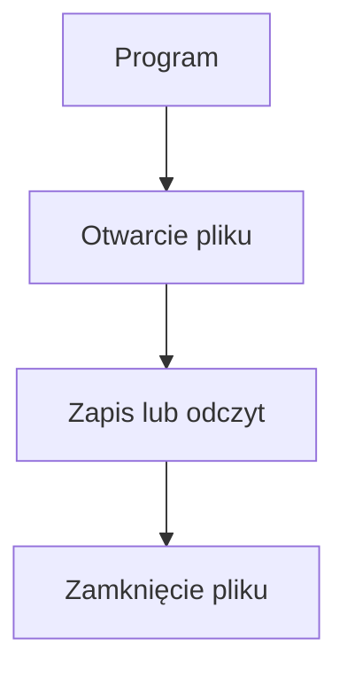

# Pliki tekstowe - odczyt i zapis

## Cel lekcji

Na tej lekcji nauczysz się zapisywać tekst do pliku, dopisywać kolejne dane oraz odczytywać zawartość pliku. Poznasz proste metody klasy `File`, a następnie klasy `StreamWriter` i `StreamReader`, które pozwalają jawnie otworzyć plik do zapisu lub odczytu.

## Po lekcji potrafisz

- wyjaśnić, do czego służy plik tekstowy,
- wskazać różnicę między ścieżką względną i pełną ścieżką,
- wyświetlić położenie tworzonego pliku,
- zapisać tekst za pomocą `File.WriteAllText`,
- dopisać tekst za pomocą `File.AppendAllText`,
- odczytać tekst za pomocą `File.ReadAllText`,
- zapisać i odczytać tablicę wierszy,
- sprawdzić istnienie pliku,
- wykorzystać `StreamWriter` i `StreamReader`,
- utworzyć katalog i bezpiecznie zbudować ścieżkę.

## 1. Po co zapisujemy dane w pliku

Zmienna przechowuje wartość potrzebną podczas działania programu. Po zakończeniu programu wartość zwykłej zmiennej przestaje być dostępna.

Plik pozwala zachować dane poza działającym programem. Możemy później ponownie uruchomić program i odczytać zapisaną zawartość.

```text
zmienna => dane używane podczas działania programu
plik tekstowy => dane zapisane poza programem
```

Plik tekstowy zawiera znaki, które można odczytać w zwykłym edytorze tekstu. Mogą to być:

- pojedyncze napisy,
- liczby zapisane jako tekst,
- wiele wierszy,
- dane rozdzielone średnikami,
- wyniki działania programu.

## 2. Przestrzeń nazw System.IO

Klasy służące do pracy z plikami znajdują się w przestrzeni nazw `System.IO`.

Na początku programu dodajemy:

```csharp
using System.IO;
```

W tej lekcji wykorzystamy między innymi:

- `File` - proste operacje na całych plikach,
- `Directory` - operacje na katalogach,
- `Path` - budowanie i sprawdzanie ścieżek,
- `StreamWriter` - otwarcie pliku do zapisu,
- `StreamReader` - otwarcie pliku do odczytu.

## 3. Ścieżka do pliku

Ścieżka określa położenie pliku.

```csharp
string sciezka = "dane.txt";
```

Jest to ścieżka względna. Nie zawiera pełnego położenia pliku w systemie. Jest interpretowana względem bieżącego katalogu roboczego programu.

Położenie katalogu roboczego może zależeć od sposobu uruchomienia programu, ustawień projektu i używanego środowiska. Nie należy zakładać, że ścieżka względna zawsze oznacza katalog z plikiem projektu.

## 4. Sprawdzenie pełnej ścieżki

Poniższy program pokazuje bieżący katalog roboczy i pełną ścieżkę do pliku.

```csharp
using System;
using System.IO;

class Program
{
    static void Main()
    {
        string sciezka = "dane.txt";

        Console.WriteLine("Nazwa pliku: " + sciezka);
        Console.WriteLine("Katalog roboczy: " + Directory.GetCurrentDirectory());
        Console.WriteLine("Pełna ścieżka: " + Path.GetFullPath(sciezka));
    }
}
```

- `Directory.GetCurrentDirectory()` zwraca bieżący katalog roboczy.
- `Path.GetFullPath(sciezka)` wyznacza pełną ścieżkę dla podanej ścieżki względnej.
- Samo wyświetlenie ścieżki nie tworzy pliku.

## 5. Pierwszy zapis - File.WriteAllText

Najprostszy zapis tekstu do pliku:

```csharp
File.WriteAllText("dane.txt", "Pierwszy zapis do pliku");
```

Metoda `File.WriteAllText`:

- tworzy plik, jeżeli plik nie istnieje,
- zapisuje przekazany tekst,
- zastępuje wcześniejszą zawartość, jeżeli plik już istnieje,
- nie wyświetla automatycznie tekstu w konsoli.

## 6. Kompletny program zapisujący tekst

```csharp
using System;
using System.IO;

class Program
{
    static void Main()
    {
        string sciezka = "dane.txt";
        string tekst = "Pierwszy zapis do pliku";

        File.WriteAllText(sciezka, tekst);

        Console.WriteLine("Zapisano tekst do pliku.");
        Console.WriteLine("Pełna ścieżka: " + Path.GetFullPath(sciezka));
    }
}
```

Po wykonaniu `WriteAllText` plik jest zamknięty. Można go otworzyć w edytorze tekstu.

```text
File.WriteAllText => zastępuje wcześniejszą zawartość pliku
```

## 7. Nadpisywanie pliku

Poniższy program dwa razy zapisuje tekst do tego samego pliku.

```csharp
using System;
using System.IO;

class Program
{
    static void Main()
    {
        string sciezka = "dane.txt";

        File.WriteAllText(sciezka, "Pierwsza zawartość");
        File.WriteAllText(sciezka, "Druga zawartość");

        Console.WriteLine(File.ReadAllText(sciezka));
    }
}
```

W pliku pozostanie tylko:

```text
Druga zawartość
```

Drugie wywołanie `WriteAllText` zastąpiło wcześniejszy tekst. Nie jest to błąd metody. Jest to jej zamierzone działanie. Trzeba jednak uważać, aby przypadkowo nie usunąć potrzebnej zawartości.

## 8. Dopisywanie - File.AppendAllText

Do dopisywania tekstu na końcu pliku służy `File.AppendAllText`.

```csharp
File.AppendAllText("dane.txt", "Nowy wiersz" + Environment.NewLine);
```

`Environment.NewLine` dodaje znak końca wiersza odpowiedni dla systemu. Bez niego kolejny tekst może zostać dopisany bezpośrednio po poprzednim.

```text
File.WriteAllText => zapis od początku i zastąpienie zawartości
File.AppendAllText => dopisanie na końcu pliku
```

## 9. Zapis i dopisywanie kolejnych wierszy

```csharp
using System;
using System.IO;

class Program
{
    static void Main()
    {
        string sciezka = "dane.txt";

        File.WriteAllText(sciezka, "Pierwszy wiersz" + Environment.NewLine);
        File.AppendAllText(sciezka, "Drugi wiersz" + Environment.NewLine);
        File.AppendAllText(sciezka, "Trzeci wiersz" + Environment.NewLine);

        Console.WriteLine("Zapisano trzy wiersze.");
    }
}
```

Pierwsza instrukcja tworzy nową zawartość. Dwie następne dopisują tekst na końcu.

## 10. Odczyt całego pliku - File.ReadAllText

Metoda `File.ReadAllText` odczytuje całą zawartość pliku jako jeden napis.

```csharp
string tekst = File.ReadAllText("dane.txt");
```

Znaki końca wiersza również znajdują się w odczytanym napisie. Odczyt nie zmienia i nie usuwa zawartości pliku.

## 11. Zapis i odczyt całego tekstu

```csharp
using System;
using System.IO;

class Program
{
    static void Main()
    {
        string sciezka = "wiadomosc.txt";
        string tekstDoZapisu = "C# pozwala zapisywać dane w plikach.";

        File.WriteAllText(sciezka, tekstDoZapisu);

        string tekstOdczytany = File.ReadAllText(sciezka);

        Console.WriteLine("Odczytana zawartość:");
        Console.WriteLine(tekstOdczytany);
    }
}
```

Zmienna `tekstOdczytany` otrzymuje zawartość zapisaną wcześniej w pliku.

## 12. Sprawdzenie istnienia pliku - File.Exists

Przed odczytem możemy sprawdzić, czy plik istnieje.

```csharp
using System;
using System.IO;

class Program
{
    static void Main()
    {
        string sciezka = "dane.txt";

        if (File.Exists(sciezka))
        {
            string tekst = File.ReadAllText(sciezka);
            Console.WriteLine(tekst);
        }
        else
        {
            Console.WriteLine("Plik nie istnieje.");
        }
    }
}
```

`File.Exists` zwraca wartość typu `bool`:

- `true` - pod podaną ścieżką istnieje plik,
- `false` - pliku nie znaleziono.

Takie sprawdzenie chroni prosty program przed próbą odczytania nieistniejącego pliku. Nie zabezpiecza jednak przed wszystkimi możliwymi problemami, na przykład brakiem uprawnień lub zmianą stanu pliku w trakcie działania programu. Obsługę takich sytuacji poznamy przy wyjątkach.

## 13. Zapis tablicy wierszy - File.WriteAllLines

Gdy program posiada tablicę napisów, może zapisać każdy element jako osobny wiersz.

```csharp
using System;
using System.IO;

class Program
{
    static void Main()
    {
        string sciezka = "oceny.txt";

        string[] wiersze =
        {
            "Anna;5",
            "Jan;4",
            "Ola;6"
        };

        File.WriteAllLines(sciezka, wiersze);

        Console.WriteLine("Zapisano " + wiersze.Length + " wiersze.");
    }
}
```

`File.WriteAllLines`:

- tworzy plik, jeżeli go nie ma,
- zapisuje każdy element tablicy w osobnym wierszu,
- zastępuje wcześniejszą zawartość istniejącego pliku.

## 14. Odczyt wierszy - File.ReadAllLines

`File.ReadAllLines` odczytuje plik do tablicy napisów.

```csharp
string[] wiersze = File.ReadAllLines("oceny.txt");
```

Każdy wiersz pliku staje się osobnym elementem tablicy. Pierwszy wiersz otrzymuje indeks `0`.

## 15. Wyświetlenie ponumerowanych wierszy

```csharp
using System;
using System.IO;

class Program
{
    static void Main()
    {
        string sciezka = "oceny.txt";

        if (File.Exists(sciezka))
        {
            string[] wiersze = File.ReadAllLines(sciezka);

            Console.WriteLine("Liczba wierszy: " + wiersze.Length);

            for (int i = 0; i < wiersze.Length; i++)
            {
                Console.WriteLine((i + 1) + ". " + wiersze[i]);
            }
        }
        else
        {
            Console.WriteLine("Plik nie istnieje.");
        }
    }
}
```

Indeks tablicy zaczyna się od `0`, ale numer wyświetlany użytkownikowi zaczynamy od `1`, dlatego używamy `i + 1`.

## 16. Przetwarzanie danych z pliku

Wiersze pliku możemy dzielić i zamieniać na odpowiednie typy.

```csharp
using System;
using System.IO;

class Program
{
    static void Main()
    {
        string sciezka = "oceny.txt";

        string[] daneDoZapisu =
        {
            "Anna;5",
            "Jan;4",
            "Ola;6",
            "Błędny wiersz"
        };

        File.WriteAllLines(sciezka, daneDoZapisu);

        string[] wiersze = File.ReadAllLines(sciezka);

        foreach (string wiersz in wiersze)
        {
            string[] elementy = wiersz.Split(';');

            if (elementy.Length == 2)
            {
                string imie = elementy[0];
                int ocena;

                if (int.TryParse(elementy[1], out ocena))
                {
                    Console.WriteLine(imie + " - ocena: " + ocena);
                }
                else
                {
                    Console.WriteLine("Niepoprawna ocena: " + wiersz);
                }
            }
            else
            {
                Console.WriteLine("Niepoprawny format wiersza: " + wiersz);
            }
        }
    }
}
```

Kolejność pracy:

```text
odczyt wiersza => Split => sprawdzenie liczby elementów => TryParse => wykorzystanie danych
```

Najpierw sprawdzamy `elementy.Length`. Dzięki temu nie próbujemy odczytać `elementy[1]`, jeżeli wiersz nie zawiera średnika.

## 17. Jawne otwarcie pliku - StreamWriter

Klasa `StreamWriter` pozwala otworzyć plik do zapisu i wykonać kilka kolejnych operacji.

```csharp
using System;
using System.IO;

class Program
{
    static void Main()
    {
        string sciezka = "notatki.txt";

        using (StreamWriter pisarz = new StreamWriter(sciezka))
        {
            pisarz.WriteLine("Pierwszy wiersz");
            pisarz.WriteLine("Drugi wiersz");
            pisarz.Write("Trzeci");
            pisarz.Write(" wiersz");
        }

        Console.WriteLine("Zakończono zapis.");
    }
}
```

W tym programie:

- `new StreamWriter(sciezka)` otwiera plik do zapisu,
- `WriteLine` zapisuje tekst i przechodzi do następnego wiersza,
- `Write` zapisuje tekst bez automatycznego przejścia do nowego wiersza,
- blok `using` zapewnia zamknięcie pliku po zakończeniu pracy,
- po opuszczeniu bloku nie korzystamy już z obiektu `pisarz`.

Zapis `using (StreamWriter ...)` nie jest tym samym co dyrektywa `using System;` umieszczona na początku pliku. Dyrektywa udostępnia nazwy z przestrzeni nazw. Blok `using` wyznacza czas korzystania z otwartego zasobu.

## 18. Nadpisywanie i dopisywanie w StreamWriter

Konstruktor `StreamWriter` może otrzymać drugi argument typu `bool`.

```csharp
new StreamWriter(sciezka, false)
```

Wartość `false` oznacza zapis od początku i zastąpienie wcześniejszej zawartości.

```csharp
new StreamWriter(sciezka, true)
```

Wartość `true` oznacza dopisywanie na końcu pliku.

```text
false => nadpisywanie
true => dopisywanie
```

## 19. StreamWriter - zapis i dopisanie

```csharp
using System;
using System.IO;

class Program
{
    static void Main()
    {
        string sciezka = "historia.txt";

        using (StreamWriter pisarz = new StreamWriter(sciezka, false))
        {
            pisarz.WriteLine("Pierwszy wpis");
        }

        using (StreamWriter pisarz = new StreamWriter(sciezka, true))
        {
            pisarz.WriteLine("Drugi wpis");
        }

        string tekst = File.ReadAllText(sciezka);
        Console.WriteLine(tekst);
    }
}
```

Pierwszy blok tworzy nową zawartość. Drugi blok dopisuje kolejny wiersz.

## 20. Jawne otwarcie pliku do odczytu - StreamReader

`StreamReader` pozwala otworzyć plik do odczytu.

```csharp
using System;
using System.IO;

class Program
{
    static void Main()
    {
        string sciezka = "wiadomosc.txt";

        File.WriteAllText(sciezka, "Tekst odczytany przez StreamReader.");

        using (StreamReader czytnik = new StreamReader(sciezka))
        {
            string tekst = czytnik.ReadToEnd();
            Console.WriteLine(tekst);
        }
    }
}
```

- Konstruktor `StreamReader` otwiera plik.
- `ReadToEnd` odczytuje tekst od bieżącego miejsca do końca pliku.
- Odczyt nie zmienia zawartości pliku.
- Blok `using` zamyka plik po zakończeniu odczytu.

W tej lekcji do prostego przetwarzania osobnych wierszy korzystamy z `File.ReadAllLines`. Odczyt wiersz po wierszu przez `StreamReader.ReadLine` wymaga dodatkowego omówienia sytuacji, w której osiągnięto koniec pliku.

## 21. Metody klasy File i strumienie

| Element | Przeznaczenie | Zachowanie | Typowe użycie |
| --- | --- | --- | --- |
| `File.WriteAllText` | Zapis jednego napisu | Zastępuje zawartość | Krótki, jednorazowy zapis |
| `File.AppendAllText` | Dopisanie napisu | Zachowuje wcześniejszą zawartość | Dziennik zdarzeń, kolejne wpisy |
| `File.ReadAllText` | Odczyt całego pliku | Zwraca jeden `string` | Niewielki plik tekstowy |
| `File.WriteAllLines` | Zapis tablicy napisów | Każdy element trafia do osobnego wiersza | Zapis przygotowanych wierszy |
| `File.ReadAllLines` | Odczyt wierszy | Zwraca `string[]` | Przetwarzanie wierszy pętlą |
| `StreamWriter` | Jawne otwarcie do zapisu | Pozwala kolejno używać `Write` i `WriteLine` | Wiele operacji zapisu |
| `StreamReader` | Jawne otwarcie do odczytu | Pozwala odczytywać z otwartego pliku | Kontrolowany odczyt tekstu |

Metody klasy `File` są wygodne przy prostych, jednorazowych operacjach. `StreamWriter` i `StreamReader` pokazują jawnie moment otwarcia pliku i umożliwiają wykonanie kilku operacji podczas jednego otwarcia.

## 22. Plik w osobnym katalogu

Do bezpiecznego łączenia fragmentów ścieżki służy `Path.Combine`.

```csharp
string sciezka = Path.Combine("dane", "wyniki.txt");
```

`Path.Combine` buduje ścieżkę, ale nie tworzy katalogu. Katalog trzeba utworzyć osobno.

## 23. Utworzenie katalogu i zapis pliku

```csharp
using System;
using System.IO;

class Program
{
    static void Main()
    {
        string katalog = "dane";
        string sciezka = Path.Combine(katalog, "wyniki.txt");

        if (!Directory.Exists(katalog))
        {
            Directory.CreateDirectory(katalog);
        }

        File.WriteAllText(sciezka, "Wynik: 25");

        Console.WriteLine("Zapisano plik:");
        Console.WriteLine(Path.GetFullPath(sciezka));
    }
}
```

Nie łączymy fragmentów ścieżki ręcznie za pomocą znaków `/` lub `\`, jeżeli możemy użyć `Path.Combine`. Dzięki temu kod nie zależy od sposobu zapisywania separatora katalogów w konkretnym systemie.

## 24. Kodowanie znaków

Plik tekstowy posiada kodowanie, które określa sposób zapisu znaków. W typowym współczesnym projekcie .NET przedstawione metody poprawnie zapisują polskie litery w UTF-8.

Temat kodowań jest szerszy. Na tym etapie wystarczy pamiętać, że program zapisujący i program odczytujący powinny prawidłowo interpretować te same znaki.

## 25. Schemat pracy z plikiem



W przypadku prostych metod klasy `File` otwarcie i zamknięcie odbywa się wewnątrz wywołanej metody. Przy `StreamWriter` i `StreamReader` zakres otwarcia pliku pokazuje blok `using`.

## 26. Najczęstsze błędy

### Szukanie pliku w niewłaściwym katalogu

Ścieżka względna jest interpretowana względem bieżącego katalogu roboczego. W razie wątpliwości wyświetl `Path.GetFullPath(sciezka)`.

### Założenie, że ścieżka względna zawsze wskazuje katalog projektu

Katalog roboczy zależy od sposobu uruchomienia programu. Program powinien wyświetlić pełną ścieżkę zamiast opierać się na przypuszczeniu.

### Przypadkowe nadpisanie pliku

`WriteAllText` i `WriteAllLines` zastępują wcześniejszą zawartość. Do dopisywania użyj `AppendAllText` albo `StreamWriter` z argumentem `true`.

### Brak końca wiersza podczas dopisywania

Jeżeli używasz `AppendAllText`, dodaj `Environment.NewLine`, gdy kolejny tekst ma rozpocząć się w nowym wierszu.

### Odczyt nieistniejącego pliku

W prostym programie sprawdź `File.Exists` przed odczytem pliku, którego program wcześniej nie utworzył.

### Pomylenie WriteAllText i AppendAllText

Pierwsza metoda zastępuje zawartość. Druga dopisuje na końcu.

### Pomylenie Write i WriteLine

`Write` nie dodaje automatycznie końca wiersza. `WriteLine` przechodzi do kolejnego wiersza.

### Zapis do nieistniejącego katalogu

Metoda zapisująca może utworzyć plik, ale nie tworzy brakującej struktury katalogów. Najpierw utwórz katalog.

### Założenie, że Path.Combine tworzy katalog

`Path.Combine` tylko buduje napis reprezentujący ścieżkę.

### Korzystanie ze strumienia poza blokiem using

Po zakończeniu bloku `using` plik jest zamknięty. Nie korzystaj dalej z obiektu `pisarz` ani `czytnik`.

### Pomylenie dwóch znaczeń using

`using System;` jest dyrektywą umieszczoną na początku pliku. `using (StreamWriter ...)` jest blokiem wyznaczającym czas korzystania z otwartego pliku.

### Przekonanie, że odczyt usuwa zawartość

`ReadAllText`, `ReadAllLines` i `StreamReader` odczytują dane. Nie usuwają ich z pliku.

### Oczekiwanie wyniku w konsoli

Zapis do pliku nie wyświetla automatycznie danych. Do wyświetlenia komunikatu nadal używamy `Console.WriteLine`.

## 27. Zapamiętaj

- Ścieżka wskazuje położenie pliku.
- Ścieżka względna zależy od bieżącego katalogu roboczego.
- `Path.GetFullPath` pozwala sprawdzić pełną ścieżkę.
- `File.WriteAllText` zastępuje zawartość pliku.
- `File.AppendAllText` dopisuje tekst na końcu.
- `File.ReadAllText` zwraca cały plik jako jeden napis.
- `File.WriteAllLines` zapisuje elementy tablicy w osobnych wierszach.
- `File.ReadAllLines` zwraca tablicę wierszy.
- `File.Exists` sprawdza, czy plik istnieje.
- `StreamWriter` służy do zapisu tekstu.
- `StreamReader` służy do odczytu tekstu.
- Blok `using` zamyka strumień po zakończeniu pracy.
- `Path.Combine` buduje ścieżkę, ale nie tworzy katalogu.
- `Directory.CreateDirectory` tworzy katalog, jeżeli jest potrzebny.

## 28. Ćwiczenia

1. Zapisz do pliku `powitanie.txt` napis `Witaj w C#`.
2. Wyświetl pełną ścieżkę do utworzonego pliku.
3. Wyświetl bieżący katalog roboczy programu.
4. Zapisz do pliku tekst wprowadzony przez użytkownika.
5. Wykonaj dwa wywołania `WriteAllText` i sprawdź końcową zawartość pliku.
6. Wyjaśnij, dlaczego pierwsza zawartość została zastąpiona.
7. Zapisz pierwszy wiersz przez `WriteAllText`, a drugi przez `AppendAllText`.
8. Dopisz trzy napisy tak, aby każdy znalazł się w osobnym wierszu.
9. Odczytaj cały plik przez `ReadAllText` i wyświetl go w konsoli.
10. Sprawdź istnienie pliku przed jego odczytaniem.
11. Wyświetl komunikat zawierający pełną ścieżkę, jeżeli plik nie istnieje.
12. Zapisz tablicę pięciu imion za pomocą `WriteAllLines`.
13. Odczytaj tablicę imion za pomocą `ReadAllLines`.
14. Wyświetl każdy odczytany wiersz za pomocą `foreach`.
15. Wyświetl numery wierszy za pomocą pętli `for`.
16. Wyświetl liczbę wierszy odczytanego pliku.
17. Policz wiersze zawierające wskazane słowo bez używania LINQ.
18. Znajdź najdłuższy wiersz pliku.
19. Zapisz do pliku pięć liczb, po jednej w każdym wierszu.
20. Odczytaj liczby za pomocą `ReadAllLines` i `TryParse`, a następnie oblicz ich sumę.
21. Odczytaj dane w formacie `imie;ocena` i rozdziel je za pomocą `Split`.
22. Wyświetl komunikat dla wiersza zawierającego niepoprawną ocenę.
23. Zapisz wyniki prostych obliczeń do pliku `wyniki.txt`.
24. Utwórz katalog `raporty` i zapisz w nim plik.
25. Zbuduj ścieżkę do pliku za pomocą `Path.Combine`.
26. Napisz program używający `StreamWriter` i dwóch wywołań `WriteLine`.
27. Porównaj wynik działania `Write` i `WriteLine`.
28. Otwórz `StreamWriter` z argumentem `true` i dopisz nowy wiersz.
29. Odczytaj cały plik za pomocą `StreamReader` i `ReadToEnd`.
30. Popraw program, który przez pomyłkę nadpisuje plik zamiast dopisywać dane.
31. Przeanalizuj program bez uruchamiania i wskaż, w którym katalogu należy szukać pliku.
32. Przygotuj program zapisujący dziennik wyników: datę wpisaną przez użytkownika, nazwę zadania i liczbę punktów, każdorazowo dopisując nowy wiersz.

## Podsumowanie

Proste metody klasy `File` pozwalają zapisać, dopisać i odczytać cały tekst albo tablicę wierszy. `StreamWriter` i `StreamReader` umożliwiają jawne otwarcie pliku i wykonanie kolejnych operacji wewnątrz bloku `using`. Przy pracy z plikiem trzeba świadomie wybrać między nadpisywaniem i dopisywaniem oraz sprawdzać rzeczywiste położenie wynikające ze ścieżki.
