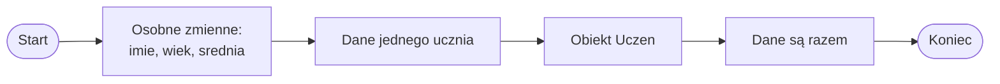

# Po co są obiekty

## Problem: wiele zmiennych opisuje jedną rzecz

Do tej pory przechowywaliśmy dane w osobnych zmiennych.

```csharp
string imie = "Ala";
int wiek = 16;
double srednia = 4.75;
```

Te trzy zmienne opisują jednego ucznia:

- `imie` przechowuje imię,
- `wiek` przechowuje wiek,
- `srednia` przechowuje średnią ocen.

Na początku taki zapis jest prosty i zrozumiały. Problem pojawia się wtedy, gdy danych jest więcej.

## Gdy danych jest więcej

Przykład z dwoma uczniami bez obiektów:

```csharp
string imie1 = "Ala";
int wiek1 = 16;
double srednia1 = 4.75;

string imie2 = "Bartek";
int wiek2 = 17;
double srednia2 = 3.90;
```

Taki zapis zaczyna być niewygodny:

- nazwy zmiennych robią się sztuczne,
- łatwo pomylić dane,
- trudno dodać trzeciego ucznia,
- trudno przekazać dane ucznia do metody,
- program robi się mniej czytelny.

W większych programach takie rozproszone dane szybko prowadzą do bałaganu.

## Pomysł: potraktuj ucznia jako jedną całość

W rzeczywistości uczeń nie jest trzema osobnymi rzeczami. Uczeń jest jedną osobą, która ma różne informacje, na przykład:

- imię,
- wiek,
- średnią ocen.

W programie chcemy móc podobnie potraktować dane ucznia jako jedną całość.

Zamiast myśleć o osobnych zmiennych `imie`, `wiek` i `srednia`, możemy myśleć o jednym uczniu, który ma te dane.

## Obiekt jako jedna całość

Obiekt to sposób przedstawienia w programie konkretnej rzeczy, osoby albo pojęcia.

Przykłady obiektów:

- uczeń,
- książka,
- produkt,
- samochód,
- konto użytkownika,
- postać w grze.

Obiekt może mieć dane i może mieć czynności z nim związane.

## Dane i czynności

| Obiekt | Dane | Czynności |
|---|---|---|
| Uczeń | imię, wiek, średnia | pokaż dane, sprawdź promocję |
| Produkt | nazwa, cena, ilość | oblicz wartość |
| Postać w grze | imię, punkty życia | atakuj, lecz się |

Dane opisują obiekt. Czynności mówią, co można z obiektem zrobić.

W C# dane i czynności można połączyć w klasie.

## Klasa i obiekt — bardzo wstępnie

Klasa to opis, jakiego rodzaju dane i metody może mieć obiekt.

Obiekt to konkretny egzemplarz utworzony na podstawie klasy.

Prosta analogia:

- klasa jest jak formularz ucznia,
- obiekt jest jak wypełniony formularz konkretnego ucznia.

Nie musisz jeszcze znać całej składni klas. Szczegóły pojawią się w kolejnych lekcjach.

## Pierwszy bardzo prosty przykład

Poniższy kod jest zapowiedzią dalszych lekcji. Na razie chodzi głównie o zobaczenie, że dane ucznia można zebrać w jednym obiekcie.

```csharp
using System;

class Uczen
{
    public string imie;
    public int wiek;
    public double srednia;
}

class Program
{
    static void Main()
    {
        Uczen uczen1 = new Uczen();

        uczen1.imie = "Ala";
        uczen1.wiek = 16;
        uczen1.srednia = 4.75;

        Console.WriteLine(uczen1.imie);
        Console.WriteLine(uczen1.wiek);
        Console.WriteLine(uczen1.srednia);
    }
}
```

Wyjaśnienie:

- `class Uczen` opisuje, jakie dane ma uczeń,
- `Uczen uczen1` tworzy zmienną przechowującą obiekt ucznia,
- `new Uczen()` tworzy nowy obiekt,
- `uczen1.imie` oznacza pole `imie` konkretnego ucznia,
- szczegóły składni będą omawiane w następnych lekcjach.

W tym przykładzie używamy pól publicznych tylko dydaktycznie, jako najprostszej wersji do nauki. Właściwości `get` i `set` będą omówione później.

## Diagram: od wielu zmiennych do obiektu



Diagram pokazuje, że obiekt pomaga zebrać dane jednej rzeczy w jedną całość.

## Dlaczego obiekty pomagają

Obiekty pomagają, bo:

- grupują dane jednej rzeczy,
- ułatwiają przekazywanie danych do metod,
- zmniejszają liczbę luźnych zmiennych,
- ułatwiają tworzenie wielu podobnych elementów,
- porządkują większe programy,
- przygotowują do budowania bardziej realistycznych aplikacji.

Obiekty nie są potrzebne w każdym bardzo małym programie. Stają się ważne wtedy, gdy program ma więcej danych i więcej powiązanych działań.

## Czego jeszcze nie robimy

W tej lekcji nie omawiamy jeszcze:

- dziedziczenia,
- interfejsów,
- polimorfizmu,
- hermetyzacji,
- właściwości `get` i `set`,
- zaawansowanego projektowania klas.

Na razie najważniejsze jest zrozumienie, że obiekt grupuje dane i zachowania.

## Najczęstsze błędy na początku

- Zaczynanie od trudnych definicji zamiast od problemu.
- Mylenie klasy z obiektem.
- Mylenie jednej zmiennej z całym obiektem.
- Próba uczenia się dziedziczenia przed zrozumieniem klasy i obiektu.
- Używanie obiektów tam, gdzie wystarczy jedna prosta zmienna.
- Oczekiwanie, że obiekty od razu będą łatwe.

## Ćwiczenia

1. Wypisz trzy zmienne opisujące jednego ucznia: `imie`, `wiek`, `srednia`.
2. Wypisz sześć zmiennych opisujących dwóch uczniów i zauważ problem z nazwami.
3. Wskaż, jakie dane może mieć obiekt `Ksiazka`.
4. Wskaż, jakie dane może mieć obiekt `Produkt`.
5. Wskaż, jakie czynności mogłyby dotyczyć obiektu `Uczen`.
6. Wyjaśnij własnymi słowami różnicę między klasą a obiektem.
7. Przepisz przykład z klasą `Uczen` i zmień dane ucznia na własne.

## Podsumowanie

Obiekt pozwala traktować dane jednej rzeczy jako całość.

Klasa opisuje, jakiego rodzaju dane i metody może mieć obiekt.

Obiekt jest konkretnym egzemplarzem klasy.

Obiekty pomagają porządkować większe programy. Na początku najważniejsze jest zrozumienie problemu, który obiekty rozwiązują.
