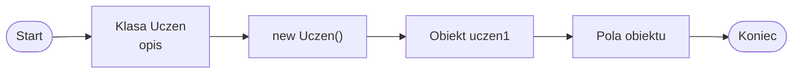

# Klasa i obiekt

## Przypomnienie z poprzedniej lekcji

W poprzedniej lekcji pojawiły się trzy ważne myśli:

- obiekt pozwala traktować dane jednej rzeczy jako całość,
- klasa opisuje, jakie dane i metody może mieć obiekt,
- obiekt jest konkretnym egzemplarzem klasy.

Teraz spokojnie rozdzielimy te dwa pojęcia: klasę i obiekt.

## Klasa jako opis

Klasa jest opisem rodzaju obiektu. Sama klasa nie jest jeszcze konkretną rzeczą.

Proste analogie:

- klasa to formularz, a obiekt to wypełniony formularz,
- klasa to przepis, a obiekt to konkretne danie,
- klasa to projekt domu, a obiekt to konkretny dom.

W programie klasa mówi, jakie dane i działania mogą należeć do obiektu danego typu.

## Prosta klasa Uczen

```csharp
class Uczen
{
    public string imie;
    public int wiek;
    public double srednia;
}
```

Wyjaśnienie:

- `class Uczen` tworzy nowy typ danych,
- `imie`, `wiek` i `srednia` są polami,
- pola przechowują dane obiektu,
- `public` oznacza, że na tym etapie możemy odwołać się do pola z `Main`,
- to jest uproszczony zapis dydaktyczny; później poznamy lepsze sposoby kontroli dostępu.

## Obiekt jako egzemplarz klasy

```csharp
Uczen uczen1 = new Uczen();
```

Wyjaśnienie:

- `Uczen` to typ,
- `uczen1` to zmienna przechowująca obiekt,
- `new Uczen()` tworzy nowy obiekt,
- obiekt ma własne pola `imie`, `wiek` i `srednia`.

Klasa `Uczen` jest opisem, a `uczen1` jest konkretnym obiektem utworzonym na podstawie tej klasy.

## Dostęp do pól przez kropkę

```csharp
uczen1.imie = "Ala";
uczen1.wiek = 16;
uczen1.srednia = 4.75;

Console.WriteLine(uczen1.imie);
```

Kropka pozwala wejść do pola konkretnego obiektu.

`uczen1.imie` oznacza pole `imie` obiektu `uczen1`. To nie jest osobna zmienna `imie` w `Main`, tylko pole obiektu.

## Kompletny przykład

```csharp
using System;

class Uczen
{
    public string imie;
    public int wiek;
    public double srednia;
}

class Program
{
    static void Main()
    {
        Uczen uczen1 = new Uczen();

        uczen1.imie = "Ala";
        uczen1.wiek = 16;
        uczen1.srednia = 4.75;

        Console.WriteLine(uczen1.imie);
        Console.WriteLine(uczen1.wiek);
        Console.WriteLine(uczen1.srednia);
    }
}
```

Co dzieje się w programie:

1. `class Uczen` opisuje dane ucznia.
2. W `Main` instrukcja `new Uczen()` tworzy nowy obiekt.
3. Zmienna `uczen1` przechowuje ten obiekt.
4. Do pól obiektu przypisywane są wartości.
5. Program wypisuje wartości pól na ekranie.

## Diagram: klasa i obiekt



Diagram pokazuje, że klasa jest opisem, a obiekt powstaje dopiero po użyciu `new`.

## Kilka obiektów tej samej klasy

```csharp
Uczen uczen1 = new Uczen();
Uczen uczen2 = new Uczen();

uczen1.imie = "Ala";
uczen1.wiek = 16;
uczen1.srednia = 4.75;

uczen2.imie = "Bartek";
uczen2.wiek = 17;
uczen2.srednia = 3.90;

Console.WriteLine(uczen1.imie);
Console.WriteLine(uczen2.imie);
```

Wyjaśnienie:

- oba obiekty powstały na podstawie tej samej klasy,
- `uczen1` i `uczen2` mają takie same pola,
- wartości pól mogą być różne,
- zmiana pola jednego obiektu nie zmienia pola drugiego obiektu.

## Klasa to nie obiekt

Sama klasa `Uczen` jest tylko opisem. Dopiero `new Uczen()` tworzy konkretny obiekt.

Ważne:

- klasa `Uczen` nie jest jeszcze konkretnym uczniem,
- konkretnym uczniem jest dopiero obiekt, np. `uczen1`,
- z jednej klasy można utworzyć wiele obiektów.

To podobne do formularza: pusty formularz jest wzorem, a wypełniony formularz opisuje konkretną osobę.

## Najczęstsze błędy

- Mylenie klasy z obiektem.
- Zapomnienie o `new Uczen()`.
- Próba odwołania się do pola bez obiektu.
- Pomylenie `uczen1.imie` z osobną zmienną `imie`.
- Oczekiwanie, że zmiana `uczen1` zmieni też `uczen2`.
- Zbyt szybkie przechodzenie do zaawansowanej teorii OOP.

## Ćwiczenia

1. Napisz klasę `Ksiazka` z polami `tytul`, `autor` i `liczbaStron`.
2. Utwórz obiekt klasy `Ksiazka`.
3. Przypisz wartości do pól obiektu `Ksiazka`.
4. Wypisz dane książki na ekranie.
5. Napisz klasę `Produkt` z polami `nazwa`, `cena` i `ilosc`.
6. Utwórz dwa obiekty klasy `Produkt` i nadaj im różne wartości pól.
7. Wyjaśnij własnymi słowami różnicę między klasą a obiektem.
8. Sprawdź, co się stanie, jeśli spróbujesz użyć pola obiektu przed utworzeniem obiektu przez `new`.

## Podsumowanie

Klasa jest opisem typu obiektu.

Obiekt jest konkretnym egzemplarzem klasy.

`new` tworzy nowy obiekt. Pola przechowują dane obiektu.

Do pól obiektu odwołujemy się przez kropkę. Z jednej klasy można utworzyć wiele obiektów, a każdy obiekt ma własne wartości pól.
