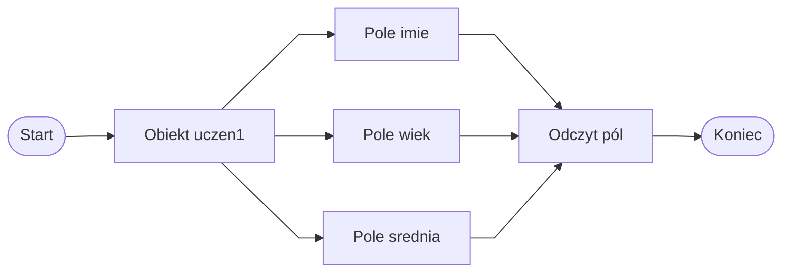

# Pola obiektu

## Cel lekcji

Po tej lekcji rozumiesz, że pola przechowują dane obiektu. Potrafisz zdefiniować proste pola w klasie, przypisać im wartości dla konkretnego obiektu i odczytać te wartości za pomocą kropki.

## Co to jest pole

Pole to zmienna należąca do obiektu. Przechowuje jedną informację o obiekcie.

Jeżeli tworzymy klasę opisującą ucznia, pola mogą przechowywać na przykład imię, wiek i średnią ocen.

```csharp
class Uczen
{
    public string imie;
    public int wiek;
    public double srednia;
}
```

W tym przykładzie:

* `imie` jest polem typu `string`,
* `wiek` jest polem typu `int`,
* `srednia` jest polem typu `double`.

Każde pole ma typ i nazwę. Pola opisują dane, które może przechowywać obiekt danej klasy.

## Pole a zmienna lokalna

Zmienna lokalna jest zadeklarowana wewnątrz metody. Istnieje tylko w tej metodzie lub w jej bloku kodu.

Pole jest zadeklarowane w klasie. Należy do obiektu utworzonego na podstawie tej klasy.

```csharp
class Uczen
{
    public string imie;
}

class Program
{
    static void Main()
    {
        string tekst = "Ala";
    }
}
```

W tym przykładzie:

* `imie` jest polem klasy `Uczen`,
* `tekst` jest zmienną lokalną metody `Main`.

To ważna różnica. Pole opisuje dane obiektu, a zmienna lokalna jest pomocniczą wartością używaną w określonym miejscu programu.

## Dostęp do pola przez kropkę

Aby dostać się do pola konkretnego obiektu, używamy kropki.

```csharp
Uczen uczen1 = new Uczen();

uczen1.imie = "Ala";
uczen1.wiek = 16;
uczen1.srednia = 4.75;

Console.WriteLine(uczen1.imie);
```

Zapis `uczen1.imie` oznacza pole `imie` obiektu `uczen1`.

Schemat jest prosty:

```text
nazwaObiektu.nazwaPola
```

Najpierw podajemy nazwę obiektu, potem kropkę, a na końcu nazwę pola.

## Kompletny przykład z polami

```csharp
using System;

class Uczen
{
    public string imie;
    public int wiek;
    public double srednia;
    public bool czyAktywny;
}

class Program
{
    static void Main()
    {
        Uczen uczen1 = new Uczen();

        uczen1.imie = "Ala";
        uczen1.wiek = 16;
        uczen1.srednia = 4.75;
        uczen1.czyAktywny = true;

        Console.WriteLine(uczen1.imie);
        Console.WriteLine(uczen1.wiek);
        Console.WriteLine(uczen1.srednia);
        Console.WriteLine(uczen1.czyAktywny);
    }
}
```

Pola mogą mieć różne typy danych. W przykładzie użyto:

* `string` do tekstu,
* `int` do liczby całkowitej,
* `double` do liczby rzeczywistej,
* `bool` do wartości `true` albo `false`.

## Diagram: obiekt i jego pola



Obiekt może mieć wiele pól. Każde pole przechowuje osobną informację o tym samym obiekcie.

## Każdy obiekt ma własne pola

Jeżeli utworzymy dwa obiekty tej samej klasy, każdy z nich ma własne wartości pól.

```csharp
using System;

class Uczen
{
    public string imie;
    public int wiek;
}

class Program
{
    static void Main()
    {
        Uczen uczen1 = new Uczen();
        Uczen uczen2 = new Uczen();

        uczen1.imie = "Ala";
        uczen1.wiek = 16;

        uczen2.imie = "Bartek";
        uczen2.wiek = 17;

        Console.WriteLine(uczen1.imie);
        Console.WriteLine(uczen2.imie);
    }
}
```

Obiekty `uczen1` i `uczen2` mają takie same pola, bo powstały z tej samej klasy. Ich wartości mogą być jednak różne.

Zmiana pola jednego obiektu nie zmienia pola drugiego obiektu.

## Zmiana wartości pola

Wartość pola można zmienić podobnie jak wartość zmiennej. Trzeba jednak wskazać, którego obiektu dotyczy zmiana.

```csharp
uczen1.srednia = 4.75;
Console.WriteLine(uczen1.srednia);

uczen1.srednia = 5.10;
Console.WriteLine(uczen1.srednia);
```

W tym przykładzie zmieniamy wartość pola `srednia` obiektu `uczen1`.

## public jako uproszczenie

W tej lekcji używamy pól zapisanych z wyrazem `public`, aby wyraźnie zobaczyć mechanizm działania pól.

```csharp
public string imie;
```

Oznacza to, że do pola można dostać się bezpośrednio z zewnątrz klasy.

W większych programach zwykle nie udostępnia się pól w taki sposób. Później poznasz bezpieczniejsze sposoby pracy z danymi obiektu, na przykład właściwości. Na tym etapie najważniejsze jest zrozumienie, że pole przechowuje dane obiektu.

## Najczęstsze błędy

* Użycie pola bez podania nazwy obiektu.
* Mylenie pola ze zmienną lokalną.
* Pominięcie kropki przy dostępie do pola.
* Oczekiwanie, że zmiana pola jednego obiektu zmieni pole drugiego obiektu.
* Nadawanie polom nieczytelnych nazw, na przykład `x`, `a`, `dane`.
* Traktowanie pól `public` jako docelowego stylu pisania większych programów.

Przykład błędu:

```csharp
imie = "Ala";
```

Jeżeli `imie` jest polem obiektu, trzeba wskazać obiekt:

```csharp
uczen1.imie = "Ala";
```

## Ćwiczenia

1. Utwórz klasę `Ksiazka` z polami `tytul`, `autor` i `liczbaStron`.
2. Utwórz obiekt klasy `Ksiazka` i przypisz wartości do jego pól.
3. Wypisz w konsoli wartości pól obiektu `Ksiazka`.
4. Utwórz klasę `Produkt` z polami `nazwa`, `cena` i `ilosc`.
5. Utwórz dwa obiekty klasy `Produkt` i nadaj im różne wartości pól.
6. Zmień wartość pola `cena` jednego produktu i wypisz ją ponownie.
7. Wyjaśnij własnymi słowami różnicę między polem a zmienną lokalną.
8. W przykładowym programie wskaż, które nazwy są polami, a które zmiennymi lokalnymi.

## Podsumowanie

* Pole przechowuje dane obiektu.
* Każde pole ma typ i nazwę.
* Do pola konkretnego obiektu odwołujemy się przez kropkę.
* Każdy obiekt ma własne wartości pól.
* Pole różni się od zmiennej lokalnej miejscem deklaracji i zakresem użycia.
* Pola `public` są na początku kursu uproszczeniem dydaktycznym.
