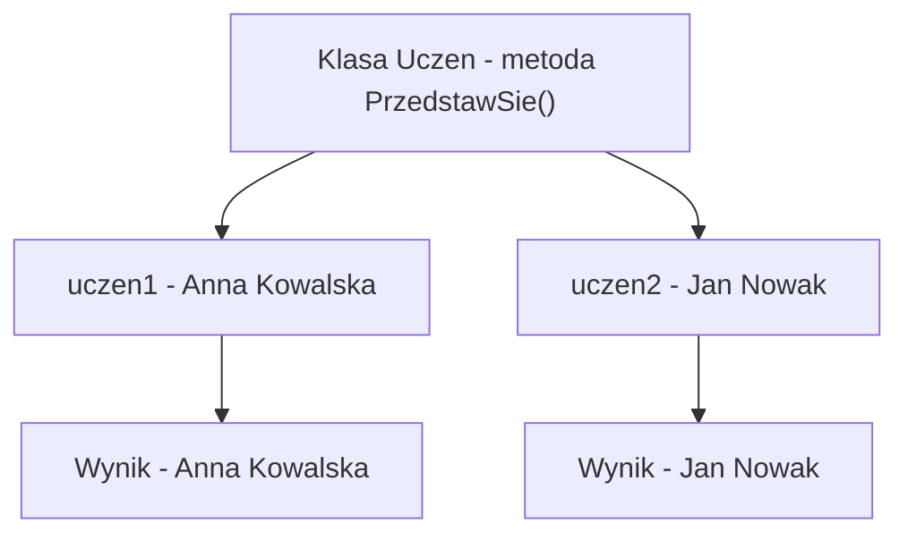

# Metody obiektu

## Cel lekcji

Na tej lekcji nauczysz się definiować i wywoływać metody obiektu. Zobaczysz, że metoda może korzystać z pól konkretnego obiektu, zwracać wartość, przyjmować parametry oraz zmieniać stan obiektu.

## Po lekcji potrafisz

- odróżnić dane obiektu od jego zachowań,
- zdefiniować publiczną metodę obiektu,
- wywołać metodę przez operator kropki,
- utworzyć metodę `void`,
- zwrócić z metody wartość typu `string`, `bool` lub `double`,
- przekazać argument do metody obiektu,
- zmienić pola obiektu wewnątrz metody,
- wyjaśnić podstawową różnicę między metodą obiektu i metodą `static`.

## 1. Krótkie przypomnienie

Klasa jest opisem obiektów określonego rodzaju. Obiekt jest konkretnym egzemplarzem klasy.

Pola przechowują dane obiektu. Każdy obiekt ma własne wartości pól. Dostęp do elementów obiektu uzyskujemy za pomocą operatora kropki.

```csharp
Uczen uczen1 = new Uczen();
uczen1.imie = "Anna";
```

W poprzedniej lekcji obiekty przechowywały dane. Teraz dodamy do klas czynności wykonywane przez obiekty.

## 2. Dane i zachowania

Obiekt łączy dane oraz zachowania.

```text
Uczen
- pola: imie, nazwisko, srednia
- metody: PrzedstawSie(), WyswietlSrednia(), CzyZdal()
```

- Pola opisują stan obiektu.
- Metody opisują czynności, które obiekt może wykonać.

Metody zapisujemy wewnątrz klasy, obok pól.

## 3. Pierwsza metoda obiektu

Metoda `PrzedstawSie()` wyświetla dane ucznia. Nie ma przed nazwą słowa `static`, dlatego jest metodą obiektu.

```csharp
using System;

class Uczen
{
    public string imie;
    public string nazwisko;

    public void PrzedstawSie()
    {
        Console.WriteLine($"Nazywam się {imie} {nazwisko}.");
    }
}

class Program
{
    static void Main()
    {
        Uczen uczen1 = new Uczen();
        uczen1.imie = "Anna";
        uczen1.nazwisko = "Kowalska";

        uczen1.PrzedstawSie();
    }
}
```

W deklaracji metody:

```csharp
public void PrzedstawSie()
```

- `public` pozwala wywołać metodę z klasy `Program`,
- `void` oznacza, że metoda nie zwraca wartości,
- `PrzedstawSie` jest nazwą metody,
- `()` jest miejscem na parametry metody,
- `{ }` wyznacza ciało metody.

Wywołanie:

```csharp
uczen1.PrzedstawSie();
```

oznacza, że obiekt `uczen1` wykonuje metodę `PrzedstawSie()`.

## 4. Ta sama metoda i różne obiekty

Kod metody jest wspólny dla wszystkich obiektów klasy. Metoda działa jednak na polach obiektu, przez który została wywołana.

```csharp
using System;

class Uczen
{
    public string imie;
    public string nazwisko;

    public void PrzedstawSie()
    {
        Console.WriteLine($"Nazywam się {imie} {nazwisko}.");
    }
}

class Program
{
    static void Main()
    {
        Uczen uczen1 = new Uczen();
        uczen1.imie = "Anna";
        uczen1.nazwisko = "Kowalska";

        Uczen uczen2 = new Uczen();
        uczen2.imie = "Jan";
        uczen2.nazwisko = "Nowak";

        uczen1.PrzedstawSie();
        uczen2.PrzedstawSie();
    }
}
```

Wynik:

```text
Nazywam się Anna Kowalska.
Nazywam się Jan Nowak.
```

Wywołanie `uczen1.PrzedstawSie()` korzysta z pól obiektu `uczen1`. Wywołanie `uczen2.PrzedstawSie()` korzysta z pól obiektu `uczen2`.



## 5. Metoda void wyświetlająca dane

Metoda `void` wykonuje czynność, ale nie zwraca wartości do miejsca wywołania.

```csharp
using System;

class Uczen
{
    public string imie;
    public string nazwisko;
    public string klasa;
    public double srednia;

    public void WyswietlDane()
    {
        Console.WriteLine("Imię: " + imie);
        Console.WriteLine("Nazwisko: " + nazwisko);
        Console.WriteLine("Klasa: " + klasa);
        Console.WriteLine("Średnia: " + srednia);
    }
}

class Program
{
    static void Main()
    {
        Uczen uczen1 = new Uczen();
        uczen1.imie = "Ola";
        uczen1.nazwisko = "Lis";
        uczen1.klasa = "3TI";
        uczen1.srednia = 4.25;

        uczen1.WyswietlDane();
    }
}
```

Metoda ma bezpośredni dostęp do pól obiektu, przez który została wywołana. Nie trzeba przekazywać tych pól jako argumentów.

## 6. Metoda zwracająca string

Metoda może obliczyć i zwrócić wartość. Typ zapisany przed nazwą metody określa typ wyniku.

```csharp
using System;

class Uczen
{
    public string imie;
    public string nazwisko;

    public string PobierzPelneImie()
    {
        return imie + " " + nazwisko;
    }
}

class Program
{
    static void Main()
    {
        Uczen uczen1 = new Uczen();
        uczen1.imie = "Ewa";
        uczen1.nazwisko = "Zając";

        string pelneImie = uczen1.PobierzPelneImie();
        Console.WriteLine(pelneImie);

        Console.WriteLine(uczen1.PobierzPelneImie());
    }
}
```

Metoda `PobierzPelneImie()` nie wyświetla danych. Zwraca napis za pomocą `return`. Kod wywołujący może zapisać wynik w zmiennej albo od razu przekazać go do `Console.WriteLine()`.

## 7. Wyświetlenie a zwrócenie wartości

Te dwie metody wykonują inne zadania:

```csharp
public void WyswietlImie()
{
    Console.WriteLine(imie);
}
```

```csharp
public string PobierzImie()
{
    return imie;
}
```

- `WyswietlImie()` wypisuje wartość i niczego nie zwraca.
- `PobierzImie()` zwraca wartość, którą można wykorzystać w innym miejscu programu.

Zwrócenie wartości daje kodowi wywołującemu większą swobodę. Wynik można wyświetlić, zapisać lub porównać.

## 8. Metoda zwracająca bool

Metoda `CzyZdal()` zwraca wynik sprawdzenia warunku. Nie wyświetla komunikatu.

```csharp
using System;

class Uczen
{
    public string imie;
    public double srednia;

    public bool CzyZdal()
    {
        return srednia >= 2.0;
    }
}

class Program
{
    static void Main()
    {
        Uczen uczen1 = new Uczen();
        uczen1.imie = "Marek";
        uczen1.srednia = 3.1;

        if (uczen1.CzyZdal())
        {
            Console.WriteLine(uczen1.imie + " zdał.");
        }
        else
        {
            Console.WriteLine(uczen1.imie + " nie zdał.");
        }
    }
}
```

Zasada przyjęta w tym przykładzie:

```text
srednia >= 2.0 => uczeń zdał
```

Metoda zwraca `true` albo `false`. Instrukcja `if` decyduje, jaki komunikat wyświetlić.

## 9. Metoda zwracająca wartość liczbową

Metoda może wykonać obliczenie na podstawie pól obiektu.

```csharp
using System;

class Prostokat
{
    public double szerokosc;
    public double wysokosc;

    public double ObliczPole()
    {
        return szerokosc * wysokosc;
    }
}

class Program
{
    static void Main()
    {
        Prostokat prostokat1 = new Prostokat();
        prostokat1.szerokosc = 5.0;
        prostokat1.wysokosc = 3.0;

        double pole = prostokat1.ObliczPole();
        Console.WriteLine("Pole: " + pole);
    }
}
```

Metoda `ObliczPole()` korzysta z szerokości i wysokości tego prostokąta, przez który została wywołana.

## 10. Metoda obiektu z parametrem

Metoda może przyjmować dane podczas wywołania. Parametr `kwota` istnieje tylko wewnątrz metody `Wplac()`.

```csharp
using System;

class Konto
{
    public string wlasciciel;
    public double saldo;

    public void Wplac(double kwota)
    {
        if (kwota > 0)
        {
            saldo += kwota;
            Console.WriteLine("Wpłacono: " + kwota);
        }
        else
        {
            Console.WriteLine("Kwota wpłaty musi być dodatnia.");
        }
    }
}

class Program
{
    static void Main()
    {
        Konto konto1 = new Konto();
        konto1.wlasciciel = "Anna Kowalska";
        konto1.saldo = 0;

        konto1.Wplac(100);
        konto1.Wplac(50);
        konto1.Wplac(-20);

        Console.WriteLine("Saldo: " + konto1.saldo);
    }
}
```

W tym przykładzie:

- `saldo` jest polem obiektu,
- `kwota` jest parametrem metody,
- `100`, `50` i `-20` są argumentami przekazywanymi podczas wywołań.

## 11. Metoda z kilkoma parametrami

Metoda `Przesun()` otrzymuje dwie wartości i zmienia oba pola punktu.

```csharp
using System;

class Punkt
{
    public int x;
    public int y;

    public void Przesun(int zmianaX, int zmianaY)
    {
        x += zmianaX;
        y += zmianaY;
    }

    public void Wyswietl()
    {
        Console.WriteLine($"Punkt: ({x}, {y})");
    }
}

class Program
{
    static void Main()
    {
        Punkt punkt1 = new Punkt();
        punkt1.x = 2;
        punkt1.y = 5;

        punkt1.Wyswietl();
        punkt1.Przesun(3, -2);
        punkt1.Wyswietl();
    }
}
```

Argument `3` zostaje przekazany do parametru `zmianaX`, a argument `-2` do parametru `zmianaY`.

## 12. Metoda zmieniająca stan obiektu

Stan obiektu to aktualne wartości jego pól. Metoda może tylko odczytać pola albo je zmienić.

```csharp
using System;

class Licznik
{
    public int wartosc;

    public void Zwieksz()
    {
        wartosc++;
    }

    public void Zmniejsz()
    {
        wartosc--;
    }

    public void Wyzeruj()
    {
        wartosc = 0;
    }

    public void Wyswietl()
    {
        Console.WriteLine("Wartość licznika: " + wartosc);
    }
}

class Program
{
    static void Main()
    {
        Licznik licznik1 = new Licznik();
        Licznik licznik2 = new Licznik();

        licznik1.Zwieksz();
        licznik1.Zwieksz();
        licznik2.Zmniejsz();

        licznik1.Wyswietl();
        licznik2.Wyswietl();

        licznik1.Wyzeruj();
        licznik1.Wyswietl();
    }
}
```

Zmiana pola obiektu `licznik1` nie zmienia pola obiektu `licznik2`. Każdy obiekt ma własny stan.

## 13. Wynik zależny od parametru i pola

Metoda może jednocześnie korzystać z pola obiektu i parametru.

```csharp
using System;

class Produkt
{
    public string nazwa;
    public double cena;

    public double ObliczCene(int liczbaSztuk)
    {
        if (liczbaSztuk > 0)
        {
            return cena * liczbaSztuk;
        }

        return 0;
    }
}

class Program
{
    static void Main()
    {
        Produkt produkt1 = new Produkt();
        produkt1.nazwa = "Zeszyt";
        produkt1.cena = 8.5;

        Console.WriteLine(produkt1.ObliczCene(3));
        Console.WriteLine(produkt1.ObliczCene(10));
        Console.WriteLine(produkt1.ObliczCene(0));
    }
}
```

Pole `cena` należy do produktu. Parametr `liczbaSztuk` otrzymuje nową wartość przy każdym wywołaniu metody.

## 14. Metoda obiektu a metoda static

Metoda obiektu nie ma słowa `static`:

```csharp
public void PrzedstawSie()
```

Taka metoda:

- jest wywoływana przez konkretny obiekt,
- może bezpośrednio korzystać z pól tego obiektu,
- działa na stanie obiektu, przez który została wywołana.

Wywołanie metody obiektu:

```csharp
uczen1.PrzedstawSie();
```

Metoda `Main()` ma słowo `static`:

```csharp
static void Main()
```

Metoda `Main()` należy do klasy `Program`. Nie jest wywoływana przez obiekt klasy `Program` i nie ma automatycznie dostępu do pól konkretnego ucznia.

Wewnątrz `Main()` można jednak utworzyć obiekt i wywołać jego metodę:

```csharp
Uczen uczen1 = new Uczen();
uczen1.PrzedstawSie();
```

Nie można natomiast wywołać metody obiektu bez wskazania obiektu:

```csharp
PrzedstawSie();
```

Program nie wiedziałby wtedy, z pól którego ucznia ma skorzystać.

## 15. Kilka metod w jednej klasie

Jedna klasa może zawierać kilka metod opisujących różne zachowania obiektu.

```csharp
using System;

class Samochod
{
    public string marka;
    public int predkosc;

    public void Przyspiesz(int wartosc)
    {
        if (wartosc > 0)
        {
            predkosc += wartosc;
        }
    }

    public void Zwolnij(int wartosc)
    {
        if (wartosc > 0)
        {
            predkosc -= wartosc;

            if (predkosc < 0)
            {
                predkosc = 0;
            }
        }
    }

    public void WyswietlStan()
    {
        Console.WriteLine("Marka: " + marka);
        Console.WriteLine("Prędkość: " + predkosc);
    }
}

class Program
{
    static void Main()
    {
        Samochod samochod1 = new Samochod();
        samochod1.marka = "Toyota";
        samochod1.predkosc = 0;

        samochod1.Przyspiesz(50);
        samochod1.WyswietlStan();

        samochod1.Zwolnij(20);
        samochod1.WyswietlStan();

        samochod1.Zwolnij(100);
        samochod1.WyswietlStan();
    }
}
```

Metody pilnują zasad działania samochodu. Prędkość nie może spaść poniżej `0`.

## 16. Nazewnictwo metod

W tym kursie stosujemy następującą konwencję:

- nazwy klas zapisujemy PascalCase,
- nazwy metod zapisujemy PascalCase,
- nazwy pól, parametrów i zmiennych zapisujemy camelCase,
- nazwa metody powinna opisywać wykonywaną czynność.

Dobre nazwy metod:

```text
PrzedstawSie
ObliczPole
CzyZdal
WyswietlDane
ZmienPredkosc
```

Nieczytelne nazwy:

```text
Metoda1
Zrob
X
Test
```

## 17. Zestawienie rodzajów metod

| Rodzaj metody | Przykładowa deklaracja | Typ wyniku | Sposób wywołania | Zastosowanie |
| --- | --- | --- | --- | --- |
| `void` bez parametrów | `public void Wyswietl()` | Brak wartości | `obiekt.Wyswietl();` | Wykonanie prostej czynności |
| `void` z parametrem | `public void Wplac(double kwota)` | Brak wartości | `konto.Wplac(100);` | Zmiana stanu obiektu |
| Zwracająca `string` | `public string PobierzOpis()` | `string` | `string opis = obiekt.PobierzOpis();` | Utworzenie opisu |
| Zwracająca `bool` | `public bool CzyZdal()` | `bool` | `if (uczen.CzyZdal())` | Sprawdzenie warunku |
| Zwracająca `double` | `public double ObliczPole()` | `double` | `double pole = prostokat.ObliczPole();` | Wykonanie obliczenia |
| Metoda obiektu | `public void PrzedstawSie()` | Zależny od deklaracji | `uczen.PrzedstawSie();` | Działanie na polach obiektu |
| Metoda `static` | `static void Main()` | `void` | Uruchamiana jako punkt startowy programu | Działanie należące do klasy `Program` |

## 18. Typowe błędy

### Metoda zapisana poza klasą

Metoda musi znajdować się wewnątrz definicji klasy.

### Metoda umieszczona wewnątrz Main

Metody obiektu zapisujemy wewnątrz odpowiedniej klasy, a nie wewnątrz metody `Main()`.

### Pominięcie nawiasów

Niepoprawnie:

```csharp
uczen1.PrzedstawSie;
```

Poprawnie:

```csharp
uczen1.PrzedstawSie();
```

### Brak obiektu podczas wywołania

Niepoprawnie w `Main()`:

```csharp
PrzedstawSie();
```

Poprawnie:

```csharp
uczen1.PrzedstawSie();
```

### Dodanie static do metody obiektu

Metoda, która ma bezpośrednio pracować na polach konkretnego obiektu, nie powinna mieć słowa `static`.

### Użycie pola bez wskazania obiektu w Main

Niepoprawnie:

```csharp
Console.WriteLine(imie);
```

Poprawnie:

```csharp
Console.WriteLine(uczen1.imie);
```

### Pomylenie pola z metodą

Pole odczytujemy bez nawiasów:

```csharp
uczen1.imie
```

Metodę wywołujemy z nawiasami:

```csharp
uczen1.PrzedstawSie()
```

### Pomylenie parametru z argumentem

Parametr znajduje się w deklaracji metody:

```csharp
public void Wplac(double kwota)
```

Argument znajduje się w wywołaniu:

```csharp
konto1.Wplac(100);
```

### Niezgodny typ wyniku

Metoda zadeklarowana jako `double` musi zwrócić wartość zgodną z typem `double`.

### Brak return

Każda droga wykonania metody zwracającej wartość musi prowadzić do odpowiedniego `return`.

### Zwracanie wartości z metody void

Metoda `void` nie zwraca wartości za pomocą zapisu `return wartosc;`.

### Wspólny stan dwóch obiektów

Zmiana pól jednego obiektu nie zmienia automatycznie pól drugiego obiektu.

### Nieczytelna nazwa metody

Nazwa powinna opisywać czynność. `ObliczPole()` jest czytelniejsze niż `Metoda1()`.

## 19. Zapamiętaj

- Metoda obiektu nie ma słowa `static`.
- Metodę obiektu wywołujemy przez konkretny obiekt.
- Metoda ma dostęp do pól obiektu, przez który została wywołana.
- Ten sam kod metody działa na danych różnych obiektów.
- Metoda `void` wykonuje czynność, ale nie zwraca wartości.
- Metoda może zwracać wynik za pomocą `return`.
- Metoda może przyjmować parametry.
- Metoda może zmieniać stan obiektu.
- `static Main()` może utworzyć obiekt i wywołać jego metodę.
- Każdy obiekt ma własne wartości pól.

## 20. Ćwiczenia

1. Utwórz klasę `Uczen` z metodą wyświetlającą dane ucznia.
2. Utwórz klasę `Produkt` z metodą wyświetlającą nazwę i cenę produktu.
3. Dodaj do klasy `Osoba` metodę zwracającą pełne imię i nazwisko.
4. Dodaj do klasy `Prostokat` metodę zwracającą pole.
5. Dodaj do klasy `Prostokat` metodę zwracającą obwód.
6. Dodaj do klasy `Uczen` metodę sprawdzającą, czy uczeń zdał.
7. Utwórz klasę `Liczba` z metodą sprawdzającą, czy wartość zapisana w polu jest dodatnia.
8. Utwórz metodę zwiększającą wartość pola o `1`.
9. Utwórz metodę zmniejszającą wartość pola o `1`.
10. Utwórz metodę zerującą licznik.
11. Dodaj do klasy `Konto` metodę wpłacającą dodatnią kwotę.
12. Dodaj metodę wypłacającą kwotę po sprawdzeniu, czy saldo jest wystarczające.
13. Utwórz klasę `Punkt` z metodą przesuwającą punkt o podane wartości.
14. Dodaj do klasy `Produkt` metodę zmieniającą cenę tylko na wartość dodatnią.
15. Dodaj metodę obliczającą cenę podanej liczby sztuk produktu.
16. Utwórz metodę zwiększającą prędkość samochodu.
17. Utwórz metodę zmniejszającą prędkość bez możliwości uzyskania wartości ujemnej.
18. Dodaj do wybranej klasy metodę zwracającą opis obiektu jako `string`.
19. Utwórz dwa obiekty klasy `Uczen` i wywołaj tę samą metodę dla obu obiektów.
20. Pokaż za pomocą dwóch liczników, że każdy obiekt ma osobny stan.
21. Utwórz klasę `Ksiazka` z polami i metodą wyświetlającą opis książki.
22. Utwórz klasę `Temperatura` z metodą sprawdzającą, czy wartość oznacza mróz.
23. Utwórz klasę `Konto` z metodami wpłaty, wypłaty i wyświetlania salda.
24. Utwórz klasę `Postac` z polami `nazwa` i `punktyZycia` oraz metodą zmniejszającą punkty życia.
25. Utwórz klasę `Towar` z metodą obliczającą wartość magazynową.
26. Utwórz klasę `Kolo` z metodą obliczającą pole na podstawie pola `promien`.
27. Napisz krótki przykład pokazujący wywołanie metody obiektu wewnątrz `static Main()`.
28. Odszukaj i popraw błędy w przykładach, w których pominięto obiekt, nawiasy albo instrukcję `return`.

## Podsumowanie

Metody obiektu opisują zachowania konkretnego obiektu. Mogą korzystać z jego pól, zmieniać jego stan, przyjmować parametry i zwracać wyniki. Ten sam kod metody działa na osobnych danych każdego utworzonego obiektu.
