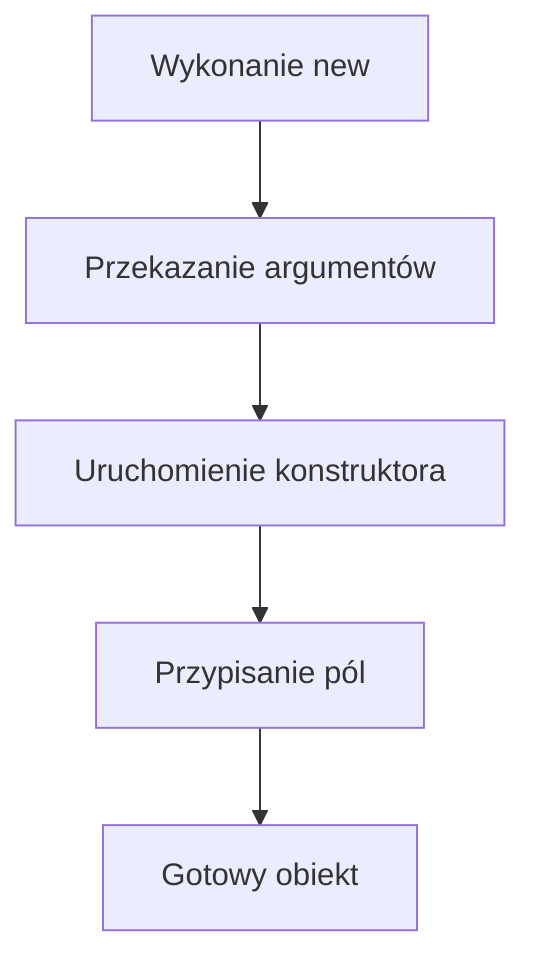

# Konstruktor

## Cel lekcji

Na tej lekcji nauczysz się przygotowywać obiekt podczas jego tworzenia. Poznasz konstruktor bez parametrów, konstruktor z parametrami oraz słowo `this`.

## Po lekcji potrafisz

- rozpoznać konstruktor w kodzie klasy,
- zdefiniować publiczny konstruktor bez parametrów,
- zdefiniować publiczny konstruktor z parametrami,
- przekazać argumenty podczas tworzenia obiektu,
- przypisać parametry konstruktora do pól,
- użyć słowa `this`,
- utworzyć kilka konstruktorów tej samej klasy,
- odróżnić konstruktor od zwykłej metody,
- wyjaśnić działanie konstruktora domyślnego.

## 1. Problem ręcznego przypisywania pól

W poprzednich lekcjach tworzyliśmy obiekt, a następnie osobno przypisywaliśmy wartości do jego pól.

```csharp
Uczen uczen1 = new Uczen();
uczen1.imie = "Anna";
uczen1.nazwisko = "Kowalska";
uczen1.klasa = "3TI";
```

Ten sposób działa, ale ma kilka wad:

- trzeba pamiętać o ustawieniu każdego potrzebnego pola,
- można zapomnieć o przypisaniu wartości,
- można rozpocząć pracę z nieprzygotowanym obiektem,
- kod tworzący obiekt staje się dłuższy.

Chcemy utworzyć obiekt i od razu przekazać jego początkowe dane:

```csharp
Uczen uczen1 = new Uczen("Anna", "Kowalska", "3TI");
```

Umożliwia to konstruktor.

## 2. Co to jest konstruktor

Konstruktor jest specjalnym elementem klasy, który przygotowuje obiekt podczas jego tworzenia.

Konstruktor:

- uruchamia się podczas użycia `new`,
- ma taką samą nazwę jak klasa,
- nie ma typu zwracanego,
- nie zapisujemy przed nim nawet `void`,
- może przyjmować parametry,
- może ustawiać początkowe wartości pól.

Ogólny zapis:

```csharp
class Uczen
{
    public Uczen()
    {
    }
}
```

Nazwa klasy to `Uczen` i nazwa konstruktora również musi brzmieć `Uczen`.

## 3. Pierwszy konstruktor bez parametrów

Konstruktor bez parametrów może nadać polom ustalone wartości początkowe.

```csharp
using System;

class Uczen
{
    public string imie;
    public string nazwisko;
    public string klasa;

    public Uczen()
    {
        imie = "Nieznane";
        nazwisko = "Nieznane";
        klasa = "Brak";
    }

    public void WyswietlDane()
    {
        Console.WriteLine("Imię: " + imie);
        Console.WriteLine("Nazwisko: " + nazwisko);
        Console.WriteLine("Klasa: " + klasa);
    }
}

class Program
{
    static void Main()
    {
        Uczen uczen1 = new Uczen();
        uczen1.WyswietlDane();
    }
}
```

Kolejność działania:

```text
new Uczen() => uruchomienie konstruktora => ustawienie pól => gotowy obiekt
```

Po zakończeniu konstruktora obiekt `uczen1` ma przygotowane wartości pól.

## 4. Konstruktor uruchamia się dla każdego obiektu

Każde użycie `new Uczen()` tworzy nowy obiekt i uruchamia jego konstruktor.

```csharp
using System;

class Uczen
{
    public string imie;

    public Uczen()
    {
        imie = "Nieznane";
        Console.WriteLine("Uruchomiono konstruktor klasy Uczen.");
    }
}

class Program
{
    static void Main()
    {
        Uczen uczen1 = new Uczen();
        Uczen uczen2 = new Uczen();

        Console.WriteLine(uczen1.imie);
        Console.WriteLine(uczen2.imie);
    }
}
```

Komunikat z konstruktora pojawi się dwa razy. Konstruktor wykona się osobno dla obiektu `uczen1` i osobno dla obiektu `uczen2`.

Każdy obiekt otrzymuje własne pola. Konstruktor nie tworzy wspólnych pól dla wszystkich obiektów.

## 5. Konstruktor z jednym parametrem

Parametr konstruktora pozwala przekazać wartość podczas tworzenia obiektu.

```csharp
using System;

class Produkt
{
    public string nazwa;

    public Produkt(string nazwaProduktu)
    {
        nazwa = nazwaProduktu;
    }

    public void WyswietlNazwe()
    {
        Console.WriteLine("Produkt: " + nazwa);
    }
}

class Program
{
    static void Main()
    {
        Produkt produkt1 = new Produkt("Monitor");
        Produkt produkt2 = new Produkt("Klawiatura");

        produkt1.WyswietlNazwe();
        produkt2.WyswietlNazwe();
    }
}
```

W tym przykładzie:

- `nazwa` jest polem obiektu,
- `nazwaProduktu` jest parametrem konstruktora,
- `"Monitor"` i `"Klawiatura"` są argumentami.

## 6. Konstruktor z kilkoma parametrami

Konstruktor może otrzymać kilka wartości potrzebnych do przygotowania obiektu.

```csharp
using System;

class Uczen
{
    public string imie;
    public string nazwisko;
    public string klasa;

    public Uczen(
        string imieUcznia,
        string nazwiskoUcznia,
        string nazwaKlasy
    )
    {
        imie = imieUcznia;
        nazwisko = nazwiskoUcznia;
        klasa = nazwaKlasy;
    }

    public void WyswietlDane()
    {
        Console.WriteLine($"{imie} {nazwisko}, klasa {klasa}");
    }
}

class Program
{
    static void Main()
    {
        Uczen uczen1 = new Uczen("Anna", "Kowalska", "3TI");
        Uczen uczen2 = new Uczen("Jan", "Nowak", "2TP");

        uczen1.WyswietlDane();
        uczen2.WyswietlDane();
    }
}
```

Każdy obiekt otrzymuje własny zestaw wartości przekazanych podczas jego tworzenia.

## 7. Elementy wywołania konstruktora

Przeanalizujmy zapis:

```csharp
Uczen uczen1 = new Uczen("Anna", "Kowalska", "3TI");
```

- Pierwsze `Uczen` określa typ zmiennej.
- `uczen1` jest zmienną przechowującą obiekt.
- `new` rozpoczyna tworzenie nowego obiektu.
- `Uczen("Anna", "Kowalska", "3TI")` wywołuje konstruktor klasy `Uczen`.
- Wartości w nawiasach są argumentami konstruktora.

Liczba, kolejność i typy argumentów muszą odpowiadać parametrom konstruktora.

Dla konstruktora:

```csharp
public Uczen(string imieUcznia, string nazwiskoUcznia, string nazwaKlasy)
```

poprawne wywołanie zawiera trzy napisy w tej samej kolejności.

## 8. Słowo this

Parametry mogą mieć takie same nazwy jak pola. Wtedy słowo `this` pozwala je rozróżnić.

```csharp
using System;

class Uczen
{
    public string imie;
    public string nazwisko;

    public Uczen(string imie, string nazwisko)
    {
        this.imie = imie;
        this.nazwisko = nazwisko;
    }

    public void WyswietlDane()
    {
        Console.WriteLine(this.imie + " " + this.nazwisko);
    }
}

class Program
{
    static void Main()
    {
        Uczen uczen1 = new Uczen("Ola", "Lis");
        uczen1.WyswietlDane();
    }
}
```

Instrukcja:

```csharp
this.imie = imie;
```

oznacza:

```text
pole imie aktualnego obiektu = parametr imie
```

- `this.imie` oznacza pole aktualnie tworzonego obiektu.
- `imie` oznacza parametr konstruktora.

Słowo `this` nie jest obowiązkowe w każdej instrukcji. W metodzie `WyswietlDane()` zapis `Console.WriteLine(imie);` również byłby poprawny, ponieważ nie występuje konflikt nazw.

## 9. Konstruktor i metody obiektu

Konstruktor przygotowuje obiekt. Metody wykonują późniejsze działania na utworzonym obiekcie.

```csharp
using System;

class Prostokat
{
    public double szerokosc;
    public double wysokosc;

    public Prostokat(double szerokosc, double wysokosc)
    {
        this.szerokosc = szerokosc;
        this.wysokosc = wysokosc;
    }

    public double ObliczPole()
    {
        return szerokosc * wysokosc;
    }

    public double ObliczObwod()
    {
        return 2 * szerokosc + 2 * wysokosc;
    }
}

class Program
{
    static void Main()
    {
        Prostokat prostokat1 = new Prostokat(5, 3);
        Prostokat prostokat2 = new Prostokat(8, 4);

        Console.WriteLine("Pole pierwszego: " + prostokat1.ObliczPole());
        Console.WriteLine("Obwód pierwszego: " + prostokat1.ObliczObwod());
        Console.WriteLine("Pole drugiego: " + prostokat2.ObliczPole());
        Console.WriteLine("Obwód drugiego: " + prostokat2.ObliczObwod());
    }
}
```

Konstruktor ustawia szerokość i wysokość. Metody korzystają później z pól właściwego prostokąta.

## 10. Konstruktor a zwykła metoda

Konstruktor:

- ma nazwę taką jak klasa,
- nie ma typu zwracanego,
- wykonuje się podczas `new`,
- przygotowuje obiekt,
- nie jest wywoływany przez istniejący obiekt.

Zwykła metoda:

- może mieć dowolną poprawną nazwę,
- ma typ wyniku albo `void`,
- jest wywoływana na istniejącym obiekcie,
- wykonuje czynność po utworzeniu obiektu,
- może być wywoływana wiele razy.

```csharp
Uczen uczen1 = new Uczen("Anna");
uczen1.PrzedstawSie();
```

```text
new Uczen("Anna") => konstruktor
uczen1.PrzedstawSie() => metoda obiektu
```

## 11. Konstruktor domyślny

We wcześniejszych lekcjach mogliśmy napisać:

```csharp
Uczen uczen1 = new Uczen();
```

mimo że w klasie nie zapisaliśmy własnego konstruktora.

Jeżeli klasa nie zawiera żadnego własnego konstruktora, kompilator udostępnia konstruktor bez parametrów. Nazywamy go konstruktorem domyślnym.

Taki konstruktor pozwala utworzyć obiekt, ale nie zawiera napisanych przez nas instrukcji ustawiających własne wartości. Pola otrzymują zwykłe wartości początkowe wynikające z ich typów.

Trzeba rozróżnić:

- konstruktor domyślny dostarczony automatycznie,
- własny konstruktor bez parametrów napisany przez programistę.

Oba pozwalają zastosować zapis `new Uczen()`, ale tylko we własnym konstruktorze możemy umieścić przygotowane przez nas instrukcje.

## 12. Własny konstruktor wyłącza automatyczny konstruktor bez parametrów

Jeżeli zdefiniujemy własny konstruktor, kompilator nie dodaje już automatycznie konstruktora bez parametrów.

```csharp
class Produkt
{
    public string nazwa;

    public Produkt(string nazwa)
    {
        this.nazwa = nazwa;
    }
}
```

Poprawnie:

```csharp
Produkt produkt1 = new Produkt("Monitor");
```

Niepoprawnie:

```csharp
Produkt produkt1 = new Produkt();
```

Klasa ma własny konstruktor wymagający jednego argumentu. Nie ma konstruktora bez parametrów, ponieważ kompilator nie dodał go automatycznie.

Jeżeli chcemy umożliwić oba sposoby tworzenia produktu, musimy samodzielnie zapisać oba konstruktory.

## 13. Kilka konstruktorów tej samej klasy

Klasa może mieć kilka publicznych konstruktorów. Mają taką samą nazwę, ale różnią się listą parametrów. Nazywamy to przeciążaniem konstruktorów.

```csharp
using System;

class Produkt
{
    public string nazwa;
    public double cena;

    public Produkt()
    {
        nazwa = "Nieznany produkt";
        cena = 0;
    }

    public Produkt(string nazwa)
    {
        this.nazwa = nazwa;
        cena = 0;
    }

    public Produkt(string nazwa, double cena)
    {
        this.nazwa = nazwa;
        this.cena = cena;
    }

    public void WyswietlDane()
    {
        Console.WriteLine($"{nazwa}, cena: {cena}");
    }
}

class Program
{
    static void Main()
    {
        Produkt produkt1 = new Produkt();
        Produkt produkt2 = new Produkt("Monitor");
        Produkt produkt3 = new Produkt("Klawiatura", 149.99);

        produkt1.WyswietlDane();
        produkt2.WyswietlDane();
        produkt3.WyswietlDane();
    }
}
```

Kompilator wybiera konstruktor pasujący do przekazanych argumentów:

- brak argumentów => konstruktor bez parametrów,
- jeden napis => konstruktor z jednym parametrem,
- napis i liczba => konstruktor z dwoma parametrami.

## 14. Prosta kontrola wartości w konstruktorze

Konstruktor może zawierać instrukcje warunkowe i przygotować poprawną wartość początkową.

```csharp
using System;

class Konto
{
    public string wlasciciel;
    public double saldo;

    public Konto(string wlasciciel, double saldoPoczatkowe)
    {
        this.wlasciciel = wlasciciel;

        if (saldoPoczatkowe >= 0)
        {
            saldo = saldoPoczatkowe;
        }
        else
        {
            saldo = 0;
        }
    }

    public void WyswietlDane()
    {
        Console.WriteLine("Właściciel: " + wlasciciel);
        Console.WriteLine("Saldo: " + saldo);
    }
}

class Program
{
    static void Main()
    {
        Konto konto1 = new Konto("Anna Kowalska", 500);
        Konto konto2 = new Konto("Jan Nowak", -100);

        konto1.WyswietlDane();
        konto2.WyswietlDane();
    }
}
```

Ujemne saldo początkowe zostaje zastąpione wartością `0`. Pola są jednak nadal publiczne i po utworzeniu obiektu można zmienić je bezpośrednio. Dokładniejszą kontrolę dostępu do danych poznamy w osobnej lekcji.

## 15. Nie każde pole musi być parametrem konstruktora

Niektóre pola mogą otrzymać stałą wartość początkową.

```csharp
using System;

class Samochod
{
    public string marka;
    public int rokProdukcji;
    public int predkosc;

    public Samochod(string marka, int rokProdukcji)
    {
        this.marka = marka;
        this.rokProdukcji = rokProdukcji;
        predkosc = 0;
    }

    public void Przyspiesz(int wartosc)
    {
        if (wartosc > 0)
        {
            predkosc += wartosc;
        }
    }

    public void WyswietlDane()
    {
        Console.WriteLine("Marka: " + marka);
        Console.WriteLine("Rok produkcji: " + rokProdukcji);
        Console.WriteLine("Prędkość: " + predkosc);
    }
}

class Program
{
    static void Main()
    {
        Samochod samochod1 = new Samochod("Toyota", 2022);

        samochod1.WyswietlDane();
        samochod1.Przyspiesz(50);
        samochod1.WyswietlDane();
    }
}
```

Marka i rok produkcji są przekazywane jako argumenty. Prędkość każdego nowego samochodu rozpoczyna się od `0`.

## 16. Kolejność wykonywania instrukcji

Poniższy program pokazuje moment uruchomienia konstruktora i metody obiektu.

```csharp
using System;

class Urzadzenie
{
    public string nazwa;

    public Urzadzenie(string nazwa)
    {
        Console.WriteLine("Uruchomiono konstruktor");
        this.nazwa = nazwa;
    }

    public void UruchomMetode()
    {
        Console.WriteLine("Uruchomiono metodę");
    }
}

class Program
{
    static void Main()
    {
        Console.WriteLine("Przed utworzeniem obiektu");

        Urzadzenie urzadzenie1 = new Urzadzenie("Drukarka");

        Console.WriteLine("Po utworzeniu obiektu");
        urzadzenie1.UruchomMetode();
    }
}
```

Wynik:

```text
Przed utworzeniem obiektu
Uruchomiono konstruktor
Po utworzeniu obiektu
Uruchomiono metodę
```

Konstruktor kończy działanie, zanim program przejdzie do instrukcji znajdującej się po utworzeniu obiektu.

## 17. Schemat tworzenia obiektu



## 18. Nazewnictwo

Nazwa konstruktora musi być identyczna z nazwą klasy. Wielkość liter ma znaczenie.

Poprawnie:

```csharp
class Uczen
{
    public Uczen(string imie, string nazwisko, string klasa)
    {
    }
}
```

Niepoprawnie:

```csharp
class Uczen
{
    public uczen(string a, string b, string c)
    {
    }
}
```

W niepoprawnym przykładzie nazwa `uczen` rozpoczyna się małą literą i nie jest identyczna z nazwą klasy `Uczen`. Parametry `a`, `b` i `c` mają także nieczytelne nazwy.

Stosujemy:

- PascalCase dla nazw klas,
- nazwę konstruktora identyczną z nazwą klasy,
- camelCase dla pól, parametrów i zmiennych,
- nazwy parametrów opisujące przekazywane dane.

## 19. Zestawienie konstruktorów i metod

| Element | Przykład | Kiedy się wykonuje | Typ zwracany | Zastosowanie |
| --- | --- | --- | --- | --- |
| Konstruktor domyślny | Automatyczne `Uczen()` | Podczas `new Uczen()` | Brak | Umożliwia utworzenie obiektu, gdy nie zapisano własnego konstruktora |
| Własny konstruktor bez parametrów | `public Uczen()` | Podczas `new Uczen()` | Brak | Ustawia własne wartości początkowe |
| Konstruktor z jednym parametrem | `public Uczen(string imie)` | Podczas `new Uczen("Anna")` | Brak | Otrzymuje jedną wartość początkową |
| Konstruktor z kilkoma parametrami | `public Uczen(string imie, string nazwisko)` | Podczas tworzenia obiektu z pasującymi argumentami | Brak | Otrzymuje kilka wartości początkowych |
| Kilka konstruktorów | `Uczen()`, `Uczen(string imie)` | Konstruktor jest wybierany według argumentów | Brak | Pozwala tworzyć obiekty na kilka sposobów |
| Metoda obiektu | `public void PrzedstawSie()` | Po wywołaniu przez istniejący obiekt | `void` albo określony typ | Wykonuje działanie obiektu |
| `this.pole` | `this.imie = imie;` | Podczas wykonywania konstruktora lub metody | Nie dotyczy | Wskazuje pole aktualnego obiektu |

## 20. Typowe błędy

### Dodanie void do konstruktora

Niepoprawnie:

```csharp
public void Uczen()
{
}
```

Taki zapis jest błędny i program się nie skompiluje. Element mający nazwę identyczną z nazwą klasy może być konstruktorem, dlatego nie zapisujemy przed nim `void` ani innego typu zwracanego.

Poprawnie:

```csharp
public Uczen()
{
}
```

### Inny typ zwracany

Konstruktor nie może mieć typu `string`, `int`, `bool` ani żadnego innego typu zwracanego.

### Nazwa inna niż nazwa klasy

Dla klasy `Produkt` konstruktor musi nazywać się `Produkt`. Wielkość liter również musi być zgodna.

### Konstruktor poza klasą

Konstruktor zapisujemy wewnątrz klasy, której obiekty ma przygotowywać.

### Wywołanie konstruktora jak metody

Konstruktora nie wywołujemy przez istniejący obiekt:

```csharp
produkt1.Produkt();
```

Konstruktor wykonuje się podczas tworzenia obiektu przez `new`.

### Brak konstruktora bez parametrów

Jeżeli klasa ma tylko konstruktor `Produkt(string nazwa)`, zapis `new Produkt()` jest niepoprawny.

### Niepoprawna liczba argumentów

Wywołanie musi zawierać tyle argumentów, ile parametrów wymaga wybrany konstruktor.

### Niewłaściwa kolejność argumentów

Dla konstruktora przyjmującego imię, nazwisko i klasę argumenty trzeba przekazać w tej samej kolejności.

### Niezgodny typ argumentu

Jeżeli parametr ma typ `int`, trzeba przekazać zgodną wartość liczbową, a nie dowolny napis.

### Przypisanie parametru do niego samego

Niepoprawnie:

```csharp
imie = imie;
```

Obie nazwy wskazują wtedy parametr. Pole nie otrzyma przekazanej wartości.

Poprawnie:

```csharp
this.imie = imie;
```

### Błędne rozumienie this

`this` oznacza aktualny obiekt, a nie całą klasę.

### Oczekiwanie ponownego wykonania konstruktora

Konstruktor wykonuje się podczas tworzenia obiektu. Wywołanie zwykłej metody nie uruchamia ponownie konstruktora.

### Założenie, że konstruktor bez parametrów pozostaje automatycznie

Po zapisaniu własnego konstruktora kompilator nie dodaje automatycznie konstruktora bez parametrów.

### Zwracanie wartości

Konstruktor nie zwraca wartości za pomocą `return wartosc;`.

### Brak new

Obiekt tworzymy za pomocą słowa `new` i wywołania odpowiedniego konstruktora.

## 21. Zapamiętaj

- Konstruktor przygotowuje obiekt.
- Konstruktor wykonuje się podczas użycia `new`.
- Konstruktor ma taką samą nazwę jak klasa.
- Konstruktor nie ma typu zwracanego.
- Konstruktor może przyjmować parametry.
- Argumenty przekazujemy podczas tworzenia obiektu.
- `this` oznacza aktualny obiekt.
- `this.pole` pozwala odróżnić pole od parametru o tej samej nazwie.
- Jeżeli klasa nie ma własnego konstruktora, kompilator udostępnia konstruktor domyślny.
- Zdefiniowanie własnego konstruktora wyłącza automatyczne dodanie konstruktora bez parametrów.
- Klasa może mieć kilka konstruktorów różniących się parametrami.
- Konstruktor i zwykła metoda pełnią inne role.

## 22. Ćwiczenia

1. Utwórz publiczny konstruktor bez parametrów ustawiający początkowe wartości pól ucznia.
2. Utwórz konstruktor ustawiający imię ucznia.
3. Utwórz konstruktor ustawiający imię i nazwisko.
4. Utwórz konstruktor ustawiający wszystkie pola ucznia.
5. Utwórz dwóch uczniów z różnymi argumentami konstruktora.
6. Utwórz konstruktor klasy `Produkt` ustawiający nazwę.
7. Utwórz konstruktor klasy `Produkt` ustawiający nazwę i cenę.
8. Utwórz konstruktor klasy `Ksiazka` ustawiający tytuł i autora.
9. Utwórz konstruktor klasy `Samochod` ustawiający markę i rok produkcji.
10. Utwórz konstruktor klasy `Punkt` ustawiający współrzędne.
11. Utwórz konstruktor klasy `Prostokat` ustawiający szerokość i wysokość.
12. Zastosuj `this` dla pól i parametrów o tych samych nazwach.
13. Wyjaśnij własnymi słowami instrukcję `this.imie = imie;`.
14. Utwórz konstruktor klasy `Konto`, który nie pozwala ustawić ujemnego salda początkowego.
15. Utwórz konstruktor klasy `Temperatura` ustawiający wartość początkową.
16. Utwórz konstruktor ustawiający jedno pole na podstawie argumentu, a drugie na stałą wartość.
17. Utwórz klasę zawierającą konstruktor i metodę wyświetlającą dane.
18. Utwórz klasę zawierającą konstruktor oraz metodę wykonującą obliczenie.
19. Dodaj do jednej klasy konstruktor bez parametrów i konstruktor z jednym parametrem.
20. Utwórz klasę z trzema konstruktorami różniącymi się parametrami.
21. Dla kilku wywołań `new` wskaż konstruktor wybrany przez kompilator.
22. Popraw konstruktor błędnie zadeklarowany jako `void`.
23. Popraw błędną nazwę konstruktora.
24. Popraw wywołanie zawierające niewłaściwą liczbę argumentów.
25. Popraw wywołanie zawierające argumenty w niewłaściwej kolejności.
26. Popraw przypisanie `imie = imie;` tak, aby pole otrzymało wartość parametru.
27. Wyjaśnij, dlaczego `new Produkt()` nie działa, gdy klasa zawiera wyłącznie konstruktor z parametrem.
28. Dodaj własny konstruktor bez parametrów do klasy mającej konstruktor z parametrami.
29. Napisz program pokazujący komunikaty przed, podczas i po utworzeniu obiektu.
30. Utwórz klasę `Postac` z konstruktorem ustawiającym nazwę i początkowe punkty życia.
31. Utwórz klasę `Towar` z konstruktorem ustawiającym nazwę, cenę i liczbę sztuk.
32. Utwórz klasę `Zadanie` z konstruktorem przyjmującym opis oraz drugim konstruktorem przyjmującym opis i liczbę punktów.

## Podsumowanie

Konstruktor przygotowuje obiekt podczas jego tworzenia. Może ustawiać wartości pól na podstawie argumentów, kontrolować dane początkowe i zapewniać kilka sposobów tworzenia obiektów. Słowo `this` wskazuje aktualny obiekt i pozwala odróżnić pole od parametru o tej samej nazwie.
