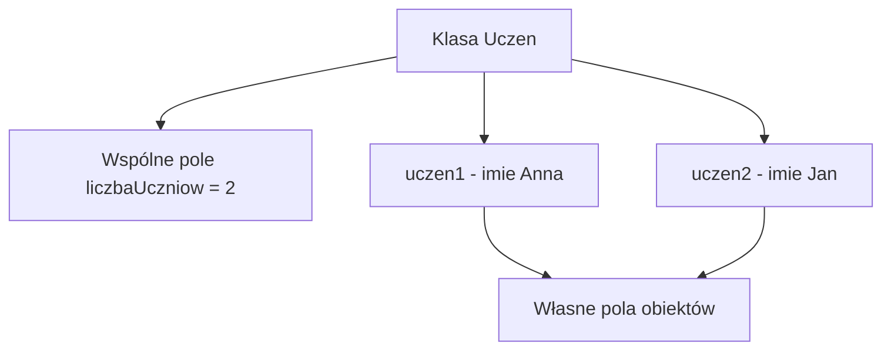

# Pola obiektu i pola static

## Cel lekcji

Na tej lekcji poznasz różnicę między polem należącym do konkretnego obiektu a polem `static` należącym do klasy. Nauczysz się przechowywać jedną wartość wspólną dla wszystkich obiektów oraz tworzyć liczniki obiektów.

## Po lekcji potrafisz

- rozpoznać pole obiektu i pole `static`,
- zdefiniować publiczne pole `static`,
- odczytać i zmienić pole `static` przez nazwę klasy,
- wyjaśnić, dlaczego pole statyczne ma jedną wspólną wartość,
- zwiększyć licznik w konstruktorze,
- nadać obiektom kolejne numery,
- wskazać dane należące do obiektu i dane wspólne dla klasy.

## 1. Przypomnienie zwykłego pola obiektu

Zwykłe pole należy do konkretnego obiektu. Każdy obiekt ma własną wartość takiego pola.

```csharp
using System;

class Uczen
{
    public string imie;

    public Uczen(string imie)
    {
        this.imie = imie;
    }
}

class Program
{
    static void Main()
    {
        Uczen uczen1 = new Uczen("Anna");
        Uczen uczen2 = new Uczen("Jan");

        Console.WriteLine(uczen1.imie);
        Console.WriteLine(uczen2.imie);

        uczen1.imie = "Ola";

        Console.WriteLine(uczen1.imie);
        Console.WriteLine(uczen2.imie);
    }
}
```

Zmiana pola `imie` obiektu `uczen1` nie zmienia pola obiektu `uczen2`.

```text
pole obiektu => osobna wartość dla każdego obiektu
```

## 2. Problem wspólnej informacji

Załóżmy, że każdy uczeń należy do tej samej szkoły. Moglibyśmy umieścić w klasie zwykłe pole:

```csharp
public string nazwaSzkoly;
```

Takie rozwiązanie oznaczałoby, że:

- każdy obiekt ma własną kopię nazwy szkoły,
- tę samą wartość trzeba przypisać wielu obiektom,
- zmianę nazwy trzeba wykonać osobno w każdym obiekcie.

Nazwa szkoły jest informacją dotyczącą całej klasy `Uczen`. W takiej sytuacji możemy zastosować pole `static`.

## 3. Pierwsze pole static

Pole `nazwaSzkoly` należy do klasy `Uczen`. Pole `imie` należy do konkretnego obiektu.

```csharp
using System;

class Uczen
{
    public string imie;
    public static string nazwaSzkoly = "Technikum nr 1";

    public Uczen(string imie)
    {
        this.imie = imie;
    }
}

class Program
{
    static void Main()
    {
        Uczen uczen1 = new Uczen("Anna");
        Uczen uczen2 = new Uczen("Jan");

        Console.WriteLine("Uczeń: " + uczen1.imie);
        Console.WriteLine("Uczeń: " + uczen2.imie);
        Console.WriteLine("Szkoła: " + Uczen.nazwaSzkoly);
    }
}
```

W tym przykładzie:

- `imie` jest polem obiektu,
- `nazwaSzkoly` jest polem klasy,
- każdy uczeń ma własne imię,
- wszystkie obiekty klasy `Uczen` korzystają z jednej wartości `nazwaSzkoly`.

## 4. Dostęp przez nazwę klasy

Do pola statycznego odwołujemy się przez nazwę klasy:

```csharp
Uczen.nazwaSzkoly
```

- `Uczen` jest nazwą klasy.
- Kropka wybiera element należący do klasy.
- `nazwaSzkoly` jest polem `static`.
- Do odczytania pola nie jest potrzebny obiekt.

Pole można odczytać przed utworzeniem pierwszego ucznia.

```csharp
using System;

class Uczen
{
    public string imie;
    public static string nazwaSzkoly = "Technikum nr 1";

    public Uczen(string imie)
    {
        this.imie = imie;
    }
}

class Program
{
    static void Main()
    {
        Console.WriteLine(Uczen.nazwaSzkoly);

        Uczen uczen1 = new Uczen("Anna");
        Console.WriteLine(uczen1.imie);
    }
}
```

Nie trzeba tworzyć obiektu tylko po to, aby odczytać pole należące do klasy.

## 5. Pole static nie należy do obiektu

Niepoprawny zapis:

```csharp
uczen1.nazwaSzkoly
```

W C# takie odwołanie powoduje błąd kompilacji. Pole `nazwaSzkoly` nie należy do obiektu `uczen1`, lecz do klasy `Uczen`.

Poprawny zapis:

```csharp
Uczen.nazwaSzkoly
```

Zwykłe pole odczytujemy przez obiekt:

```csharp
uczen1.imie
```

Pole statyczne odczytujemy przez klasę:

```csharp
Uczen.nazwaSzkoly
```

## 6. Jedna wspólna wartość

Zmiana pola statycznego zmienia jedną wartość wspólną dla całej klasy.

```csharp
using System;

class Uczen
{
    public string imie;
    public static string nazwaSzkoly = "Technikum nr 1";

    public Uczen(string imie)
    {
        this.imie = imie;
    }
}

class Program
{
    static void Main()
    {
        Console.WriteLine("Początkowa szkoła: " + Uczen.nazwaSzkoly);

        Uczen uczen1 = new Uczen("Anna");
        Uczen uczen2 = new Uczen("Jan");

        Uczen.nazwaSzkoly = "Zespół Szkół Technicznych";

        Console.WriteLine(uczen1.imie + " - " + Uczen.nazwaSzkoly);
        Console.WriteLine(uczen2.imie + " - " + Uczen.nazwaSzkoly);
    }
}
```

Nie powstała osobna nazwa szkoły dla każdego ucznia. Zmieniliśmy jedno pole klasy. Każdy kod odczytujący `Uczen.nazwaSzkoly` zobaczy nową wartość.

## 7. Pole static typu int

Pole statyczne może mieć typ `int`.

```csharp
public static int liczbaUczniow = 0;
```

Istnieje jeden licznik dla całej klasy. Wartość odczytujemy przez:

```csharp
Uczen.liczbaUczniow
```

Gdyby licznik był zwykłym polem obiektu, każdy uczeń miałby osobny licznik. Nie uzyskalibyśmy jednej łącznej liczby.

## 8. Licznik utworzonych obiektów

Konstruktor może zwiększać wspólne pole klasy przy każdym utworzeniu obiektu.

```csharp
using System;

class Uczen
{
    public string imie;
    public static int liczbaUczniow = 0;

    public Uczen(string imie)
    {
        this.imie = imie;
        Uczen.liczbaUczniow++;
    }
}

class Program
{
    static void Main()
    {
        Console.WriteLine("Licznik: " + Uczen.liczbaUczniow);

        Uczen uczen1 = new Uczen("Anna");
        Console.WriteLine("Licznik: " + Uczen.liczbaUczniow);

        Uczen uczen2 = new Uczen("Jan");
        Console.WriteLine("Licznik: " + Uczen.liczbaUczniow);

        Uczen uczen3 = new Uczen("Ola");
        Console.WriteLine("Licznik: " + Uczen.liczbaUczniow);
    }
}
```

Zmiany licznika:

```text
początek => 0
pierwsze new Uczen("Anna") => 1
drugie new Uczen("Jan") => 2
trzecie new Uczen("Ola") => 3
```

Każde wywołanie konstruktora zwiększa tę samą wartość `Uczen.liczbaUczniow`.

## 9. Co dokładnie liczy licznik

Pole zwiększane w konstruktorze liczy wykonania konstruktora. W tym przykładzie odpowiada to liczbie utworzonych obiektów.

Trzeba pamiętać:

- licznik nie sprawdza, ile obiektów jest obecnie używanych,
- zakończenie zakresu zmiennej nie zmniejsza licznika,
- ponowne przypisanie zmiennej nie cofa wcześniejszego zwiększenia,
- ponowne uruchomienie programu rozpoczyna działanie od wartości początkowej zapisanej w kodzie.

Dokładniejsza nazwa pola mogłaby brzmieć `liczbaUtworzonychUczniow`.

## 10. Pole obiektu i pole static w jednej klasie

Każdy produkt ma własną cenę. Stawka VAT jest w tym przykładzie wspólna dla wszystkich produktów.

```csharp
using System;

class Produkt
{
    public string nazwa;
    public double cena;
    public static double stawkaVat = 0.23;

    public Produkt(string nazwa, double cena)
    {
        this.nazwa = nazwa;
        this.cena = cena;
    }

    public double ObliczCeneBrutto()
    {
        return cena * (1 + Produkt.stawkaVat);
    }
}

class Program
{
    static void Main()
    {
        Produkt produkt1 = new Produkt("Monitor", 1000);
        Produkt produkt2 = new Produkt("Klawiatura", 200);

        Console.WriteLine(produkt1.ObliczCeneBrutto());
        Console.WriteLine(produkt2.ObliczCeneBrutto());

        Produkt.stawkaVat = 0.20;

        Console.WriteLine(produkt1.ObliczCeneBrutto());
        Console.WriteLine(produkt2.ObliczCeneBrutto());
    }
}
```

Każdy produkt ma własne pola `nazwa` i `cena`. Wszystkie produkty korzystają z jednej wartości `Produkt.stawkaVat`. Jej zmiana wpływa na wyniki metod obu produktów.

Przykład służy do nauki działania pola `static`, a nie do projektowania systemu księgowego.

## 11. Pole static dostępne w konstruktorze

Konstruktor może odczytać wspólne pole statyczne i je zmienić.

```csharp
using System;

class Bilet
{
    public int numer;
    public string wlasciciel;
    public static int nastepnyNumer = 1;

    public Bilet(string wlasciciel)
    {
        this.wlasciciel = wlasciciel;
        numer = Bilet.nastepnyNumer;
        Bilet.nastepnyNumer++;
    }

    public void WyswietlDane()
    {
        Console.WriteLine($"Bilet {numer}, właściciel: {wlasciciel}");
    }
}

class Program
{
    static void Main()
    {
        Bilet bilet1 = new Bilet("Anna");
        Bilet bilet2 = new Bilet("Jan");
        Bilet bilet3 = new Bilet("Ola");

        bilet1.WyswietlDane();
        bilet2.WyswietlDane();
        bilet3.WyswietlDane();

        Console.WriteLine("Następny numer: " + Bilet.nastepnyNumer);
    }
}
```

W tym przykładzie:

- `numer` jest osobnym polem każdego biletu,
- `nastepnyNumer` jest wspólnym polem klasy,
- konstruktor odczytuje wspólną wartość,
- przypisuje ją do nowego biletu,
- zwiększa wartość przeznaczoną dla następnego biletu.

## 12. Licznik obiektów i następny numer

Pola statyczne mogą mieć różne zastosowania.

```csharp
public static int liczbaObiektow = 0;
public static int nastepnyNumer = 1;
```

- `liczbaObiektow` może liczyć wykonania konstruktora.
- `nastepnyNumer` może dostarczać kolejne numery.
- Nazwa pola powinna dokładnie opisywać jego przeznaczenie.
- Samo słowo `static` nie nadaje polu znaczenia.
- Znaczenie wynika z kodu, który odczytuje i zmienia pole.

## 13. Osobny stan graczy i wspólna nazwa gry

Punkty należą do gracza. Nazwa gry jest wspólna dla całej klasy.

```csharp
using System;

class Gracz
{
    public string nazwa;
    public int punkty;
    public static string nazwaGry = "Quiz C#";

    public Gracz(string nazwa, int punkty)
    {
        this.nazwa = nazwa;
        this.punkty = punkty;
    }

    public void WyswietlDane()
    {
        Console.WriteLine($"{nazwa}: {punkty} pkt, gra: {Gracz.nazwaGry}");
    }
}

class Program
{
    static void Main()
    {
        Gracz gracz1 = new Gracz("Anna", 10);
        Gracz gracz2 = new Gracz("Jan", 25);

        gracz1.WyswietlDane();
        gracz2.WyswietlDane();

        Gracz.nazwaGry = "Turniej C#";

        gracz1.WyswietlDane();
        gracz2.WyswietlDane();
    }
}
```

Zmiana punktów jednego gracza nie zmienia punktów drugiego. Zmiana `Gracz.nazwaGry` jest widoczna podczas wyświetlania obu graczy.

## 14. Różne klasy mają osobne pola static

Pole statyczne zawsze należy do określonej klasy.

```csharp
using System;

class Uczen
{
    public string imie;
    public static int liczbaObiektow = 0;

    public Uczen(string imie)
    {
        this.imie = imie;
        Uczen.liczbaObiektow++;
    }
}

class Nauczyciel
{
    public string imie;
    public static int liczbaObiektow = 0;

    public Nauczyciel(string imie)
    {
        this.imie = imie;
        Nauczyciel.liczbaObiektow++;
    }
}

class Program
{
    static void Main()
    {
        Uczen uczen1 = new Uczen("Anna");
        Uczen uczen2 = new Uczen("Jan");
        Uczen uczen3 = new Uczen("Ola");

        Nauczyciel nauczyciel1 = new Nauczyciel("Ewa");
        Nauczyciel nauczyciel2 = new Nauczyciel("Piotr");

        Console.WriteLine("Uczniowie: " + Uczen.liczbaObiektow);
        Console.WriteLine("Nauczyciele: " + Nauczyciel.liczbaObiektow);
    }
}
```

`Uczen.liczbaObiektow` i `Nauczyciel.liczbaObiektow` są dwoma różnymi polami. Jednakowa nazwa nie łączy pól należących do różnych klas.

## 15. Kiedy pole static ma sens

Pole statyczne ma sens, gdy informacja jest wspólna dla całej klasy.

Przykładowe zastosowania:

- licznik utworzonych obiektów,
- wspólna nazwa organizacji,
- wspólna stawka używana przez wszystkie obiekty,
- numer przeznaczony dla następnego tworzonego obiektu,
- nazwa aplikacji lub gry wspólna dla wszystkich obiektów.

Nie wybieramy `static` tylko dlatego, że chcemy łatwo odczytać wartość. Pole powinno rzeczywiście opisywać dane wspólne dla całej klasy.

## 16. Kiedy static jest błędem

Imię opisuje konkretnego ucznia. Nie powinno być wspólnym polem klasy.

Błędny pomysł:

```csharp
public static string imie;
```

Takie pole przechowywałoby tylko jedno wspólne imię. Ustawienie imienia drugiego ucznia zastąpiłoby wcześniejszą wartość.

Poprawna wersja:

```csharp
using System;

class Uczen
{
    public string imie;

    public Uczen(string imie)
    {
        this.imie = imie;
    }
}

class Program
{
    static void Main()
    {
        Uczen uczen1 = new Uczen("Anna");
        Uczen uczen2 = new Uczen("Jan");

        Console.WriteLine(uczen1.imie);
        Console.WriteLine(uczen2.imie);
    }
}
```

Każdy obiekt zachowuje własne imię.

## 17. Pole static nie wymaga obiektu

Pole statyczne można odczytać i zmienić bez tworzenia obiektu danej klasy.

```csharp
using System;

class Ustawienia
{
    public static string jezyk = "pl";
}

class Program
{
    static void Main()
    {
        Console.WriteLine(Ustawienia.jezyk);

        Ustawienia.jezyk = "en";

        Console.WriteLine(Ustawienia.jezyk);
    }
}
```

Pole `jezyk` należy do klasy `Ustawienia`. Nie trzeba wykonywać `new Ustawienia()`. Nie oznacza to, że cała klasa musi być statyczna.

## 18. Wartość podczas działania programu

Pole statyczne istnieje jako jedna wartość związana z klasą.

- Kolejne obiekty korzystają z tej samej wartości.
- Zmiana pozostaje widoczna podczas dalszego działania programu.
- Ponowne uruchomienie programu rozpoczyna pracę od wartości początkowej zapisanej w kodzie.

Pole statyczne nie zapisuje automatycznie wartości na dysku. Po zakończeniu i ponownym uruchomieniu programu kod wykonuje się od początku.

## 19. Pole static a static Main

Porównajmy dwa zapisy:

```csharp
public static int liczbaUczniow;
```

```csharp
static void Main()
```

Słowo `static` w obu przypadkach oznacza przynależność do klasy, a nie do konkretnego obiektu.

- Pole `liczbaUczniow` przechowuje wspólną wartość klasy `Uczen`.
- Metoda `Main()` należy do klasy `Program`.

W tej lekcji szczegółowo omawiamy pola `static`. Pozostałe zastosowania słowa `static` wymagają osobnego omówienia.

## 20. Schemat pól obiektu i pola static



Obiekty mają osobne wartości pola `imie`. Pole `liczbaUczniow` ma jedną wartość związaną z klasą `Uczen`.

## 21. Porównanie pól

| Cecha | Pole obiektu | Pole `static` |
| --- | --- | --- |
| Do czego należy | Do konkretnego obiektu | Do klasy |
| Liczba wartości | Osobna wartość dla każdego obiektu | Jedna wspólna wartość |
| Deklaracja | `public string imie;` | `public static int liczbaUczniow;` |
| Dostęp | `uczen1.imie` | `Uczen.liczbaUczniow` |
| Czy wymaga obiektu | Tak | Nie |
| Wpływ zmiany | Dotyczy wybranego obiektu | Jest widoczny dla całej klasy |
| Przykład zastosowania | Imię, cena, saldo, punkty | Licznik, wspólna nazwa, następny numer |

## 22. Przykładowe zapisy

| Zapis | Znaczenie | Poprawny sposób użycia |
| --- | --- | --- |
| `uczen1.imie` | Imię pierwszego ucznia | Przez obiekt `uczen1` |
| `uczen2.imie` | Imię drugiego ucznia | Przez obiekt `uczen2` |
| `Uczen.liczbaUczniow` | Wspólny licznik uczniów | Przez klasę `Uczen` |
| `Uczen.nazwaSzkoly` | Wspólna nazwa szkoły | Przez klasę `Uczen` |
| `Produkt.stawkaVat` | Wspólna stawka produktów | Przez klasę `Produkt` |
| `Bilet.nastepnyNumer` | Numer dla następnego biletu | Przez klasę `Bilet` |

## 23. Typowe błędy

### Imię oznaczone jako static

Imię powinno być zwykłym polem obiektu. W przeciwnym razie wszyscy uczniowie korzystaliby z jednej wspólnej wartości.

### Osobna kopia pola statycznego dla każdego obiektu

Pole `static` ma jedną wartość dla klasy. Obiekty nie otrzymują osobnych kopii tego pola.

### Dostęp przez obiekt

Niepoprawnie:

```csharp
uczen1.liczbaUczniow
```

Poprawnie:

```csharp
Uczen.liczbaUczniow
```

### Pominięcie nazwy klasy

Poza klasą `Uczen` trzeba wskazać klasę:

```csharp
Console.WriteLine(Uczen.liczbaUczniow);
```

### Użycie this z polem static

Pole statyczne nie należy do aktualnego obiektu. Stosujemy nazwę klasy:

```csharp
Uczen.liczbaUczniow++;
```

### Licznik jako pole obiektu

Jeżeli każdy obiekt ma osobny licznik, nie otrzymamy jednej łącznej liczby. Wspólny licznik musi być polem `static`.

### Zerowanie przy nowym obiekcie

Utworzenie kolejnego obiektu nie zeruje pola statycznego. Konstruktor może zwiększyć dotychczasową wspólną wartość.

### Automatyczne zmniejszanie licznika

Licznik zwiększany w konstruktorze nie zmniejsza się automatycznie, gdy zmienna przestaje być używana.

### Jednakowe nazwy w różnych klasach

`Uczen.liczbaObiektow` i `Nauczyciel.liczbaObiektow` są osobnymi polami.

### Niepotrzebne tworzenie obiektu

Do odczytania pola statycznego nie trzeba tworzyć obiektu. Używamy nazwy klasy.

### Wszystkie pola oznaczone jako static

Większość danych opisujących konkretny obiekt powinna być przechowywana w zwykłych polach. `static` stosujemy tylko dla wartości wspólnych.

### Pomylenie pola z lokalną zmienną

Zmienna zadeklarowana w `Main()` istnieje lokalnie w tej metodzie. Pole statyczne jest elementem określonej klasy.

## 24. Zapamiętaj

- Zwykłe pole należy do obiektu.
- Każdy obiekt ma własną wartość zwykłego pola.
- Pole `static` należy do klasy.
- Istnieje jedna wspólna wartość pola `static`.
- Do pola statycznego odwołujemy się przez nazwę klasy.
- Pole statyczne może być używane bez tworzenia obiektu.
- Konstruktor może odczytywać i zmieniać pole statyczne.
- Licznik zwiększany w konstruktorze liczy wykonania konstruktora.
- Zmiana wspólnego pola jest widoczna dla całej klasy.
- Pola statyczne o takich samych nazwach w różnych klasach są osobnymi polami.
- `static` stosujemy tylko do danych rzeczywiście wspólnych.

## 25. Ćwiczenia

1. Wskaż w podanym kodzie zwykłe pola obiektu.
2. Utwórz dwa obiekty z różnymi wartościami zwykłych pól.
3. Dodaj do klasy `Uczen` wspólną nazwę szkoły jako pole `static`.
4. Odczytaj pole statyczne przez nazwę klasy.
5. Zmień wspólną wartość pola statycznego.
6. Pokaż, że zmiana pola jednego obiektu nie zmienia drugiego obiektu.
7. Pokaż, że zmiana pola statycznego jest widoczna dla całej klasy.
8. Dodaj licznik utworzonych uczniów.
9. Dodaj licznik utworzonych produktów.
10. Dodaj licznik utworzonych samochodów.
11. Zwiększaj wspólny licznik w konstruktorze.
12. Wyświetl licznik przed i po utworzeniu kilku obiektów.
13. Nadaj kolejne numery tworzonym biletom.
14. Nadaj kolejne numery zamówieniom.
15. Nadaj kolejne identyfikatory obiektom klasy `Zadanie`.
16. Dodaj wspólną nazwę aplikacji.
17. Dodaj wspólną nazwę gry dla wszystkich graczy.
18. Dodaj wspólną stawkę wykorzystywaną przez produkty.
19. Zmień wspólną stawkę i ponownie oblicz wyniki produktów.
20. Wyjaśnij różnicę między polem `cena` i polem `stawkaVat`.
21. Popraw błędną klasę, w której pole `imie` oznaczono jako `static`.
22. Popraw kod odwołujący się do pola statycznego przez obiekt.
23. Wyjaśnij różnicę między `uczen1.imie` i `Uczen.liczbaUczniow`.
24. Utwórz osobne liczniki dla dwóch różnych klas.
25. Sprawdź, czy liczniki dwóch klas działają niezależnie.
26. Utwórz klasę `Postac` z osobnymi punktami życia i wspólną nazwą gry.
27. Utwórz klasę `Konto` z osobnym saldem i wspólną nazwą banku.
28. Utwórz klasę `Towar` z osobną ceną i wspólną stawką podatku.
29. Wyświetl pole statyczne bez tworzenia obiektu danej klasy.
30. Dla podanej listy danych wskaż, które powinny należeć do obiektu, a które mogą należeć do klasy.
31. Przeanalizuj program, w którym wszystkie pola oznaczono jako `static`, i wskaż błędy projektu.
32. Przygotuj własny przykład wykorzystujący licznik obiektów oraz wspólną informację tekstową.

## Podsumowanie

Zwykłe pole przechowuje osobną wartość dla konkretnego obiektu. Pole `static` przechowuje jedną wartość wspólną dla całej klasy. Dostęp do pola statycznego uzyskujemy przez nazwę klasy. Konstruktor może zmieniać wspólne pole, dzięki czemu można liczyć tworzone obiekty lub nadawać im kolejne numery.
