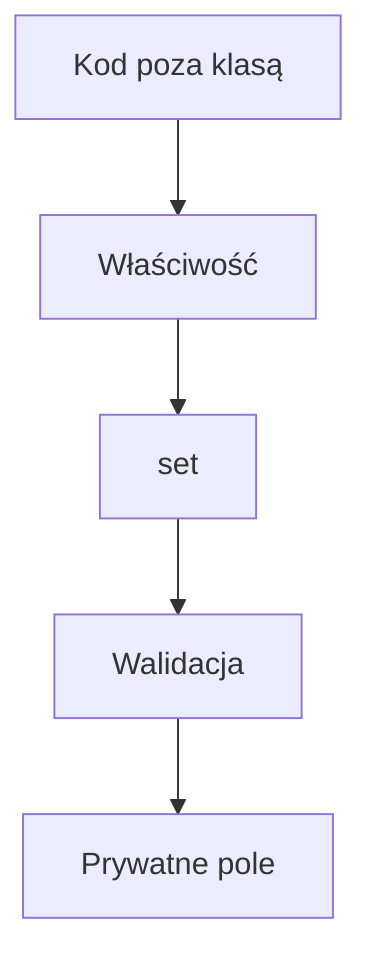
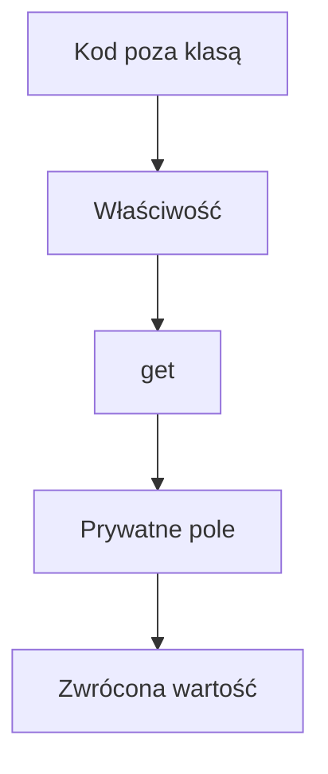

# Pola prywatne oraz właściwości get i set

## Cel lekcji

Na tej lekcji poznasz pola prywatne oraz właściwości. Dowiesz się, jak kontrolować odczyt i zmianę danych obiektu za pomocą `get` i `set`. Zobaczysz także, czym jest specjalne słowo `value` i jak wykorzystać właściwość do sprawdzania poprawności danych.

## Po lekcji potrafisz

- wyjaśnić różnicę między polem publicznym i prywatnym,
- utworzyć pełną właściwość korzystającą z prywatnego pola,
- wyjaśnić działanie `get`, `set` i `value`,
- kontrolować wartości przypisywane do obiektu,
- utworzyć właściwość tylko do odczytu,
- zastosować właściwość w konstruktorze,
- utworzyć właściwość automatyczną,
- zdecydować, kiedy użyć właściwości, a kiedy metody.

## 1. Przypomnienie pola publicznego

W poprzednich lekcjach pola klasy były publiczne. Dzięki temu mogliśmy korzystać z nich bezpośrednio poza klasą.

```csharp
using System;

class Uczen
{
    public string imie;
    public int wiek;
}

class Program
{
    static void Main()
    {
        Uczen uczen = new Uczen();

        uczen.imie = "Anna";
        uczen.wiek = 17;

        Console.WriteLine(uczen.imie);
        Console.WriteLine(uczen.wiek);
    }
}
```

Słowo `public` oznacza, że do pola można uzyskać dostęp także z kodu znajdującego się poza klasą `Uczen`.

```text
uczen.wiek = 17;              => zapis do publicznego pola
Console.WriteLine(uczen.wiek); => odczyt publicznego pola
```

## 2. Problem z publicznym polem

Publiczne pole pozwala zapisać dowolną wartość zgodną z jego typem. Typ `int` dopuszcza liczby ujemne, więc poniższa instrukcja jest poprawna dla kompilatora:

```csharp
uczen.wiek = -200;
```

Liczba `-200` jest wartością typu `int`, ale nie jest poprawnym wiekiem ucznia. Klasa nie kontroluje bezpośredniego przypisania do publicznego pola.

```csharp
using System;

class Uczen
{
    public int wiek;
}

class Program
{
    static void Main()
    {
        Uczen uczen = new Uczen();

        uczen.wiek = -200;

        Console.WriteLine("Wiek: " + uczen.wiek);
    }
}
```

Program się skompiluje i wyświetli niepoprawny wiek. Potrzebujemy sposobu, który pozwoli klasie kontrolować dostęp do jej danych.

## 3. Pole private

Pole można oznaczyć słowem `private`:

```csharp
private int wiek;
```

`private` oznacza, że z pola można korzystać bezpośrednio tylko wewnątrz klasy, w której zostało zadeklarowane.

- Metody klasy `Uczen` mogą korzystać z pola `wiek`.
- Konstruktor klasy `Uczen` może korzystać z pola `wiek`.
- Właściwości klasy `Uczen` mogą korzystać z pola `wiek`.
- Kod w metodzie `Main()` nie może odwołać się bezpośrednio do pola `wiek`.

Obiekt nadal ma to pole i przechowuje w nim wartość. Pole nie znika. Zostaje jedynie ukryte przed bezpośrednim dostępem z zewnątrz klasy.

Poniższy program się nie skompiluje:

```csharp
using System;

class Uczen
{
    private int wiek;
}

class Program
{
    static void Main()
    {
        Uczen uczen = new Uczen();

        // Błąd kompilacji - pole wiek jest prywatne.
        uczen.wiek = 17;
    }
}
```

Kompilator informuje, że pole jest niedostępne z powodu swojego poziomu ochrony. To zamierzone działanie `private`.

## 4. Jak udostępnić prywatne pole

Chcemy jednocześnie:

- przechowywać wiek w prywatnym polu,
- pozwolić na odczyt wieku,
- pozwolić na zmianę wieku,
- kontrolować przypisywaną wartość.

Służy do tego właściwość.

```csharp
class Uczen
{
    private int wiek;

    public int Wiek
    {
        get
        {
            return wiek;
        }

        set
        {
            wiek = value;
        }
    }
}
```

W tej klasie występują dwa różne elementy:

- `wiek` jest prywatnym polem przechowującym wartość,
- `Wiek` jest publiczną właściwością kontrolującą dostęp do pola.

Wielkość liter ma znaczenie. `wiek` i `Wiek` nie są tym samym elementem.

## 5. Pierwszy kompletny program z właściwością

```csharp
using System;

class Uczen
{
    private int wiek;

    public int Wiek
    {
        get
        {
            return wiek;
        }

        set
        {
            wiek = value;
        }
    }
}

class Program
{
    static void Main()
    {
        Uczen uczen = new Uczen();

        uczen.Wiek = 17;

        Console.WriteLine("Wiek: " + uczen.Wiek);
    }
}
```

Poza klasą korzystamy z publicznej właściwości `Wiek`. Nie korzystamy bezpośrednio z prywatnego pola `wiek`.

## 6. Pole wiek i właściwość Wiek

Porównajmy oba elementy:

| Element | Deklaracja | Zadanie | Bezpośredni dostęp poza klasą |
| --- | --- | --- | --- |
| Pole | `private int wiek;` | Przechowuje wartość | Nie |
| Właściwość | `public int Wiek` | Kontroluje dostęp do wartości | Tak |

Nazwy zapisujemy zgodnie z przyjętą konwencją:

- prywatne pole po polsku i zgodnie z camelCase: `wiek`, `liczbaPunktow`,
- publiczna właściwość zgodnie z PascalCase: `Wiek`, `LiczbaPunktow`.

Właściwość przypomina pole podczas używania:

```csharp
uczen.Wiek = 17;
Console.WriteLine(uczen.Wiek);
```

Wewnątrz właściwości wykonuje się jednak kod umieszczony w `set` albo `get`.

## 7. Jak działa set

`set` obsługuje zapis do właściwości.

```csharp
set
{
    wiek = value;
}
```

Gdy program wykonuje instrukcję:

```csharp
uczen.Wiek = 17;
```

zachodzą następujące czynności:

1. Operator przypisania uruchamia blok `set` właściwości `Wiek`.
2. Liczba `17` staje się wartością dostępną pod nazwą `value`.
3. Instrukcja `wiek = value;` przypisuje liczbę `17` do prywatnego pola `wiek`.

```text
uczen.Wiek = 17
=> uruchomienie set
=> value ma wartość 17
=> wiek = value
=> prywatne pole wiek ma wartość 17
```

## 8. Czym jest value

`value` jest specjalną nazwą dostępną wewnątrz bloku `set`. Reprezentuje wartość przypisywaną do właściwości.

```csharp
uczen.Wiek = 17;
```

W tym przypadku `value` ma wartość `17`.

```csharp
uczen.Wiek = 20;
```

W tym przypadku `value` ma wartość `20`.

Nie deklarujemy `value` samodzielnie. C# udostępnia je automatycznie podczas wykonywania `set`.

Typ `value` jest zgodny z typem właściwości:

| Typ właściwości | Przykładowe przypisanie | Typ `value` |
| --- | --- | --- |
| `int` | `uczen.Wiek = 17;` | `int` |
| `string` | `uczen.Imie = "Anna";` | `string` |
| `double` | `produkt.Cena = 19.99;` | `double` |
| `bool` | `konto.Aktywne = true;` | `bool` |

`value` istnieje tylko wewnątrz `set`. Nie można go użyć w `get`, konstruktorze, metodzie `Main()` ani zwykłej metodzie.

## 9. Jak działa get

`get` obsługuje odczyt właściwości.

```csharp
get
{
    return wiek;
}
```

Gdy program wykonuje instrukcję:

```csharp
Console.WriteLine(uczen.Wiek);
```

zachodzą następujące czynności:

1. Program próbuje odczytać właściwość `Wiek`.
2. Odczyt uruchamia blok `get`.
3. Instrukcja `return wiek;` pobiera wartość prywatnego pola `wiek`.
4. Wartość zwrócona przez `get` trafia do `Console.WriteLine`.

```text
Console.WriteLine(uczen.Wiek)
=> uruchomienie get
=> return wiek
=> zwrócenie wartości prywatnego pola
=> wyświetlenie wartości
```

Najważniejsza reguła:

```text
zapis do właściwości => set
odczyt właściwości => get
```

## 10. get i set nie wykonują się jednocześnie

To sposób użycia właściwości decyduje, który blok zostanie uruchomiony.

```csharp
uczen.Wiek = 17;                  // Uruchamia set.
int zapisanyWiek = uczen.Wiek;    // Uruchamia get.
Console.WriteLine(uczen.Wiek);    // Uruchamia get.
uczen.Wiek = uczen.Wiek + 1;      // Najpierw get, później set.
```

Ostatnia instrukcja najpierw odczytuje bieżący wiek za pomocą `get`. Następnie dodaje `1`, a wynik zapisuje za pomocą `set`.

## 11. Walidacja wieku

Najważniejszą zaletą pełnej właściwości jest możliwość sprawdzenia wartości przed zapisaniem jej do pola.

```csharp
using System;

class Uczen
{
    private int wiek;

    public int Wiek
    {
        get
        {
            return wiek;
        }

        set
        {
            if (value >= 0)
            {
                wiek = value;
            }
            else
            {
                Console.WriteLine("Wiek nie może być ujemny.");
            }
        }
    }
}

class Program
{
    static void Main()
    {
        Uczen uczen = new Uczen();

        uczen.Wiek = 17;
        Console.WriteLine("Wiek: " + uczen.Wiek);

        uczen.Wiek = -5;
        Console.WriteLine("Wiek po błędnej próbie: " + uczen.Wiek);
    }
}
```

Dla `uczen.Wiek = 17;` warunek `value >= 0` jest prawdziwy. Liczba `17` zostaje zapisana w polu `wiek`.

Dla `uczen.Wiek = -5;` warunek jest fałszywy. Program wyświetla komunikat, ale nie wykonuje przypisania do pola. W polu pozostaje wcześniejsza wartość `17`.

Odrzucenie nowej wartości nie zeruje pola i nie przywraca automatycznie wartości początkowej. Jeżeli `set` nie wykona przypisania, pole zachowuje dotychczasową wartość.

## 12. Walidacja wartości granicznych

Uczeń technikum może mieć w przyjętym przykładzie od 14 do 20 lat.

```csharp
if (value >= 14 && value <= 20)
{
    wiek = value;
}
```

Wartości `14` i `20` są poprawne, ponieważ zastosowano operatory `>=` oraz `<=`.

| Wartość | Wynik sprawdzenia |
| --- | --- |
| `13` | Odrzucona |
| `14` | Przyjęta |
| `17` | Przyjęta |
| `20` | Przyjęta |
| `21` | Odrzucona |

Wartości znajdujące się dokładnie na granicy są częstym źródłem błędów. Zawsze trzeba ustalić, czy granica należy do dozwolonego zakresu.

## 13. Walidacja oceny

```csharp
using System;

class Wynik
{
    private int ocena;

    public int Ocena
    {
        get
        {
            return ocena;
        }

        set
        {
            if (value >= 1 && value <= 6)
            {
                ocena = value;
            }
            else
            {
                Console.WriteLine("Ocena musi należeć do zakresu od 1 do 6.");
            }
        }
    }
}

class Program
{
    static void Main()
    {
        Wynik wynik = new Wynik();

        wynik.Ocena = 5;
        Console.WriteLine("Ocena: " + wynik.Ocena);

        wynik.Ocena = 8;
        Console.WriteLine("Ocena po błędnej próbie: " + wynik.Ocena);
    }
}
```

Właściwość pozwala zmienić ocenę tylko wtedy, gdy `value` należy do zakresu od `1` do `6` włącznie.

## 14. Walidacja napisu

Właściwość może również sprawdzać napis.

```csharp
using System;

class Uczen
{
    private string imie = "Brak imienia";

    public string Imie
    {
        get
        {
            return imie;
        }

        set
        {
            if (!string.IsNullOrWhiteSpace(value))
            {
                imie = value;
            }
            else
            {
                Console.WriteLine("Imię nie może być puste.");
            }
        }
    }
}

class Program
{
    static void Main()
    {
        Uczen uczen = new Uczen();

        uczen.Imie = "Anna";
        Console.WriteLine(uczen.Imie);

        uczen.Imie = "   ";
        Console.WriteLine(uczen.Imie);
    }
}
```

Metoda `string.IsNullOrWhiteSpace(value)` zwraca `true`, gdy napis:

- ma wartość `null`,
- jest pusty, czyli `""`,
- składa się wyłącznie ze znaków białych, na przykład spacji.

Operator `!` odwraca wynik. Warunek jest prawdziwy tylko wtedy, gdy napis zawiera rzeczywistą treść.

## 15. Właściwość i konstruktor

Konstruktor może przypisać wartość bezpośrednio do prywatnego pola.

```csharp
using System;

class Uczen
{
    private int wiek;

    public int Wiek
    {
        get
        {
            return wiek;
        }

        set
        {
            if (value >= 0)
            {
                wiek = value;
            }
        }
    }

    public Uczen(int wiekPoczatkowy)
    {
        wiek = wiekPoczatkowy;
    }
}

class Program
{
    static void Main()
    {
        Uczen uczen = new Uczen(17);
        Console.WriteLine(uczen.Wiek);
    }
}
```

Instrukcja `wiek = wiekPoczatkowy;` zapisuje wartość bezpośrednio do pola. Nie uruchamia `set`, więc nie korzysta z walidacji znajdującej się we właściwości.

## 16. Konstruktor korzystający z właściwości

Konstruktor może także przypisać wartość przez właściwość.

```csharp
using System;

class Uczen
{
    private int wiek;

    public int Wiek
    {
        get
        {
            return wiek;
        }

        set
        {
            if (value >= 0)
            {
                wiek = value;
            }
            else
            {
                Console.WriteLine("Niepoprawny wiek.");
            }
        }
    }

    public Uczen(int wiekPoczatkowy)
    {
        Wiek = wiekPoczatkowy;
    }
}

class Program
{
    static void Main()
    {
        Uczen uczen1 = new Uczen(17);
        Uczen uczen2 = new Uczen(-5);

        Console.WriteLine("Uczeń 1: " + uczen1.Wiek);
        Console.WriteLine("Uczeń 2: " + uczen2.Wiek);
    }
}
```

Instrukcja `Wiek = wiekPoczatkowy;` uruchamia `set`. Konstruktor korzysta więc z tej samej walidacji co kod znajdujący się poza klasą.

Różnica:

```text
wiek = wiekPoczatkowy  => bezpośredni zapis do pola, bez uruchomienia set
Wiek = wiekPoczatkowy  => zapis przez właściwość, uruchomienie set
```

Jeżeli niepoprawna wartość zostanie odrzucona, pole typu `int` zachowa wartość początkową `0`. W rzeczywistym projekcie trzeba świadomie ustalić, czy taka wartość jest odpowiednia.

## 17. Właściwość tylko do odczytu

Jeżeli właściwość ma `get`, ale nie ma `set`, można ją odczytać poza klasą, ale nie można jej tam przypisać nowej wartości.

```csharp
using System;

class Uczen
{
    private int numerUcznia;

    public int NumerUcznia
    {
        get
        {
            return numerUcznia;
        }
    }

    public Uczen(int numerUcznia)
    {
        this.numerUcznia = numerUcznia;
    }
}

class Program
{
    static void Main()
    {
        Uczen uczen = new Uczen(101);

        Console.WriteLine("Numer ucznia: " + uczen.NumerUcznia);

        // Błąd kompilacji - właściwość nie ma set.
        // uczen.NumerUcznia = 200;
    }
}
```

Konstruktor klasy może zapisać wartość do prywatnego pola `numerUcznia`. Kod w `Main()` może odczytać tę wartość przez właściwość `NumerUcznia`, ale nie może jej zmienić za pomocą przypisania.

Właściwość tylko do odczytu nie jest tym samym co pole `const`. Wartość może zostać ustalona osobno dla każdego obiektu, na przykład w konstruktorze.

## 18. Właściwość tylko do zapisu

Właściwość może zawierać `set` bez `get`:

```csharp
private string haslo;

public string Haslo
{
    set
    {
        haslo = value;
    }
}
```

Do takiej właściwości można przypisać wartość, ale nie można jej odczytać poza klasą. Jest to rozwiązanie spotykane znacznie rzadziej niż właściwość zawierająca `get` i `set` albo właściwość tylko do odczytu.

## 19. Kilka właściwości w jednej klasie

Jedna klasa może zawierać różne rodzaje właściwości.

```csharp
using System;

class Uczen
{
    private int wiek;
    private int numerUcznia;

    public string Imie { get; set; }

    public int Wiek
    {
        get
        {
            return wiek;
        }

        set
        {
            if (value >= 0)
            {
                wiek = value;
            }
            else
            {
                Console.WriteLine("Niepoprawny wiek.");
            }
        }
    }

    public int NumerUcznia
    {
        get
        {
            return numerUcznia;
        }
    }

    public Uczen(string imie, int wiekPoczatkowy, int numerUcznia)
    {
        Imie = imie;
        Wiek = wiekPoczatkowy;
        this.numerUcznia = numerUcznia;
    }
}

class Program
{
    static void Main()
    {
        Uczen uczen = new Uczen("Anna", 17, 101);

        Console.WriteLine("Imię: " + uczen.Imie);
        Console.WriteLine("Wiek: " + uczen.Wiek);
        Console.WriteLine("Numer: " + uczen.NumerUcznia);

        uczen.Imie = "Anna Maria";
        uczen.Wiek = 18;

        Console.WriteLine("Nowe imię: " + uczen.Imie);
        Console.WriteLine("Nowy wiek: " + uczen.Wiek);
    }
}
```

W tej klasie:

- `Imie` jest właściwością automatyczną,
- `Wiek` jest pełną właściwością z walidacją,
- `NumerUcznia` jest właściwością tylko do odczytu poza klasą.

## 20. Właściwości automatyczne

Jeżeli właściwość nie wymaga dodatkowej kontroli, możemy zastosować krótszy zapis:

```csharp
public string Imie { get; set; }
```

Jest to właściwość automatyczna. Kompilator tworzy ukryte miejsce przechowujące jej wartość. Nie deklarujemy jawnie pola `imie`.

Pełna właściwość:

```csharp
private string imie;

public string Imie
{
    get
    {
        return imie;
    }

    set
    {
        imie = value;
    }
}
```

Właściwość automatyczna o takim samym podstawowym działaniu:

```csharp
public string Imie { get; set; }
```

Właściwość automatyczna jest odpowiednia, gdy chcemy zwyczajnie odczytywać i zapisywać wartość. Pełna właściwość jest potrzebna, gdy chcemy dodać walidację lub inne instrukcje wykonywane podczas odczytu albo zapisu.

## 21. Pełna właściwość i właściwość automatyczna

| Cecha | Pełna właściwość | Właściwość automatyczna |
| --- | --- | --- |
| Jawne prywatne pole | Tak | Nie |
| Kod w `get` i `set` | Widoczny | Tworzony przez kompilator |
| Prosta do zapisania | Dłuższa | Krótsza |
| Własna walidacja | Tak | Nie w tym podstawowym zapisie |
| Przykład | Wiek z kontrolą zakresu | Imię bez dodatkowej kontroli |

Właściwość automatyczna nie jest lepsza w każdej sytuacji. Wybór zależy od tego, czy podczas dostępu do wartości potrzebujemy własnego kodu.

## 22. Błędne odwołanie właściwości do samej siebie

Poniższy zapis jest błędny:

```csharp
public int Wiek
{
    get
    {
        return Wiek;
    }

    set
    {
        Wiek = value;
    }
}
```

Problem w `get`:

1. Odczyt `Wiek` uruchamia `get`.
2. `return Wiek;` ponownie próbuje odczytać `Wiek`.
3. Ponowny odczyt ponownie uruchamia `get`.
4. Wywołania powtarzają się bez końca aż do błędu wykonania.

Problem w `set`:

1. Zapis do `Wiek` uruchamia `set`.
2. `Wiek = value;` ponownie próbuje zapisać do `Wiek`.
3. Ponowny zapis ponownie uruchamia `set`.
4. Wywołania powtarzają się bez końca aż do błędu wykonania.

Pełna właściwość powinna korzystać z osobnego pola:

```csharp
private int wiek;

public int Wiek
{
    get
    {
        return wiek;
    }

    set
    {
        wiek = value;
    }
}
```

```text
Wiek => właściwość
wiek => prywatne pole
```

## 23. Przykład klasy Produkt

```csharp
using System;

class Produkt
{
    private double cena;

    public string Nazwa { get; set; }

    public double Cena
    {
        get
        {
            return cena;
        }

        set
        {
            if (value >= 0)
            {
                cena = value;
            }
            else
            {
                Console.WriteLine("Cena nie może być ujemna.");
            }
        }
    }

    public Produkt(string nazwa, double cenaPoczatkowa)
    {
        Nazwa = nazwa;
        Cena = cenaPoczatkowa;
    }
}

class Program
{
    static void Main()
    {
        Produkt produkt = new Produkt("Klawiatura", 199.99);

        Console.WriteLine(produkt.Nazwa);
        Console.WriteLine(produkt.Cena);

        produkt.Cena = -50;

        Console.WriteLine("Cena po błędnej próbie: " + produkt.Cena);
    }
}
```

`Nazwa` jest prostą właściwością automatyczną. `Cena` jest pełną właściwością, ponieważ musi kontrolować przypisywaną wartość.

## 24. Nie każda zmiana powinna korzystać z publicznego set

Saldo konta można odczytać, ale jego zmiana powinna wynikać z konkretnej operacji: wpłaty albo wypłaty. Publiczny `set` pozwoliłby ominąć reguły tych operacji.

```csharp
using System;

class Konto
{
    private double saldo;

    public double Saldo
    {
        get
        {
            return saldo;
        }
    }

    public void Wplac(double kwota)
    {
        if (kwota > 0)
        {
            saldo = saldo + kwota;
        }
        else
        {
            Console.WriteLine("Kwota wpłaty musi być dodatnia.");
        }
    }

    public void Wyplac(double kwota)
    {
        if (kwota <= 0)
        {
            Console.WriteLine("Kwota wypłaty musi być dodatnia.");
        }
        else if (kwota <= saldo)
        {
            saldo = saldo - kwota;
        }
        else
        {
            Console.WriteLine("Brak wystarczających środków.");
        }
    }
}

class Program
{
    static void Main()
    {
        Konto konto = new Konto();

        konto.Wplac(500);
        Console.WriteLine("Saldo po wpłacie: " + konto.Saldo);

        konto.Wyplac(200);
        Console.WriteLine("Saldo po wypłacie: " + konto.Saldo);

        konto.Wyplac(400);
        Console.WriteLine("Saldo po błędnej próbie: " + konto.Saldo);

        // Błąd kompilacji - właściwość Saldo nie ma set.
        // konto.Saldo = 1000000;
    }
}
```

Właściwość `Saldo` służy do odczytu. Metody `Wplac` i `Wyplac` opisują działania i pilnują ich reguł. Dzięki temu kod poza klasą nie może dowolnie nadpisać salda.

## 25. Pole, właściwość, zmienna lokalna i metoda

| Element | Miejsce deklaracji | Sposób dostępu | Przeznaczenie | Przykład |
| --- | --- | --- | --- | --- |
| Prywatne pole | W klasie, poza metodami | Bezpośrednio wewnątrz klasy | Przechowuje stan obiektu | `private int wiek;` |
| Właściwość | W klasie, poza metodami | Przez nazwę właściwości | Kontroluje odczyt lub zapis | `uczen.Wiek` |
| Zmienna lokalna | W metodzie lub konstruktorze | Tylko w swoim zakresie | Przechowuje wartość potrzebną podczas wykonywania kodu | `int nowyWiek = 18;` |
| Metoda | W klasie | Wywołanie z nawiasami `()` | Wykonuje określoną operację | `konto.Wplac(500);` |

Najkrócej:

```text
pole => przechowuje dane obiektu
właściwość => kontroluje dostęp do danych
get => obsługuje odczyt
set => obsługuje zapis
value => zawiera wartość przypisywaną do właściwości
metoda => wykonuje operację
```

## 26. Przepływ zapisu i odczytu



Podczas zapisu `set` może sprawdzić wartość przed umieszczeniem jej w prywatnym polu.



Podczas odczytu `get` pobiera wartość pola i zwraca ją do kodu korzystającego z właściwości.

## 27. Najczęstsze błędy

### Bezpośredni dostęp do prywatnego pola

Niepoprawnie poza klasą:

```csharp
uczen.wiek = 17;
```

Poprawnie przez publiczną właściwość:

```csharp
uczen.Wiek = 17;
```

### Pomylenie pola z właściwością

`wiek` jest polem, a `Wiek` właściwością. Wielkość liter ma znaczenie.

### Nazwa właściwości zapisana małą literą

Kod może się skompilować, ale nie jest zgodny z konwencją języka C#. Publiczne właściwości zapisujemy zgodnie z PascalCase, na przykład `Wiek`.

### Brak return w get

`get` właściwości typu `int` musi zwrócić wartość typu `int`.

```csharp
get
{
    return wiek;
}
```

### Ręczne deklarowanie value

Nie deklarujemy `value`. Jest ono automatycznie dostępne wewnątrz `set`.

### Użycie value poza set

`value` nie jest dostępne w `get`, metodzie ani konstruktorze.

### Odwrócone przypisanie

Niepoprawnie:

```csharp
value = wiek;
```

Taki zapis nie umieszcza nowej wartości w polu. Poprawny kierunek przypisania:

```csharp
wiek = value;
```

### Właściwość odwołująca się do samej siebie

`return Wiek;` wewnątrz `get` oraz `Wiek = value;` wewnątrz `set` ponownie uruchamiają tę samą właściwość. Pełna właściwość powinna korzystać z prywatnego pola `wiek`.

### Zapis do właściwości bez set

Jeżeli właściwość ma tylko `get`, próba przypisania poza klasą powoduje błąd kompilacji.

### Pomylenie właściwości tylko do odczytu z const

Właściwość tylko do odczytu może zwracać wartość pola ustaloną osobno dla każdego obiektu. Nie musi to być stała wspólna wartość znana podczas kompilacji.

### Błędne wartości graniczne

Warunek `value > 1 && value < 6` odrzuca oceny `1` oraz `6`. Jeżeli granice są dozwolone, trzeba użyć `>=` i `<=`.

### Automatyczna właściwość bez potrzebnej walidacji

```csharp
public int Wiek { get; set; }
```

Taki podstawowy zapis nie odrzuca wartości ujemnych. Jeśli wiek ma być sprawdzany, potrzebujemy pełnej właściwości z prywatnym polem.

## 28. Zapamiętaj

- Pole przechowuje dane obiektu.
- `private` blokuje bezpośredni dostęp do pola spoza klasy.
- Obiekt nadal posiada prywatne pole.
- Właściwość może kontrolować dostęp do pola.
- Zapis do właściwości uruchamia `set`.
- Odczyt właściwości uruchamia `get`.
- `value` zawiera wartość przypisywaną do właściwości.
- `value` jest dostępne tylko wewnątrz `set`.
- `get` zwraca wartość za pomocą `return`.
- Pełna właściwość może sprawdzać poprawność danych.
- Właściwość bez `set` jest dostępna poza klasą tylko do odczytu.
- Przypisanie do właściwości w konstruktorze uruchamia `set`.
- Właściwość automatyczna jest odpowiednia, gdy nie potrzebujemy własnej walidacji.
- Nie każdą zmianę stanu obiektu należy udostępniać przez publiczny `set`.
- W pełnej właściwości korzystamy z pola, a nie ponownie z tej samej właściwości.

## 29. Ćwiczenia

1. Wskaż publiczne pola w podanym fragmencie klasy.
2. Wyjaśnij, dlaczego publiczne pole `wiek` pozwala zapisać wartość ujemną.
3. Zmień publiczne pole `wiek` na pole prywatne.
4. Sprawdź, jaki błąd wystąpi przy próbie dostępu do prywatnego pola z metody `Main()`.
5. Dodaj do prywatnego pola `wiek` publiczną właściwość `Wiek`.
6. Wyjaśnij własnymi słowami różnicę między `wiek` i `Wiek`.
7. Wskaż, która instrukcja uruchamia `get`, a która `set`.
8. Opisz wartość `value` podczas wykonywania instrukcji `uczen.Wiek = 18;`.
9. Napisz właściwość `LiczbaPunktow` korzystającą z prywatnego pola `liczbaPunktow`.
10. Dodaj walidację niedopuszczającą ujemnej liczby punktów.
11. Napisz właściwość `Ocena`, która przyjmuje wartości od 1 do 6.
12. Sprawdź działanie właściwości `Ocena` dla wartości `1`, `6`, `0` i `7`.
13. Popraw warunek, który niepotrzebnie odrzuca wartości graniczne.
14. Utwórz właściwość `Cena`, która nie przyjmuje wartości ujemnych.
15. Utwórz właściwość `Imie`, która odrzuca pusty napis.
16. Wyjaśnij działanie `string.IsNullOrWhiteSpace`.
17. Utwórz konstruktor przypisujący wartość bezpośrednio do prywatnego pola.
18. Zmień konstruktor tak, aby korzystał z właściwości i uruchamiał walidację.
19. Wyjaśnij różnicę między `wiek = 17;` i `Wiek = 17;` wewnątrz klasy.
20. Utwórz właściwość `Numer` tylko do odczytu i ustaw pole w konstruktorze.
21. Pokaż niepoprawną próbę zapisu do właściwości bez `set` i opisz błąd.
22. Zamień prostą pełną właściwość `Imie` na właściwość automatyczną.
23. Wyjaśnij, dlaczego właściwość automatyczna nie wystarcza do walidacji wieku w podstawowym zapisie.
24. Znajdź błąd we właściwości, której `get` wykonuje `return Wiek;`.
25. Znajdź błąd we właściwości, której `set` wykonuje `Wiek = value;`.
26. Utwórz klasę `Uczen` zawierającą automatyczną właściwość `Imie`, walidowaną właściwość `Wiek` oraz właściwość `NumerUcznia` tylko do odczytu.
27. Utwórz klasę `Produkt` z właściwościami `Nazwa` i `Cena`. Cena nie może być ujemna.
28. Utwórz klasę `Konto` z właściwością `Saldo` tylko do odczytu oraz metodami `Wplac` i `Wyplac`.
29. Wyjaśnij, dlaczego zmiana salda powinna odbywać się metodami, a nie przez publiczny `set`.
30. Dla danych: imię, wiek, numer ucznia i saldo zdecyduj, które właściwości powinny mieć `set`.
31. Przeanalizuj bez uruchamiania programu instrukcję `uczen.Wiek = uczen.Wiek + 1;` i podaj kolejność uruchamiania `get` i `set`.
32. Zaprojektuj własną klasę zawierającą właściwość automatyczną, pełną właściwość z walidacją oraz właściwość tylko do odczytu.

## Podsumowanie

Prywatne pole przechowuje dane obiektu i nie jest bezpośrednio dostępne poza klasą. Publiczna właściwość może zapewnić kontrolowany dostęp do tego pola. `get` obsługuje odczyt, `set` obsługuje zapis, a `value` zawiera przypisywaną wartość. Pełna właściwość pozwala sprawdzić dane przed ich zapisaniem. Gdy dodatkowa kontrola nie jest potrzebna, można zastosować właściwość automatyczną.
