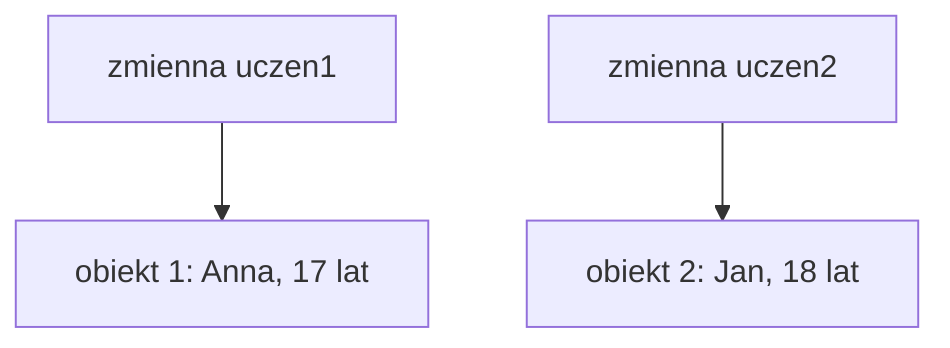
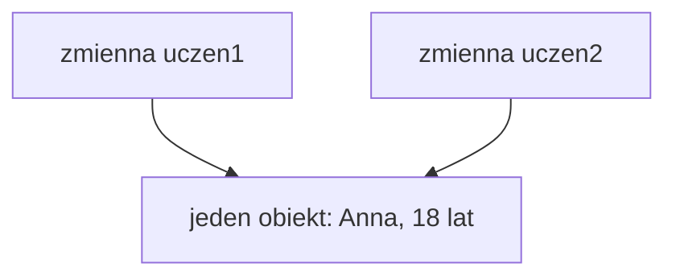

# Kilka obiektów tej samej klasy

## Cel lekcji

Na tej lekcji nauczysz się tworzyć i obsługiwać kilka obiektów tej samej klasy. Zobaczysz różnicę między dwoma niezależnymi obiektami a dwiema zmiennymi odnoszącymi się do tego samego obiektu.

## Po lekcji potrafisz

- utworzyć kilka obiektów tej samej klasy,
- wyjaśnić, dlaczego każdy obiekt ma własny stan,
- zmienić dane jednego obiektu bez zmiany pozostałych,
- wywołać tę samą metodę dla różnych obiektów,
- odróżnić utworzenie obiektu od przypisania zmiennej,
- porównać wybrane właściwości obiektów,
- zamienić dane dwóch obiektów,
- zamienić obiekty, do których odnoszą się zmienne,
- przekazać obiekt jako argument metody,
- przewidzieć działanie licznika tworzonych obiektów.

## 1. Klasa i obiekty

Klasa opisuje, jakie dane i działania będą miały jej obiekty. Na podstawie jednej klasy możemy utworzyć wiele obiektów.

```csharp
Uczen uczen1 = new Uczen("Anna", 17);
Uczen uczen2 = new Uczen("Jan", 18);
```

W pierwszej instrukcji:

- `Uczen` jest nazwą klasy i typem zmiennej,
- `uczen1` jest nazwą zmiennej,
- `new Uczen("Anna", 17)` tworzy pierwszy obiekt,
- konstruktor ustawia dane pierwszego obiektu.

W drugiej instrukcji:

- `uczen2` jest inną zmienną,
- drugie `new Uczen("Jan", 18)` tworzy drugi obiekt,
- konstruktor ustawia dane drugiego obiektu.

```text
dwa wykonania new => dwa różne obiekty
```

Zmienne typu klasy odnoszą się do obiektów. Nie należy mówić, że zmienna zawiera cały obiekt. Dokładna organizacja pamięci jest osobnym zagadnieniem i nie jest potrzebna do zrozumienia tej lekcji.

## 2. Pierwsze dwa obiekty

```csharp
using System;

class Uczen
{
    private int wiek;

    public string Imie { get; set; }

    public int Wiek
    {
        get
        {
            return wiek;
        }

        set
        {
            if (value >= 0)
            {
                wiek = value;
            }
        }
    }

    public Uczen(string imie, int wiekPoczatkowy)
    {
        Imie = imie;
        Wiek = wiekPoczatkowy;
    }

    public void WyswietlDane()
    {
        Console.WriteLine($"{Imie}, wiek: {Wiek}");
    }
}

class Program
{
    static void Main()
    {
        Uczen uczen1 = new Uczen("Anna", 17);
        Uczen uczen2 = new Uczen("Jan", 18);

        uczen1.WyswietlDane();
        uczen2.WyswietlDane();
    }
}
```

Każdy obiekt ma własne wartości właściwości `Imie` i `Wiek`.

| Zmienna | Obiekt | Imie | Wiek |
| --- | --- | --- | --- |
| `uczen1` | Pierwszy obiekt | Anna | 17 |
| `uczen2` | Drugi obiekt | Jan | 18 |

## 3. Niezależny stan obiektów

Stan obiektu to wartości danych należących do tego obiektu. Dwa niezależne obiekty mogą mieć różny stan.

```csharp
using System;

class Uczen
{
    private int wiek;

    public string Imie { get; set; }

    public int Wiek
    {
        get
        {
            return wiek;
        }

        set
        {
            if (value >= 0)
            {
                wiek = value;
            }
        }
    }

    public Uczen(string imie, int wiekPoczatkowy)
    {
        Imie = imie;
        Wiek = wiekPoczatkowy;
    }

    public void WyswietlDane()
    {
        Console.WriteLine($"{Imie}, wiek: {Wiek}");
    }
}

class Program
{
    static void Main()
    {
        Uczen uczen1 = new Uczen("Anna", 17);
        Uczen uczen2 = new Uczen("Jan", 18);

        Console.WriteLine("Przed zmianą:");
        uczen1.WyswietlDane();
        uczen2.WyswietlDane();

        uczen1.Wiek = 19;

        Console.WriteLine("Po zmianie pierwszego ucznia:");
        uczen1.WyswietlDane();
        uczen2.WyswietlDane();
    }
}
```

Instrukcja `uczen1.Wiek = 19;` zmienia stan pierwszego obiektu. Drugi obiekt nadal przechowuje wiek `18`.

```text
zmiana uczen1.Wiek => zmiana pierwszego obiektu
uczen2.Wiek => bez zmian
```

## 4. Ta sama metoda i różne obiekty

Kod metody `WyswietlDane` został zapisany w klasie tylko raz. Możemy jednak wywołać tę metodę dla każdego obiektu.

```csharp
uczen1.WyswietlDane();
uczen2.WyswietlDane();
```

Pierwsze wywołanie korzysta ze stanu pierwszego obiektu. Drugie wywołanie korzysta ze stanu drugiego obiektu.

```text
uczen1.WyswietlDane() => dane obiektu wskazanego przez uczen1
uczen2.WyswietlDane() => dane obiektu wskazanego przez uczen2
```

Wywołanie metody dla pierwszego obiektu nie powoduje automatycznego wykonania tej metody dla drugiego obiektu.

## 5. Kilka kont

Każde konto ma własnego właściciela i własne saldo.

```csharp
using System;

class Konto
{
    private double saldo;

    public string Wlasciciel { get; set; }

    public double Saldo
    {
        get
        {
            return saldo;
        }
    }

    public Konto(string wlasciciel)
    {
        Wlasciciel = wlasciciel;
        saldo = 0;
    }

    public void Wplac(double kwota)
    {
        if (kwota > 0)
        {
            saldo = saldo + kwota;
        }
    }

    public void Wyplac(double kwota)
    {
        if (kwota > 0 && kwota <= saldo)
        {
            saldo = saldo - kwota;
        }
        else
        {
            Console.WriteLine("Nie można wykonać wypłaty.");
        }
    }

    public void WyswietlDane()
    {
        Console.WriteLine($"{Wlasciciel}, saldo: {Saldo:F2} zł");
    }
}

class Program
{
    static void Main()
    {
        Konto konto1 = new Konto("Anna");
        Konto konto2 = new Konto("Jan");

        konto1.Wplac(500);
        konto2.Wplac(200);
        konto1.Wyplac(100);

        konto1.WyswietlDane();
        konto2.WyswietlDane();
    }
}
```

Wpłata lub wypłata wykonana dla `konto1` zmienia tylko pierwsze konto. Drugie konto ma własne pole `saldo`.

## 6. Kilka produktów

```csharp
using System;

class Produkt
{
    private double cena;

    public string Nazwa { get; set; }

    public double Cena
    {
        get
        {
            return cena;
        }

        set
        {
            if (value >= 0)
            {
                cena = value;
            }
        }
    }

    public Produkt(string nazwa, double cenaPoczatkowa)
    {
        Nazwa = nazwa;
        Cena = cenaPoczatkowa;
    }

    public void WyswietlDane()
    {
        Console.WriteLine($"{Nazwa}: {Cena:F2} zł");
    }
}

class Program
{
    static void Main()
    {
        Produkt produkt1 = new Produkt("Monitor", 1000);
        Produkt produkt2 = new Produkt("Klawiatura", 200);

        produkt1.Cena = 950;

        produkt1.WyswietlDane();
        produkt2.WyswietlDane();
    }
}
```

Zmiana `produkt1.Cena` nie wpływa na `produkt2.Cena`. Są to dwa obiekty utworzone przez dwa osobne wykonania `new`.

## 7. Stan obiektu i stan wspólny klasy

Zwykłe właściwości opisują konkretny obiekt. Pole `static` należy do klasy i ma jedną wspólną wartość.

```csharp
using System;

class Gracz
{
    private int punkty;

    public string Nazwa { get; set; }

    public int Punkty
    {
        get
        {
            return punkty;
        }
    }

    public static string nazwaGry = "Quiz C#";

    public Gracz(string nazwa)
    {
        Nazwa = nazwa;
        punkty = 0;
    }

    public void DodajPunkty(int liczbaPunktow)
    {
        if (liczbaPunktow > 0)
        {
            punkty = punkty + liczbaPunktow;
        }
    }

    public void WyswietlDane()
    {
        Console.WriteLine($"{Nazwa}: {Punkty} pkt, gra: {Gracz.nazwaGry}");
    }
}

class Program
{
    static void Main()
    {
        Gracz gracz1 = new Gracz("Anna");
        Gracz gracz2 = new Gracz("Jan");

        gracz1.DodajPunkty(10);
        gracz2.DodajPunkty(25);

        gracz1.WyswietlDane();
        gracz2.WyswietlDane();

        Gracz.nazwaGry = "Turniej C#";

        gracz1.WyswietlDane();
        gracz2.WyswietlDane();
    }
}
```

```text
właściwości obiektu => osobne wartości dla każdego obiektu
pole static => jedna wartość wspólna dla klasy
```

Punkty graczy są niezależne. Zmiana pola `Gracz.nazwaGry` jest wspólna i jest widoczna podczas wyświetlania obu graczy.

## 8. Dwa niezależne obiekty na diagramie



Każda zmienna odnosi się do innego obiektu. Zmiana pierwszego obiektu nie zmienia drugiego.

## 9. Jedna zmienna przypisana do drugiej

Przeanalizujmy inny zapis:

```csharp
Uczen uczen1 = new Uczen("Anna", 17);
Uczen uczen2 = uczen1;
```

Operator `new` występuje tylko raz, dlatego powstaje tylko jeden obiekt. Instrukcja `Uczen uczen2 = uczen1;` tworzy drugą zmienną, ale nie tworzy drugiego ucznia.

```text
jedno wykonanie new => jeden obiekt
dwie zmienne => dwa sposoby uzyskania dostępu do tego samego obiektu
```

## 10. Dwie zmienne i jeden obiekt

```csharp
using System;

class Uczen
{
    private int wiek;

    public string Imie { get; set; }

    public int Wiek
    {
        get
        {
            return wiek;
        }

        set
        {
            if (value >= 0)
            {
                wiek = value;
            }
        }
    }

    public Uczen(string imie, int wiekPoczatkowy)
    {
        Imie = imie;
        Wiek = wiekPoczatkowy;
    }
}

class Program
{
    static void Main()
    {
        Uczen uczen1 = new Uczen("Anna", 17);
        Uczen uczen2 = uczen1;

        uczen2.Wiek = 18;

        Console.WriteLine(uczen1.Wiek);
        Console.WriteLine(uczen2.Wiek);
    }
}
```

Oba odczyty wyświetlą `18`. Zmienna `uczen2` odnosi się do tego samego obiektu co `uczen1`. Zmiana wykonana przez jedną zmienną zmienia wspólny obiekt, dlatego jest widoczna także przez drugą zmienną.

Nie skopiowano danych do nowego obiektu. Nowy obiekt w ogóle nie powstał.

## 11. Jeden obiekt na diagramie



Nazwy zmiennych są różne, ale obie zmienne odnoszą się do tego samego obiektu.

## 12. new a zwykłe przypisanie

Porównajmy dwa zapisy.

Pierwszy zapis:

```csharp
Uczen uczen2 = new Uczen("Anna", 17);
```

Operator `new` tworzy nowy, niezależny obiekt.

Drugi zapis:

```csharp
Uczen uczen2 = uczen1;
```

Nie ma tutaj operatora `new`. Nie powstaje nowy obiekt. Zmienna `uczen2` zaczyna odnosić się do tego samego obiektu co `uczen1`.

| Zapis | Liczba wykonań `new` | Rezultat |
| --- | ---: | --- |
| `Uczen uczen1 = new Uczen(...);`<br>`Uczen uczen2 = new Uczen(...);` | 2 | Dwa niezależne obiekty |
| `Uczen uczen1 = new Uczen(...);`<br>`Uczen uczen2 = uczen1;` | 1 | Jeden obiekt i dwie zmienne |

## 13. Identyczne dane nie oznaczają jednego obiektu

Dwa obiekty mogą mieć takie same wartości właściwości i nadal pozostawać niezależnymi obiektami.

```csharp
using System;

class Uczen
{
    private int wiek;

    public string Imie { get; set; }

    public int Wiek
    {
        get
        {
            return wiek;
        }

        set
        {
            if (value >= 0)
            {
                wiek = value;
            }
        }
    }

    public Uczen(string imie, int wiekPoczatkowy)
    {
        Imie = imie;
        Wiek = wiekPoczatkowy;
    }

    public void WyswietlDane()
    {
        Console.WriteLine($"{Imie}, wiek: {Wiek}");
    }
}

class Program
{
    static void Main()
    {
        Uczen uczen1 = new Uczen("Anna", 17);
        Uczen uczen2 = new Uczen("Anna", 17);

        uczen1.Wiek = 18;

        uczen1.WyswietlDane();
        uczen2.WyswietlDane();
    }
}
```

Wykonano dwa razy `new`, więc utworzono dwa obiekty. Początkowo mają identyczne dane, ale zmiana pierwszego nie wpływa na drugi.

```text
identyczne dane => nie muszą oznaczać tego samego obiektu
dwa wykonania new => dwa niezależne obiekty
```

## 14. Porównywanie danych obiektów

Najczęściej porównujemy konkretną informację, na przykład wiek uczniów.

```csharp
using System;

class Uczen
{
    public string Imie { get; set; }
    public int Wiek { get; set; }

    public Uczen(string imie, int wiek)
    {
        Imie = imie;
        Wiek = wiek;
    }
}

class Program
{
    static void Main()
    {
        Uczen uczen1 = new Uczen("Anna", 17);
        Uczen uczen2 = new Uczen("Jan", 18);

        if (uczen1.Wiek > uczen2.Wiek)
        {
            Console.WriteLine("Pierwszy uczeń jest starszy.");
        }
        else if (uczen1.Wiek < uczen2.Wiek)
        {
            Console.WriteLine("Drugi uczeń jest starszy.");
        }
        else
        {
            Console.WriteLine("Uczniowie są w tym samym wieku.");
        }
    }
}
```

Porównujemy `uczen1.Wiek` i `uczen2.Wiek`, czyli dwie wartości typu `int`.

Zapis:

```csharp
uczen1 == uczen2
```

nie służy w tej lekcji do porównywania wszystkich wartości właściwości. Jeśli chcemy porównać wiek, cenę albo punkty, wskazujemy odpowiednią właściwość.

## 15. Zamiana danych dwóch obiektów

Możemy zamienić wartości wybranej właściwości dwóch obiektów za pomocą zmiennej pomocniczej.

```csharp
using System;

class Produkt
{
    public string Nazwa { get; set; }
    public double Cena { get; set; }

    public Produkt(string nazwa, double cena)
    {
        Nazwa = nazwa;
        Cena = cena;
    }

    public void WyswietlDane()
    {
        Console.WriteLine($"{Nazwa}: {Cena:F2} zł");
    }
}

class Program
{
    static void Main()
    {
        Produkt produkt1 = new Produkt("Monitor", 1000);
        Produkt produkt2 = new Produkt("Klawiatura", 200);

        double cenaPomocnicza = produkt1.Cena;
        produkt1.Cena = produkt2.Cena;
        produkt2.Cena = cenaPomocnicza;

        produkt1.WyswietlDane();
        produkt2.WyswietlDane();
    }
}
```

W tym przykładzie zmieniliśmy dane obiektów. Pierwszy obiekt nadal jest monitorem, a drugi klawiaturą. Zamienione zostały tylko wartości właściwości `Cena`.

## 16. Zamiana zmiennych obiektowych

Inną operacją jest zamiana obiektów, do których odnoszą się zmienne.

```csharp
using System;

class Produkt
{
    public string Nazwa { get; set; }
    public double Cena { get; set; }

    public Produkt(string nazwa, double cena)
    {
        Nazwa = nazwa;
        Cena = cena;
    }

    public void WyswietlDane()
    {
        Console.WriteLine($"{Nazwa}: {Cena:F2} zł");
    }
}

class Program
{
    static void Main()
    {
        Produkt produkt1 = new Produkt("Monitor", 1000);
        Produkt produkt2 = new Produkt("Klawiatura", 200);

        Produkt pomocniczy = produkt1;
        produkt1 = produkt2;
        produkt2 = pomocniczy;

        Console.WriteLine("Obiekt wskazywany teraz przez produkt1:");
        produkt1.WyswietlDane();

        Console.WriteLine("Obiekt wskazywany teraz przez produkt2:");
        produkt2.WyswietlDane();
    }
}
```

Nie utworzono nowych obiektów i nie skopiowano wszystkich właściwości. Zmieniono jedynie to, do których obiektów odnoszą się zmienne.

- `produkt1` odnosi się teraz do wcześniejszego drugiego obiektu.
- `produkt2` odnosi się teraz do wcześniejszego pierwszego obiektu.
- Oba wcześniej utworzone obiekty nadal istnieją.

Zamiana danych i zamiana zmiennych obiektowych to dwie różne operacje.

## 17. Przekazanie obiektu do metody

Obiekt można przekazać jako argument metody.

```csharp
using System;

class Uczen
{
    public string Imie { get; set; }
    public int Wiek { get; set; }

    public Uczen(string imie, int wiek)
    {
        Imie = imie;
        Wiek = wiek;
    }
}

class Program
{
    static void ZwiekszWiek(Uczen uczen)
    {
        uczen.Wiek = uczen.Wiek + 1;
    }

    static void Main()
    {
        Uczen uczen1 = new Uczen("Anna", 17);

        ZwiekszWiek(uczen1);

        Console.WriteLine(uczen1.Wiek);
    }
}
```

Parametr `uczen` odnosi się do tego samego obiektu, który został przekazany podczas wywołania. Metoda zmienia właściwość tego obiektu. Po zakończeniu metody zmiana pozostaje widoczna przez zmienną `uczen1`.

Nie trzeba stosować `ref`, aby zmienić stan obiektu. W tym przykładzie nie zmieniamy samej zmiennej `uczen1`. Zmieniamy właściwość obiektu, do którego ta zmienna się odnosi.

## 18. Metoda porównująca dwa obiekty

Metoda może przyjąć dwa obiekty i porównać ich właściwości.

```csharp
using System;

class Uczen
{
    public string Imie { get; set; }
    public int Wiek { get; set; }

    public Uczen(string imie, int wiek)
    {
        Imie = imie;
        Wiek = wiek;
    }
}

class Program
{
    static void WyswietlStarszego(Uczen uczen1, Uczen uczen2)
    {
        if (uczen1.Wiek > uczen2.Wiek)
        {
            Console.WriteLine("Starszy uczeń: " + uczen1.Imie);
        }
        else if (uczen1.Wiek < uczen2.Wiek)
        {
            Console.WriteLine("Starszy uczeń: " + uczen2.Imie);
        }
        else
        {
            Console.WriteLine("Uczniowie są w tym samym wieku.");
        }
    }

    static void Main()
    {
        Uczen uczen1 = new Uczen("Anna", 17);
        Uczen uczen2 = new Uczen("Jan", 18);

        WyswietlStarszego(uczen1, uczen2);
    }
}
```

Metoda nie musi znać nazw zmiennych użytych w `Main()`. Otrzymuje dwa parametry typu `Uczen` i korzysta z właściwości przekazanych obiektów.

## 19. Licznik utworzonych obiektów

Pole `static` może policzyć wykonania konstruktora.

```csharp
using System;

class Uczen
{
    public string Imie { get; set; }
    public static int liczbaUtworzonych = 0;

    public Uczen(string imie)
    {
        Imie = imie;
        Uczen.liczbaUtworzonych++;
    }
}

class Program
{
    static void Main()
    {
        Console.WriteLine("Początek: " + Uczen.liczbaUtworzonych);

        Uczen uczen1 = new Uczen("Anna");
        Console.WriteLine("Po pierwszym new: " + Uczen.liczbaUtworzonych);

        Uczen uczen2 = uczen1;
        Console.WriteLine("Po przypisaniu zmiennej: " + Uczen.liczbaUtworzonych);

        Uczen uczen3 = new Uczen("Jan");
        Console.WriteLine("Po drugim new: " + Uczen.liczbaUtworzonych);

        Console.WriteLine(uczen1.Imie);
        Console.WriteLine(uczen2.Imie);
        Console.WriteLine(uczen3.Imie);
    }
}
```

Przebieg licznika:

```text
początek => 0
pierwsze new => konstruktor => 1
uczen2 = uczen1 => bez konstruktora => nadal 1
drugie new => konstruktor => 2
```

Przypisanie zmiennej nie uruchamia konstruktora i nie zwiększa licznika. Licznik zwiększa się podczas tworzenia obiektu, a nie podczas tworzenia kolejnej zmiennej odnoszącej się do istniejącego obiektu.

## 20. Porównanie najważniejszych sytuacji

| Sytuacja | Przykładowy zapis | Liczba nowo utworzonych obiektów | Czy obiekty są niezależne | Skutek zmiany właściwości |
| --- | --- | ---: | --- | --- |
| Dwa wykonania `new` | `a = new Uczen(...);` i `b = new Uczen(...);` | 2 | Tak | Zmiana `a` nie zmienia `b` |
| Przypisanie zmiennej | `b = a;` | 0 | Nie powstaje drugi obiekt | Zmiana wspólnego obiektu jest widoczna przez `a` i `b` |
| Zmiana właściwości | `a.Wiek = 18;` | 0 | Zależy od wcześniejszych przypisań | Zmienia wskazany obiekt |
| Wywołanie metody | `a.WyswietlDane();` | 0 | Bez zmian | Metoda pracuje na obiekcie wskazanym przez `a` |
| Nowa zmienna do istniejącego obiektu | `Uczen b = a;` | 0 | Nie | Obie zmienne odnoszą się do tego samego obiektu |

## 21. Jak analizować kod z obiektami

Podczas analizy programu wykonuj następujące kroki:

1. Zaznacz każde wystąpienie operatora `new`.
2. Dla każdego `new` zapisz, że powstaje nowy obiekt.
3. Sprawdź, do której zmiennej trafia odniesienie do nowego obiektu.
4. Zaznacz zwykłe przypisania, takie jak `uczen2 = uczen1`.
5. Pamiętaj, że zwykłe przypisanie nie tworzy obiektu.
6. Przy każdej zmianie właściwości ustal, do którego obiektu odnosi się użyta zmienna.
7. Dopiero wtedy przewiduj wynik programu.

Liczba nazw zmiennych nie musi być równa liczbie obiektów. Najpewniejszą wskazówką dla początkującego jest liczba rzeczywiście wykonanych operatorów `new`.

## 22. Najczęstsze błędy

### Każda zmienna oznacza nowy obiekt

Nie. Nowa zmienna może odnosić się do już istniejącego obiektu.

```csharp
Uczen uczen2 = uczen1;
```

Ten zapis nie zawiera `new` i nie tworzy obiektu.

### Brak new przy zamiarze utworzenia niezależnego obiektu

Jeśli potrzebujemy drugiego niezależnego ucznia, wykonujemy drugi operator `new`.

### Przypisanie kopiuje dane do nowego obiektu

Zapis `uczen2 = uczen1` nie tworzy kopii ucznia. Obie zmienne odnoszą się do tego samego obiektu.

### Identyczne dane oznaczają ten sam obiekt

Dwa osobne obiekty mogą mieć identyczne wartości właściwości. O ich niezależności decyduje sposób utworzenia, a nie różnica danych.

### Różne nazwy zmiennych oznaczają różne obiekty

Zmienne o różnych nazwach mogą odnosić się do tego samego obiektu.

### Zmiana niewłaściwego obiektu

Przed przypisaniem sprawdź nazwę zmiennej stojącą przed kropką:

```csharp
uczen1.Wiek = 18;
```

### Wywołanie metody dla niewłaściwej zmiennej

`konto1.Wplac(100);` i `konto2.Wplac(100);` zmieniają dwa różne konta, jeśli zmienne odnoszą się do niezależnych obiektów.

### Pomylenie właściwości obiektu z polem static

Właściwość `gracz1.Punkty` należy do konkretnego gracza. Pole `Gracz.nazwaGry` jest wspólne dla klasy.

### Porównywanie całych obiektów zamiast danych

Jeżeli chcemy znaleźć starszego ucznia, porównujemy `Wiek`. Jeżeli chcemy znaleźć droższy produkt, porównujemy `Cena`.

### Pomylenie zamiany danych z zamianą zmiennych

Zamiana `Cena` zmienia dane obiektów. Zamiana zmiennych typu `Produkt` zmienia to, do których obiektów odnoszą się zmienne.

### Przypisanie zmiennej zwiększa licznik obiektów

Licznik zwiększany w konstruktorze zmienia się tylko wtedy, gdy konstruktor zostanie wykonany. Zwykłe przypisanie nie uruchamia konstruktora.

### Metoda otrzymuje automatycznie kopię całego obiektu

Parametr typu klasy odnosi się do przekazanego obiektu. Zmiana jego właściwości w metodzie pozostaje widoczna po zakończeniu metody.

## 23. Zapamiętaj

- Jedna klasa może służyć do utworzenia wielu obiektów.
- Każde wykonanie `new` tworzy nowy obiekt.
- Dwa wykonania `new` tworzą dwa niezależne obiekty.
- Każdy obiekt ma własny stan.
- Ta sama metoda może pracować osobno na różnych obiektach.
- Przypisanie `uczen2 = uczen1` nie tworzy nowego obiektu.
- Dwie zmienne mogą odnosić się do tego samego obiektu.
- Zmiana wspólnego obiektu jest widoczna przez obie zmienne.
- Identyczne dane nie oznaczają, że mamy jeden obiekt.
- Różne nazwy zmiennych nie gwarantują istnienia różnych obiektów.
- Dane obiektów porównujemy przez wybrane właściwości.
- Zamiana danych nie jest tym samym co zamiana zmiennych obiektowych.
- Metoda może zmienić stan przekazanego obiektu bez użycia `ref`.
- Przypisanie zmiennej nie uruchamia konstruktora.
- Pole `static` jest wspólne, a właściwości obiektu opisują konkretny obiekt.

## 24. Ćwiczenia

1. Utwórz dwóch uczniów o różnych imionach i wieku.
2. Wyświetl dane obu uczniów za pomocą metody `WyswietlDane`.
3. Zmień wiek pierwszego ucznia i sprawdź dane drugiego ucznia.
4. Utwórz trzy niezależne obiekty klasy `Produkt`.
5. Zmień cenę tylko drugiego produktu.
6. Utwórz dwa konta i wykonaj różne wpłaty na każde z nich.
7. Wypłać środki tylko z pierwszego konta i porównaj salda.
8. Utwórz dwóch graczy i dodaj im różne liczby punktów.
9. Zmień wspólną nazwę gry i wyświetl dane obu graczy.
10. Wskaż w podanym kodzie wszystkie wykonania operatora `new`.
11. Na podstawie kodu podaj liczbę utworzonych obiektów.
12. Wyjaśnij, dlaczego dwie zmienne nie zawsze oznaczają dwa obiekty.
13. Przeanalizuj zapis `Uczen uczen2 = uczen1;`.
14. Przewidź wynik programu po zmianie `uczen2.Wiek`, gdy `uczen2 = uczen1`.
15. Utwórz dwa niezależne obiekty o identycznym imieniu i wieku.
16. Zmień jeden z dwóch obiektów o identycznych danych i sprawdź drugi.
17. Porównaj wiek dwóch uczniów i wyświetl imię starszego.
18. Uwzględnij przypadek, w którym uczniowie są w tym samym wieku.
19. Porównaj ceny dwóch produktów i wyświetl nazwę droższego.
20. Porównaj punkty dwóch graczy.
21. Zamień ceny dwóch produktów za pomocą zmiennej pomocniczej.
22. Wyjaśnij, które dane zmieniły się po zamianie cen.
23. Zamień obiekty, do których odnoszą się dwie zmienne typu `Produkt`.
24. Wyjaśnij różnicę między zamianą cen a zamianą zmiennych obiektowych.
25. Napisz metodę zwiększającą wiek przekazanego ucznia o jeden.
26. Wyjaśnij, dlaczego metoda z poprzedniego ćwiczenia nie wymaga `ref`.
27. Napisz metodę porównującą wiek dwóch uczniów.
28. Dodaj do klasy licznik utworzonych obiektów.
29. Sprawdź licznik po utworzeniu obiektu i po przypisaniu drugiej zmiennej do pierwszej.
30. Popraw program, który miał utworzyć dwa obiekty, ale wykonał tylko jedno `new`.
31. Znajdź w podanym kodzie wywołanie metody wykonane dla niewłaściwego obiektu.
32. Przeanalizuj bez uruchamiania program zawierający trzy zmienne, dwa wykonania `new` i kilka przypisań. Podaj, które zmienne odnoszą się do tych samych obiektów.

## Podsumowanie

Każde wykonanie operatora `new` tworzy nowy obiekt. Dwa niezależne obiekty tej samej klasy mają osobny stan, nawet jeśli początkowo zawierają identyczne dane. Zwykłe przypisanie jednej zmiennej obiektowej do drugiej nie tworzy kopii. Powoduje, że obie zmienne odnoszą się do tego samego obiektu. Zrozumienie tej różnicy jest podstawą dalszej pracy z obiektami.
