---
layout: default
title: TEST JEKYLL DZIALA
---

# C# - podstawy programowania 2026/2027

Autor: Mariusz Smółka

To jest strona główna kursu C# dla początkujących. Materiały dotyczą głównie programowania konsolowego i podstaw potrzebnych na początku nauki INF.04.

## Informacje

- [Licencja](licencja.md)
- [Organizacja kursu](00-organizacja/README.md)
- [Status kursu](00-organizacja/status-kursu.md)

## 01 - Podstawy

- [Wprowadzenie](01-podstawy/README.md)
- [Pierwszy program](01-podstawy/01-pierwszy-program.md)
- [Console.WriteLine](01-podstawy/02-console-writeline.md)
- [Zmienne](01-podstawy/03-zmienne.md)
- [Typy danych](01-podstawy/04-typy-danych.md)
- [Komentarze](01-podstawy/05-komentarze.md)
- [Operatory](01-podstawy/06-operatory.md)

## 02 - Wejście i wyjście

- [Wprowadzenie](02-wejscie-wyjscie/README.md)
- [Console.ReadLine](02-wejscie-wyjscie/01-console-readline.md)
- [Konwersja typów](02-wejscie-wyjscie/02-konwersja-typow.md)
- [Formatowanie wyników](02-wejscie-wyjscie/03-formatowanie-wynikow.md)
- [Podsumowanie działu](02-wejscie-wyjscie/04-podsumowanie.md)

## 03 - Warunki

- [Wprowadzenie](03-warunki/README.md)
- [if](03-warunki/01-if.md)
- [if else](03-warunki/02-if-else.md)
- [else if](03-warunki/03-else-if.md)
- [switch](03-warunki/04-switch.md)
- [Podsumowanie działu](03-warunki/05-podsumowanie.md)

## 04 - Pętle

- [Wprowadzenie](04-petle/README.md)
- [while](04-petle/01-while.md)
- [do while](04-petle/02-do-while.md)
- [for](04-petle/03-for.md)
- [Tablice jednowymiarowe - podstawy](04-petle/04-tablice-jednowymiarowe.md)
- [Pętla for po tablicy](04-petle/05-for-po-tablicy.md)
- [Suma i średnia elementów tablicy](04-petle/06-suma-srednia-tablicy.md)
- [Minimum i maksimum elementów tablicy](04-petle/07-minimum-maksimum-tablicy.md)
- [Zliczanie elementów tablicy spełniających warunek](04-petle/08-licznik-akumulator.md)
- [Pętla foreach](04-petle/09-foreach.md)
- [break i continue](04-petle/10-break-continue.md)

## 05 - Tablice

- [Wprowadzenie](05-tablice/README.md)
- [Tablice jednowymiarowe](05-tablice/01-tablice.md)
- [Indeksy](05-tablice/02-indeksy.md)
- [Pętla for po tablicy](05-tablice/03-for-po-tablicy.md)
- [foreach](05-tablice/04-foreach.md)
- [Suma, minimum i maksimum](05-tablice/05-suma-minimum-maksimum.md)

## 06 - Projekty

- [Zapowiedź projektów](06-projekty/README.md)


## Test Mermaid

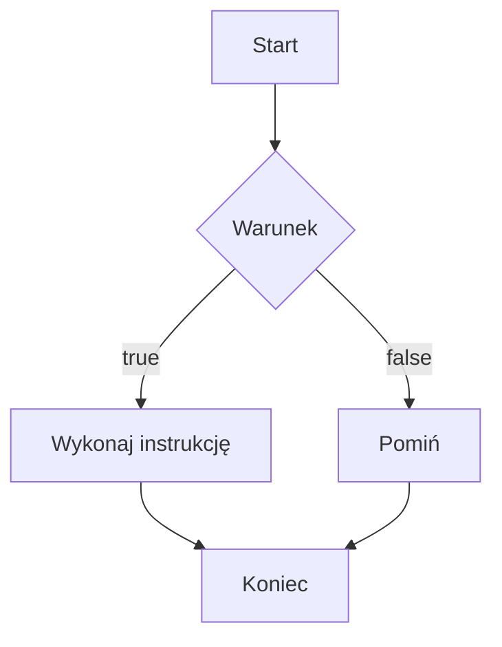

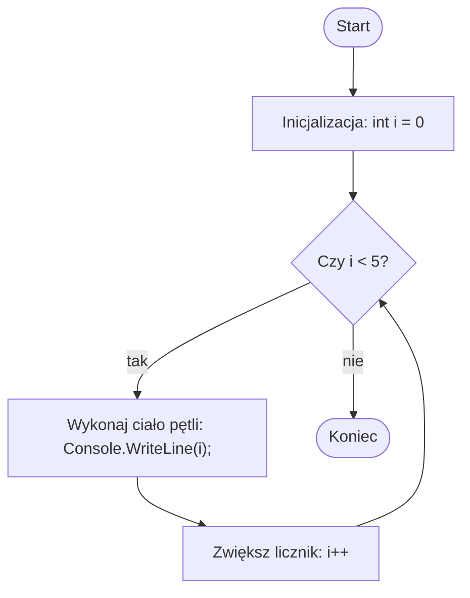

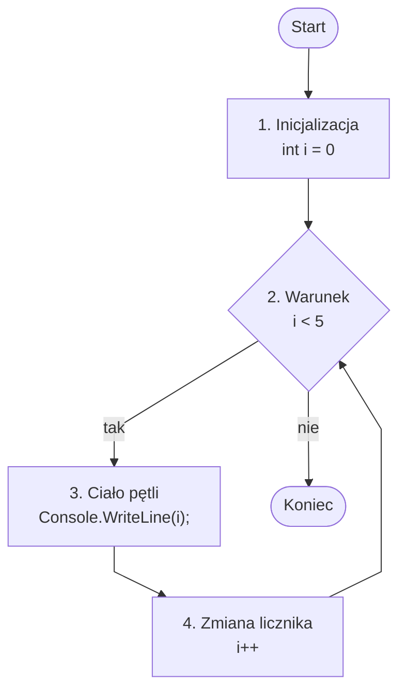

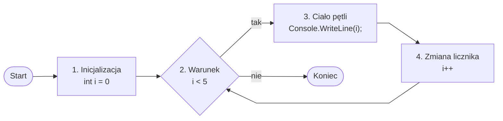


# C++ — drzewa przedziałowe

## 1. Po co są drzewa przedziałowe?

Drzewo przedziałowe, po angielsku **segment tree**, to struktura danych, która pozwala szybko odpowiadać na pytania dotyczące fragmentów tablicy.

Typowe pytania:

- jaka jest suma elementów od indeksu `l` do `r`,
- jaka jest najmniejsza wartość na przedziale `l..r`,
- jaka jest największa wartość na przedziale `l..r`,
- jaki jest wynik jakiejś operacji na fragmencie tablicy.

Przykład tablicy:

```cpp
int a[] = {2, 1, 5, 3, 4};
```

Możemy pytać:

```text
Jaka jest suma od indeksu 1 do 3?
a[1] + a[2] + a[3] = 1 + 5 + 3 = 9
```

Gdy tablica jest mała, można po prostu przejść pętlą po elementach.

```cpp
int suma = 0;

for (int i = l; i <= r; i++) {
    suma += a[i];
}
```

Problem pojawia się wtedy, gdy:

- tablica ma bardzo dużo elementów,
- zapytań jest bardzo dużo,
- wartości w tablicy mogą się zmieniać.

Dla tablicy o rozmiarze `n = 1 000 000` i miliona zapytań zwykła pętla może być za wolna.

Drzewo przedziałowe rozwiązuje ten problem.

---

## 2. Podstawowa idea

Drzewo przedziałowe dzieli tablicę na przedziały.

Dla tablicy:

```text
indeks:  0  1  2  3
wartość: 2  1  5  3
```

drzewo może wyglądać tak:

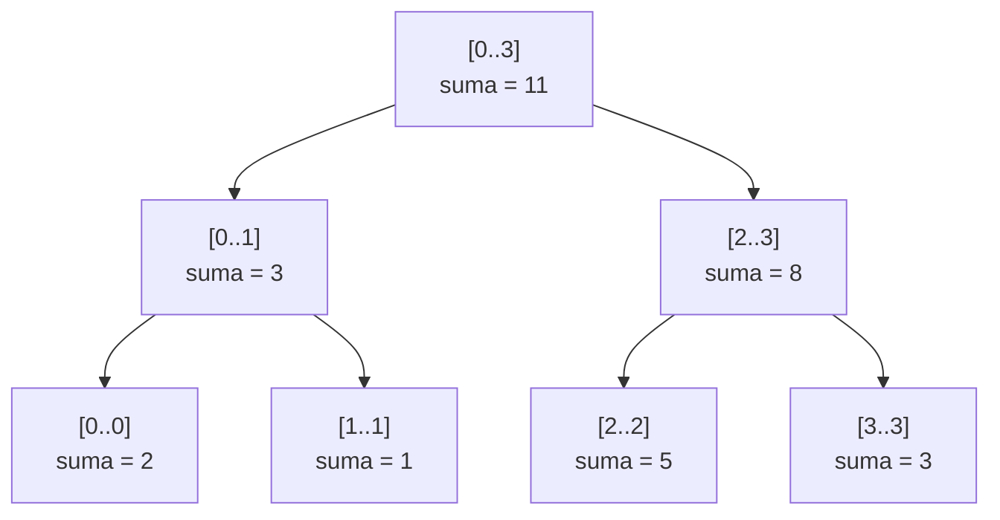

Każdy węzeł drzewa przechowuje informację o pewnym przedziale.

W tym przykładzie przechowujemy **sumę**.

- korzeń przechowuje sumę całej tablicy,
- dzieci przechowują sumy połówek,
- liście przechowują pojedyncze elementy.

---

## 3. Co przechowuje jeden węzeł?

Jeden węzeł drzewa odpowiada za jeden przedział.

Przykład:

```text
[0..3] oznacza przedział od indeksu 0 do indeksu 3
```

Jeżeli drzewo służy do sumowania, węzeł przechowuje sumę:

```text
[0..3] = a[0] + a[1] + a[2] + a[3]
```

Jeżeli drzewo służy do minimum, węzeł przechowuje minimum:

```text
[0..3] = min(a[0], a[1], a[2], a[3])
```

Jeżeli drzewo służy do maksimum, węzeł przechowuje maksimum:

```text
[0..3] = max(a[0], a[1], a[2], a[3])
```

---

## 4. Dlaczego to działa szybko?

Drzewo dzieli przedziały na połowy.

Dla `n = 8` wygląda to koncepcyjnie tak:

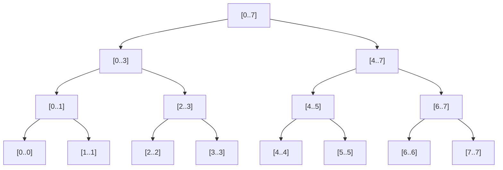

Wysokość takiego drzewa wynosi około:

```text
log2(n)
```

Dla `n = 1 000 000` wysokość drzewa to około `20`.

To oznacza, że zamiast sprawdzać setki tysięcy elementów, często odwiedzamy tylko kilkadziesiąt węzłów.

---

## 5. Złożoność

Dla tablicy rozmiaru `n`:

| Operacja | Złożoność |
|---|---:|
| Budowa drzewa | `O(n)` |
| Zapytanie o przedział | `O(log n)` |
| Zmiana jednego elementu | `O(log n)` |
| Pamięć | `O(n)` |

W implementacji rekurencyjnej często tworzy się tablicę drzewa o rozmiarze `4 * n`.

```cpp
vector<int> tree(4 * n);
```

Dlaczego `4 * n`?

Ponieważ jest to prosty i bezpieczny rozmiar dla drzewa binarnego reprezentowanego w tablicy. Nie zawsze całe miejsce zostanie użyte, ale unikamy problemów z wyliczaniem dokładnego rozmiaru.

---

# Przykład 1 — suma na przedziale

## Dane

Mamy tablicę:

```text
indeks:  0  1  2  3
wartość: 2  1  5  3
```

Chcemy szybko odpowiadać na pytania typu:

```text
suma(l, r)
```

Na przykład:

```text
suma(1, 3) = a[1] + a[2] + a[3] = 1 + 5 + 3 = 9
```

## Drzewo

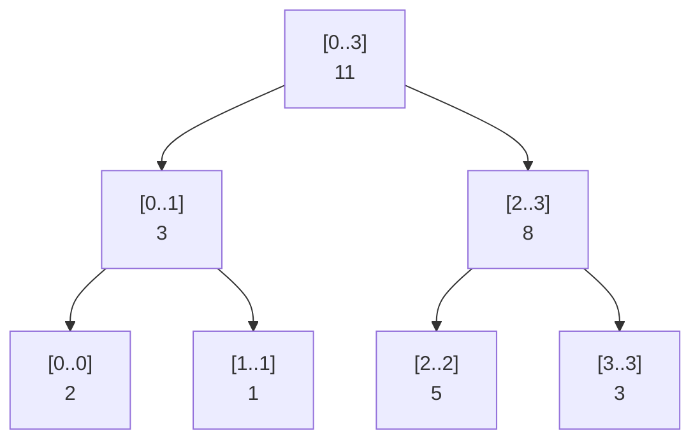

Wartości w węzłach:

```text
[0..0] = 2
[1..1] = 1
[2..2] = 5
[3..3] = 3

[0..1] = 2 + 1 = 3
[2..3] = 5 + 3 = 8

[0..3] = 3 + 8 = 11
```

## Zapytanie: suma od 1 do 3

Pytamy o:

```text
suma(1, 3)
```

Drzewo szuka takich gotowych przedziałów, które razem dokładnie pokrywają zakres `[1..3]`.

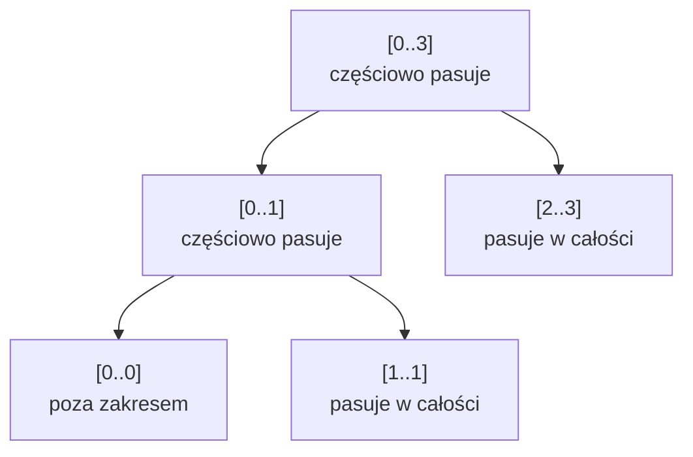

Wynik:

```text
[1..1] + [2..3] = 1 + 8 = 9
```

Nie musimy odwiedzać każdego elementu osobno.

---

## Kod C++ — suma na przedziale

```cpp
#include <iostream>
#include <vector>
using namespace std;

class SegmentTreeSum {
private:
    vector<int> tree;
    vector<int> data;
    int n;

    void build(int node, int left, int right) {
        if (left == right) {
            tree[node] = data[left];
            return;
        }

        int mid = (left + right) / 2;

        build(2 * node, left, mid);
        build(2 * node + 1, mid + 1, right);

        tree[node] = tree[2 * node] + tree[2 * node + 1];
    }

    int query(int node, int left, int right, int qLeft, int qRight) {
        if (right < qLeft || qRight < left) {
            return 0;
        }

        if (qLeft <= left && right <= qRight) {
            return tree[node];
        }

        int mid = (left + right) / 2;

        int leftResult = query(2 * node, left, mid, qLeft, qRight);
        int rightResult = query(2 * node + 1, mid + 1, right, qLeft, qRight);

        return leftResult + rightResult;
    }

public:
    SegmentTreeSum(const vector<int>& values) {
        data = values;
        n = data.size();
        tree.assign(4 * n, 0);

        build(1, 0, n - 1);
    }

    int query(int left, int right) {
        return query(1, 0, n - 1, left, right);
    }
};

int main() {
    vector<int> a = {2, 1, 5, 3};

    SegmentTreeSum st(a);

    cout << st.query(1, 3) << endl; // 9
    cout << st.query(0, 2) << endl; // 8
    cout << st.query(2, 2) << endl; // 5

    return 0;
}
```

---

# Przykład 2 — minimum na przedziale

Drzewo przedziałowe nie musi przechowywać sumy.

Może przechowywać minimum.

## Dane

```text
indeks:  0  1  2  3  4  5
wartość: 7  2  9  1  6  3
```

Chcemy odpowiadać na pytania:

```text
minimum(l, r)
```

Na przykład:

```text
minimum(1, 4) = min(2, 9, 1, 6) = 1
```

## Drzewo minimum

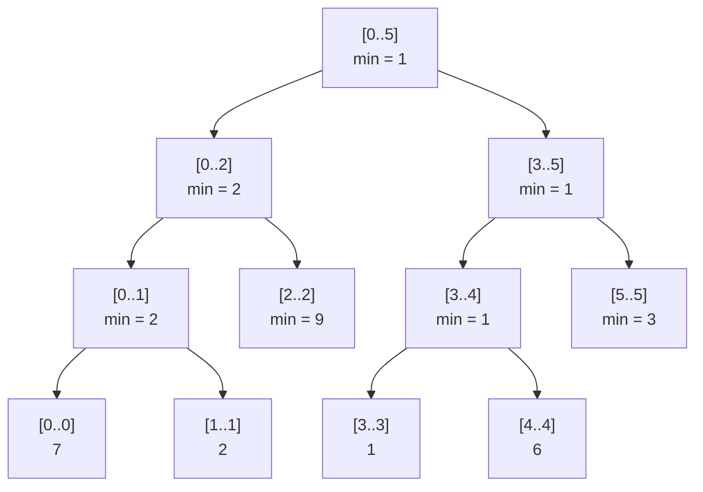

## Zapytanie: minimum od 1 do 4

Szukamy:

```text
minimum(1, 4)
```

Wynik można złożyć z przedziałów:

```text
[1..1], [2..2], [3..4]
```

czyli:

```text
min(2, 9, 1) = 1
```

## Różnica względem sumy

Dla sumy neutralnym wynikiem dla przedziału poza zakresem było `0`.

Dla minimum neutralnym wynikiem jest bardzo duża liczba, na przykład:

```cpp
INT_MAX
```

Dlaczego?

Bo:

```text
min(x, INT_MAX) = x
```

Czyli przedział poza zapytaniem nie wpływa na wynik.

---

## Kod C++ — minimum na przedziale

```cpp
#include <iostream>
#include <vector>
#include <climits>
using namespace std;

class SegmentTreeMin {
private:
    vector<int> tree;
    vector<int> data;
    int n;

    void build(int node, int left, int right) {
        if (left == right) {
            tree[node] = data[left];
            return;
        }

        int mid = (left + right) / 2;

        build(2 * node, left, mid);
        build(2 * node + 1, mid + 1, right);

        tree[node] = min(tree[2 * node], tree[2 * node + 1]);
    }

    int query(int node, int left, int right, int qLeft, int qRight) {
        if (right < qLeft || qRight < left) {
            return INT_MAX;
        }

        if (qLeft <= left && right <= qRight) {
            return tree[node];
        }

        int mid = (left + right) / 2;

        int leftResult = query(2 * node, left, mid, qLeft, qRight);
        int rightResult = query(2 * node + 1, mid + 1, right, qLeft, qRight);

        return min(leftResult, rightResult);
    }

public:
    SegmentTreeMin(const vector<int>& values) {
        data = values;
        n = data.size();
        tree.assign(4 * n, INT_MAX);

        build(1, 0, n - 1);
    }

    int query(int left, int right) {
        return query(1, 0, n - 1, left, right);
    }
};

int main() {
    vector<int> a = {7, 2, 9, 1, 6, 3};

    SegmentTreeMin st(a);

    cout << st.query(1, 4) << endl; // 1
    cout << st.query(0, 2) << endl; // 2
    cout << st.query(4, 5) << endl; // 3

    return 0;
}
```

---

# Przykład 3 — aktualizacja jednego elementu

Drzewa przedziałowe są szczególnie przydatne wtedy, gdy tablica się zmienia.

Załóżmy, że mamy tablicę:

```text
indeks:  0  1  2  3
wartość: 2  1  5  3
```

Drzewo sum wygląda tak:


Teraz zmieniamy:

```text
a[2] = 10
```

Tablica po zmianie:

```text
indeks:  0  1   2  3
wartość: 2  1  10  3
```

Nie trzeba budować całego drzewa od nowa.

Trzeba zmienić tylko te węzły, które leżą na ścieżce od liścia `a[2]` do korzenia.

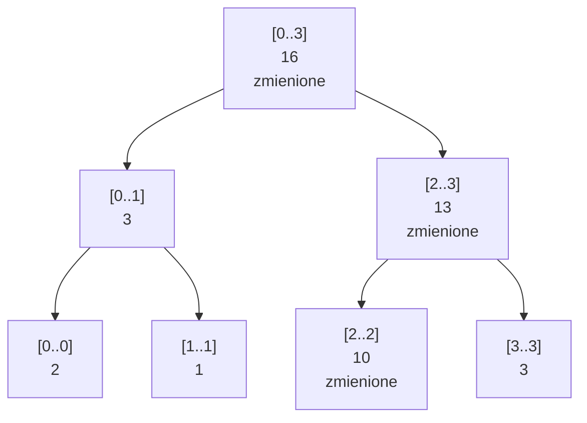

Zmienione zostały tylko:

```text
[2..2]
[2..3]
[0..3]
```

Czyli tylko `O(log n)` węzłów.

---

## Kod C++ — suma z aktualizacją punktową

```cpp
#include <iostream>
#include <vector>
using namespace std;

class SegmentTreeSumUpdate {
private:
    vector<int> tree;
    vector<int> data;
    int n;

    void build(int node, int left, int right) {
        if (left == right) {
            tree[node] = data[left];
            return;
        }

        int mid = (left + right) / 2;

        build(2 * node, left, mid);
        build(2 * node + 1, mid + 1, right);

        tree[node] = tree[2 * node] + tree[2 * node + 1];
    }

    int query(int node, int left, int right, int qLeft, int qRight) {
        if (right < qLeft || qRight < left) {
            return 0;
        }

        if (qLeft <= left && right <= qRight) {
            return tree[node];
        }

        int mid = (left + right) / 2;

        return query(2 * node, left, mid, qLeft, qRight)
             + query(2 * node + 1, mid + 1, right, qLeft, qRight);
    }

    void update(int node, int left, int right, int index, int newValue) {
        if (left == right) {
            tree[node] = newValue;
            data[index] = newValue;
            return;
        }

        int mid = (left + right) / 2;

        if (index <= mid) {
            update(2 * node, left, mid, index, newValue);
        } else {
            update(2 * node + 1, mid + 1, right, index, newValue);
        }

        tree[node] = tree[2 * node] + tree[2 * node + 1];
    }

public:
    SegmentTreeSumUpdate(const vector<int>& values) {
        data = values;
        n = data.size();
        tree.assign(4 * n, 0);

        build(1, 0, n - 1);
    }

    int query(int left, int right) {
        return query(1, 0, n - 1, left, right);
    }

    void update(int index, int newValue) {
        update(1, 0, n - 1, index, newValue);
    }
};

int main() {
    vector<int> a = {2, 1, 5, 3};

    SegmentTreeSumUpdate st(a);

    cout << st.query(0, 3) << endl; // 11

    st.update(2, 10);

    cout << st.query(0, 3) << endl; // 16
    cout << st.query(2, 3) << endl; // 13

    return 0;
}
```

---

# Przykład 4 — maksimum na przedziale z aktualizacją

Teraz zrobimy wariant, w którym drzewo przechowuje maksimum.

## Dane

```text
indeks:  0  1  2  3  4
wartość: 4  7  1  9  3
```

Chcemy odpowiadać na pytania:

```text
max(l, r)
```

Na przykład:

```text
max(1, 4) = max(7, 1, 9, 3) = 9
```

## Drzewo maksimum

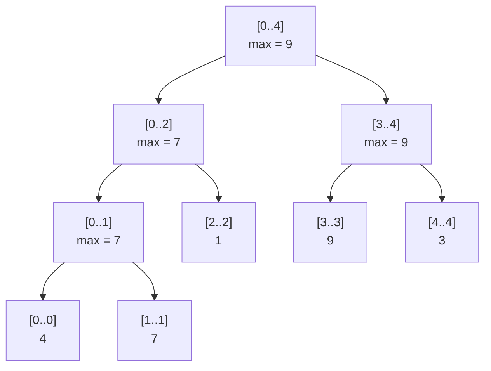

## Aktualizacja

Zmieniamy:

```text
a[2] = 12
```

Nowa tablica:

```text
indeks:  0  1   2  3  4
wartość: 4  7  12  9  3
```

Nowe maksimum całej tablicy to `12`.

Aktualizujemy tylko ścieżkę od `[2..2]` do korzenia.

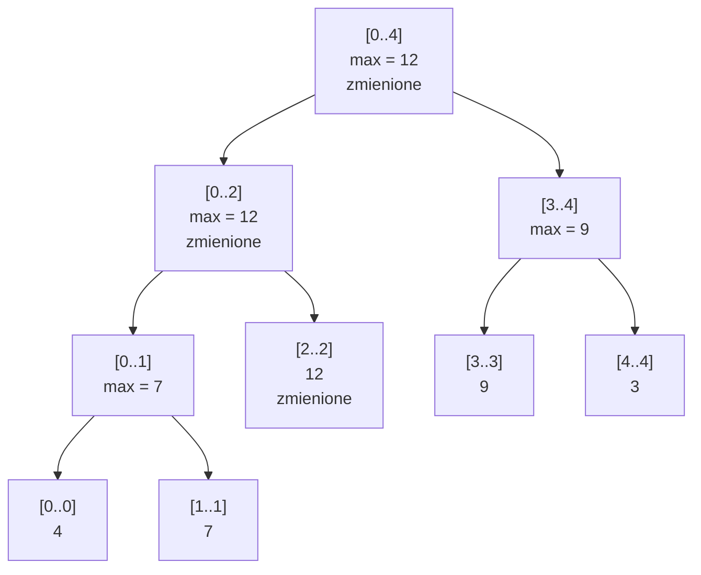

---

## Kod C++ — maksimum z aktualizacją

```cpp
#include <iostream>
#include <vector>
#include <climits>
using namespace std;

class SegmentTreeMax {
private:
    vector<int> tree;
    vector<int> data;
    int n;

    void build(int node, int left, int right) {
        if (left == right) {
            tree[node] = data[left];
            return;
        }

        int mid = (left + right) / 2;

        build(2 * node, left, mid);
        build(2 * node + 1, mid + 1, right);

        tree[node] = max(tree[2 * node], tree[2 * node + 1]);
    }

    int query(int node, int left, int right, int qLeft, int qRight) {
        if (right < qLeft || qRight < left) {
            return INT_MIN;
        }

        if (qLeft <= left && right <= qRight) {
            return tree[node];
        }

        int mid = (left + right) / 2;

        int leftResult = query(2 * node, left, mid, qLeft, qRight);
        int rightResult = query(2 * node + 1, mid + 1, right, qLeft, qRight);

        return max(leftResult, rightResult);
    }

    void update(int node, int left, int right, int index, int newValue) {
        if (left == right) {
            tree[node] = newValue;
            data[index] = newValue;
            return;
        }

        int mid = (left + right) / 2;

        if (index <= mid) {
            update(2 * node, left, mid, index, newValue);
        } else {
            update(2 * node + 1, mid + 1, right, index, newValue);
        }

        tree[node] = max(tree[2 * node], tree[2 * node + 1]);
    }

public:
    SegmentTreeMax(const vector<int>& values) {
        data = values;
        n = data.size();
        tree.assign(4 * n, INT_MIN);

        build(1, 0, n - 1);
    }

    int query(int left, int right) {
        return query(1, 0, n - 1, left, right);
    }

    void update(int index, int newValue) {
        update(1, 0, n - 1, index, newValue);
    }
};

int main() {
    vector<int> a = {4, 7, 1, 9, 3};

    SegmentTreeMax st(a);

    cout << st.query(1, 4) << endl; // 9

    st.update(2, 12);

    cout << st.query(1, 4) << endl; // 12
    cout << st.query(3, 4) << endl; // 9

    return 0;
}
```

---

# Przykład 5 — dodawanie na całym przedziale, czyli lazy propagation

Ten przykład jest trudniejszy, ale bardzo ważny.

Do tej pory aktualizowaliśmy jeden element:

```text
a[index] = newValue
```

Teraz chcemy wykonać operację:

```text
dodaj x do każdego elementu na przedziale [l..r]
```

Przykład:

```text
indeks:  0  1  2  3  4
wartość: 1  2  3  4  5
```

Operacja:

```text
dodaj 10 do przedziału [1..3]
```

Po operacji:

```text
indeks:  0   1   2   3  4
wartość: 1  12  13  14  5
```

Gdybyśmy aktualizowali każdy element osobno, byłoby wolno.

Dlatego stosuje się technikę **lazy propagation**, czyli „leniwe odkładanie aktualizacji”.

---

## Intuicja lazy propagation

Jeżeli cały przedział węzła mieści się w aktualizowanym zakresie, nie musimy od razu schodzić do dzieci.

Możemy powiedzieć:

```text
Ten cały przedział dostał +10.
Wartość sumy w tym węźle poprawiam od razu.
Dzieci poprawię dopiero wtedy, gdy naprawdę będą potrzebne.
```

Do tego używamy dodatkowej tablicy:

```cpp
vector<long long> lazy;
```

Tablica `lazy` przechowuje zaległe aktualizacje.

---

## Diagram idei

Mamy tablicę:

```text
[1, 2, 3, 4]
```

Drzewo sum:

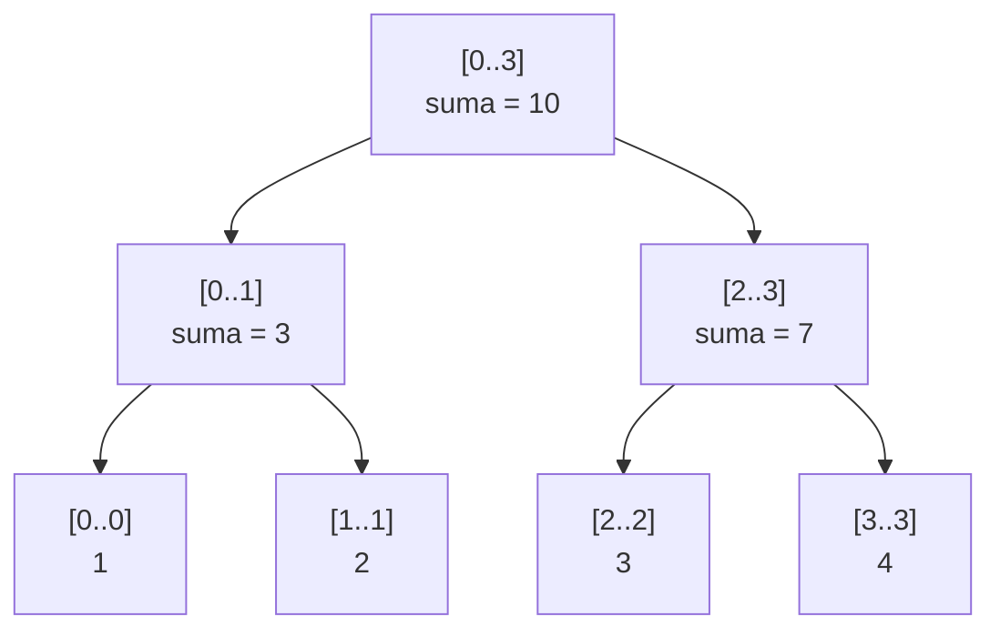

Operacja:

```text
dodaj 5 do przedziału [0..1]
```

Przedział `[0..1]` w całości pasuje do lewego dziecka.

Nie musimy schodzić do `[0..0]` i `[1..1]`.

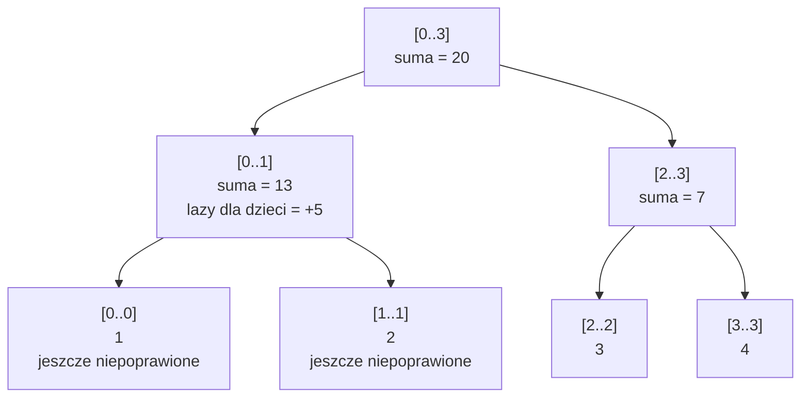

Suma `[0..1]` jest już poprawna:

```text
(1 + 5) + (2 + 5) = 13
```

Ale liście `[0..0]` i `[1..1]` nie muszą być od razu fizycznie poprawione.

Zostaną poprawione dopiero wtedy, gdy jakieś zapytanie będzie wymagało zejścia niżej.

---

## Kod C++ — suma z dodawaniem na przedziale

```cpp
#include <iostream>
#include <vector>
using namespace std;

class SegmentTreeLazySum {
private:
    vector<long long> tree;
    vector<long long> lazy;
    vector<long long> data;
    int n;

    void build(int node, int left, int right) {
        if (left == right) {
            tree[node] = data[left];
            return;
        }

        int mid = (left + right) / 2;

        build(2 * node, left, mid);
        build(2 * node + 1, mid + 1, right);

        tree[node] = tree[2 * node] + tree[2 * node + 1];
    }

    void push(int node, int left, int right) {
        if (lazy[node] == 0) {
            return;
        }

        long long value = lazy[node];

        tree[node] += value * (right - left + 1);

        if (left != right) {
            lazy[2 * node] += value;
            lazy[2 * node + 1] += value;
        }

        lazy[node] = 0;
    }

    void updateRange(int node, int left, int right,
                     int qLeft, int qRight, long long value) {
        push(node, left, right);

        if (right < qLeft || qRight < left) {
            return;
        }

        if (qLeft <= left && right <= qRight) {
            lazy[node] += value;
            push(node, left, right);
            return;
        }

        int mid = (left + right) / 2;

        updateRange(2 * node, left, mid, qLeft, qRight, value);
        updateRange(2 * node + 1, mid + 1, right, qLeft, qRight, value);

        tree[node] = tree[2 * node] + tree[2 * node + 1];
    }

    long long query(int node, int left, int right, int qLeft, int qRight) {
        push(node, left, right);

        if (right < qLeft || qRight < left) {
            return 0;
        }

        if (qLeft <= left && right <= qRight) {
            return tree[node];
        }

        int mid = (left + right) / 2;

        long long leftResult = query(2 * node, left, mid, qLeft, qRight);
        long long rightResult = query(2 * node + 1, mid + 1, right, qLeft, qRight);

        return leftResult + rightResult;
    }

public:
    SegmentTreeLazySum(const vector<long long>& values) {
        data = values;
        n = data.size();

        tree.assign(4 * n, 0);
        lazy.assign(4 * n, 0);

        build(1, 0, n - 1);
    }

    void updateRange(int left, int right, long long value) {
        updateRange(1, 0, n - 1, left, right, value);
    }

    long long query(int left, int right) {
        return query(1, 0, n - 1, left, right);
    }
};

int main() {
    vector<long long> a = {1, 2, 3, 4, 5};

    SegmentTreeLazySum st(a);

    cout << st.query(0, 4) << endl; // 15

    st.updateRange(1, 3, 10);

    cout << st.query(0, 4) << endl; // 45
    cout << st.query(1, 3) << endl; // 39
    cout << st.query(2, 2) << endl; // 13

    return 0;
}
```

---

# 6. Najważniejszy schemat działania zapytania

Zapytanie w drzewie przedziałowym zawsze rozważa trzy przypadki.

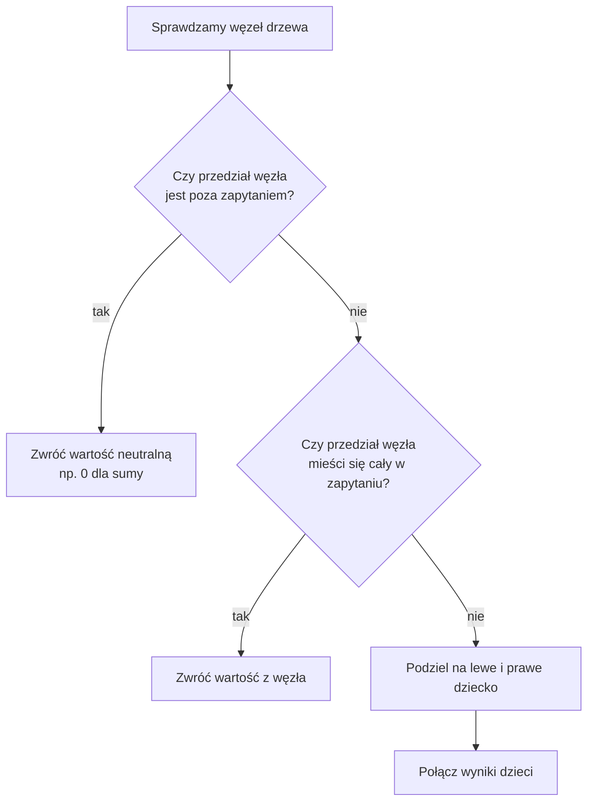

To jest serce drzewa przedziałowego.

---

# 7. Wartość neutralna

Wartość neutralna zależy od operacji.

| Operacja | Wartość neutralna | Dlaczego |
|---|---:|---|
| suma | `0` | `x + 0 = x` |
| minimum | `INT_MAX` | `min(x, INT_MAX) = x` |
| maksimum | `INT_MIN` | `max(x, INT_MIN) = x` |
| iloczyn | `1` | `x * 1 = x` |

Jeżeli fragment drzewa nie ma znaczenia dla zapytania, zwracamy wartość neutralną.

---

# 8. Jak rozpoznać, że można użyć drzewa przedziałowego?

Drzewo przedziałowe można zastosować, gdy:

1. mamy tablicę,
2. często pytamy o wynik na przedziale,
3. operacja da się składać z wyników mniejszych przedziałów.

Przykłady operacji, które pasują:

```text
suma
minimum
maksimum
NWD
iloczyn
xor
liczba zer
liczba elementów spełniających warunek
```

Przykładowo:

```text
suma([0..7]) = suma([0..3]) + suma([4..7])
```

albo:

```text
min([0..7]) = min(min([0..3]), min([4..7]))
```

To znaczy, że wynik dużego przedziału można obliczyć z wyników mniejszych przedziałów.

---

# 9. Częsty błąd początkujących

Błąd:

```text
Drzewo przedziałowe przechowuje wszystkie możliwe przedziały.
```

To nieprawda.

Dla tablicy `n` elementów wszystkich możliwych przedziałów jest około:

```text
n * (n + 1) / 2
```

czyli bardzo dużo.

Drzewo przedziałowe przechowuje tylko wybrane przedziały powstałe przez dzielenie na połowy.

Dzięki temu zużywa `O(n)` pamięci, a nie `O(n^2)`.

---

# 10. Porównanie z prostą pętlą

Załóżmy, że mamy `n = 1 000 000` elementów i `q = 1 000 000` zapytań.

## Prosta pętla

Jedno zapytanie może kosztować:

```text
O(n)
```

Wszystkie zapytania:

```text
O(n * q)
```

czyli bardzo dużo.

## Drzewo przedziałowe

Budowa:

```text
O(n)
```

Jedno zapytanie:

```text
O(log n)
```

Wszystkie zapytania:

```text
O(q log n)
```

Dla miliona elementów `log2(n)` to około `20`.

To ogromna różnica.

---

# 11. Uniwersalny wzorzec kodu

W większości prostych zadań wystarczą trzy funkcje:

```cpp
build(...)
query(...)
update(...)
```

Ich znaczenie:

| Funkcja | Znaczenie |
|---|---|
| `build` | buduje drzewo na podstawie tablicy |
| `query` | odpowiada na pytanie o przedział |
| `update` | zmienia jeden element |
| `updateRange` | zmienia cały przedział, zwykle z lazy propagation |

---

# 12. Podsumowanie

Drzewo przedziałowe to struktura danych do szybkiej pracy na przedziałach tablicy.

Najważniejsze cechy:

- przechowuje informacje o przedziałach,
- dzieli tablicę na połowy,
- pozwala odpowiadać na zapytania w `O(log n)`,
- pozwala aktualizować elementy w `O(log n)`,
- używa pamięci `O(n)`,
- nadaje się do sum, minimów, maksimów i wielu innych operacji,
- przy aktualizacjach całych przedziałów używa się techniki lazy propagation.

Najważniejsza intuicja:

```text
Nie licz wyniku od zera.
Użyj gotowych wyników dla większych fragmentów tablicy.
```

To właśnie robi drzewo przedziałowe.
